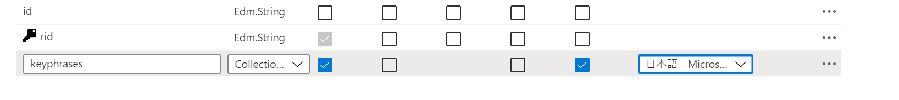
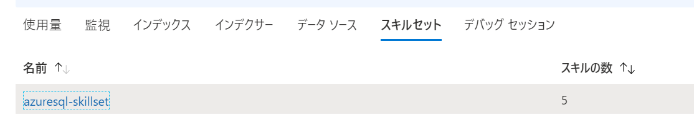
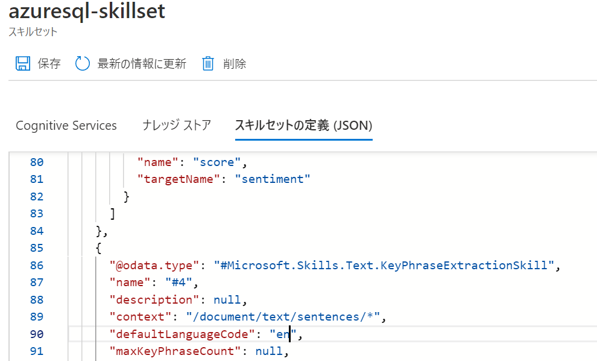

# Azure Cognitive Searchのスキル言語設定

## 概要

日本語のデータに対してAzure Cognitive Searchのスキルを利用したいときはまりポイントがあったので備忘録

## はまりポイントについて

Azure Portal上のデータのインポートからスキルを設定する際、Analyzerという項目がありますが、こちらを日本語でセットしても、キーフレーズ抽出などがうまくいかない場合があります。

## 対処方法

スキルセットのjson定義を確認してください。  
default Langageがenとなっていますので、jaに変えてあげることで、適切なCognitiveスキルを利用してくれます。

### 画面参考

概要から対象のスキルセットを確認します。

json定義を確認すると、キーフレーズ抽出のスキルの定義で言語がenになっています。

## 参考リンク

[組み込みのスキル](https://docs.microsoft.com/ja-jp/azure/search/cognitive-search-predefined-skills#built-in-skills)

