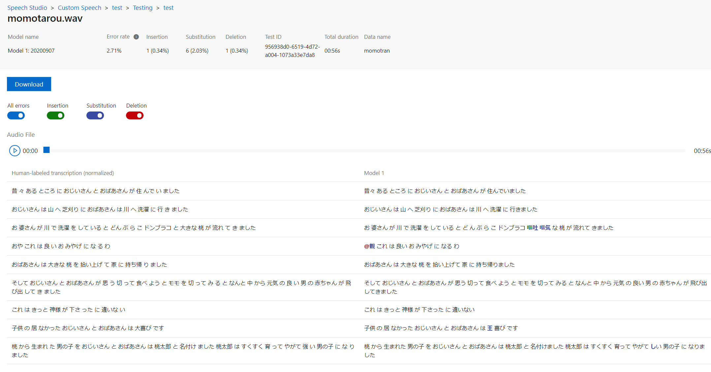

# Azureの音声書き起こし精度をSpeech Studioで評価してみる

## はじめに

※本記事は2020/10の情報をベースにしています。

Azure Cognitive Serviceでは、音声読み上げや書き起こし、音声翻訳などのAI機能をSpeech Serviceとして提供をしています。

では書き起こし機能で利用されているモデルはどのように正確さを評価したらいいか？docsをあさっていたら良さげな機能を見つけてそれを試した結果を紹介します。

~~（一部うまくいきませんでした。）~~


2020/11 追記
サポートに対応いただき、うまくいくようになりました！MS サポートの担当者様ありがとうございました。


## 評価の仕方

docsでは音声書き起こしモデルの定量的な評価指標として、「**ワード エラー率 (WER)**」が紹介されています。

[カスタム音声の正確性を評価する](https://docs.microsoft.com/ja-jp/azure/cognitive-services/speech-service/how-to-custom-speech-evaluate-data)

ワード エラー率=エラー単語の総数/テスト用の書き起こしファイルで提供された単語数 

という考え方ですね。エラー単語とは以下のようなものを言います。

> - 挿入 (I): 仮説トランスクリプトに誤って追加された単語
> - 削除 (D): 仮説トランスクリプトで検出されなかった単語
> - 置換 (S): 参照と仮説の間で置き換えられた単語


Speech Studioという開発UIを利用するとこのテストや、モデルの改善が可能です。

### Speech Studio

[Speech Studio概要](https://speech.microsoft.com/)

> 音声、Azure の認知サービスのカスタマイズ ポータルへようこそ。音声をテキストに書き起こし、翻訳を行い、テキストを実物そっくりの音声に変換するために必要なすべてのツール。


## Speech Studioを使ってみる手順

準備：  
[Speech Service リソースをデプロイします。](https://docs.microsoft.com/ja-jp/azure/cognitive-services/speech-service/overview#create-the-azure-resource)

手順概要：
1. 音声ファイルをSpeech Studioにアップロードします。
2. 文字起こしテキストを作成してDataにExportします。
3. 結果確認
   
### 1. 音声ファイルをSpeech Studioにアップロードします。

以下を参考に、プロジェクトの作成と、Audioデータアップロードを行います。
[Custom Speech ポータルでプロジェクトを作成する](https://docs.microsoft.com/ja-jp/azure/cognitive-services/speech-service/quickstarts/speech-studio-test-model#create-a-project-in-the-custom-speech-portal)

音声ファイル：
「[「桃太郎デスマッチ」 ー Azure / AWS / GCP 学習済みAIサービスで「桃太郎」を Speech To Text してみた話](https://qiita.com/Futo_Horio/items/dc095a4a27e031d810da)」が大変面白かったのでこちらを使わせていただきます。

Audio only を選択してアップロードします。


### 2. 文字起こしテキストを作成してDataにExportします。

文字起こしテキスト：
Editro機能を使って翻訳をつけていきます。ある程度自動生成されるので、手直しくらいの量です。

~~しかし、一部の書き起こしの登録がうまくいかず、エラーないように色々試した結果なぞの文章になっています・・・しばらく格闘しましたが諦めました。。~~
2020/11 追記
うまくいくようになったので差し替え

editor画面


downloadしてみると以下のようなtxtファイルが生成されていました。

trans.txt

``` 
> momotarou.wav	昔々あるところにおじいさんとおばあさんが住んでいました。 おじいさんは山へ芝刈りに、おばあさんは川へ洗濯に行きました。 お婆さんが川で洗濯をしていると、どんぶらこドンブラコと、大きな桃が流れてきました。 おや、これは良いおみやげになるわ。 おばあさんは、大きな桃を拾い上げて家に持ち帰りました。 そしておじいさんとおばあさんが思う切って食べようとモモを切ってみると、なんと中から元気の良い男の赤ちゃんが飛び出してきました。 これはきっと神様が下さったに違いない。 子供の居なかったおじいさんとおばあさんは大喜びです。 桃から生まれた男の子をおじいさんとおばあさんは桃太郎と名付けました。桃太郎はすくすく育って、やがて強い男の子になりました。
```

編集後はEditorタブからExportで文字起こしテキスト付きの音声データとしてDataに登録可能です。

### 3. 結果確認

testingからtestを実行すると、結果として以下のような画面がでます。
ちなみにtestを行うモデル2つ選択可能で、未作成であっても、Cognitive Serviceのバージョンを二つ選ぶことで、モデルの精度比較を行えます。

2020/11 追記




見方は左が正解の書き起こし内容で、右がモデルの出力となります。
さらに、Error Rateの要素として、
- 緑：モデルにより誤って追加された単語
- 青：モデルにより置き換えられた単語
- 赤；モデルで検出されなかった単語

が表示されます。

テスト結果画面ではセンテンスをクリックするとその場面の音声が流れ、音声が聞こえづらくて精度が出なかった、などの問題をすぐに特定できそうです。

過去の誤ったtrans.txtでの例

>書き起こしファイルの問題で、error rateがいまいちになっていますが、どこが違うかたくさん出たのでかえって良かったかもしれません


## 最後に

~~文字起こしテキストがかなり苦戦しました。うまく正規化されない内容になっているとアップロードエラーを起こします。どこでエラーが起きているかログがないので、結局ワンセンテンスずつアップしてどこでエラーとなるかを確認するはめになりました。Feed Backを飛ばしておきます。。~~
2020/11 追記
うまくいくようになりました。MS サポートの担当者様ありがとうございました。

参考までに、完全なテストができる日本語サンプルを以下で紹介します。

https://github.com/Azure-Samples/cognitive-services-speech-sdk/tree/master/sampledata/customspeech/ja-JP


### 日本語サンプルでのテスト結果


さすがに精度はそれなりの数字がでます。てにをはは苦手なようですが、アルファベットと英語の違いを補正してあげればかなりの精度となっていそうです
