## はじめに

本日のTeams 障害でみなさんお仕事への影響はいかがでしたか？数時間ながらこういう障害はTwitterが盛り上がりますね。
私はちょうどフォーカスしていたタイミングだったのであまり影響はなかったですが、そんな中で[りなたむ 💉✖︎3⃣ || Microsoft MVP](https://twitter.com/R_t_A_n_M)　さんが、こんなつぶやき

<blockquote class="twitter-tweet">
一般「なにぃ！？ <a href="https://twitter.com/hashtag/Teams?src=hash&amp;ref_src=twsrc%5Etfw">#Teams</a> が落ちた！？12時からの××社との打ち合わせどうするんだーワタワタ」  弊社「あ、Teams落ちたのかー　じゃあ <a href="https://twitter.com/hashtag/Azure?src=hash&amp;ref_src=twsrc%5Etfw">#Azure</a> の Communication Services つかって 簡易的な Web会議室作っちゃいますね　ぽちぽちー　はいできましたどぞー😃」
&mdash; りなたむ 💉✖︎3⃣ || Microsoft MVP (@R_t_A_n_M) <a href="https://twitter.com/R_t_A_n_M/status/1549946563774259200?ref_src=twsrc%5Etfw">July 21, 2022</a></blockquote> 

これは試してみたい！ということで実際にやってみました。

### 参考 

なんにでも先駆者はいるもので、[【爆速構築】Azure Communication Services でビデオ通話アプリを10分で作ってみた](https://zenn.dev/hiromu_fujitani/articles/4b51584fbb1541)にて一年くらい前に同様のことをされている方がいました。
ただ、この頃よりもっと簡単になってます。

## 1. Azure Communication Service のデプロイ

[クイック スタート:Communication Services のリソースを作成して管理する](https://docs.microsoft.com/ja-jp/azure/communication-services/quickstarts/create-communication-resource?tabs=windows&pivots=platform-azp) を参考にデプロイしていきます。

まずは、サービスを検索し、**通信サービス** をクリック

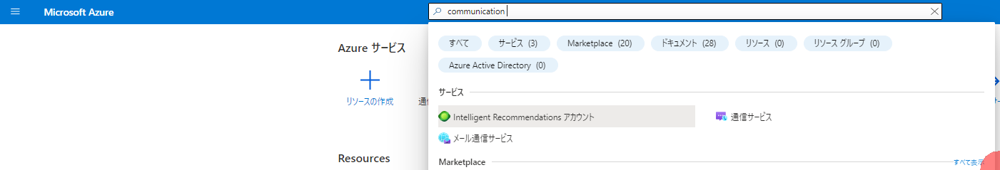

**作成** をクリック

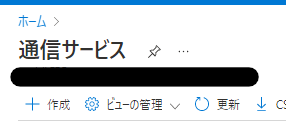

名称などを設定して **レビューと作成** をクリック

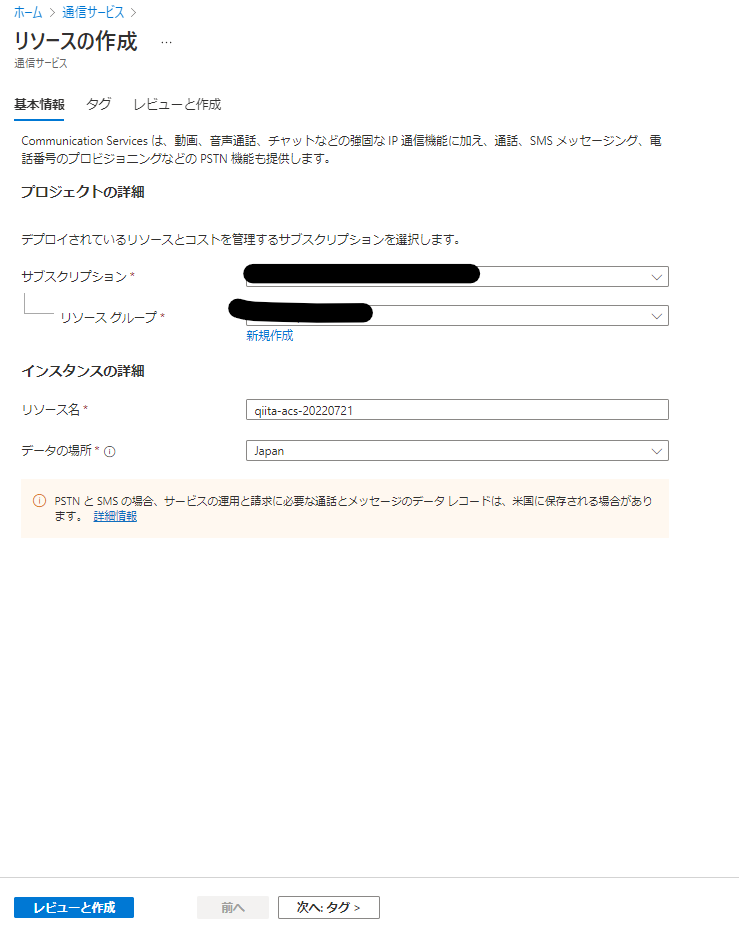

内容確認して **作成** をクリック

3分くらいで作成完了するので、 **リソースに移動** をクリック

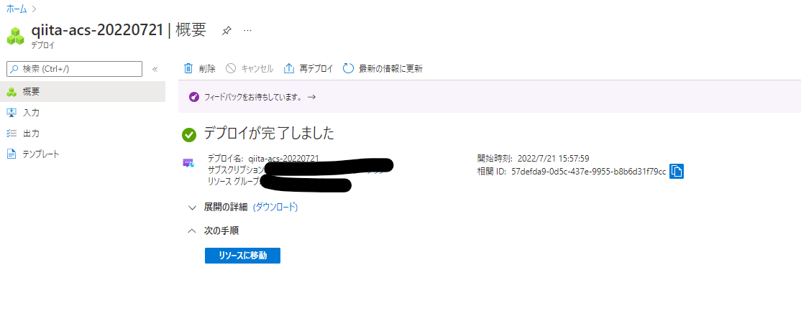

## 2. グループ通話アプリのデプロイ

詳細は、[通話のヒーロー サンプルを使ってみる](https://docs.microsoft.com/ja-jp/azure/communication-services/samples/calling-hero-sample?pivots=platform-web) なのですが、より簡単にデプロイできるようになってます。

**サンプルアプリケーション** をクリック

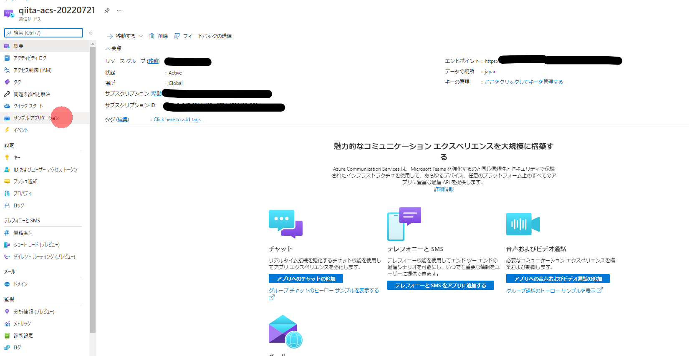

Web用グループ通話ヒーローのサンプルの **展開** をクリック

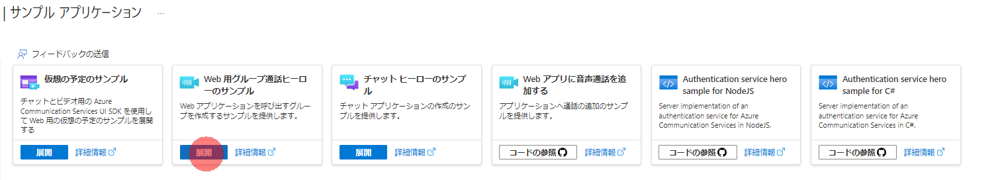

Web Appの情報をいれたら **確認と作成** をクリック

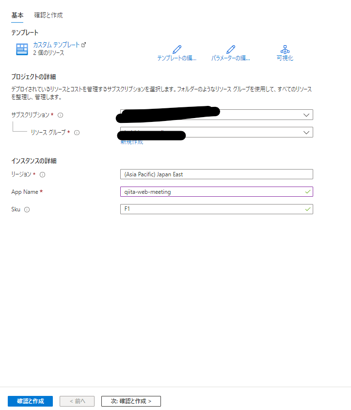

**作成** をクリック

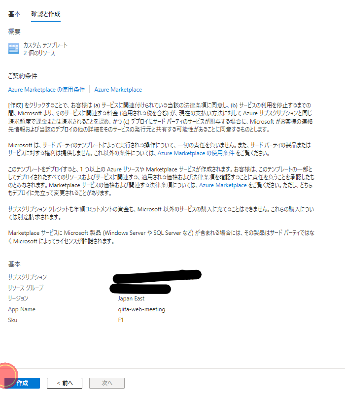

デプロイ完了です。ここまで9クリック！

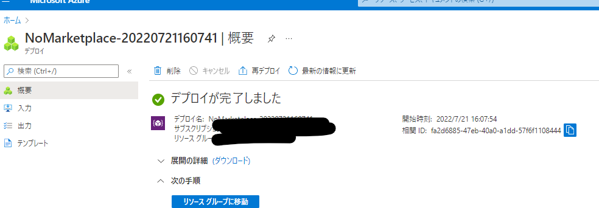

3. 通話を開始する

Web Appリソースに移動して、urlを確認します。

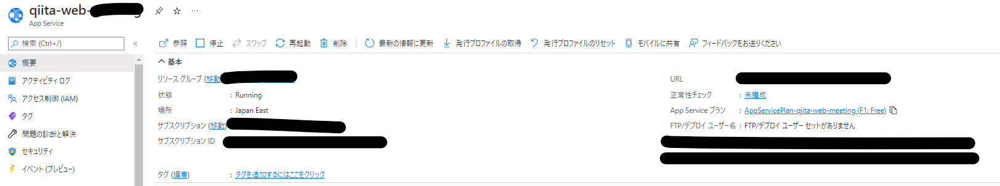

urlにアクセスすると、web通話画面が立ち上がるので、自分の表示名をいれてCallを開始しましょう

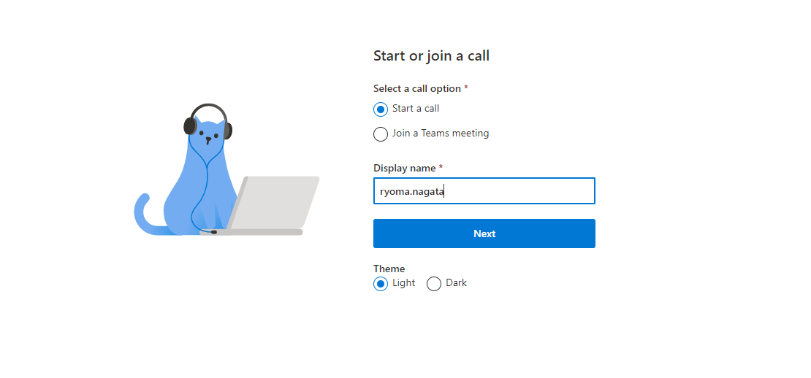

デバイスを選択したら通話開始！

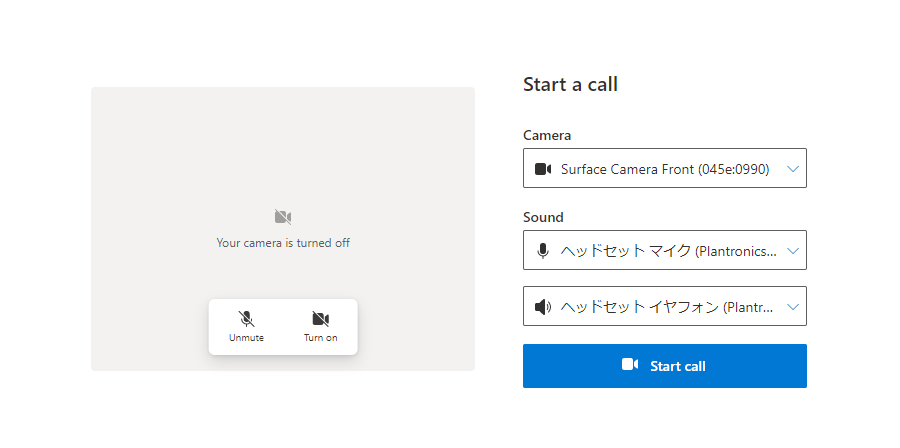

他の人を呼ぶときは **People** -> **Copy invite link** からurlにより参加してもらいます。

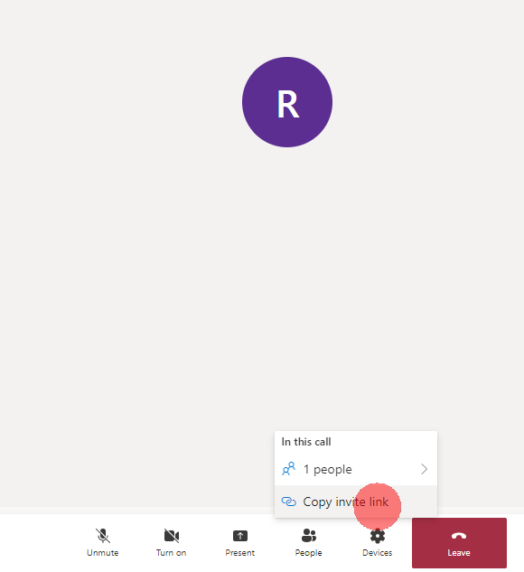

画面共有は **Present** から。

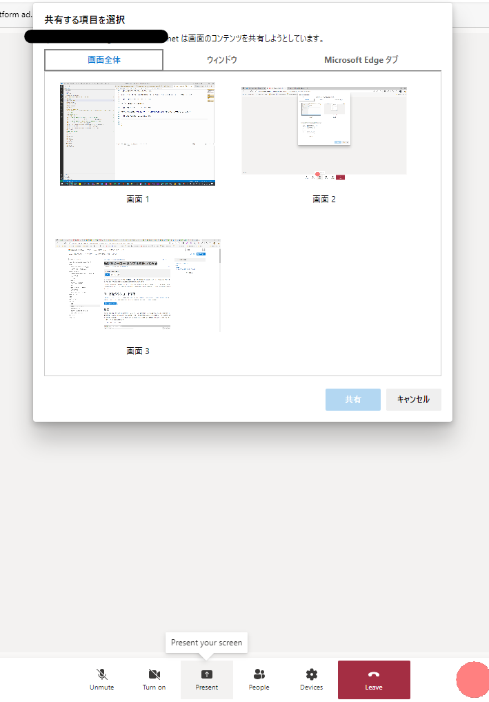

Teams復旧を待つ間、同僚とここで話しながら画面共有もしましたが、全然違和感なかったです

Communication Serviceに触る機会が来るとは思ってませんでしたが、こんなに簡単にグループ通話アプリを作れるとは思ってませんでした。

会社での会議利用に使うにはサンプルレベルでは認証もないし、そもそも適格性審査などの問題なんかもあったりする企業さんもあると思うのでここまで簡単に配下ないと思いますが、（Zoomとか併用できる企業も多いと思いますし）バックアップの一つとしては面白いですね