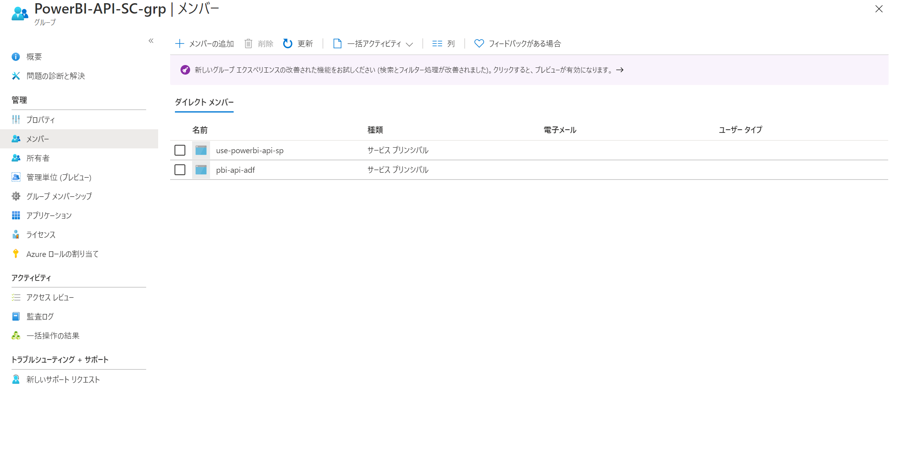
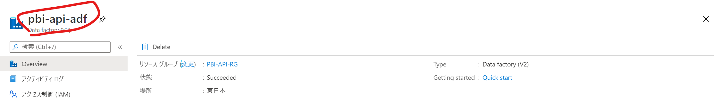
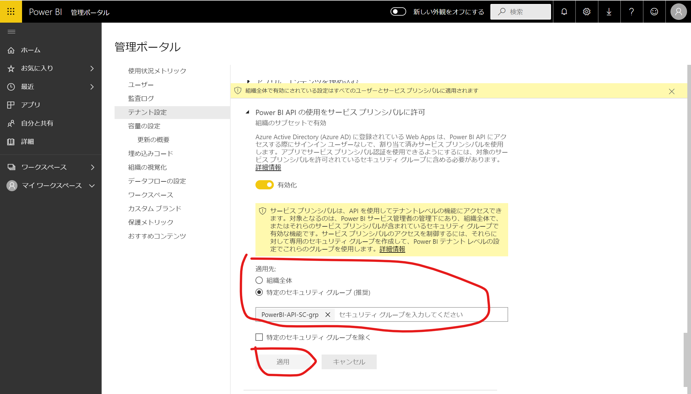
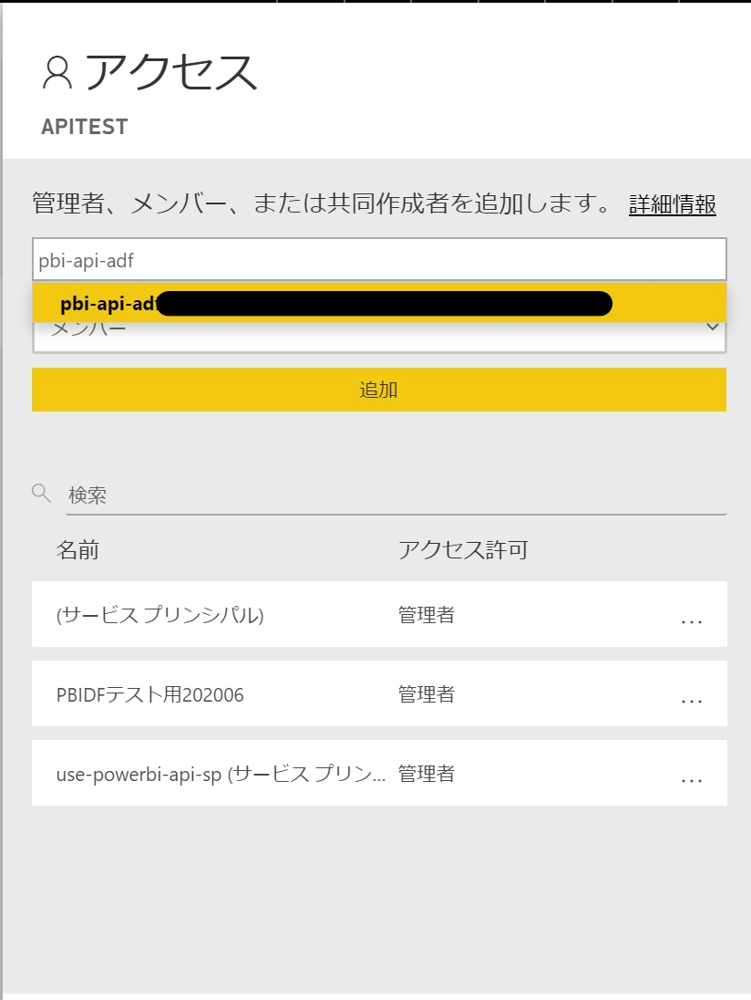
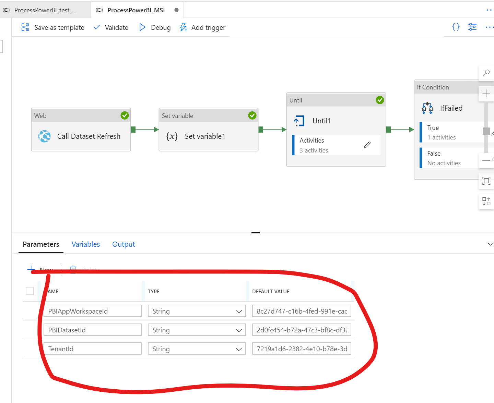
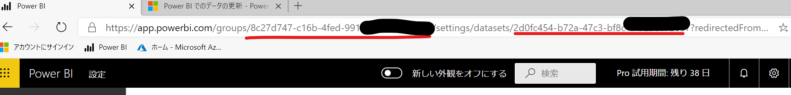

- [概要](#概要)
  - [MSI 認証](#msi-認証)
    - [参考リンク](#参考リンク)
- [手順](#手順)
  - [前提注意事項](#前提注意事項)
  - [1. AAD セキュリティグループを作成して、ADFを追加する](#1-aad-セキュリティグループを作成してadfを追加する)
  - [2. Power BI テナントでAPI利用を許可して、AADセキュリティグループを追加する](#2-power-bi-テナントでapi利用を許可してaadセキュリティグループを追加する)
  - [3. Power BI Workspace内で、ADFを追加する](#3-power-bi-workspace内でadfを追加する)
  - [4. Data Factory Pipelineを作成する](#4-data-factory-pipelineを作成する)
  - [5. 動作確認](#5-動作確認)
- [補足事項](#補足事項)

## 概要

下記の記事の改良版です。
[Azure Data FactoryでPower BIデータセットを更新する](https://qiita.com/ryoma-nagata/items/f02b6cdd3bf2a50c5b51)

Azure Data Factory  (ADF)にはManaged IDが付与されるため、それを利用してMSI認証を行います。

前回の記事ではサービスプリンシパルによるsecretを管理する必要がありましたが、MSI認証を利用すればsecret管理が不要となり、よりセキュアに構成が可能です。

また、ポリシー上、AAD内にサービスプリンシパルが作れないような場合でも対応が可能となります。

### MSI 認証

Azure リソース作成時に自動的に割り当てられるサービスプリンシパルを利用して、認証を行うことです。
リソース自体をサービスアカウントとして扱うことで、パスワードレスな認証を実現できます。

#### 参考リンク

[Azure リソースのマネージド ID とは](https://docs.microsoft.com/ja-jp/azure/active-directory/managed-identities-azure-resources/overview)

[Azure リソースに対するマネージド ID を使用して BLOB およびキュー データへのアクセスを認証する](https://docs.microsoft.com/ja-jp/azure/storage/common/storage-auth-aad-msi)

[Power BI データセットにデータをプッシュする](https://docs.microsoft.com/ja-jp/power-bi/developer/automation/walkthrough-push-data)

シナリオが異なりますが、前提条件などがより詳しく記載されています。

## 手順

 1. AAD セキュリティグループを作成して、ADFを追加する
 2. Power BI テナントでAPI利用を許可して、AADセキュリティグループを追加する
 3. Power BI Workspace内で、ADFを追加する
 4. Data Factory Pipelineを作成する
 5. 動作確認

### 前提注意事項

 - ADにセキュリティグループ、サービスプリンシパルが必要です。
 - セキュリティグループをPowerBIのAPI許可グループに追加する必要があります。※Power BIのテナント設定の変更が発生します。


### 1. AAD セキュリティグループを作成して、ADFを追加する

ADFを作成時の名称と同一のサービスプリンシパルが作成されるので、AADセキュリティグループに追加します。



対象のADFリソース



### 2. Power BI テナントでAPI利用を許可して、AADセキュリティグループを追加する

Power BI管理者のアカウントで、Power BI 管理ポータルから以下の設定を行います。




### 3. Power BI Workspace内で、ADFを追加する

Power BI　WorkspaceにADFを追加します。
※後で気づきましたが、ここもAADセキュリティグループでよかったですね。



### 4. Data Factory Pipelineを作成する

「ProcessPowerBI_MSI」という名前のPipelineを作成して、以下のコードで置換してください。

``` json:

{
    "name": "ProcessPowerBI_MSI",
    "properties": {
        "activities": [
            {
                "name": "Call Dataset Refresh",
                "type": "WebActivity",
                "dependsOn": [],
                "policy": {
                    "timeout": "7.00:00:00",
                    "retry": 0,
                    "retryIntervalInSeconds": 30,
                    "secureOutput": false,
                    "secureInput": false
                },
                "userProperties": [],
                "typeProperties": {
                    "url": {
                        "value": "@concat('https://api.powerbi.com/v1.0/myorg/groups/',pipeline().parameters.PBIAppWorkspaceId,'/datasets/',pipeline().parameters.PBIDatasetId,'/refreshes')",
                        "type": "Expression"
                    },
                    "method": "POST",
                    "body": {
                        "helloww": "worldddd"
                    },
                    "authentication": {
                        "type": "MSI",
                        "resource": "https://analysis.windows.net/powerbi/api"
                    }
                }
            },
            {
                "name": "Until1",
                "type": "Until",
                "dependsOn": [
                    {
                        "activity": "Set variable1",
                        "dependencyConditions": [
                            "Succeeded"
                        ]
                    }
                ],
                "userProperties": [],
                "typeProperties": {
                    "expression": {
                        "value": "@not(equals(activity('FilterToCurrentRefresh').output.value[0].status,'Unknown'))",
                        "type": "Expression"
                    },
                    "activities": [
                        {
                            "name": "GetPBIRefreshes",
                            "type": "WebActivity",
                            "dependsOn": [
                                {
                                    "activity": "Wait1",
                                    "dependencyConditions": [
                                        "Succeeded"
                                    ]
                                }
                            ],
                            "policy": {
                                "timeout": "7.00:00:00",
                                "retry": 0,
                                "retryIntervalInSeconds": 30,
                                "secureOutput": false,
                                "secureInput": false
                            },
                            "userProperties": [],
                            "typeProperties": {
                                "url": {
                                    "value": "@concat('https://api.powerbi.com/v1.0/myorg/groups/',pipeline().parameters.PBIAppWorkspaceId,'/datasets/',pipeline().parameters.PBIDatasetId,'/refreshes?$top=10')",
                                    "type": "Expression"
                                },
                                "method": "GET",
                                "body": {
                                    "helloww": "worldddd"
                                },
                                "authentication": {
                                    "type": "MSI",
                                    "resource": "https://analysis.windows.net/powerbi/api"
                                }
                            }
                        },
                        {
                            "name": "FilterToCurrentRefresh",
                            "type": "Filter",
                            "dependsOn": [
                                {
                                    "activity": "GetPBIRefreshes",
                                    "dependencyConditions": [
                                        "Succeeded"
                                    ]
                                }
                            ],
                            "userProperties": [],
                            "typeProperties": {
                                "items": {
                                    "value": "@activity('GetPBIRefreshes').output.value",
                                    "type": "Expression"
                                },
                                "condition": {
                                    "value": "@Equals(variables('ReqId'),item().requestId)",
                                    "type": "Expression"
                                }
                            }
                        },
                        {
                            "name": "Wait1",
                            "type": "Wait",
                            "dependsOn": [],
                            "userProperties": [],
                            "typeProperties": {
                                "waitTimeInSeconds": 1
                            }
                        }
                    ],
                    "timeout": "7.00:00:00"
                }
            },
            {
                "name": "Set variable1",
                "type": "SetVariable",
                "dependsOn": [
                    {
                        "activity": "Call Dataset Refresh",
                        "dependencyConditions": [
                            "Succeeded"
                        ]
                    }
                ],
                "userProperties": [],
                "typeProperties": {
                    "variableName": "ReqId",
                    "value": {
                        "value": "@activity('Call Dataset Refresh').output.ADFWebActivityResponseHeaders.requestId",
                        "type": "Expression"
                    }
                }
            },
            {
                "name": "IfFailed",
                "type": "IfCondition",
                "dependsOn": [
                    {
                        "activity": "Until1",
                        "dependencyConditions": [
                            "Succeeded"
                        ]
                    }
                ],
                "userProperties": [],
                "typeProperties": {
                    "expression": {
                        "value": "@equals(activity('FilterToCurrentRefresh').output.value[0].status,'failed')",
                        "type": "Expression"
                    },
                    "ifTrueActivities": [
                        {
                            "name": "ThrowErrorOnFailure",
                            "type": "WebActivity",
                            "dependsOn": [],
                            "policy": {
                                "timeout": "7.00:00:00",
                                "retry": 0,
                                "retryIntervalInSeconds": 30,
                                "secureOutput": false
                            },
                            "userProperties": [],
                            "typeProperties": {
                                "url": {
                                    "value": "@string(activity('FilterToCurrentRefresh').output.value[0])",
                                    "type": "Expression"
                                },
                                "method": "GET"
                            }
                        }
                    ]
                }
            }
        ],
        "parameters": {
            "PBIAppWorkspaceId": {
                "type": "string",
                "defaultValue": ""
            },
            "PBIDatasetId": {
                "type": "string",
                "defaultValue": ""
            },
            "TenantId": {
                "type": "string",
                "defaultValue": ""
            }
        },
        "variables": {
            "ReqId": {
                "type": "String"
            }
        },
        "annotations": []
    },
    "type": "Microsoft.DataFactory/factories/pipelines"
}


```


### 5. 動作確認

各種パラメータを設定して、実行します。




パラメータ内容は対象はPower BI Data Setのページ移動するとurlで確認できます




テナントIDはAzure Portalから確認してください。

## 補足事項

2020年7月時点では、Power BI データセットの更新回数はFree,Proライセンスで利用可能な非占有型のワークスペースでは **8会**。
Premium ライセンスで利用可能な占有型のワークスペースでは48回の更新が可能です。

ただし、本記事のようなAPIによる更新の場合、Premium環境のみ無制限の更新が可能となります。

[データ更新](https://docs.microsoft.com/ja-jp/power-bi/connect-data/refresh-data#data-refresh)