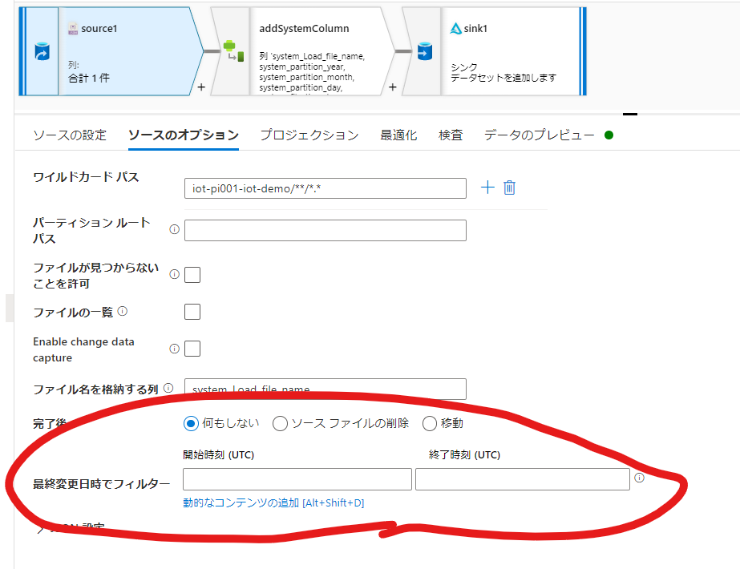
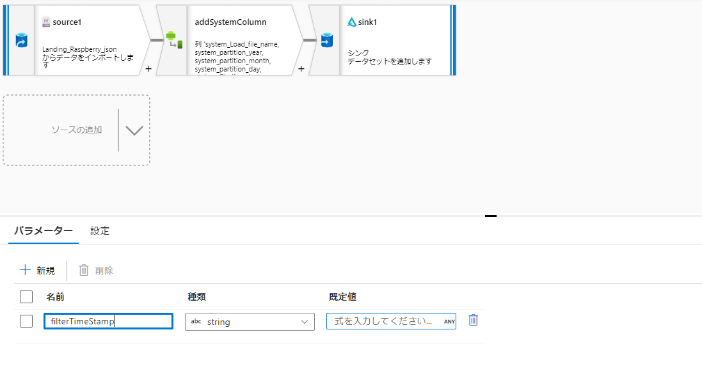
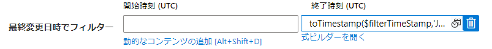
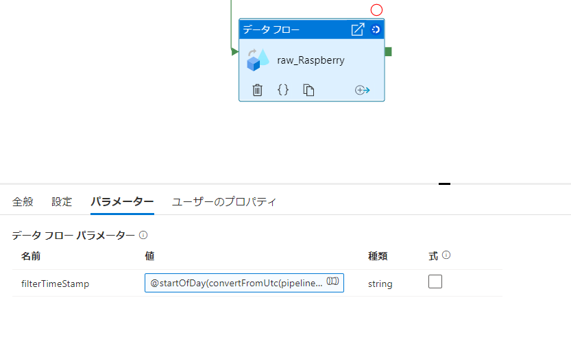

## はじめに

ちょっとつまったので備忘です。

Data Factory のパイプライン側で取得した日付時刻を使用して、データフロー側で処理される対象のファイルを限定したいという動機がありました。
ここのフィルタですね。このフィルタにpipeline 側で取得した日付時刻を使って処理をするにはどうするかという記事になります。

### 注意事項

2022/03時点の情報となります。

## 方法

データフローでタイムスタンプに変換可能な形式の文字列でデータフローパラメータに入力してやる必要があります。
この例では、パイプライン実行前日（日本時間での前日）までに連携されたファイルを対象にしたいとします。

1. データフローに以下のような文字列のパラメータを作成

2. ソースのフィルタを以下のように設定

> toTimestamp($filterTimeStamp,'JST')

1. この例ではパイプラインが実行された日本時間でのその日の開始日付時刻を取得し、フォーマットを調整します。※Azureは基本UTCで物事を考えるためこのあたりの変換はややこしいので注意

> @startOfDay(convertFromUtc(pipeline().TriggerTime,'Tokyo Standard Time'),'yyyy-MM-dd HH:mm:ss')

4. 上記の式をデータフローの実行パラメータに設定する

## 参考情報

以下の差異により、フォーマットを調整してやる必要があったということでした。

### パイプライン側で取得される日付時刻のフォーマット

フォーマットを指定しない場合、ISO 8601 に準拠した[yyyy-MM-ddTHH:mm:ss:fffffffK]のフォーマットで返されます。

[Azure Data Factory および Azure Synapse Analytics の式と関数](https://docs.microsoft.com/ja-jp/azure/data-factory/control-flow-expression-language-functions)

一例としてstartOfDay

---------------------------------

startOfDay

タイムスタンプの日の開始日時を返します

単一の書式指定子またはカスタム書式パターン。 timestamp の既定の形式は "o" (yyyy-MM-ddTHH:mm:ss:fffffffK) です。これは、ISO 8601 に準拠し、タイム ゾーン情報を保持します

---------------------------------

### データフロー側のTimestamp変換可能なフォーマット

[マッピング データ フローでのデータ変換式の使用](https://docs.microsoft.com/ja-jp/azure/data-factory/data-flow-expressions-usage)

一例としてtoTimestamp

---------------------------------

toTimestamp

省略可能なタイムスタンプ形式を指定して、文字列をタイムスタンプに変換します。 タイムスタンプを省略すると、既定のパターンの yyyy-[M]M-[d]d hh:mm:ss[.f...] が使用されます。
省略可能なタイムゾーンを 'GMT'、'PST'、'UTC'、'America/Cayman' の形式で渡せます。 タイムスタンプでサポートされる最大精度は、ミリ秒 (値 999) です。

使用可能な形式については、Java の SimpleDateFormat クラスを参照してください。

---------------------------------