## はじめに

Mapping Dataflowでscd type2を生成する方法を記載します。

## 参考

ナレッジセンターにて、scd type1/type2については更新処理による実装が確認可能です。

scdについて

https://www.kimballgroup.com/?s=scd&search=

日本語の記事少ないですね

https://knowledge.insight-lab.co.jp/sisense/data-modeling/slowly_changing_dimension

https://docs.microsoft.com/ja-jp/power-bi/guidance/star-schema#type-2-scd

https://docs.microsoft.com/ja-jp/learn/modules/populate-slowly-changing-dimensions-azure-synapse-analytics-pipelines/2-describe


## 今回の実装の特徴

以下の記事でも語られるように、更新、挿入型のscd の実装は、日付順にデータを更新していくようなパイプラインを構成することが多く、再実行や、履歴の差し込みの難易度が非常に高いです。

https://docs.microsoft.com/ja-jp/learn/modules/populate-slowly-changing-dimensions-azure-synapse-analytics-pipelines/2-describe

今回の実装では、すべてのデータからscd type2型のデータをバッチ生成することで再実行に強いパイプラインとなります。

ただし、このデータをスタースキーマのディメンションとしてサロゲートキーとともに利用する場合、関連のすべてのfactおよび、ディメンション自身で全データを利用した処理となるため、非常に処理負荷の高い実装となります。

したがって、今回紹介する方式は小規模なディメンショナルモデルであるか、sparkなど大幅なスケールアップが可能なバッチ処理基盤での利用をお勧めします。

### ちなみに

ディメンションはvalid_to , valid_fromで範囲検索させたり、updateを伴うものじゃなくて毎日スナップショットを作ろうぜという考え方もあります。

https://towardsdatascience.com/building-a-modern-batch-data-warehouse-without-updates-7819bfa3c1ee

https://www.youtube.com/watch?v=4Spo2QRTz1k&t=989s

## 手順

### 0. データと環境の準備

[Azure Data Factory or Synapse Mapping Dataflowの変更フィードの紹介](https://qiita.com/ryoma-nagata/items/dd318582e19394a90550?utm_campaign=post_article&utm_medium=twitter&utm_source=twitter_share)

で利用したデータを利用してみます。

rawはこの状態です。

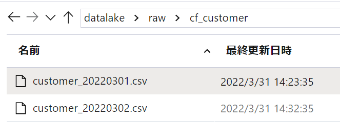

データセットも使いまわします。

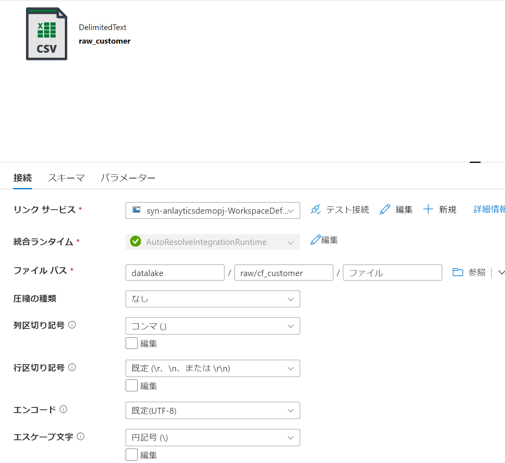

### 1. Mapping Dataflowの作成

1 ソースを追加します。

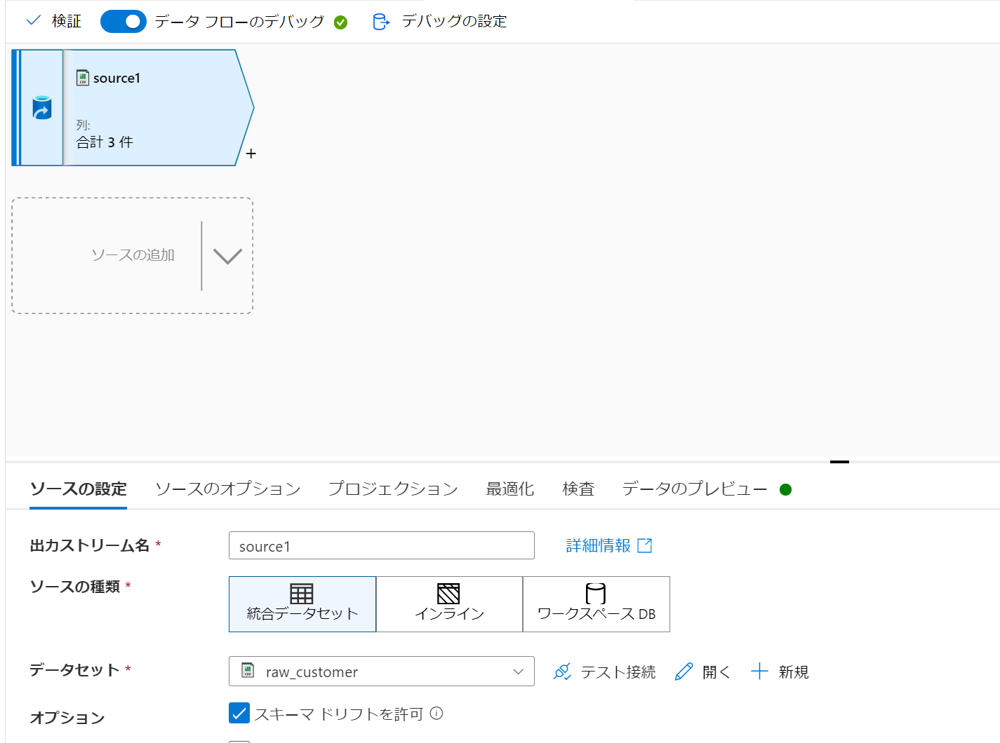

2 ファイルネームに連携日が含まれているので設定します。

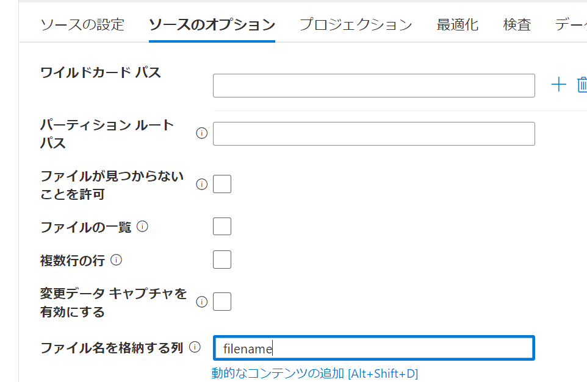

3 プレビューを確認します。

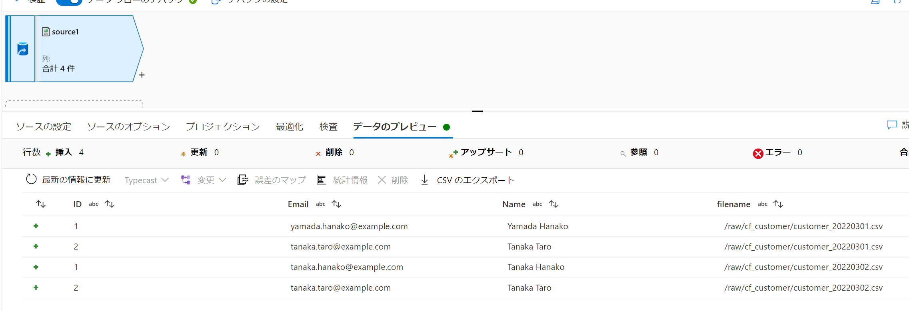

4 パラメータを設定します。

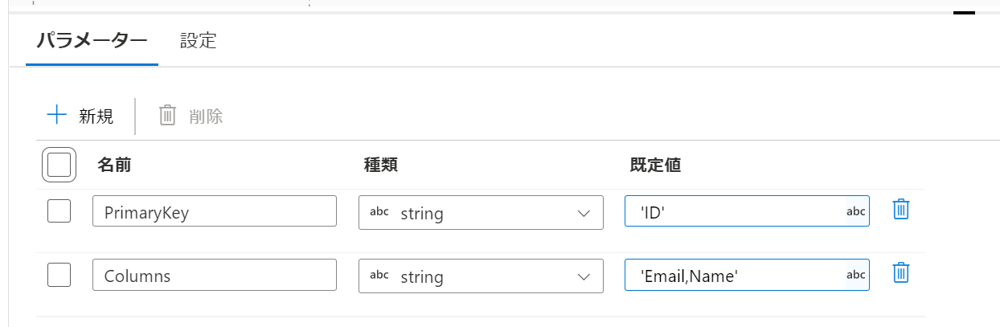

5 キーハッシュ列、データハッシュ列、日付列を追加します。

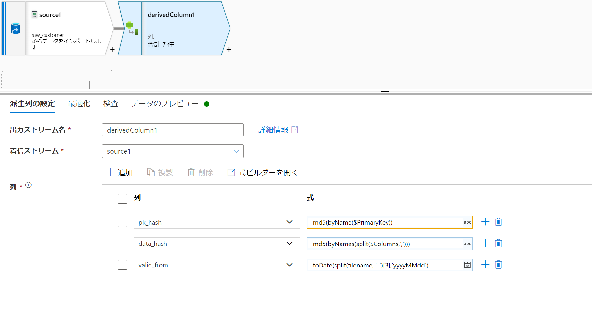


pk_hash：

キー列からハッシュ値を生成します

```

md5(byName($PrimaryKey))

```

data_hash:

データ列からハッシュ値を生成します。


```

md5(byNames(split($Columns,',')))

```

valid_from:

データの有効開始日となります。

```

toDate(split(filename, '_')[3],'yyyyMMdd')

```

プレビューはこんな感じ

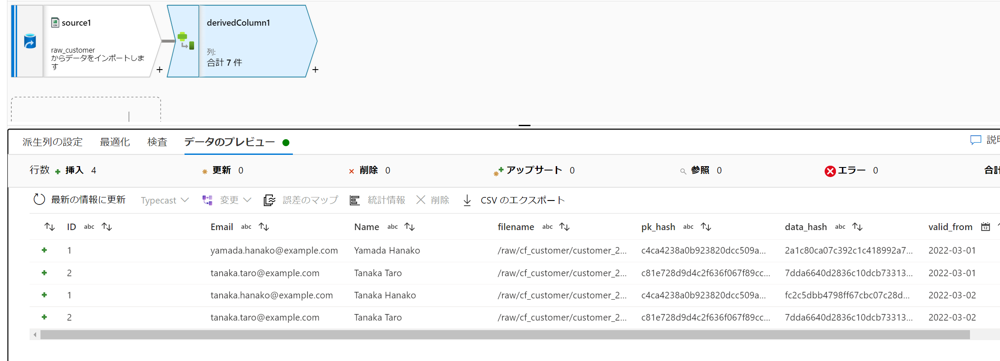

6 ID=2については変更していないことがわかります。これは同じvalid_from(開始日)にしたいので集約をかけます。

※ハッシュ列の付与も含め、変更データのみがファイル連携される基盤であれば、この集約は不要となります。

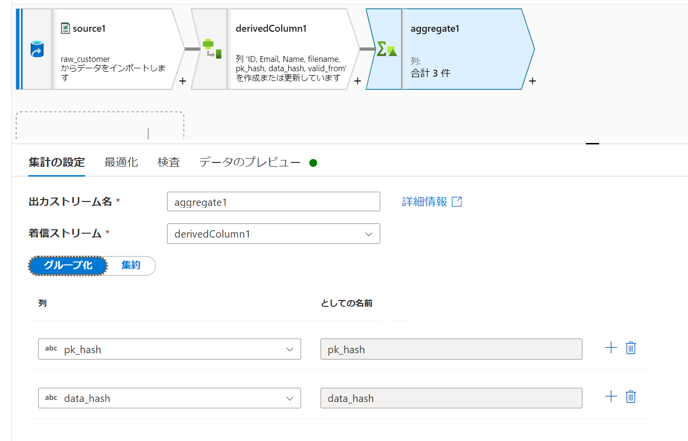

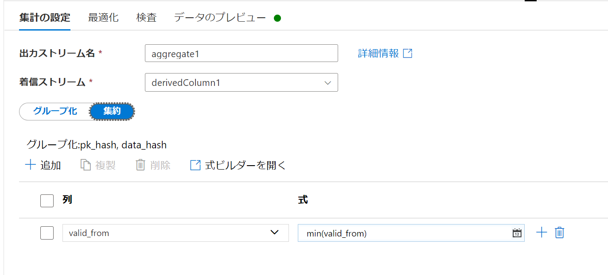


変更のあったデータのみが2行となりました

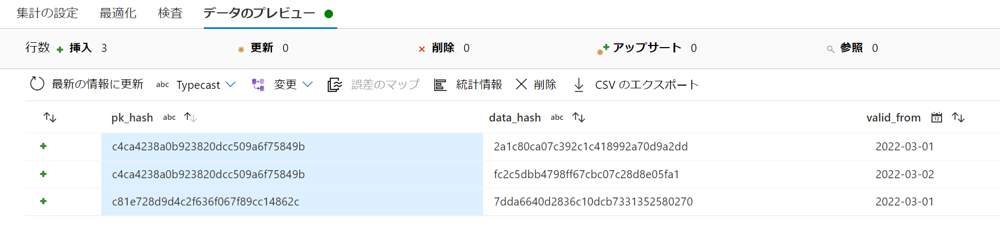


7 集約結果と自己結合をして、必要なデータのみにしぼります。

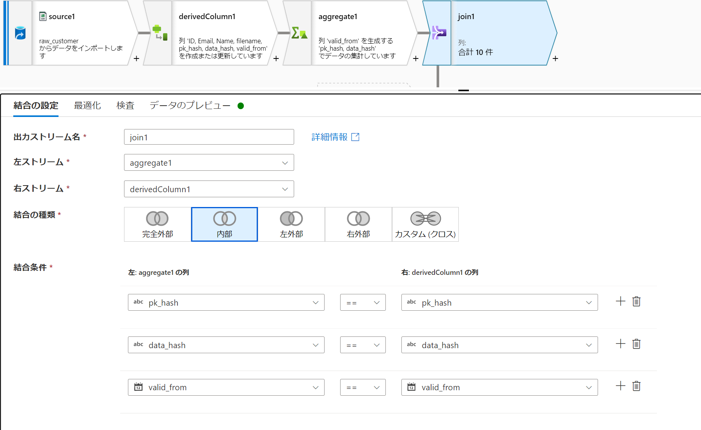


8 select で列を調整します。

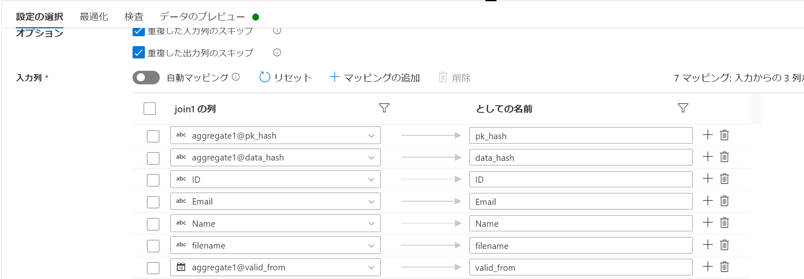


9 いよいよvalid to を生成します。windowを追加します。

over : 

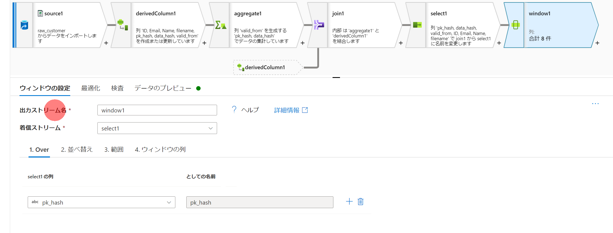

並び替え：

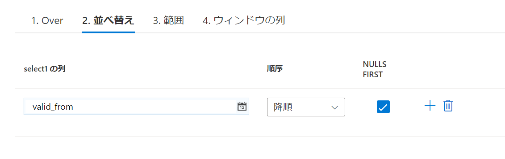


範囲：


ウィンドウの列：

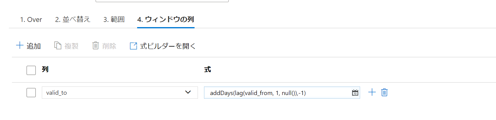

```

addDays(lag(valid_from, 1, null()),-1)

```

valid_toが次のvalid_fromの前日となるようにしています。

プレビューをみます。
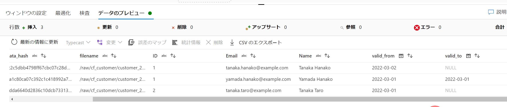

10 全件処理なので、シンクは上書きするように構成しましょう

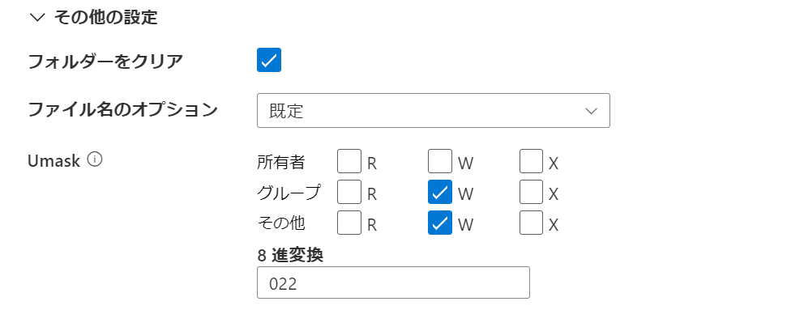

### 2. 結果の確認

パイプライン実行し、ファイルを確認してみます。

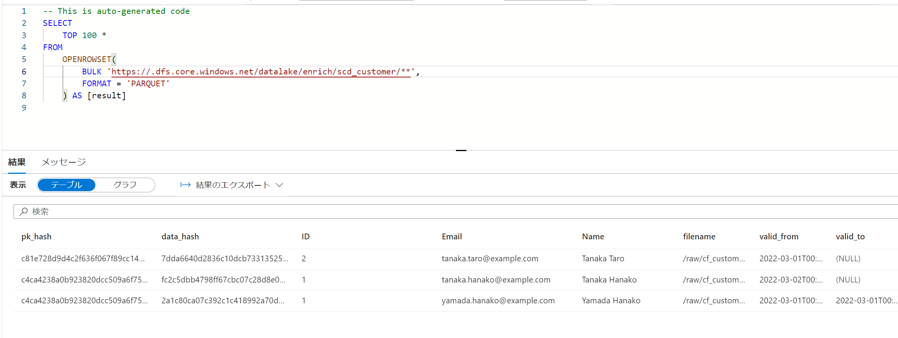


