## はじめに

SharePoint（Teamsも含む） 上のファイル連携の要望は多いです。

[Azure Data FactoryでSharePointのファイルをADLS Gen2にコピー](https://qiita.com/yaagi/items/eb6a86e0c9a2fc3b3e61) など、API を利用したコピーはいくつか見かけられますが、 基本的には 単一ファイルをループしてとるような方式です。

今回はより簡単な方法のアイデアをもらったのでやってみました。

※ 今回紹介する方法は一つの手段であり、懸念も存在します。個人的には保証されている API を利用したほうがデータ連携としては安定するように思います。ただ、API の方式は大量のファイル連携でもいけるのか？という気持ち・・・

## 概要

SharePoint の Onedrive を利用したローカルファイル同期を使ってファイルシステムとして セルフホステッド統合ランタイムからアクセスさせます。

## 手順

ローカルファイルへアクセスするためのリンクサービス設定は[こちら](https://qiita.com/ryoma-nagata/items/35e58aa4bb846bd8dac3)をご確認ください。

### 1. ローカルファイル同期設定

1. SharePoint or Teams の 対象フォルダを同期します。

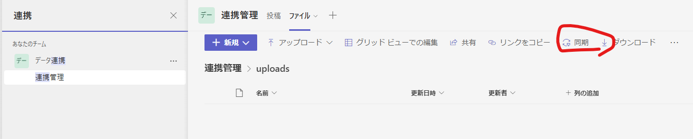

2. フォルダが追加されたら右クリックから **このデバイス上で常に保持** をクリック

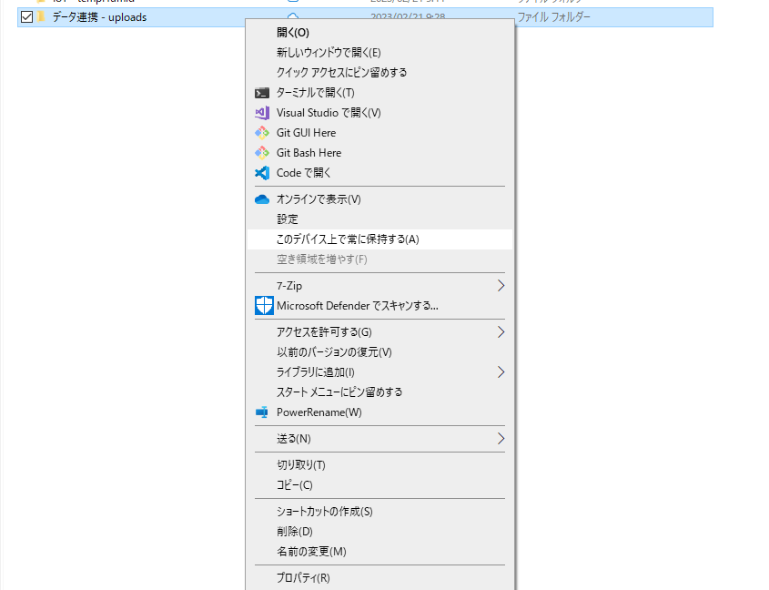

### 2. パイプライン作成

1. パイプライン画面からファイルシステムのデータセットを作成します。

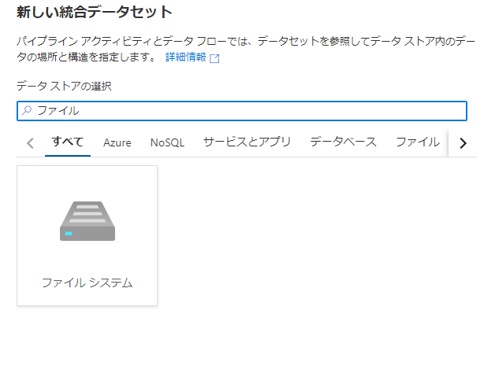

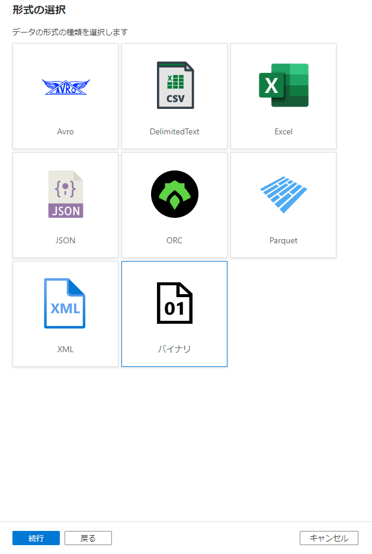

2. ファイルパスを確認し、参照します

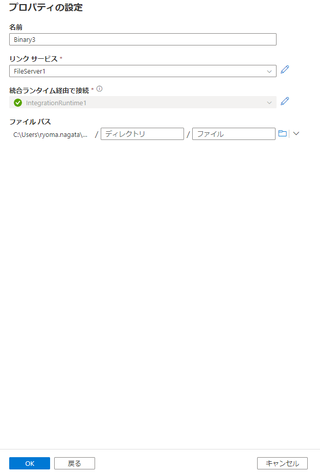

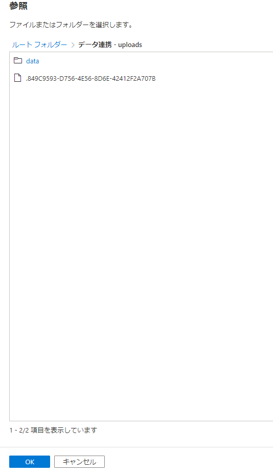

3. データセットが完成しました。

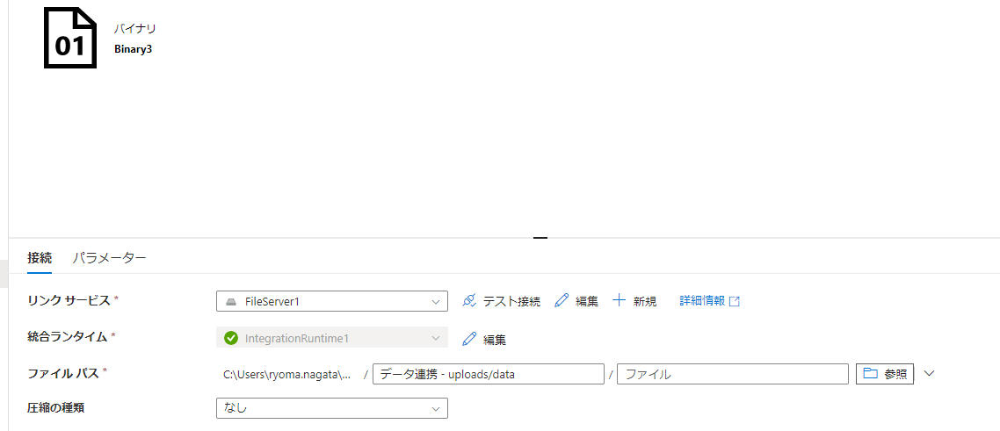

4. コピーアクティビティのパイプラインを作成し、適当な場所にシンクする設定をします。

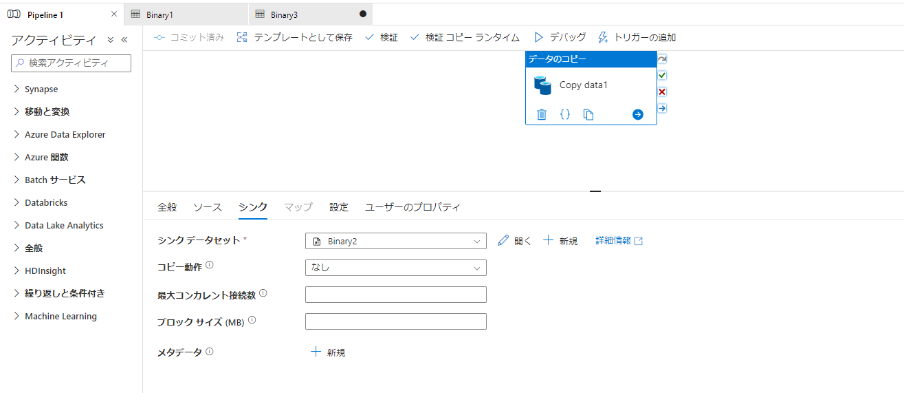

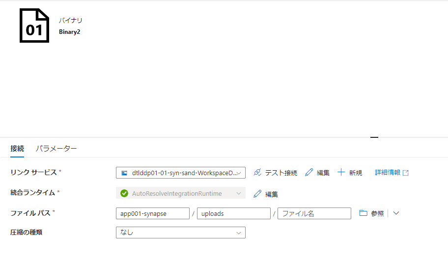

### 3. 確認

1. ファイルを Teams にアップしてみます。ルートフォルダはOnedriveが使用しているファイルがあるためお勧めしません。

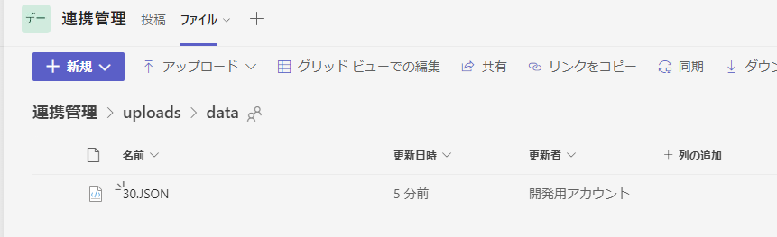

2. 数分待ち、パイプラインをデバッグ実行し、成功を確認します

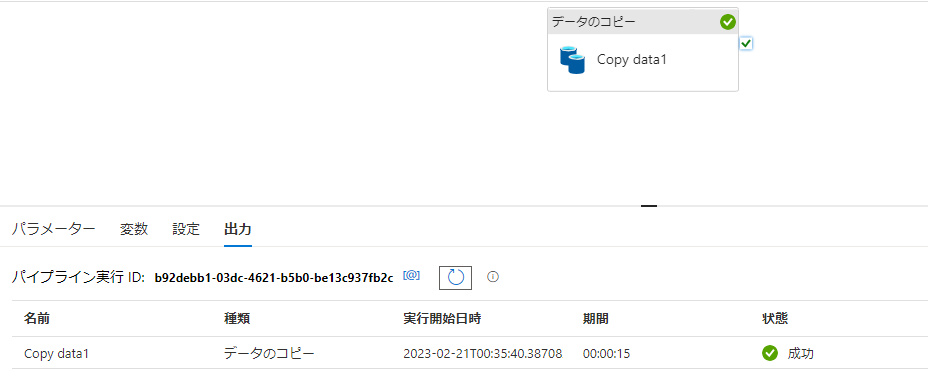

3. データレイクに連携できました。

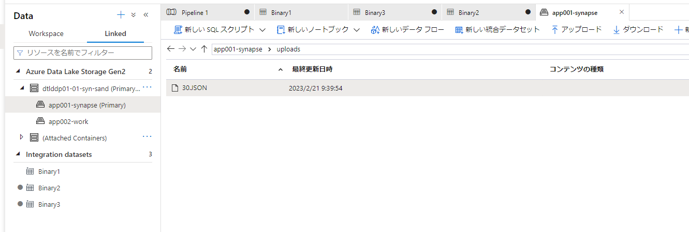

## 懸念

- ファイル同期のラグが発生するため、アップしたファイルはすぐに取得できません。
- 今回の検証の中ではユーザーのロック状態でも取得できることを確認できていますが、同期のタイミングや、不整合を起こした際に同期が停止するようなことが起きたら、など実際運用してみないとわからないことがありそうです。

