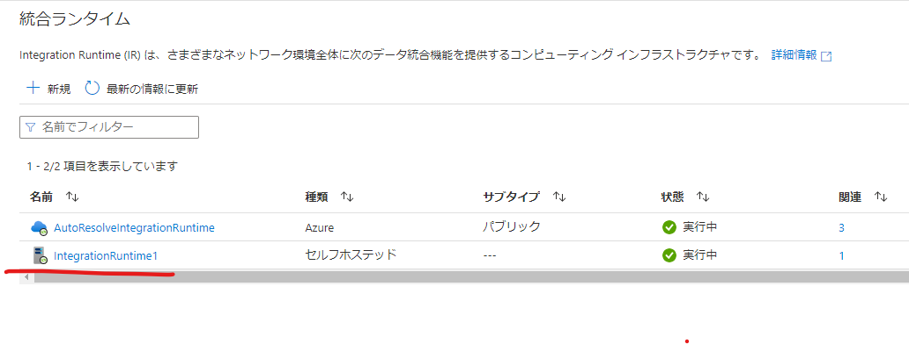
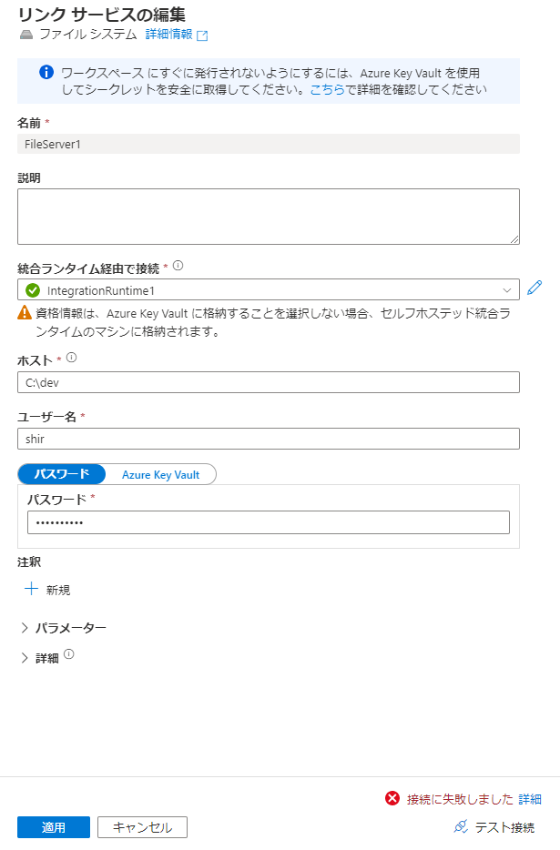
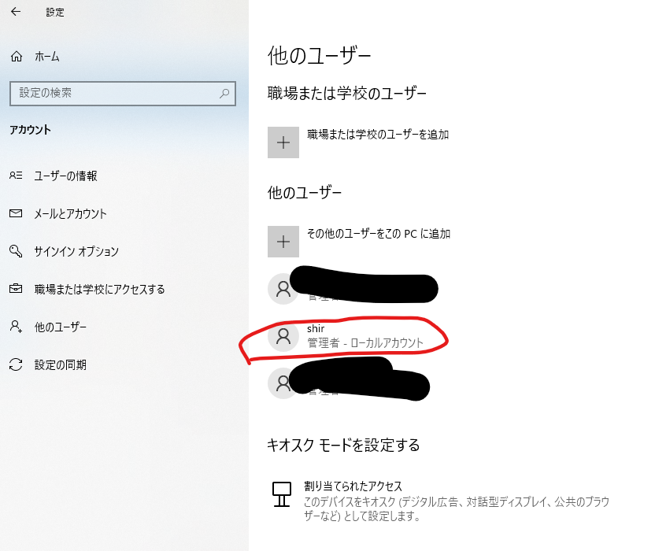
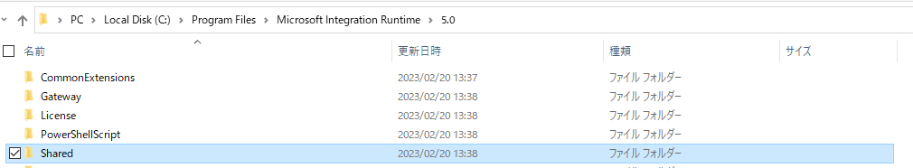
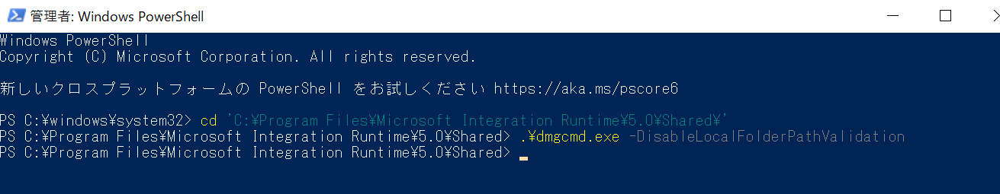
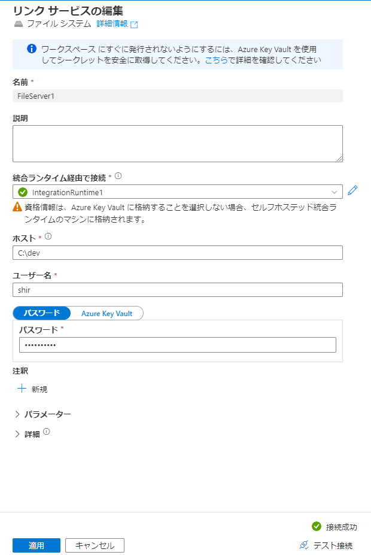

## はじめに

検証準備として、セルフホステッド統合ランタイムでローカルファイルをアップしようとしていたところうまくいかず、サポート利用して確認したところ最新のセルフホステッド統合ランタイムでは追加の設定が必要であることがわかったため、共有します。

## 修正内容


https://www.microsoft.com/en-us/download/details.aspx?id=39717

からダウンロードできるリリースノートに以下のような記載があります。

> 5.23.8355.1
> What’s new 
>
> Azure Data Factory: introduce a new security control for the Self-hosted Integration Runtime (SHIR) admin that lets them allow or disallow local SHIR file system access through File system connector. 
> 
> SHIR admins can use the local command line (dmgcmd.exe -DisableLocalFolderPathValidation/-EnableLocalFolderPathValidation) to disallow or allow. Refer here to learn more.
> 
> Note: We have changed the default setting to disallow local SHIR file system access from SHIR versions (>= 5.22.8297.1). Using the above command line, you should explicitly opt-out the security control and allow local SHIR file system if needed.

要約すると、「version 5.22.8297.1 以降、既定ではローカルファイルシステムへのアクセスを禁止されたけれど、version 5.23.8355.1 で追加したコマンドラインから許可設定を変更可能」とのことでした。

## 手順

dmgcmd.exe を実行することで、設定を変更します。

## 準備

1. [UI を使用してセルフホステッド IR を作成する](https://learn.microsoft.com/ja-jp/azure/data-factory/create-self-hosted-integration-runtime?context=%2Fazure%2Fsynapse-analytics%2Fcontext%2Fcontext&tabs=synapse-analytics#create-a-self-hosted-ir-via-ui)を参考に、セルフホステッド統合ランタイムをインストールします。



2. インストール後、ファイルシステムのリンクサービスを作成します。


3. セルフホステッド統合ランタイムをインストールしたマシンのローカルパスを入力して、テスト接続が失敗することを確認します。



統合ランタイムがセルフホステッド統合ランタイムとなっているよう注意しましょう。

ちなみに今回は検証用に、ローカル管理者ユーザーを作成しています。ドメインユーザーで検証する際は {ドメイン名}\{ユーザー名} でリンクサービスを設定しましょう。



## ローカルドライバーへのアクセスを許可する

1. まずは、dmgcmd.exeの場所を確認します。通常は C:\Program Files\Microsoft Integration Runtime\{version}\Shared\ フォルダーに置かれます。



2. Power Shell を管理者実行して、目的のパスまで移動します。

```powershell

cd 'C:\Program Files\Microsoft Integration Runtime\5.0\Shared\'

```

3. セキュリティ検証を無効にして、ローカル コンピューターのファイル システムへのアクセスを有効にします。

```powershell

.\dmgcmd.exe -DisableLocalFolderPathValidation

```



4. Azure 側で再度テスト接続し、成功を確認します。

