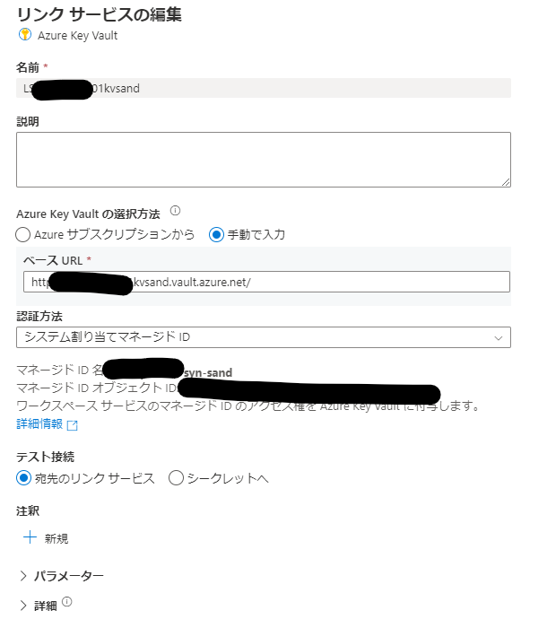

## はじめに

API仕様など都合上、シークレット情報をパイプライン内で利用しないといけない場合のTips

## 参考 

https://learn.microsoft.com/ja-jp/rest/api/keyvault/secrets/get-secret/get-secret?tabs=HTTP

## 準備

key vault のシークレットを作成しておきます。値は見えないですが、testと入れています

利用する Synapse Workspace か Data Factory が Key Vault のシークレットユーザー権限を付与します。

リンクサービスも作成しておきます。

## 手順

1.パイプラインを作成してパラメータを二つ作成

2.確認用に変数も作成

3.Webアクティビティを配置

4.**動的なコンテンツの追加**を選択

5.https://@{pipeline().parameters.vaultName}.vault.azure.net/secrets/@{pipeline().parameters.secretName}?api-version=7.3 と入力。参考に記載のGetSecretのAPI仕様に従います。

6.メソッドを設定して、MSI認証をするために認証を**システム割当マネージドID**に設定。リソースを** https://vault.azure.net**に設定。

7.確認用に変数の設定を配置

8.確認用の変数を設定して、**動的なコンテンツの追加**を選択

9.**secret is @{activity('Web1').output.value}** と入力。※実際に利用する場合には、このようにoutput.valueから取得できるという例です。

10.デバッグ実行してみます。

11.出力を確認すると、valueがとれています

12.変数設定の出力をみると想定通りですね

13.最後に、シークレットの内容を平文でログされるのはよくないので、**セキュリティで保護された出力**をオンにします。

14.もう一度デバッグすると、きちんと隠ぺいされています。※後続で設定した変数もセキュリティで保護された出力をオンにしないとそちらで確認できてしまうので注意

