## はじめに

[Flowlets and Change Feed now GA in Azure Data Factory](https://techcommunity.microsoft.com/t5/azure-data-factory-blog/flowlets-and-change-feed-now-ga-in-azure-data-factory/ba-p/3267450)

の2機能がGAしましたので、実用タイミングも踏まえて試してみます。


## 前提知識

[What's Data Lake ? Azure Data Lake best practice](https://speakerdeck.com/ryomaru0825/whats-data-lake-azure-data-lake-best-practice)

より、データレイクの層構造がわかるとユースケースが想像しやすいと思います。
※今回はrawにDelta Lakeなどを利用しない構成で考えてみてます。sparkが利用できる環境ではrawにはDelta Lakeを用いることをお勧めします。


## ユースケース

以下のようなraw->entichのケースで使ってみます。

顧客マスタが毎日日付の入ったcsvで連携され、以下のゾーンを利用して統合されます。

raw:連携されたファイルをそのまま蓄積
enrich:rawに連携された **新規ファイル** のみをdelta lakeとして変換し、upsert

## 手順

### 0. 環境とデータを準備

1 Synapse Analyticsをデプロイします。（ADFでもいいですが、datalakeと接続の作成が必要です）

[Synapse ワークスペースの作成](https://docs.microsoft.com/ja-jp/azure/synapse-analytics/get-started-create-workspace)

2 データを準備します。

[Azure Data Factory の Mapping Data Flow で CSV ファイルの重複行を削除する](https://qiita.com/nakazax/items/94ffeaf2c9d7ada96cc2)から参考にさせていただきました。

二日分のデータでID=1のレコードのみ更新がかかっています。

ファイル名：customer_20220301.csv

```

"ID","Email","Name"
"1","yamada.hanako@example.com","Yamada Hanako"
"2","tanaka.taro@example.com","Tanaka Taro"

```


ファイル名：customer_20220302.csv

```

"ID","Email","Name"
"1","tanaka.hanako@example.com","Tanaka Hanako"
"2","tanaka.taro@example.com","Tanaka Taro"

```

### 1. Mapping Data flowを作成します。

1 ソースを追加します。

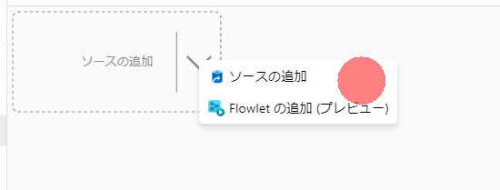

Data Lake Strage Gen2、Delimited textのデータセットを作成し、
以下のプロパティに設定します。

パスは **raw/cf_customer** とします。

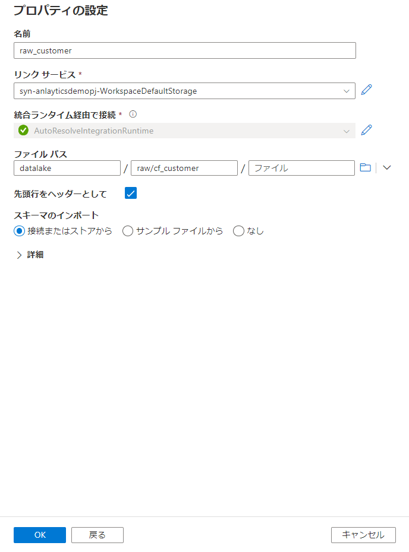

サンプルファイルからスキーマのインポートを行いましょう。

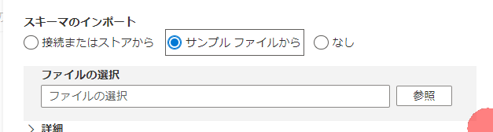

2 変更データキャプチャの設定をオンにします。また、ファイル名も格納しておきましょう。この設定により、今後rawゾーンに置かれたファイルのうち、未処理のファイルのみが処理されます。

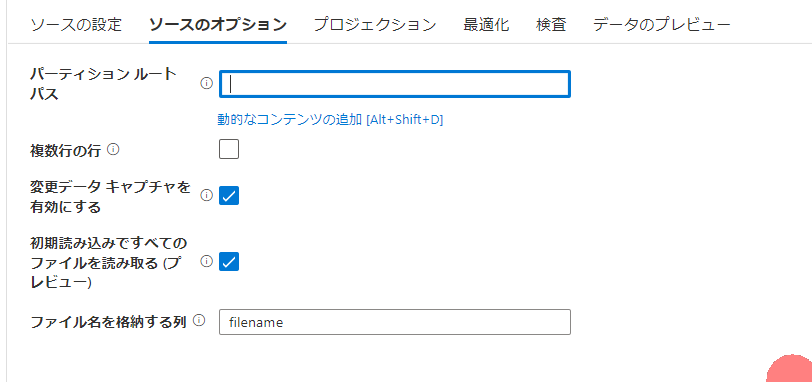

3 シンクを設定します。

Delta Lake は差分と表示されていますが、気にせず利用します。。。

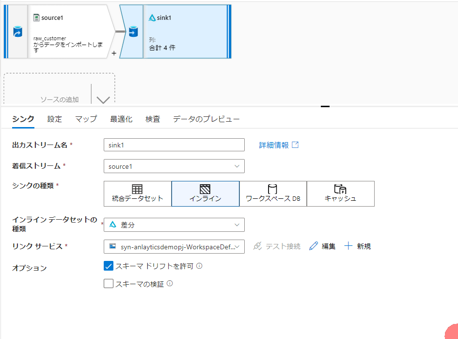


パスは　**enrich/cf_customer** とします。

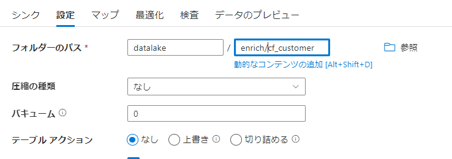

4 データ追加時のアクションを設定します。

IDをキーにしてアップサートしましょう。これで最新の状態にマスタが更新されていきます。


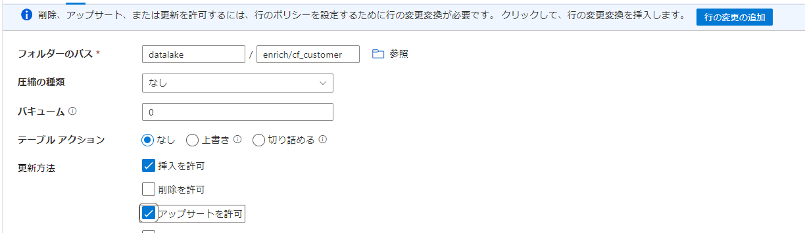

キーカラムも忘れずに


5 案内にしたがい、**行の変更の追加** をクリック後、すべての行がアップサート対象となるようにtrue()を設定します。

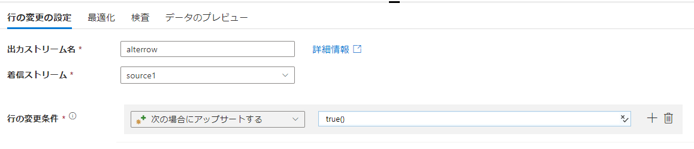

6 パイプラインを構成します。

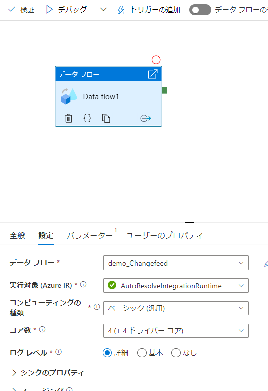

### 2. データを配置し、初回の結果を確認します。

1 データをアップします。

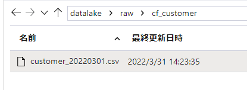

2 デバッグ実行します。

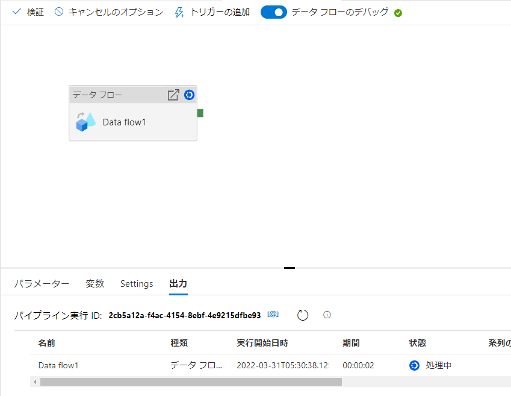

3 Delta Lakeで対象フォルダをクエリして確認します。

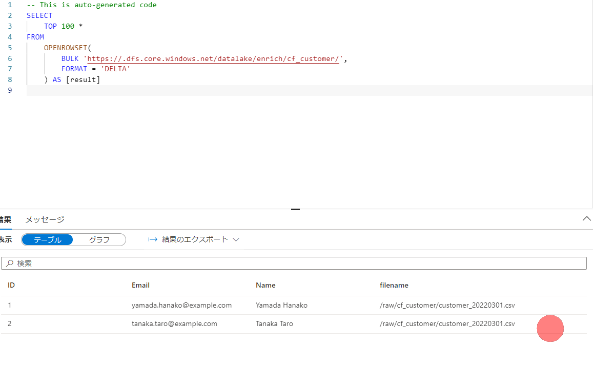


### 3. 差分データを配置し、2回目の結果を確認します。

1 データをアップします。

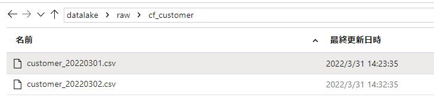

2 デバッグ実行し、処理された行数を確認します。1ファイル分が処理されていることがわかります。

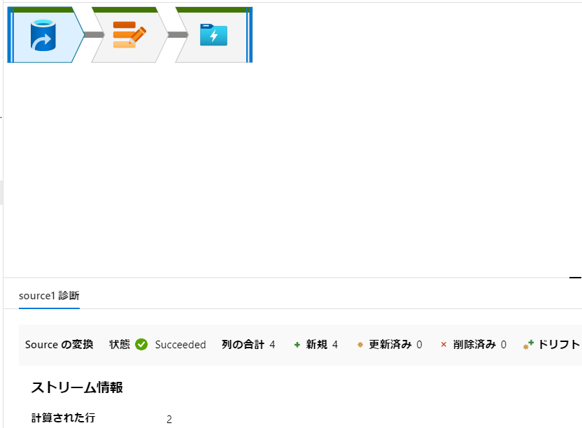

3 正常にデータが更新されました

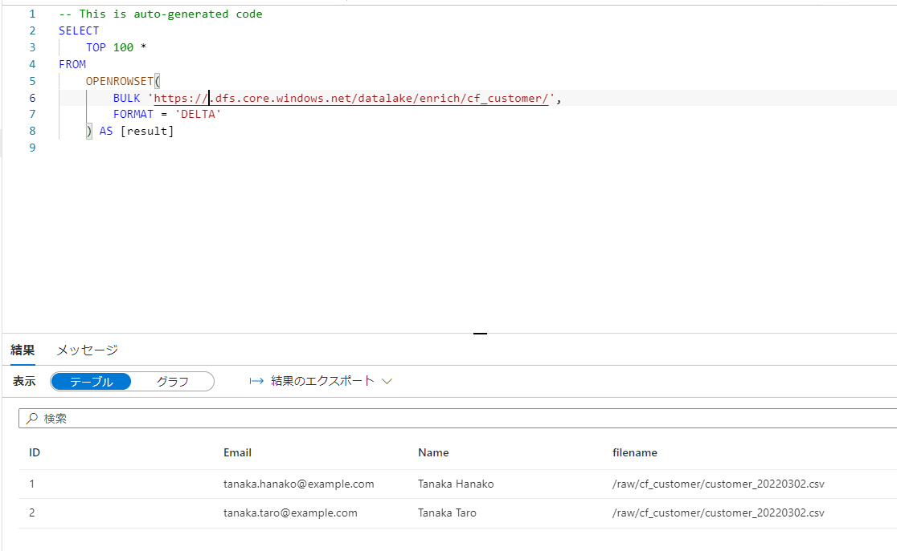


## 補足

今回はアップされたデータすべて更新されるような方式ですが、連携データを更新分のみにするか、更新チェックをデータフローで実装すれば更新のコストを削減できると思います。

## 参考

https://docs.microsoft.com/en-us/azure/data-factory/connector-azure-data-lake-storage?tabs=data-factory#change-data-capture

https://www.youtube.com/watch?v=Y9J5J2SRt5k

https://docs.microsoft.com/ja-jp/azure/data-factory/connector-azure-data-lake-storage?tabs=data-factory#change-data-capture-preview

以下の記載があるため、パイプラインの変更には注意

>最後の実行からチェックポイントを常に記録して、そこから変更を取得できるよう、パイプラインとアクティビティ名は変更しないでください。 パイプライン名またはアクティビティ名を変更すると、チェックポイントがリセットされ、次の実行は最初から開始されます。