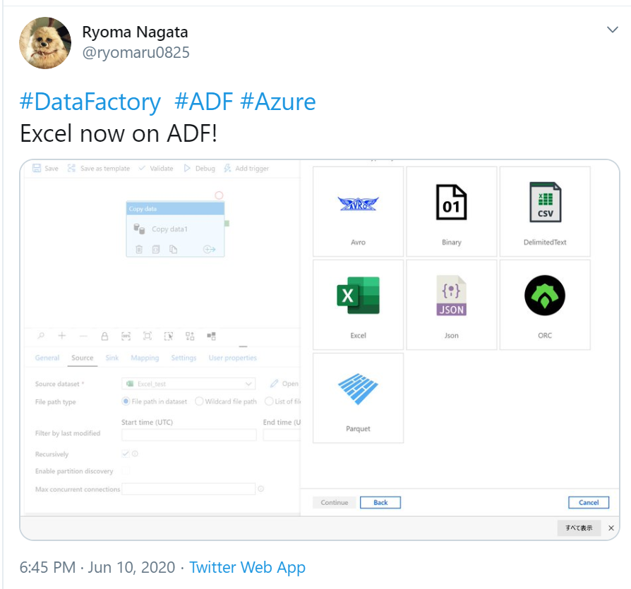
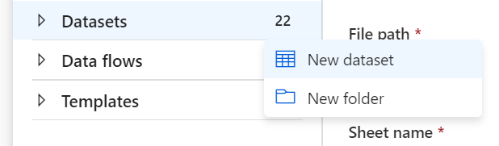
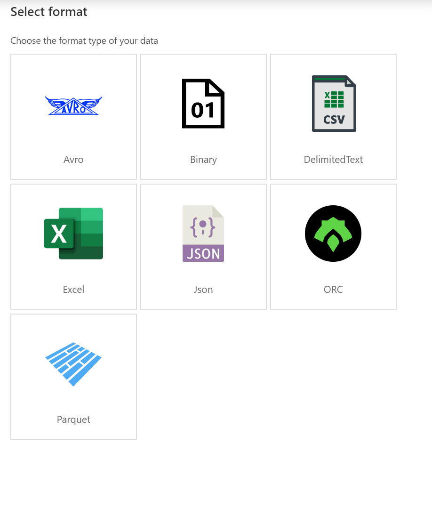
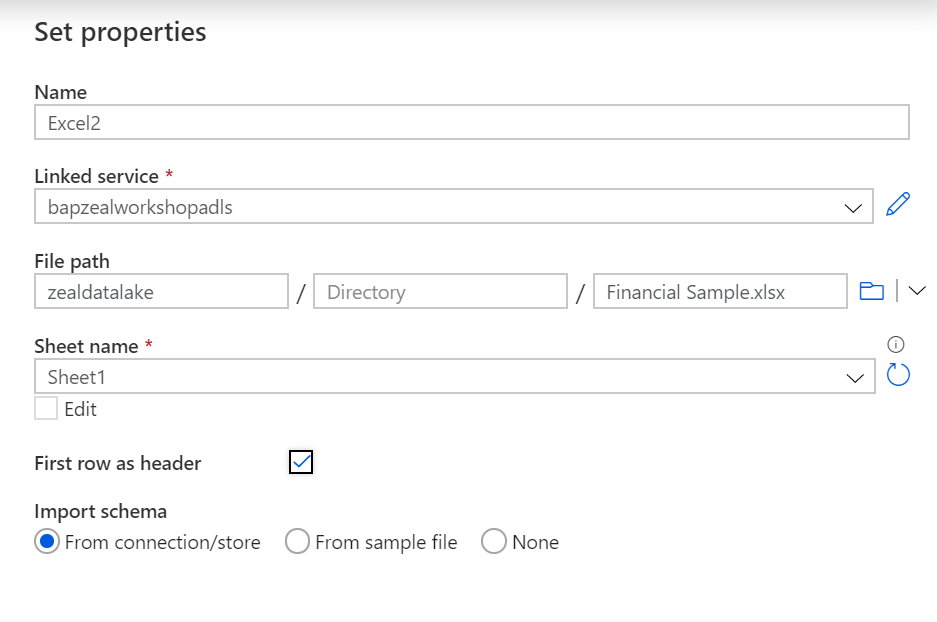

## ADFをいじっていたら見つけました

**Excel 使えるようになってる！**

思わず勢いそのままつぶやく

## 早速使ってみた

### 手順

1. Datasetを作成します。

2. Excelを置いたStorageのあるLinked Serviceを選択して、Excelを選択します。

3. ファイル、シートを選びます。

4. データセットができあがります。

5. あとはCopy ActivityでDBに書き込むもよし、型を変換してParquetにして保存するもよしです

### 所感

ご質問をいただき「Excel 内のSheetのリストを取得するにはどうするか」を検証しましたが、現時点では難しそうでした。
ただし、公式DocsのほうもまだExcelに関する記載がないので、なにかいい感じの変数があるのかもしれません。
updateに期待です