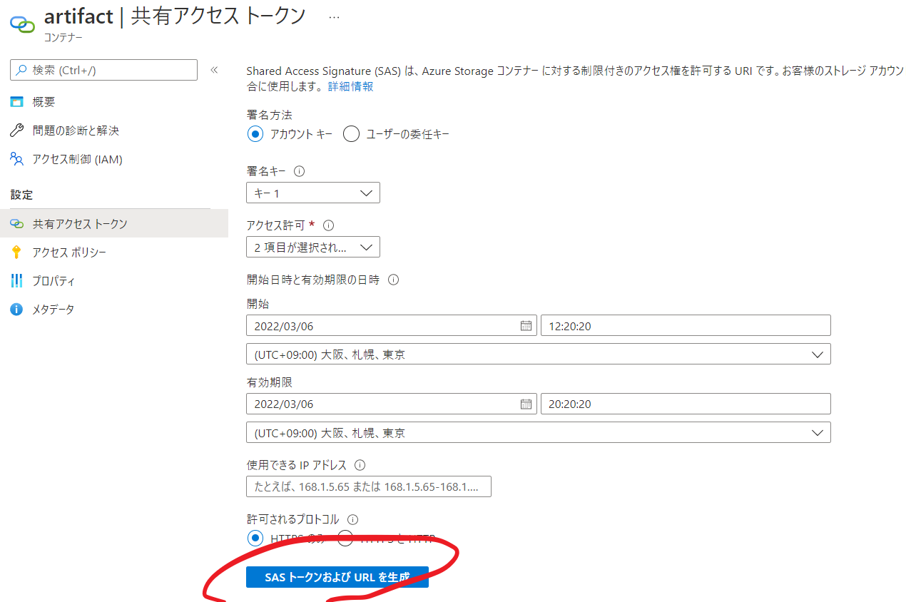
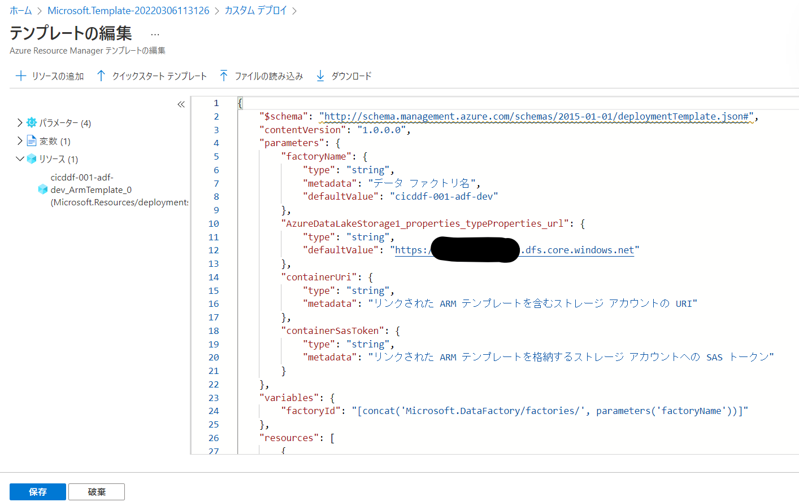

## はじめに

Data Factoryの開発環境から本番環境への反映方法についてまとめます。

今回は大規模なDataFactory向けのパターンである、**手動**、**大規模向け**となります。

注意事項：
- Synapse では利用できません。SynapseはARM上に成果物を保持していないため
- トリガーの移行では一時的なトリガーの停止が必要です。
- 反映は増分であるため、削除の反映は手動で消すかスクリプトの利用が必要です。
- ファイアウォールを設定しないARMテンプレート用のストレージが必要です。

2022/03時点の情報です。

## ARMテンプレートの制限とData Factoryの対応

ひとつのARMテンプレートファイルにはリソースの最大数の制約があり、きわめて多くのリソース（パイプライン、データセット、リンクサービスなど）が存在する大規模なData Factory リソースでは、この制約で反映が難しいケースが存在します。

Data Factoryでは、ARMテンプレートファイルを分割し、リンクテンプレートという機構をもちいることでこの制限をパスします。

## 参考記事

[https://docs.microsoft.com/ja-jp/azure/data-factory/continuous-integration-delivery-linked-templates](https://docs.microsoft.com/ja-jp/azure/data-factory/continuous-integration-delivery-linked-templates)

## 手順

### 準備

以下のような状態だとします。
#### 開発環境

リンクサービス：

データセット：

#### 本番環境

作成した時点のデフォルト状態です。

リンクサービス：

データセット：

### 1. ARMテンプレート用のストレージの準備

このように**artifact**というコンテナをもつストレージを用意しました。（コンテナ名はなんでもいいです）

このストレージに対してARMがアクセスするためにファイアウォールを設定しないようにしておきます。

### 2. ARMテンプレートのエクスポート

開発環境のADF上の管理ハブから**ARMテンプレート**→**ARMテンプレートのエクスポート**を実行します。

ダウンロードできたファイルを確認します。

今回の手順では、**linkedTemplates** 内のファイルを利用します。

### 3. linked templateのアップロード

linked templateは、以下のように、masterと連番付きのARMテンプレートファイルが存在します。（＋パラメータファイル）

大規模な構成では、この連番付きのファイルが増えていき、リソースのデプロイ数を調整します。

連番ファイルにも既定値としてストレージなどの情報がふくまれるのでこれは削除しておきましょう。

この連番付きファイルをすべて上述のARMテンプレート用のストレージにアップします。

このファイルにアクセスするために、共有アクセストークンを作成します。

アクセス許可はリスト、読み取り

必要に応じて、期限などを設定して、**SASトークンおよびURL**を生成をクリックします。

生成されたURLから、
?以前の文字列

?を含む以降の文字列をメモします。

### 3. ARMテンプレートのインポート

ADFに戻り、開発環境のADF上の管理ハブから**ARMテンプレート**→**ARMテンプレートのインポート**を実行すると、カスタムデプロイ用画面に遷移します。

**エディターで独自のテンプレートを作成する** を選択します。

先ほどダウンロードしたうちの、**ArmTemplate_master.json** を読み込みます。

結果が表示されるので、**保存**をクリック

**プロジェクトの詳細**では、対象の本番環境ADFが存在するリソースグループを選択します。

インスタンスの詳細では、本番環境用のパラメータおよびLinkedTemplate用の値を設定します。
今回は以下

 - 対象の本番環境ADFのリソース名
 - 本番環境ADF用のデータレイクストレージurl
 - 手順2でメモした**?以前の文字列** をContainer URIとして
 - 手順2でメモした**?を含む以降の文字列** をContainer SAS Tokenとして

パラメータファイルはダウンロードしておくと次回以降は読み込むだけで利用可能です。

**確認と作成** → **作成** からデプロイします。
もし失敗する場合、ARMテンプレート用のストレージの設定ができていない場合があります。（ファイアウォール、SASTokenに?の付与をしていない）

本番環境にデプロイされました。

なお、リンクサービス名は環境に関する文字列はいれないことを推奨します。（各環境間で同じ名前を使いたい）