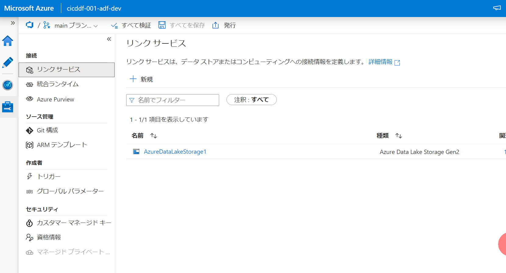
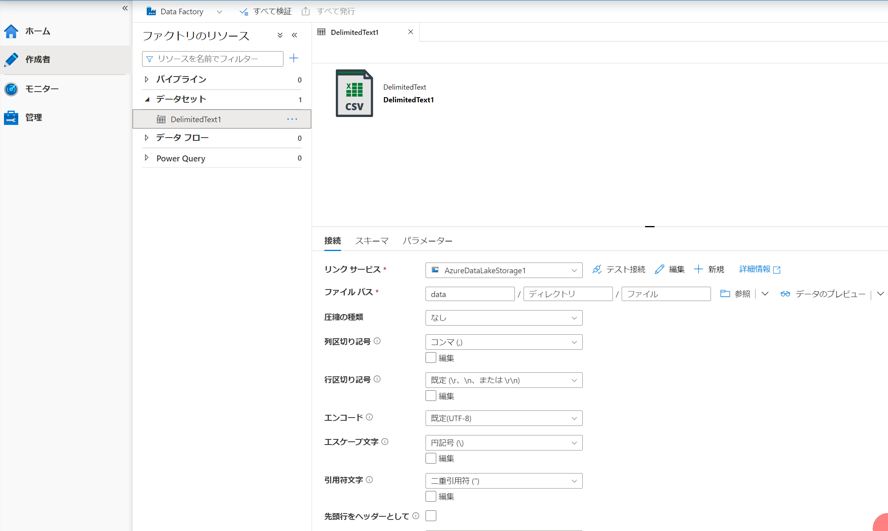
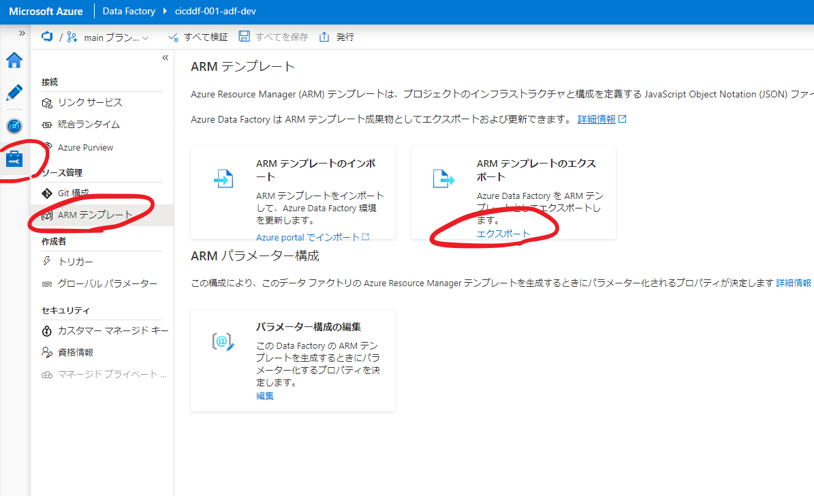
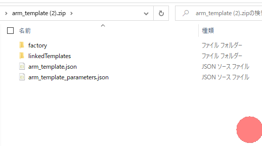
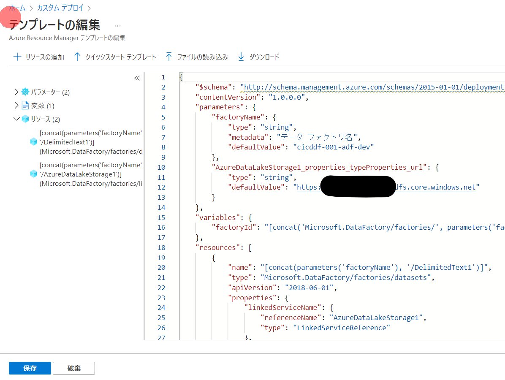
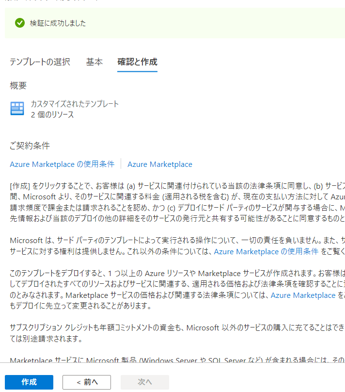

## はじめに

Data Factoryの開発環境から本番環境への反映方法についてまとめます。

今回は最も単純なパターンである、**手動**、**小規模向け**となります。

注意事項：
- Synapse では利用できません。SynapseはARM上に成果物を保持していないため
- トリガーの移行では一時的なトリガーの停止が必要です。
- 反映は増分であるため、削除の反映は手動で消すかスクリプトの利用が必要です。

2022/03時点の情報です。

## 参考記事

[https://docs.microsoft.com/ja-jp/azure/data-factory/continuous-integration-delivery-manual-promotion](https://docs.microsoft.com/ja-jp/azure/data-factory/continuous-integration-delivery-manual-promotion)

## 手順

### 準備

以下のような状態だとします。
#### 開発環境

リンクサービス：

データセット：

#### 本番環境

作成した時点のデフォルト状態です。

リンクサービス：

データセット：

### 1. ARMテンプレートのエクスポート

開発環境のADF上の管理ハブから**ARMテンプレート**→**ARMテンプレートのエクスポート**を実行します。

ダウンロードできたファイルを確認します。

今回の手順では、**arm_template.json** を利用します。

### 2. ARMテンプレートのインポート

同様に、開発環境のADF上の管理ハブから**ARMテンプレート**→**ARMテンプレートのインポート**を実行すると、カスタムデプロイ用画面に遷移します。

**エディターで独自のテンプレートを作成する** を選択します。

先ほどダウンロードした**arm_template.json** を読み込みます。

結果が表示されるので、**保存**をクリック

**プロジェクトの詳細**では、対象の本番環境ADFが存在するリソースグループを選択します。

インスタンスの詳細では、本番環境用のパラメータを設定します。
今回は以下

 - 対象の本番環境ADFのリソース名
 - 本番環境ADF用のデータレイクストレージurl

今回の環境では、本番と開発の名称差分はdev->prodに変更するだけなので該当箇所を修正しました。

パラメータファイルはダウンロードしておくと次回以降は読み込むだけで利用可能です。

**確認と作成** → **作成** からデプロイします。

本番環境にデプロイされました。

なお、リンクサービス名は環境に関する文字列はいれないことを推奨します。（各環境間で同じ名前を使いたい）