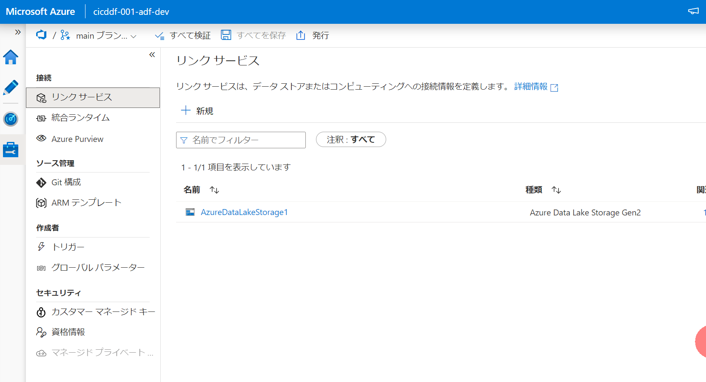
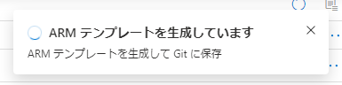
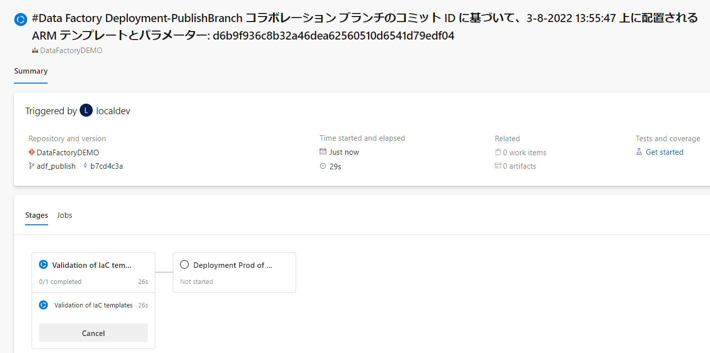

## はじめに

Data Factoryの開発環境から本番環境への反映方法についてまとめます。

今回は大規模なDataFactory向けのパターンである、**自動（承認付き）**、**小規模向け**となります。

注意事項：
- Synapse では利用できません。SynapseはARM上に成果物を保持していないため


2022/03時点の情報です。


## 参考記事

[Azure Data FactoryのCI/CDをAzure DevOpsで実装する](https://qiita.com/whata/items/7cad0c01e76d2f22e257#prepost%E3%83%87%E3%83%97%E3%83%AD%E3%82%A4%E3%82%B9%E3%82%AF%E3%83%AA%E3%83%97%E3%83%88)

[Azure Pipelines リリースを使用して継続的インテグレーションを自動化する](https://docs.microsoft.com/ja-jp/azure/data-factory/continuous-integration-delivery-automate-azure-pipelines)

※今回は従来のリリース方式となるPublishボタンでのパイプライン起動となります。ブランチ戦略、リリース戦略、および運用によって、使い分けてください。

[サンプルの配置前と配置後スクリプト](https://docs.microsoft.com/ja-jp/azure/data-factory/continuous-integration-delivery-sample-script)


## 手順

### 準備

以下のような状態だとします。
#### 開発環境

リンクサービス：


データセット：


#### 本番環境

作成した時点のデフォルト状態です。

リンクサービス：


データセット：


### 1. DevOps統合の設定

[Azure Repos Git 統合を使用した作成](https://docs.microsoft.com/ja-jp/azure/data-factory/source-control#author-with-azure-repos-git-integration)を参考に、Data FactoryとDevOpsのgit構成を設定します。

レポジトリの新規作成は今はできないようなので、Azure Repos側で作成します。


**開発済みのADFがある場合にDevOps統合を設定する場合** には、以下のように、既存のリソースのインポートを設定します。今回はすでに作ったものを使うので、これを設定します。
ルートフォルダーもdatafactoryなどのフォルダを指定するのがおすすめです。


設定後の画面では、作業ブランチは適宜作成してください。今回はリソース反映のデモをしたいだけなので、mainで作業します。


設定が済んだ段階で、Azure Repos側でData Facotryのjson定義が配置されます。


### 2. CICDパイプラインの作成、実行

コラボレーションブランチで作業（今回はmain）でADFを開いていると発行ボタンが押せます。


これを押すと、以下のようにadf_publishというブランチがAzure Reposに作成され、ARMテンプレートが配置されます。
※[Azure Data Factoryの環境反映パターン【手動、小規模】](https://qiita.com/ryoma-nagata/items/5fa5ef1d7f5f8029cfa4)で利用したものと同じものです。


このadf_publishが更新されたら＝発行ボタンを押したらパイプラインがトリガーされるように作成したいと思います。

#### 環境の設定

devopsに移動して、environment画面で、**prod** を作成します。
今回用意しているものは運用環境想定ですが、これをTESTや、QA、DEVとしてもいいです（後述のyamlを編集する必要があります。


作成した環境をクリックし、**・・・**から**Approvals and checks** をクリックします。


**Approvals** をクリックします。


承認をしてもらうDevOps上のメンバーを指定して**Create** します。


#### サービス接続の作成

[サービス接続を作成する](https://docs.microsoft.com/ja-jp/azure/devops/pipelines/library/service-endpoints?view=azure-devops&tabs=yaml#create-a-service-connection) を参考に、サービス接続を作成します。
※リンク先では、サービスプリンシパルを自動作成していますが、**該当のリソースグループに権限をもつサービスプリンシパル** をあらかじめ作成し、manualで作成することを推奨します。

今回は **azure-devops-service-connection** という名前で作成しました。


#### 必要ファイルのアップロード

1. 配置前後スクリプトをアップします。これにより、トリガーの停止、削除の反映が実施されます

Azure Reposで、adf_publishブランチを選択した状態で、ファイル作成に進みます。


ファイル名を **PrePostDeploymentsScript.ps1** とします。


[参照元](https://docs.microsoft.com/ja-jp/azure/data-factory/continuous-integration-delivery-sample-script#pre--and-post-deployment-script) のスクリプトをコピーして、はりつけ後、commitします。


ルートに作成されるようにしてください。


2. パラメータファイルを作成してアップします。

ひな型（開発環境でのパラメータ）が ** ARMTemplateParametersForFactory.json ** という名称で作成されているので、


これをダウンロードして、パラメータ内容を編集します。（以下は今回の例）


ファイル名を変更して、ルートにアップします。今回はファイル名を **ARMTemplateParametersForFactory_prod.json** としています。


3. 同様に **azure-pipelines.yaml** という名称で以下のyamlファイルを作成します。

```yaml:yaml

name: Data Factory Deployment-PublishBranch

trigger:
  branches:
    include:
      - 'adf_publish'
pr:
  none

variables:
  - name: AZURE_RESOURCE_MANAGER_CONNECTION_NAME
    value: "" # Update to '{your ResourceManagerConnectionName}'
  - name: AZURE_LOCATION
    value: "japaneast" # Update to '{your AZURE_LOCATION}'
  - name: SOURCE_FACTORY_NAME
    value: "" # Update to '{your SOURCE_FACTORY_NAME}'
  - name: TARGET_AZURE_SUBSCRIPTION_ID
    value: "" # Update to '{your TARGET_AZURE_SUBSCRIPTION_ID}'
  - name: TARGET_RESOURCE_GROUP_NAME
    value: "" # Update to '{your TARGET_RESOURCE_GROUP_NAME}'
  - name: TARGET_FACTORY_NAME
    value: "" # Update to '{your TARGET_FACTORY_NAME}'
  - name: PARAMETER_FILE_NAME
    value: "" # Update to '{your PARAMETER_FILE_NAME}'


stages:
  - stage: Validation
    displayName: "Validation of IaC templates"
    jobs:
      - job: Validation
        displayName: "Validation of IaC templates"
        continueOnError: false
        pool:
          vmImage: "ubuntu-latest"

        steps:
          # Checkout code
          - checkout: self
            name: checkout_repository
            displayName: Checkout repository
            submodules: true
            lfs: false
            clean: true
            continueOnError: false
            enabled: true

          # Deploy ARM - validation
          - task: AzureResourceManagerTemplateDeployment@3
            name: ARM_validation
            displayName: ARM - validation
            enabled: true
            continueOnError: false
            inputs:
              deploymentScope: "Resource Group"
              ConnectedServiceName: $(AZURE_RESOURCE_MANAGER_CONNECTION_NAME)
              subscriptionId: $(TARGET_AZURE_SUBSCRIPTION_ID) 
              resourceGroupName: $(TARGET_RESOURCE_GROUP_NAME)
              location: $(AZURE_LOCATION)
              templateLocation: "Linked artifact"
              csmFile: $(System.DefaultWorkingDirectory)/$(SOURCE_FACTORY_NAME)/ARMTemplateForFactory.json
              csmParametersFile: $(System.DefaultWorkingDirectory)/$(PARAMETER_FILE_NAME)
              deploymentMode: "Validation"

          # Deploy ARM - what-if
          - task: AzureCLI@2
            name: ARM_whatif
            displayName: Deploy ARM - what-if
            enabled: true
            continueOnError: false
            inputs:
              azureSubscription: $(AZURE_RESOURCE_MANAGER_CONNECTION_NAME)
              scriptType: pscore
              scriptLocation: inlineScript
              inlineScript: |
                az account set `
                  --subscription $(TARGET_AZURE_SUBSCRIPTION_ID)
                
                az deployment group what-if `
                  --resource-group $(TARGET_RESOURCE_GROUP_NAME) `
                  --subscription $(TARGET_AZURE_SUBSCRIPTION_ID) `
                  --exclude-change-types Ignore NoChange Unsupported `
                  --template-file $(System.DefaultWorkingDirectory)/$(SOURCE_FACTORY_NAME)/ARMTemplateForFactory.json `
                  --parameters  $(System.DefaultWorkingDirectory)/$(PARAMETER_FILE_NAME) `
                  --result-format "FullResourcePayloads"
                
              powerShellErrorActionPreference: "stop"
              addSpnToEnvironment: false
              useGlobalConfig: false
              failOnStandardError: false
              powerShellIgnoreLASTEXITCODE: false


          - publish: '$(System.DefaultWorkingDirectory)'
            displayName: 'Publish ARMtemplate'
            artifact: 'datafactory'

  - stage: Deployment_prod
    displayName: "Deployment Prod of IaC templates"

    # condition: and(succeeded(), in(variables['Build.Reason'], 'IndividualCI', 'BatchedCI'))
    jobs:
    - deployment: DeployToDev
      displayName: "Deployment of IaC templates"
      continueOnError: false
      pool:
        vmImage: "windows-latest"
      environment: prod #配置先環境により変更する
      strategy:
        runOnce:
          deploy:
            steps:
              # Download Artifact

              # - task: DownloadPipelineArtifact@2 #downloading artifacts created in build stage
              #   inputs:
              #     source: 'current'
              #     path: '$(Pipeline.Workspace)'
              # - download: current
              #   artifact: infra
              - task: AzurePowerShell@5
                displayName: ADF predeployment 
                inputs:
                  azureSubscription: $(AZURE_RESOURCE_MANAGER_CONNECTION_NAME)
                  ScriptType: 'FilePath'
                  ScriptPath: '$(Pipeline.Workspace)/datafactory/PrePostDeploymentsScript.ps1'
                  ScriptArguments: '$(Pipeline.Workspace)/datafactory/$(SOURCE_FACTORY_NAME)/ARMTemplateForFactory.json `
                                    -ResourceGroupName $(TARGET_RESOURCE_GROUP_NAME) `
                                    -DataFactoryName $(TARGET_FACTORY_NAME) `
                                    -predeployment $true -deleteDeployment $false'
                  azurePowerShellVersion: 'LatestVersion'

              # Deploy ARM
              - task: AzureResourceManagerTemplateDeployment@3
                name: ARM_deployment
                displayName: ARM Deployment
                enabled: true
                continueOnError: false
                inputs:
                  deploymentScope: "Resource Group"
                  ConnectedServiceName: $(AZURE_RESOURCE_MANAGER_CONNECTION_NAME)
                  subscriptionId: $(TARGET_AZURE_SUBSCRIPTION_ID) 
                  resourceGroupName: $(TARGET_RESOURCE_GROUP_NAME)
                  location: $(AZURE_LOCATION)
                  templateLocation: "Linked artifact"
                  csmFile: $(Pipeline.Workspace)/datafactory/$(SOURCE_FACTORY_NAME)/ARMTemplateForFactory.json
                  csmParametersFile: $(Pipeline.Workspace)/datafactory/$(PARAMETER_FILE_NAME)
                  deploymentMode: "Incremental"

              - script: echo $(armOutputs)
                displayName: 'Log armOutputs'

              - task: AzurePowerShell@5
                displayName: ADF postdeployment 
                inputs:
                  azureSubscription: $(AZURE_RESOURCE_MANAGER_CONNECTION_NAME)
                  ScriptType: 'FilePath'
                  ScriptPath: '$(Pipeline.Workspace)/datafactory/PrePostDeploymentsScript.ps1'
                  ScriptArguments: '$(Pipeline.Workspace)/datafactory/$(SOURCE_FACTORY_NAME)/ARMTemplateForFactory.json `
                                    -ResourceGroupName $(TARGET_RESOURCE_GROUP_NAME) `
                                    -DataFactoryName $(TARGET_FACTORY_NAME) `
                                    -predeployment $false -deleteDeployment $true'
                  azurePowerShellVersion: 'LatestVersion'

```


変数を変更する必要があり、私の環境の場合は以下のようになります。


こちらはどこにおいてもいいですが、一旦ルートに配置します。


#### Azure Pipelineの設定

Azure Reposで、**Pipeline->New pipeline** で新規作成画面に進みます。


**Azure Repos Git** を選択


adf_publishを設定したレポジトリを選択（今回は **DataFactoryDEMO**


**Exsisting Azure Pipeline YAML file** を選択


ブランチを **adf_publish** に切り替え、**/azure-pipeline.yaml**を選択します。


先ほど作成したyaml定義が確認できるので、 **variables** の内容を確認したうえで、**Run** します。

パイプライン実行が進みますが、権限周りの承認が必要な場合は適宜承認してください。


また、環境設定で承認を設定した場合は、**Permit** が必要です。


本番環境にデプロイされました。


### 3. トリガーの確認と簡単な開発の流れ

開発Data Factoryに戻り、追加開発をしてみます（今回はデータセットを削除してみます。）

作業用のブランチを作成します。


ブランチ名は何らかのルールを作ることを推奨します。


データセットを削除してみます。


削除の場合は、直接git上のファイルが削除されます。


ついでに、簡単なパイプラインも作ってみます。


**すべてを保存** することで、git上に反映されます


これをmainに反映する（各自の作業を統合する）にはPull Requestを作成します。（Azure Reposからも作成可能です。


今回はこのような感じ


**Approve** と **Complete** を実行してmainにマージします。


Data Factoryに戻り、mainブランチを見ると反映が確認できます。


この状態で、発行ボタンを押すと、adf_publishが更新されます。




更新を検知して先ほど作成したパイプラインが実行されます。



本番Data Factoryでの反映が確認できます。配置スクリプトのおかげで削除も反映されています。

