## はじめに

Mapping Dataflowでデータ型の検証し、想定外のデータがある場合にエラーとする方法を紹介します。

2021/12時点の情報です。

>**注意**
>
>紹介する方法は条件によって動作しない可能性があるので、十分にテストしてからご利用ください。

## 参考

[マッピング データ フロー変換の概要](https://docs.microsoft.com/ja-jp/azure/data-factory/data-flow-transformation-overview)

## 確認手順

Dataflownの基本はわかることが前提の手順となります。

### 1. データの準備

適当なデータを用意します。
今回はAdventureWorksLTからcsv出力したデータを使いました。
AddressIDが数字で連携されるとして、これが文字列などが入ってしまう場合にエラーにしようと思います。

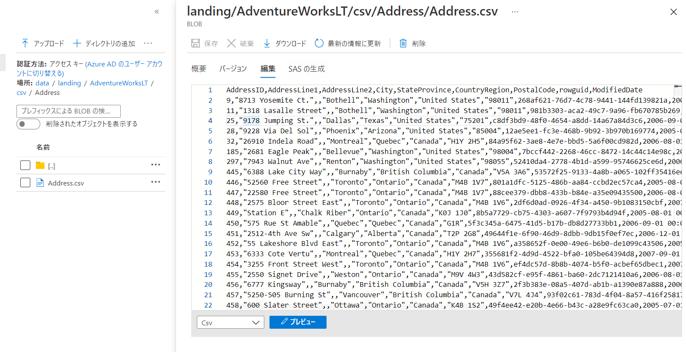

[AdventureWorks サンプルデータベース](https://docs.microsoft.com/ja-jp/sql/samples/adventureworks-install-configure?view=sql-server-ver15&tabs=ssms)

### 2. データフローの作成

#### 2.1. sorce

いたって普通にプロジェクションにより列を読み取ります。
プロジェクションの時点で型を決める場合、型に当てはまらない場合はNULLになります。
今回は文字列として読み取ります。

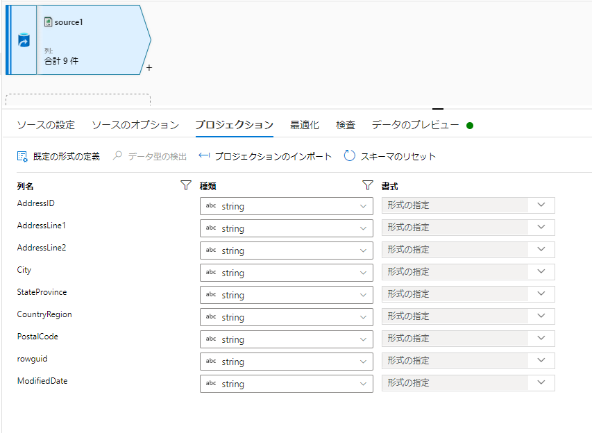

#### 2.2. 条件分岐

AddressIDがintかどうかで分岐させます。

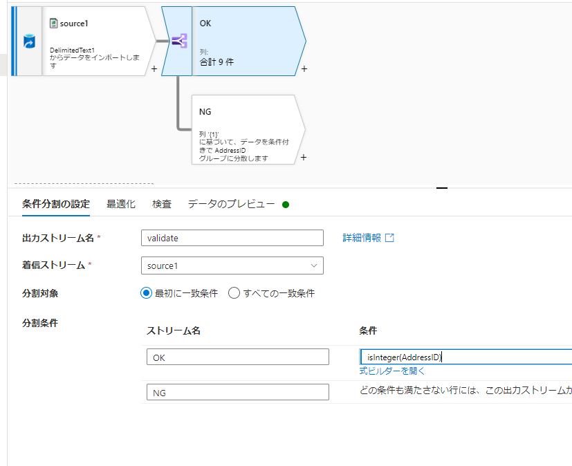

#### 2.3. sink1

問題ないデータの投入先です。特別なことはしません。

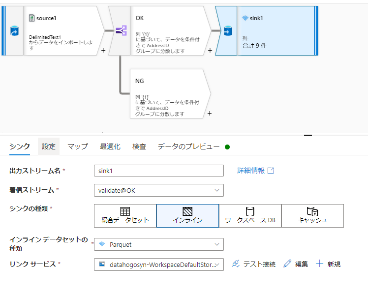

#### 2.4. sink2

ここがポイントになります。
異常データはRESTシンクしてしまいます。

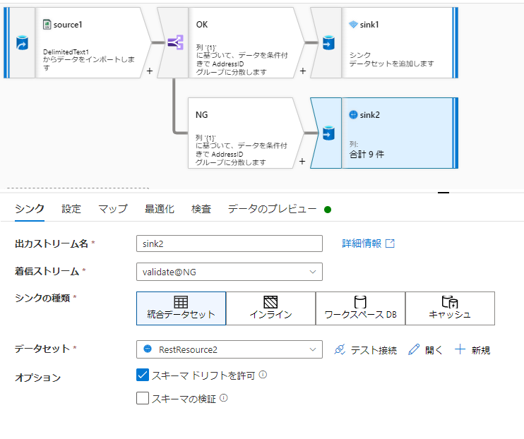

RESTシンクの中身です。
存在しないダミーurlを指定します

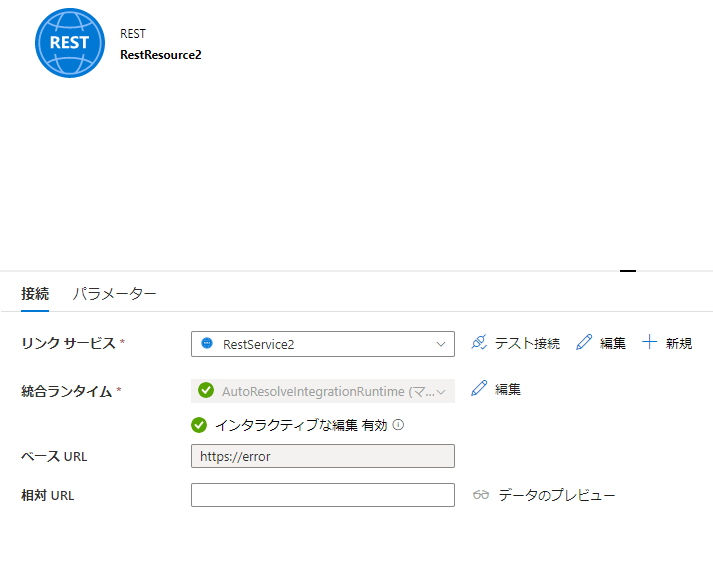

また、設定タブで挿入のみのシンクにします。

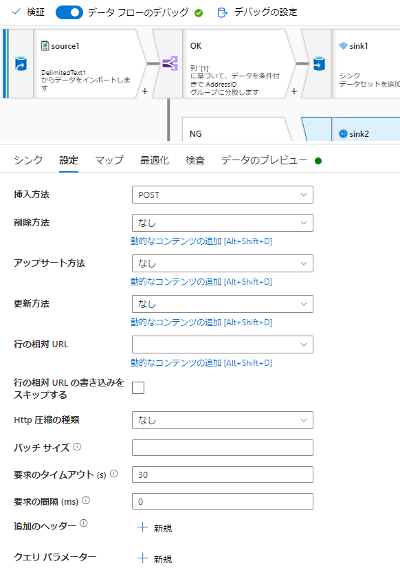

最後に書き込み順序を指定しておきます（影響ないかもです）

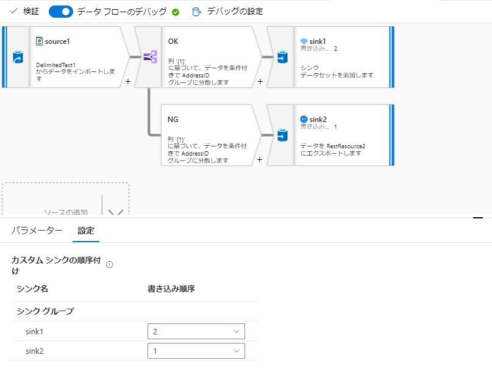

### 3. 動作確認

実行結果は以下の通り。
sink1にのみデータ書き込みが発生しますが、sink2はなにもしません。

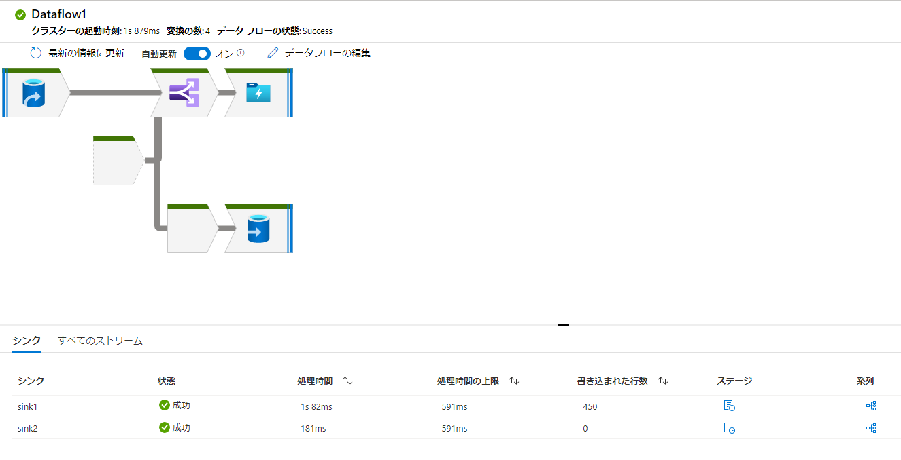

### 4. データの内容変更して動作確認

先頭行を文字列にしました。

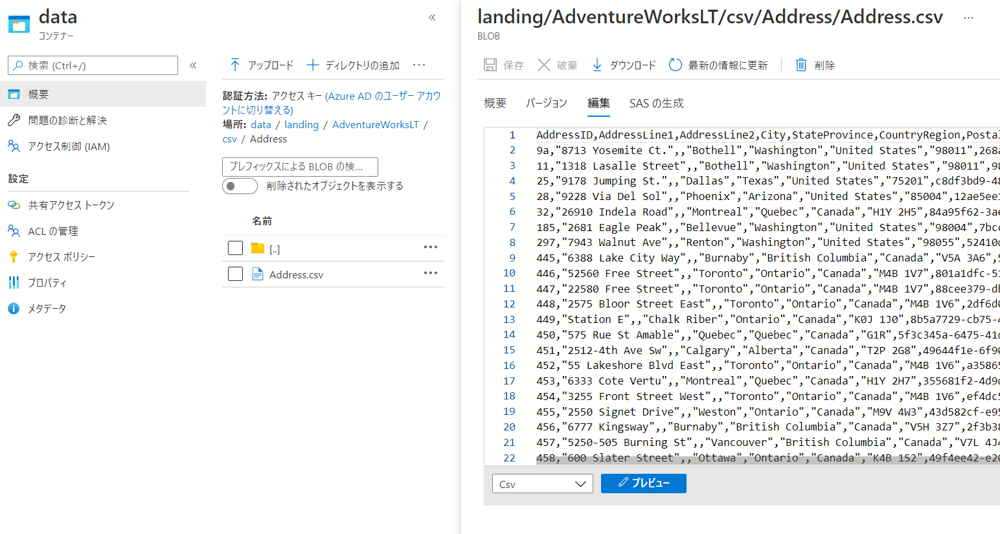

実行結果は以下の通り。

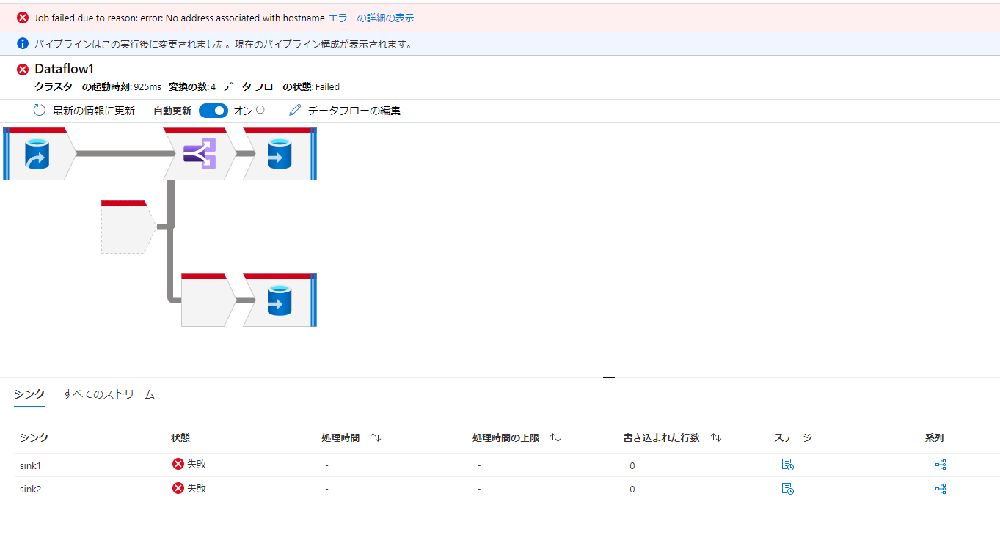

## 補足

sink2が0となるので、他の方法もいけないかと検証しましたが、空行でデータ書き込み動作が発生するらしく、うまくいきませんでした。

Delta Lakeの場合：スキーマのマージを拒否したうえで異常データのみダミー列を投入→sink 0件の場合でもエラーとなる

SQL DBの場合：
- 存在しないテーブルをsink2にした→マッピングエラー
- 事前スクリプトででたらめなSQLを記述→パースエラー

