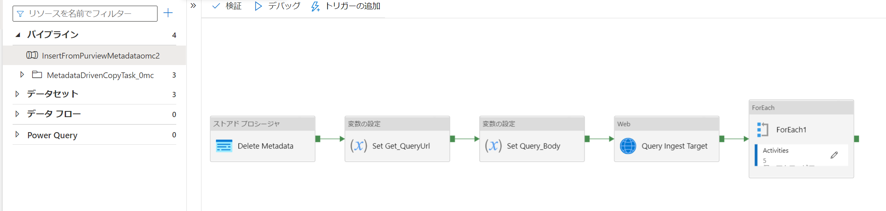

## はじめに

Azureデータ基盤のベストプラクティスの一つに[自動インジェスト フレームワークが Azure でのデータ管理と分析のシナリオをサポートする方法](https://docs.microsoft.com/ja-jp/azure/cloud-adoption-framework/scenarios/data-management/best-practices/automated-ingestion-pattern)があります。

関連して、
「[データのコピー ツール (プレビュー) でメタデータ駆動型の方法を使用して大規模なデータ コピー パイプラインを作成する](https://docs.microsoft.com/ja-jp/azure/data-factory/copy-data-tool-metadata-driven)」を利用して、メタデータ駆動のデータ取り込みパイプラインの開発が可能ですが、これをPurviewと連携してみようと思います。

## ハンズオンリポジトリ

https://github.com/ryoma-nagata/purview-data-catalog-driven-ingest

## Purviewのメタデータ取得パイプライン内容解説

### Delete Metadata

取り込みを実行するパイプライン名をキーにして制御テーブル内のレコードを削除します。

コード：
[usp_delete_metadata.sql](https://github.com/ryoma-nagata/purview-data-catalog-driven-ingest/blob/master/src/PipelineMetastoreDatabase/dbo/StoredProcedures/usp_delete_metadata.sql)

### Set Get QueryUrl～Query Ingest Target

Purviewのカタログ検索APIを利用して取り込み対象のアセットを検索します。

Set Get QueryUrl：
<Purviewアカウント名>.purview.azure.com/（PurviewのデータプレーンURI）＋「catalog/api/search/query」へのポスト用urlを生成

Set Query Body:
要求本文を生成

Query Ingest Target：
POSTメソッドでアセットの検索を実行

### For Each

アセットで繰り返します。Itemにはカタログの検索にひっかかったエンティティのguidなどが格納されます。

### Get_Entity～Get_Server_Entity

guidを仕様してgetを叩くことで、テーブル名、スキーマ名、データベース名、Azure SQL サーバーホスト名を取得します。
参照エンティティ（テーブルの場合、被参照はカラム）は親のエンティティのguidが載ってますので、以下のような参照順にgetしています。
table entitiy→dbSchema→db→server

### Insert Metadata

取得したエンティティ情報および、シンク先のフォルダなどの情報を制御テーブルに書き込みます。

コード：
[usp_insert_metadata.sql](https://github.com/ryoma-nagata/purview-data-catalog-driven-ingest/blob/master/src/PipelineMetastoreDatabase/dbo/StoredProcedures/usp_insert_metadata.sql)

## 最後に

自動インジェストパターンは大量のデータ取り込みをするうえでは、考慮不可欠の概念になります。
あわせて、カタログとの統合で型情報を取得してデータ品質チェックを自動化するなど、メタデータを利用したパイプラインはこれからいろいろなソリューションが期待されます。

ぜひお試しください。