## Azure Data StudioのUIがかっちょよくなっていました

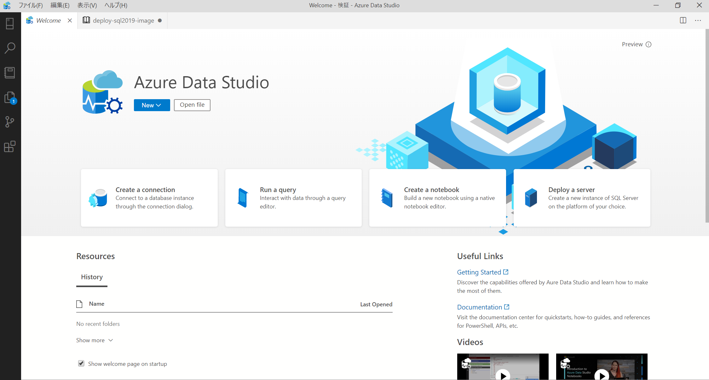

ログインも求められますが、そこでも新UI

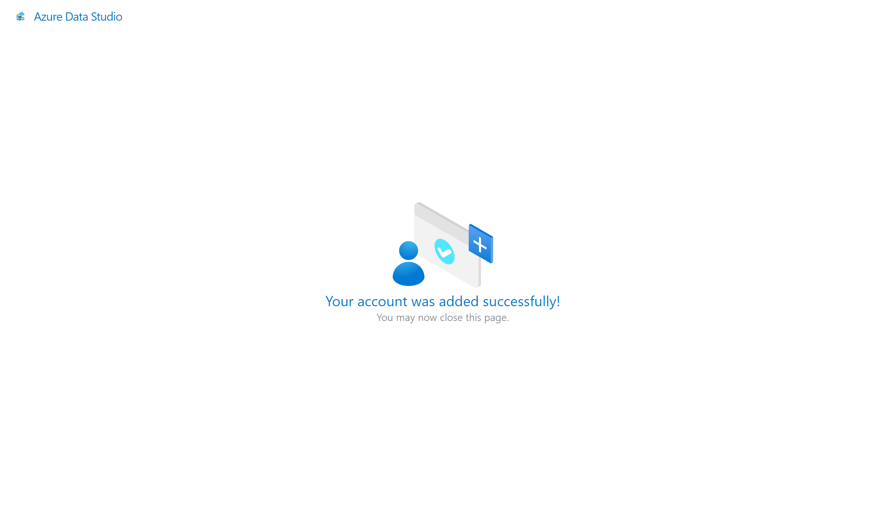

## SQL Serverをデプロイ？
Deploy ServerでSQL Serverがデプロイできることがわかったので、早速試してみます。

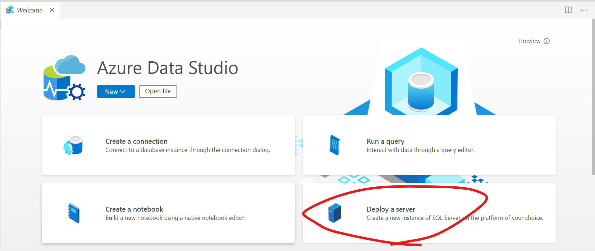

## 手順

画面の案内に従うだけでした。

### 前提条件

Docker desktopをインストールしておきます。
https://docs.docker.com/docker-for-windows/install/

インストールされていないとエラーメッセージ出てきます。（出てきました）

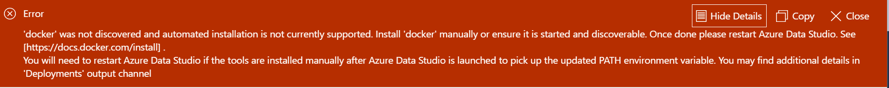

あと拡張機能は以下をいれてます。

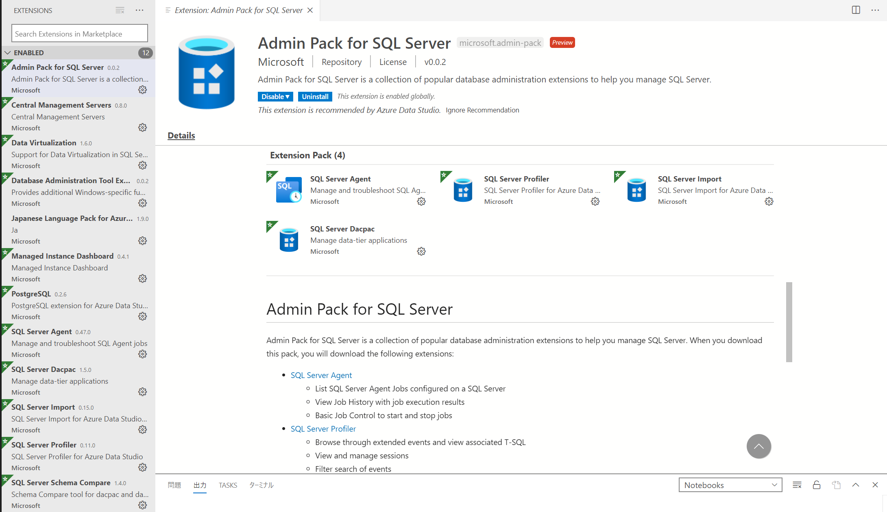


### SQL Serverのデプロイ方式を選択

Versionも選べます。2019にしました。

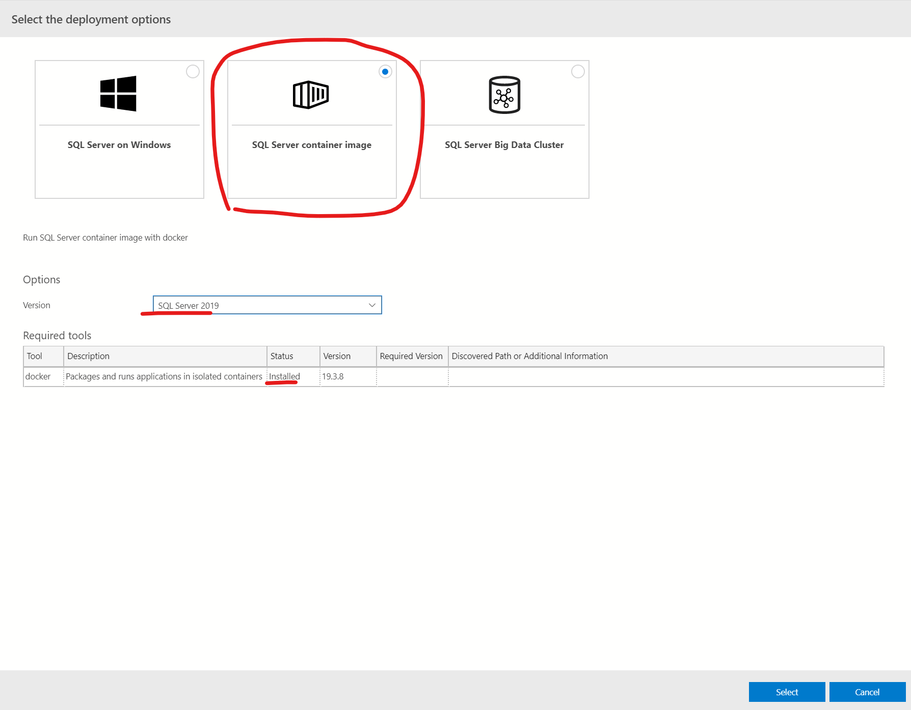


### コンテナ名とパスワード、portを選択

とりあえず適用なportにしました

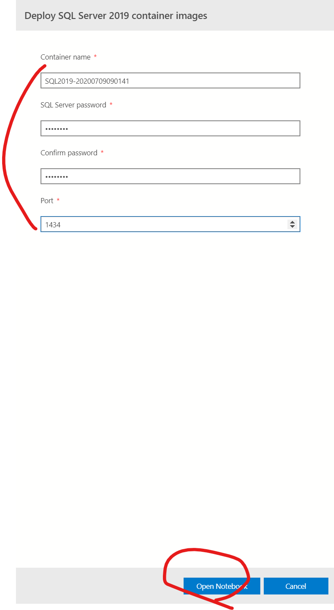

### Python Runtime設定

インストール済みでしたが、新規でインストールもできそう

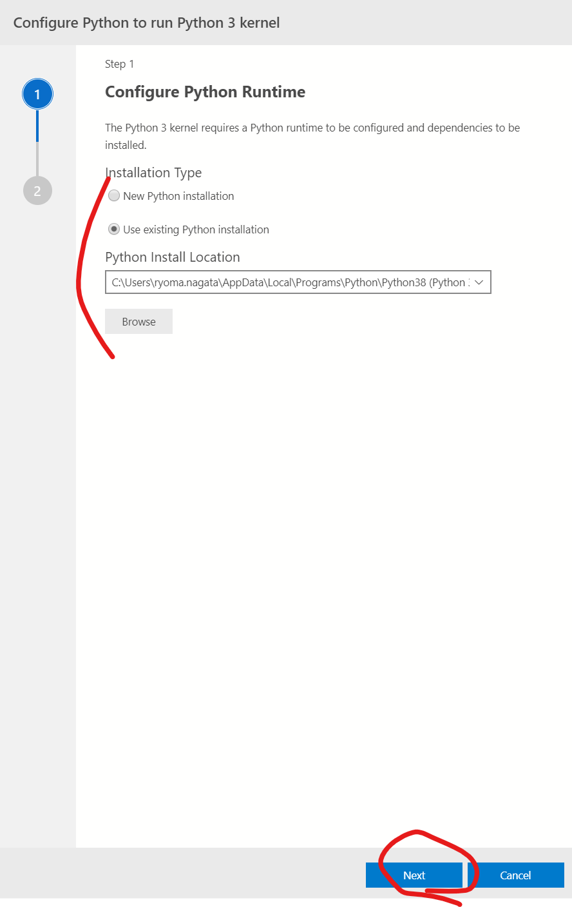

### 依存関係を読み込み

jupyterがインストールされました。


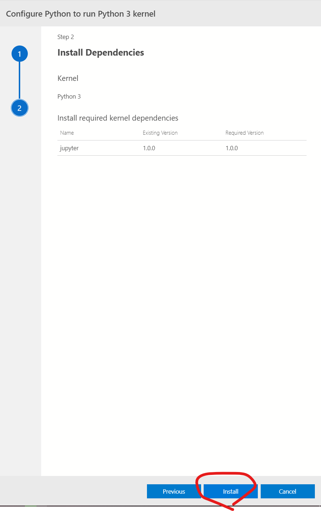

### インストールが終わるとNotebookが生成

なんと今までの情報を元にnotebookが生成されて、順に実行することで、イメージをデプロイする模様

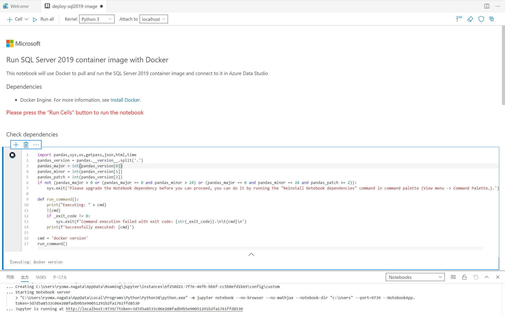

イメージを取得しています。

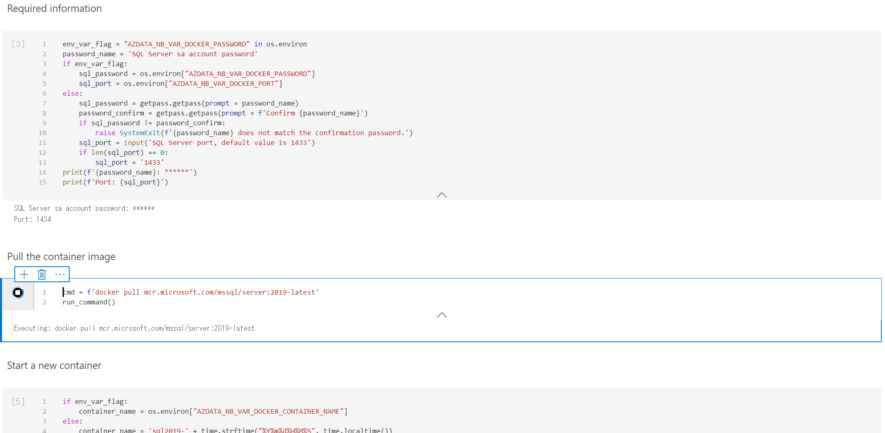

Click hear to connect to SQL Serverが表示されます。そこまで面倒みてくれるのか・・

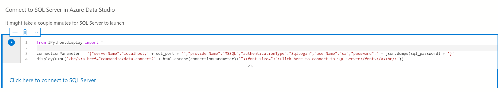

### システムデータベースのみのインスタンスが表示されます。

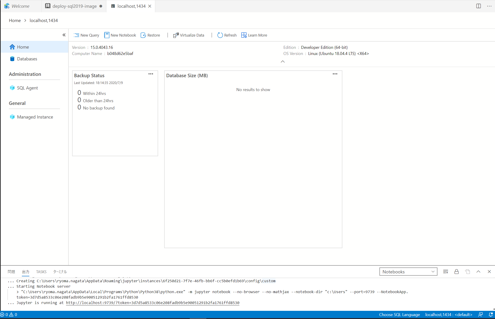


### DB作成

run Queryから実行します。
インテリゼンスが効いて使いやすいですね。

```sql:sql

CREATE DATABASE TEST

```

### 確認

タブを戻ると、マネジメント画面に表示されます。
私はSSMSに慣れていますが、この管理画面かなりよいのでは。。。

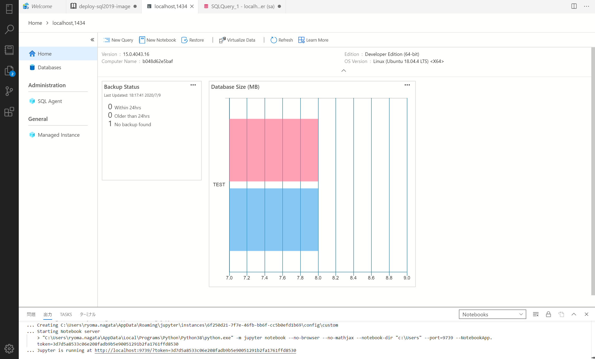


### コンテナ削除

面倒見がよすぎる.

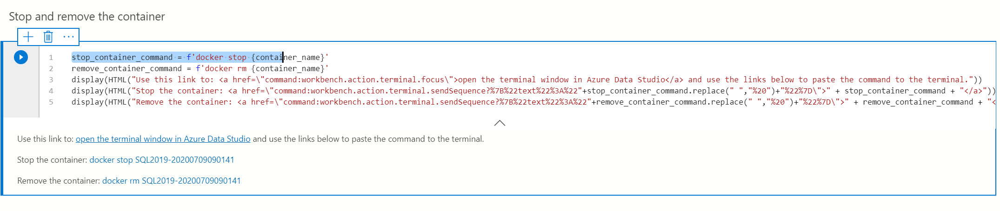

terminalが開きます。docker stop などもリンクをクリックすると、ターミナルにペーストされるので、2点実行して、終了です。


## まとめ

簡単に開発環境が作れますね。
イメージのデプロイ先もACIとか使えばリモート開発がはかどるんじゃないでしょうか
そして成功を収めたVSCodeのようにAzure Data Studioは開発と展開がより進むように思います。

がされているようです。SSMSはこの先生きのこれるのか・・・

