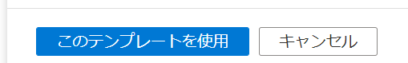
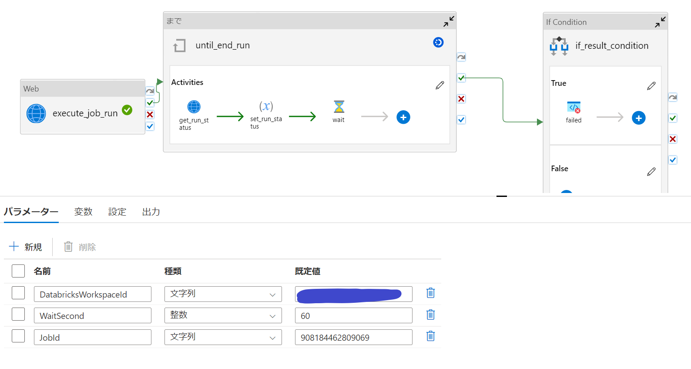

## はじめに

Azure Data Factory(以下、ADF)にはAzure Databricks上のノートブックをジョブ実行する機能がありますが、
Delta Live Tableなど、API経由でしかジョブ実行できないものがあるので、API実行のパイプラインを共有します。

## 準備

### Databricks Workspace IDの確認

1.Databricksにアクセスしてアドレスバーのここを確認、メモします。


### Jobの作成 

1.Createします。


2.対象のノートブックをtaskとして登録


3. Job Detailsにて、Job IDを確認しておきます。


### Data Factoryへの権限付与

1. 共同作成者ロールを付与します。 （[ワークスペースユーザーとしても追加する方法](https://learn.microsoft.com/ja-jp/azure/databricks/dev-tools/service-principals)もありますが、とりあえずAzure RBACで共同作成者にしておけばワークスペースの管理者になってくれるので割愛します。）
   


## パイプラインテンプレートのインポート

1.[]()からダウンロードします。

2.ADF Portal上でインポートします。


3.特に設定不要でインポートされます。




## パイプラインの内容解説



### パラメータ


|名前  |説明  |備考  |
|---------|---------|---------|
|DatabricksWorkspaceId     | DatabricksのワークスペースIDを入力します。        |         |
|WaitSecond     | ステータスチェックの間隔（秒）        | 既定値30秒        |
|JobId     | 実行したいjobのIDを入力します。        |         |

### Jobの実行


- [Jobs API](https://learn.microsoft.com/en-us/azure/databricks/dev-tools/api/2.0/jobs)を利用しています。
- POST URLにDatabricksWorkspaceIdを利用しており、対象のDatabricks Workspaceで **/2.1/jobs/run-now**　を実行しています。
  ``` expression:expression
   https://@{pipeline().parameters.DatabricksWorkspaceId}.azuredatabricks.net/api/2.1/jobs/run-now
  ```
- Bodyには、パラメータが入るようになっています。その他の制御をかけたい場合はAPIリファレンスを参照に追加可能です。
  ```exporession:expression
    {"job_id":@{pipeline().parameters.JobId}}
  ```
- MSI認証でADFからDatabricksにAPIをキックしています。
- MSI認証をするためにリソースにDatabricksのエンタープライズアプリケーションのID **2ff814a6-3304-4ab8-85cb-cd0e6f879c1d** を入力しています。
  - なお、全テナント共通のIDとなっております。  
  

### Job実行の状態チェックとUntil loop


- Until 条件は変数 **run_status** を確認しています。この変数は状態チェックにより値がセットされます。（既定はRUNNING)
  - @not(equals(variables('run_status'),'RUNNING'))
- [Jobs API](https://learn.microsoft.com/en-us/azure/databricks/dev-tools/api/2.0/jobs)を利用しています。
- GET URLにDatabricksWorkspaceIdとジョブ実行時に取得されるrun_idを利用しており、対象のDatabricks Workspaceで **2.1/jobs/runs/get?run_id={run_id}**　を実行しています。
  ``` expression:expression
   https://@{pipeline().parameters.DatabricksWorkspaceId}.azuredatabricks.net/api/2.1/jobs/runs/get?run_id=@{activity('execute_job_run').output.run_id}
  ```


### ジョブ実行失敗確認時のパイプライン失敗とエラーメッセージ


- 変数 **run_status** がFAILEDとなったときに失敗アクティビティを実行して、パイプラインをエラー終了させます。
- エラーメッセージにはステータス確認時に取得できる実行確認ページのURLと結果メッセージを表示させます。  
``` expression:expression

Failed. 
Message: @{activity('get_run_status').output.state.state_message}
Run page URL: @{activity('get_run_status').output.run_page_url}

```

## 参考

https://techcommunity.microsoft.com/t5/analytics-on-azure-blog/leverage-azure-databricks-jobs-orchestration-from-azure-data/ba-p/3123862