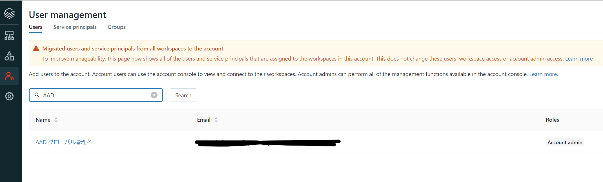

## はじめに

Databricks 上では、Azure AD認証が利用できますが、実はID管理は独自のものとなっており、ワークスペースにログインした際にワークスペース内にIDがプロビジョニングされています。

このときAzure AD セキュリティグループを利用しての運用は効かず、Databricks内でグループを作成するなどの運用になってしまいます。

今回は、SCIMの仕組みを利用して、Azure ADをIdPとてセキュリティグループやユーザーIDを自動でDatabricksアカウント全体に構成してみようと思います。

### 関連

毎度 困ったときの[＠taka_yayoi](https://qiita.com/taka_yayoi)　さんの記事がまとまっています。

- [Databricksにおけるユーザー、サービスプリンシパル、グループの管理](https://qiita.com/taka_yayoi/items/e386507be44aa3abd27e)
- [Databricksにおけるアイデンティティプロバイダーとのユーザー、グループの同期](https://qiita.com/taka_yayoi/items/6509db71832ae5df9295)
- [Databricksにおけるアイデンティティ管理のベストプラクティス](https://qiita.com/taka_yayoi/items/641b9c22e22071c7c17c)

### アカウントレベルのSCIM構成とワークスペースレベルのSCIM構成の考え方

[元の絵](https://learn.microsoft.com/ja-jp/azure/databricks/administration-guide/users-groups/scim/#--account-level-and-workspace-level-scim-provisioning)を少しかみ砕いて書いてみます。

SCIMを構成しない場合、Azure RBACで共同作成者などをもっていると、Databricks ワークスペースにログインした際に自動でワークスペースレベルのIDが構成されます。その後、自動的にアカウントレベルのユーザーとして同期が行われます。

参考：https://learn.microsoft.com/ja-jp/azure/databricks/administration-guide/users-groups/#--how-does-databricks-sync-identities-between-workspaces-and-the-account

ワークスペース管理者以外のユーザーを構成したい場合、Databricksのワークスペースかアカウントレベルでユーザーやグループを作成することになります。

このとき、ユーザー管理は独立しているため、Azure ADのセキュリティグループを権限付与の対象にしたりはできません。また、Databricks 側で削除したとしても、Azure ADに権限情報などが同期されることもありません。

SCIMを構成した場合には、Azure AD上に存在するエンタープライズアプリケーションにユーザーやグループを割り当てると、自動的にDatabricksのワークスペースかアカウントレベルでのID管理に同期されます。

実際の運用で全ユーザーを管理者にしたり、一人ひとりをメールアドレス登録することは現実的ではないため、中規模以上のDatabricks 活用では必須となるのがSCIMの構成です。

## 手順

以下を参考に実施します。

- https://learn.microsoft.com/ja-jp/azure/databricks/administration-guide/users-groups/scim/aad
- https://learn.microsoft.com/ja-jp/azure/databricks/administration-guide/users-groups/scim/

### 準備

前提を確認します。

>Azure Databricks アカウントに Premium プランが必要です。
>SCIM (SCIM REST API を含む) を使用して Azure Databricks アカウントにユーザーをプロビジョニングする場合は、Azure Databricks アカウント管理者であることが必要です。
>Azure Active Directory アカウントの全体管理者である必要があります。
>グループをプロビジョニングするには、Azure Active Directory アカウントが Premium Edition アカウントである必要があります。 ユーザーのプロビジョニングは、任意の Azure Active Directory Edition で利用できます。

アカウントコンソール(https://accounts.azuredatabricks.net/)とAzure ADを確認して、作業ができるアカウントを確認しましょう。相当の強権限です。

### Azure Databricks ユーザープロビジョニングを構成する

1.アカウントコンソールの設定画面で、「Set up user provisioning」をクリックします。

2.tokenとurlが表示されるのでこれをメモします。

### Azure AD エンタープライズ アプリケーションを構成する

1.Azure Portal のAzure AD管理画面から、エンタープライズアプリケーションの管理画面に移動し、「新しいアプリケーション」をクリックします。

2.ギャラリーから、Azure Databricks SCIMプロビジョニングコネクタを検索して、選択します。

3.名前を設定して「作成」をクリック

4.作成完了後、アプリケーションの管理画面に遷移するので、「プロビジョニング」を選択します。 

5.「作業の開始」をクリックします。

6.プロビジョニングモードを自動に設定して、先ほどコピーしたurlとtokenを貼り付けてテスト接続が成功することを確認できたら「保存」をクリックします。

※保存後の他のメニューはこんな感じ

7.最後に、プロビジョニングを開始して自動同期を有効にしましょう。

### ユーザーとグループを割当てる

1.グループを用意します。

2.エンタープライズアプリケーション管理画面で、「ユーザーまたはグループの追加」をクリックします。

3.用意したグループを割り当ててみます。この画面ではロールは変更できませんでした。

4.先ほど構成したプロビジョニング画面を見ると、間隔が40分と長いので「要求時にプロビジョニング」から、特定のグループのみをプロビジョニングすることもできそうです。

5.プロビジョニングが完了するとこのように表示されます。

6.最後にアカウントコンソールからユーザー管理を確認して、完了です。

ユーザー一覧に追加が確認できました。

グループにもsg_databricks_usersというAzure AD セキュリティグループが追加されています。

ワークスペース一覧からへのワークスペースアクセスの権限を付与可能です。

