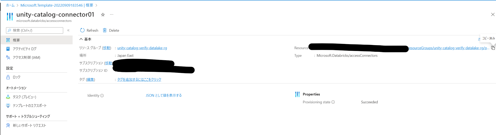
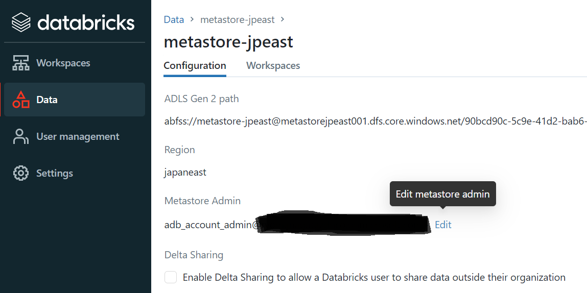
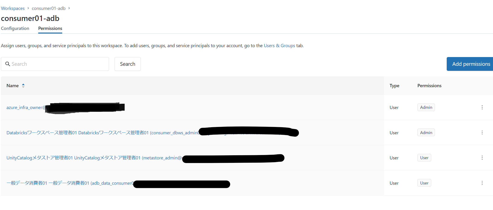
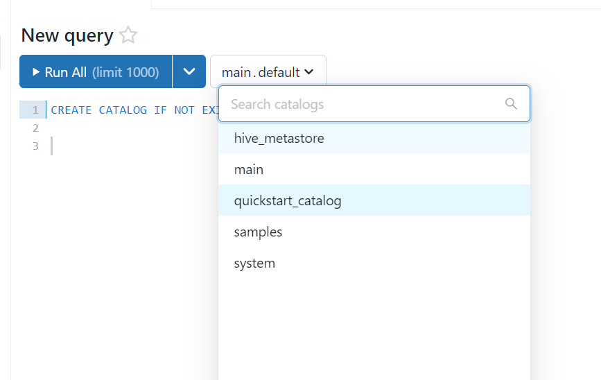

## はじめに

Databricksにガバナンスをもたらす **Unity Catalog** をセットアップしてみようと思います。

### Unity Catalog とは

Unity Catalog は異なるプロジェクト、チームが異なるDatabricksワークスペースを利用するときに起きるデータサイロを解消し、
一気通貫のメタデータ管理、データポリシー管理を行うためのガバナンス機能です。

2022/8/25をもって、Azureで一般提供されました。

[Unity カタログの一般提供](https://docs.microsoft.com/en-us/azure/databricks/release-notes/unity-catalog/20220825)

MS DocsではUnity Catalogは以下のように説明されています。

>Unity Catalog で、管理者とデータ スチュワードは、Azure Databricks アカウント内のすべてのワークスペース間でユーザーとそれらのユーザーのデータへのアクセスを一元的に管理します。 Unity Catalog で一元的に許可されている特権によって、異なるワークスペース内のユーザーが、同じデータへのアクセスを共有できます。

https://docs.microsoft.com/ja-jp/azure/databricks/data-governance/unity-catalog/


Databricks社の [Takaaki Yayoi](https://qiita.com/taka_yayoi) さんによるDatabricks blogの抄訳 が詳しい説明となります。

[AWSとAzureにおけるUnity Catalogのゲーテッドパブリックプレビューの発表](https://qiita.com/taka_yayoi/items/ed907b6190a871137662)

[Data & AI Summit 2022におけるDatabricks Unity Catalogの新機能](https://qiita.com/taka_yayoi/items/bbbc2da4ce0a88e35060)

## 手順について

[Unity Catalog の使用の開始](https://docs.microsoft.com/ja-jp/azure/databricks/data-governance/unity-catalog/manage-external-locations-and-credentials#create-external-location)
を参考にしていますが、AzureADの特権管理者の作業は依頼式になるであろうことを踏まえて、アレンジしています。

また、ドキュメントは変わってしまうUIを考慮してるのかキャプチャがなくてイメージしづらいところもあると思うので本記事のキャプチャが参考になれば幸いです。

## 準備

Azure ADユーザーを構成しておきます。

### Databricks 管理者の準備

[Databricks Workspace Administration – Best Practices for Account, Workspace and Metastore Admins](https://www.databricks.com/blog/2022/08/26/databricks-workspace-administration-best-practices-for-account-workspace-and-metastore-admins.html)を意識して三つのDatabricksの管理者ロールを用意します。

>- アカウント管理者は、ID、クラウド リソース、ワークスペースの作成、Unity Catalog メタストアの作成を管理できます。  
アカウント管理者は、Unity Catalog 用のワークスペースを有効にすることができます。 また、ワークスペースとメタストアの両方の管理者アクセス許可を付与することもできます。 セキュリティ上の理由から、アカウント内のアカウント管理者の数を制限することをお勧めします。
>- メタストア管理者は、メタストア内のセキュリティ保護可能なすべてのオブジェクトの特権と所有権を管理できます。たとえば、誰がカタログを作成できるか、誰がテーブルにクエリを実行できるかなどです。  
Unity Catalog メタストアを作成したアカウント管理者が最初のメタストア管理者になります。メタストア管理者は、このロールを別のユーザーまたはグループに委任することもできます。 メタストア管理者をグループに割り当てることをお勧めします。その場合、グループのメンバーがメタストア管理者の特権を受け取ります。「(推奨) メタストアの所有権をグループに譲渡する」を参照してください。
>- ワークスペース管理者は、Azure Databricks ワークスペースにユーザーを追加し、ワークスペース管理者ロールを割り当て、ワークスペースのオブジェクトや機能へのアクセス (クラスターの作成やジョブ所有権の変更を行う能力など) を管理することができます。 各ワークスペース内のワークスペース管理者は少人数に抑えるようにしてください。

https://docs.microsoft.com/ja-jp/azure/databricks/data-governance/unity-catalog/#--admin-roles-for-unity-catalog


- Databricksアカウント管理者
- UnityCatalogメタストア管理者01
- Databricksワークスペース管理者01
  
加えて、既存環境での作業をイメージしてAzureADグローバル管理者、インフラ構築者、最後に一般開発ユーザーの3名を足して計6名を準備します。


データ消費者としてしまいましたが、今回はテーブルの作成も彼が行う予定です。

## 実施

### 1. Azure リソースの構成（インフラ構築者作業）

インフラ構築者にAzure RBACの所有者を割り当てて作業します。

#### Azure Databricks Workspaceの作成（スキップ可能）

今回の検証のためDatabricks Workspaceを作成しておきます。  すでにある方は不要です。
作成方法は[クイックスタート: Azure portal を使用して Azure Databricks ワークスペースで Spark ジョブを実行する](https://docs.microsoft.com/ja-jp/azure/databricks/scenarios/quickstart-create-databricks-workspace-portal?tabs=azure-portal)を参照。

Unity Catalogを使用するために、価格レベルはPremiumである必要があります。


#### 東日本リージョン用のUnity Catalogメタストアストレージコンテナーの作成

Unity Catalogに使用するAzure Data Lake Storage Gen2を作成します。
このストレージにはマネージドテーブルのデータおよびメタデータが格納されます。
補足：[マネージドテーブルとは何ですか？](https://qiita.com/taka_yayoi/items/e90be9beeb1a744cee0d#%E3%83%9E%E3%83%8D%E3%83%BC%E3%82%B8%E3%83%89%E3%83%86%E3%83%BC%E3%83%96%E3%83%AB%E3%81%A8%E3%81%AF%E4%BD%95%E3%81%A7%E3%81%99%E3%81%8B)

詳細は[Azure Data Lake Storage Gen2 で使用するストレージ アカウントを作成する](https://docs.microsoft.com/ja-jp/azure/storage/blobs/create-data-lake-storage-account)を参照。

以下を意識してリソースを作成します。

> リージョンごとに作成できるメタストアは 1 つだけです。 メタストアとストレージ コンテナーに同じリージョンを使用することをお勧めします。

https://docs.microsoft.com/ja-jp/azure/databricks/data-governance/unity-catalog/get-started#---configure-and-grant-access-to-azure-storage-for-your-metastore


コンテナを作成します。

 


#### Azure Databricks アクセス コネクタの作成と権限付与

Unity Catalogのサービスがメタストアストレージコンテナ上で動作するために認証が必要です。
Azure Databricks アクセス コネクタを作成することで、Databricks Unity Catalogのシステム割当マネージドIDとして利用することが可能です。

1. Azure Databricks アクセス コネクタのデプロイをします。一般的なリソースと異なり、ARMテンプレートでデプロイすることになります。テンプレートおよび手順は[ステップ 1: Azure Databricks アクセス コネクタを作成する](https://docs.microsoft.com/ja-jp/azure/databricks/data-governance/unity-catalog/azure-managed-identities#step-1-create-an-azure-databricks-access-connector)を参照


2. テンプレートを入力します。


3. パラメータを入力します。メタストアストレージと同じリソースグループに作成する必要があるそうです。（ほんまか？）


なお、一度も対象テナント内でAzure Databricksを利用していないユーザーはサインアップされていない関係か、作成が失敗しました。（デプロイ中にエラーが出てその間にDatabricksにログインすると成功する謎挙動）


4. デプロイ後、リソースを移動してリソースIDをメモしておきます。



5. メタストアストレージのIAMに移動します。


6. おなじみのBlobデータ共同作成者を選択します。


7. 作成したAzure Databricks アクセス コネクタの名前検索して割り当てます。


### 2. アカウントコンソールへのアクセスとアカウント管理者のプロビジョニング（Azure AD グローバル管理者の作業）

DatabricksのSaaSとしてのセットアップです。
Unity Catalogはアカウントコンソールからメタストアを作成する必要があります。

また、docsに記載の↓

>最初の Azure Databricks アカウント管理者は、最初に Azure Databricks アカウント コンソールにログインする時点で、Azure Active Directory 全体管理者である必要があります。 最初のログイン時に、そのユーザーは Azure Databricks アカウント管理者になり、Azure Databricks アカウントにアクセスするためには、Azure Active Directory 全体管理者の役割は不要になります。

https://docs.microsoft.com/ja-jp/azure/databricks/data-governance/unity-catalog/get-started#requirements

の通り、はじめてアカウントコンソールにアクセスしたAzure ADグローバル管理者のユーザーがDatabricks　アカウント管理者となります。
以降の管理者はAzure ADグローバル管理者ユーザーに対しても割当が可能です。

1. Azure ADグローバル管理者でログインします。


2. [アカウントコンソール](https://accounts.azuredatabricks.net/)にアクセスします。


ちなみに、Databricksのない環境だと以下のエラー


最初にログインするユーザーがグローバル管理者でなかったり、ゲストユーザーだと以下のエラーが表示されます。


4. ログインに成功すると、このようにワークスペースの管理画面に飛びます。現存するDatabricks ワークスペースが表示されています。


5. **User management** では、現在Databricksを利用しているユーザーが表示されます。**Add User** をクリックします。


ユーザー管理は次回別途やっていきますが、
[ワークスペースユーザーはアカウントユーザーに自動同期されるようです](https://docs.microsoft.com/en-us/azure/databricks/administration-guide/users-groups/#--how-does-databricks-sync-identities-between-workspaces-and-the-account)

6. こんな感じで招待します（姓名は適当になってます


7. Databricksアカウント管理者が追加されました。ロールを変更するためにクリックします


8. Account adminのトグルをOnにしてロールを切り替えます。


9. 切替完了です。


### 3. Databricksアカウント管理の実施（Databricks アカウント管理者の作業）

Databricks アカウント管理者として、他のメンバーをDatabricksアカウントに招待しメタストアの管理を委任します。

#### ユーザーの招待

1. メタストア管理者でアカウントコンソールにアクセスして、 **User Management** に移動し、Azure ADグローバル管理者が行ったように、他のメンバーを追加します。


※次回でユーザ管理を行いますが、このひとりひとり打ち込む作業を楽にするために[SCIM](https://docs.microsoft.com/ja-jp/azure/databricks/administration-guide/users-groups/scim/)というものがあります。

#### メタストアの作成

次にUnity Catalogのメタストアを作成します。
メタストアはDatabricksワークスペース間で共有可能な "カタログ.スキーマ.テーブル" で構成されるメタデータレポジトリです。

1.  **Data** に移動します。「Create a metastore」から移動してもよいです。 **Create metastore** をクリックします。


2. リージョンとabfss://<コンテナ名>@<ストレージ名>.dfs.core.windows.netの形式のADLS Gen2のパス、Azure Databricks アクセスコネクターのリソースIDを入力して、 **Create**　します。


3. 作成が完了したら、ワークスペースへメタストアを割り当てます。


4. メッセージが表示されるのでOK


機械翻訳：


5. 割当完了です。


#### メタストアの所有の移譲

アカウント管理者はデータ管理者とは異なることが多いので、メタストア管理者を他者に指定することで、データオーナーによるデータアクセスおよびメタデータ管理が可能です。

参考：[Unity Catalog の特権の管理](https://docs.microsoft.com/ja-jp/azure/databricks/data-governance/unity-catalog/manage-privileges/#metastore-admin)

1. metastoreに移動して、Metastoreの管理者を編集します。



2. 検索が効きます


3. 変更を確認して完了です。


#### ワークスペースへの権限割当

続いて、データ分析環境としてのDatabricks ワークスペースに対して、のDatabricksワークスペース管理者への管理者権限割当と、一般ユーザーへの環境アクセス権限割当を行います。

1. **Workspace** -> **対象workspace** -> **Permissions** の順で移動して、**Add permissions** をクリックします。


2. このようにAdminとUserを割り当てていきます。Databricksワークスペース管理者と一般ユーザーとメタストアの管理者につけます。


3. 割当完了です。
 


ちなみにインフラ構築者に権限が残っているのは作成後ワークスペースにログインしたからですね。ログインすると自動でワークスペースユーザーが作成され、管理者となります。これはAzure RBACで共同作成者以上の権限をもつユーザーに起きるDatabricks Workspaceの仕様です。

参考：[ユーザー管理の概要](https://docs.microsoft.com/ja-jp/azure/databricks/administration-guide/users-groups/users#overview-of-user-management)

### 4. Databricks ワークスペース上のコンピューティングリソースの作成（Databriksワークスペース管理者の作業）

データに関する作業を行うためにワークスペース管理者はクラスターまたはSQLウェアハウスのコンピューティングリソースを分析開発者に提供します。
ポリシーなどを適用して、扱えるクラスターを制限しながらユーザー側に作成を委任することも可能です。
今回はUnity Catalogが主題なので簡単に済ませます。

#### データエンジニアリング/データサイエンス用クラスターを作成する

1. Databricksワークスペース管理者で、アカウントコンソールに入るとワークスペース選択画面になります。


2. ワークスペースにログインして、クラスターを作成します。Runtimeバージョンは11.1以降である必要があります。

今回は以下の設定にしました
- 共有クラスタにして、メタストア管理者と一般ユーザが共有する
- spot instanceをオン、自動割当解除を30分にしてコストを抑える


3. 作成後、Permissionを編集して、全ユーザにクラスター使用許可を与えます。


#### SQL ウェアハウスを作成する

1. ペルソナスイッチャー（というらしいです）からSQLを選択します


2. SQL ウェアハウスを作成します。現時点ではプレビューチャネルを使う必要があるみたいです。

以下の設定にしました。

- 2X-Small , 10分で自動停止にしてコストを抑える


3. 作成後、Permissionを編集して、全ユーザにクエリ実行許可を与えます。


4. このようになりました。


### 5. メタストアでカタログの払出と作業する権限を付与する


今回はメタストア管理者より、データ開発者にカタログを払い出します。

既定ではmainカタログ内のdefaultスキーマには全ユーザがUSAGEをもっているのでCrateを付与するだけですが、カタログの作成からやってみたいと思います。

1. メタストア管理者でログインしてSQLからカタログを作成します。（ノートブックでもいいです）
   
```sql:sql

CREATE CATALOG IF NOT EXISTS quickstart_catalog;

```


2. カタログが選べます。



3. ユーザーに権限を付与します。みなさんはグループで権限管理しましょう


```sql:sql

GRANT CREATE, USAGE
ON CATALOG quickstart_catalog
TO `<ユーザーID>`;

```

4.割り当てた権限を確認します。


```sql:sql

SHOW GRANT ON CATALOG quickstart_catalog;

```


### 6. Unity Catalog メタストアにスキーマ、テーブルを作成する


1. 一般データ開発者でログインして、SQLからスキーマを作成します。

```sql:sql

--- Create a new schema in the quick_start catalog
CREATE SCHEMA IF NOT EXISTS quickstart_schema
COMMENT "新しいUnity Catalogスキーマとして quickstart_schema";

```


2. USEコマンドかGUIから作成したスキーマが選択できるようになるので選択します。


3. テーブル作成とデータ投入をします。

```sql:sql

CREATE TABLE IF NOT EXISTS quickstart_table
  (columnA Int, columnB String) PARTITIONED BY (columnA);
 
INSERT INTO TABLE quickstart_table
VALUES
  (1, "one"),
  (2, "two");

```


4. カタログにテーブルが登録されていることがわかります。


5. Data Explorerからはより詳細にカタログの情報を確認可能です。テーブルについてコメントを記入することも可能です


ちなみに以下がUnity Catalogがセットアップされていない状態です。


6. なお列の情報に関してはGUI上の編集はまだできませんでした。


7. SampleDataを確認することもできます。


8. Detailはこのようになっています。


9. Historyも確認可能です。


10. **Action** からはNotebook作成か、SQL作成が選択可能です。※Notebook作成はペルソナスイッチャーがDataEngineering & Data Scienceの時のみ


11. 起動するノートブックはこんな感じ


12. もちろんPythonからテーブルを取得してデータエンジニアリング、サイエンス作業を行うことも簡単です。


## 終わりに

まずはセットアップと簡単なテーブル作成作業を実施しました。
次回以降では

- SCIMによるAzure ADユーザー、セキュリティグループの自動同期
- ワークスペース間ののメタストアの共有
- Unity Catalogによるアクセス制御
- 外部テーブル作成
- 監査ログレポート
- Delta Sharing

等やっていこうと思います。