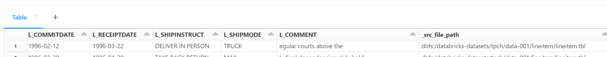
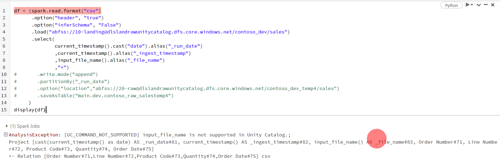

## はじめに

Databricksでデータを取り込む際に監査列として、取り込み元ファイルの情報も取得する方法をまとめます。


### 非Unity Catalog環境


input_file_name()を使用します。

```pyspark:pyspark

from  pyspark.sql.functions import input_file_name,current_timestamp
df = (spark
        .read
        .format("csv")
        .load(<ファイルパス>)
        .select("*"
            ,current_timestamp().alias("_ingest_timestamp")
            ,input_file_name().alias("_file_name")
        )
     )

```

こんな感じでとれます。



### Unity Catalog環境下

以下のようにサポートされない旨が表示されます。




[ファイル メタデータ列](https://learn.microsoft.com/ja-jp/azure/databricks/ingestion/file-metadata-column) という形で取得が可能です。

例：

```pyspark:pyspark

df = (spark
        .read
        .format("csv")
        .load(<ファイルパス>)
        .select("*","_metadata")
     )

```

こんな感じでとれます。


