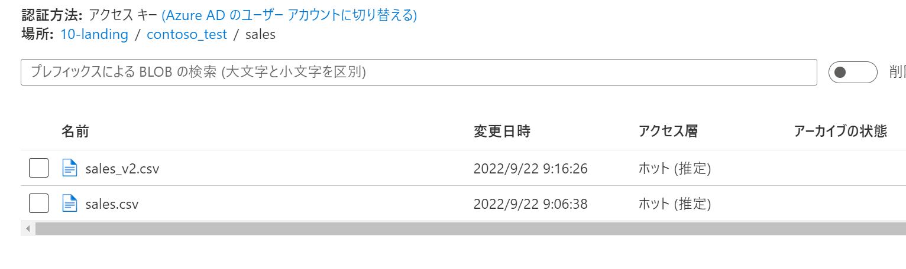
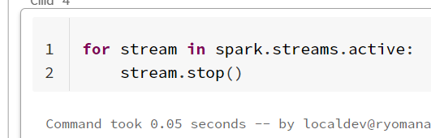
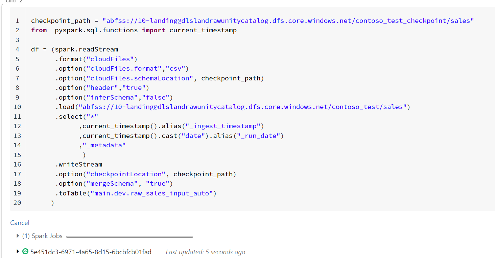

## はじめに

Databricksの **COPY INTO** と **Auto Loader** の比較について記載します。

## COPY INTO と Auto Loaderどちらを利用すべきか

どちらもバッチ処理として利用可能ですが、ストリーム処理として継続可能なのは **Auto Loader** となります。

docsからは以下のような記載となっています。

>- 数千の順序でファイルを取り込む場合は、COPY INTO を使用できます。 時間の経過とともに数百万以上の順序のファイルが予想される場合は、自動ローダーを使用します。 自動ローダーでは、COPY INTO と比較してファイルを検出する操作の合計が少なくて済み、処理を複数のバッチに分割できます。つまり、自動ローダーの方がコストが低く、大規模で効率が高くなります。
>- データ スキーマが頻繁に展開する予定の場合は、自動ローダーにより、スキーマの推論と展開に関してより適切なプリミティブが得られます。 詳細については、「自動ローダーでのスキーマの推論と展開の構成」を参照してください。
>- 再アップロードされたファイルのサブセットの読み込みは、COPY INTO のほうが少し簡単に管理できます。 自動ローダーでは、選択したファイルのサブセットの再処理が難しくなります。 ただし、自動ローダー ストリームを同時に実行しながら、COPY INTO を使用して、ファイルのサブセットを再度読み込むことは可能です。

https://learn.microsoft.com/ja-jp/azure/databricks/ingestion/

サブセットの読み込みについては、COPY INTOではファイルの読み込み時にファイルパスに加えて正規表現による対象の絞り込みが効くことを示しているようです。

デイリーな処理では **COPY INTO** でシンプルに実装する、ニアリアルタイムな処理であったりマイクロバッチ的にファイル連携が行われる場合には　**Auto Loader** を利用するという分岐になりそうです。

## COPY INTO 

[COPY INTO](https://learn.microsoft.com/ja-jp/azure/databricks/spark/latest/spark-sql/language-manual/delta-copy-into)

### サンプル：

[COPY INTO を使用した一般的なデータ ロード パターン](https://learn.microsoft.com/ja-jp/azure/databricks/ingestion/copy-into/examples)

```sql:sql

CREATE TABLE IF NOT EXISTS my_pipe_data;

COPY INTO my_pipe_data
  FROM 'abfss://container@storageAccount.dfs.core.windows.net/base/path'
  FILEFORMAT = CSV
  FORMAT_OPTIONS ('mergeSchema' = 'true',
                  'delimiter' = '|',
                  'header' = 'true')
  COPY_OPTIONS ('mergeSchema' = 'true');

```

### 検証

#### 初回ロード

マージスキーマを有効にして、ファイルのスキーマ変更に対応しつつロードしてみます。

1. テーブルを作成する


2. ファイルをアップする


3. COPY INTO を実行する


#### 冪等性の確認と追加

再実行しても取り込み済みデータは無視されることを確認し、ファイルを追加して実行します。

追加ファイルは2行のcsv

```csv:csv

Order Number,Line Number,Product Code,Quantity,Order Date
231000505,0,0602011,99,2016-04-28
231201204,0,0602011,99,2016-04-30

```

1. 再実行で無視を確認


2. ファイル追加



3. 再実行で取り込みを確認


#### Unity Catalog上の履歴

※他の作業で発生した余計な実行は黒塗りしてます


## Auto Loader


[Auto Loader](https://learn.microsoft.com/ja-jp/azure/databricks/ingestion/auto-loader/options)

Unity Catalog環境下になるのでシングルユーザーモードのクラスターで実行します※ジョブ実行時もシングルユーザーモードでの構成が必要ですが、既定のジョブクラスターはシングルユーザーモードなのでおそらく問題ないですね

### サンプル

[Unity Catalog で自動ローダーを使用する](https://learn.microsoft.com/ja-jp/azure/databricks/ingestion/auto-loader/unity-catalog)

```python:python

checkpoint_path = "s3://dev-bucket/_checkpoint/dev_table"

(spark.readStream
  .format("cloudFiles")
  .option("cloudFiles.format", "json")
  .option("cloudFiles.schemaLocation", checkpoint_path)
  .load("s3://autoloader-source/json-data")
  .writeStream
  .option("checkpointLocation", checkpoint_path)
  .trigger(availableNow=True)
  .toTable("dev_catalog.dev_database.dev_table"))

```

### 検証

#### 初回ロード

1. テーブルを作成する


2. ファイルアップ


3. AutoLoaderの実行


4. 結果


#### 冪等性の確認と追加

1. 停止して再実行





すでに読み込み済みなので増えません


2. ファイル追加


3. セル実行が有効な間自動追加されていることを確認


4. さらに追加


#### Unity Catalog上の履歴

