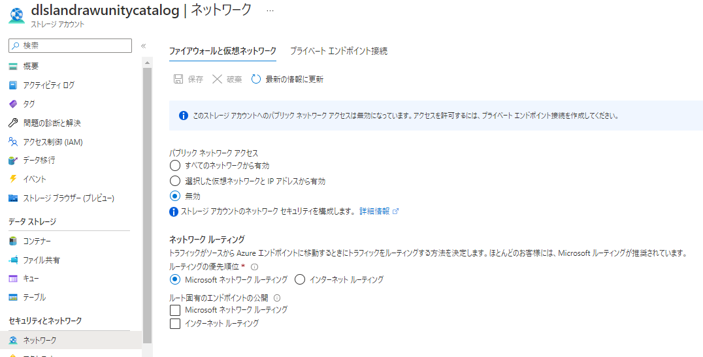

## はじめに

Databrikcs に管理されたVnetを利用することは、Vnet管理不要というメリットがあるが、この場合、ファイアウォールの背後のストレージにアクセスするためのサービスエンドポイントや、プライベートエンドポイントの設置といったことができません。


引用：https://qiita.com/ryoma-nagata/items/66c48dd2a86956c0d00d

## ねらい

このような構成をすることでアクセスさせます。ネットワークの素人なので雰囲気です


## 手順

### 準備

以下を用意しておきます。

- Azure Databricks 
- Azure Data Lake Storage Gen 2 ※パブリックアクセス無効




### 1. ネットワークを構成する

1. [仮想ネットワークのピアリング](https://learn.microsoft.com/ja-jp/azure/databricks/administration-guide/cloud-configurations/azure/vnet-peering)に従って、構成します。


2.接続したvnet にプライベートエンドポイントを作成します。

参考：https://learn.microsoft.com/ja-jp/azure/storage/common/storage-private-endpoints#creating-a-private-endpoint


3.プライベートDNSゾーンをリンクしていることを確認します。


また、DNSゾーンではデータレイクを示すAレコードの登録を確認します


4.Private DNS Resolver を作成します。


5.受信エンドポイントを作成してIPを確認しておきます。


### 2. Databricksのクラスター初期化スクリプトを構成し、アクセスを確認する

1. 適当なクラスターを作成し、アカウントキーを使用したアクセスを試してみます。


```python:pyspark

key = 'アカウントキー情報'

spark.conf.set("fs.azure.account.key.<ストレージ名>.dfs.core.windows.net",key)

dbutils.fs.ls("abfss://<コンテナ名>@<ストレージ名>.dfs.core.windows.net/")

```


アクセスはブロックされ、プライベートエンドポイントで名前解決ができていないことがわかります。


2. 管理コンソールで Global Init scripts で **+追加**


3.名前とコードを入力し **Enable** を確認して **Add** をクリック

```bash: dns setting

#!/bin/bash
mv /etc/resolv.conf /etc/resolv.conf.orig
echo nameserver 10.1.2.68 | sudo tee --append /etc/resolv.conf

```
4.クラスターを再起動し、再度実行を確認します。

アクセスできました。


## 注意・課題

SQL ウェアハウスのDNS設定は調査中のです。