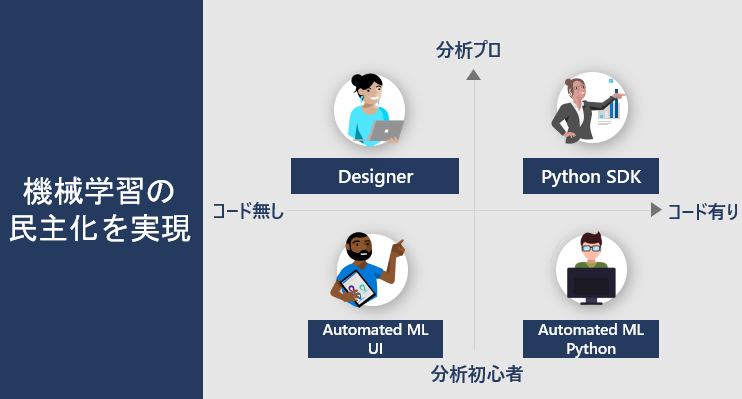
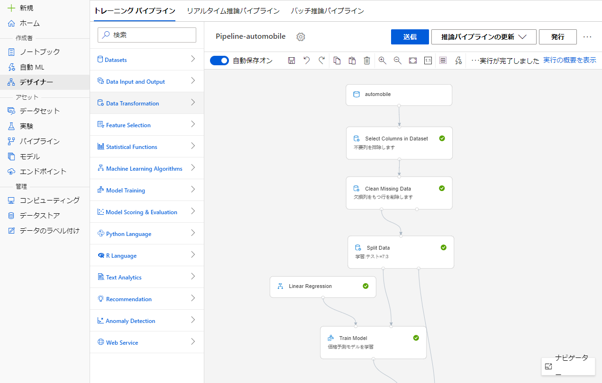
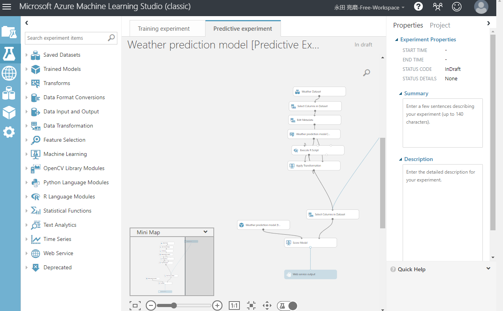
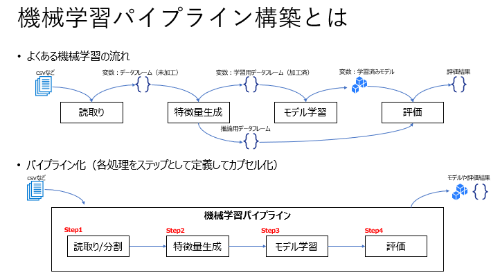
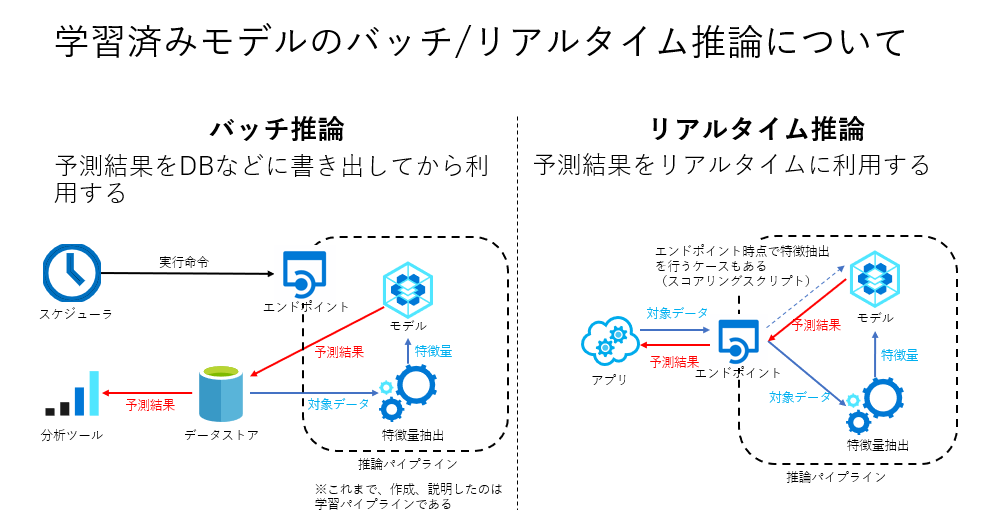
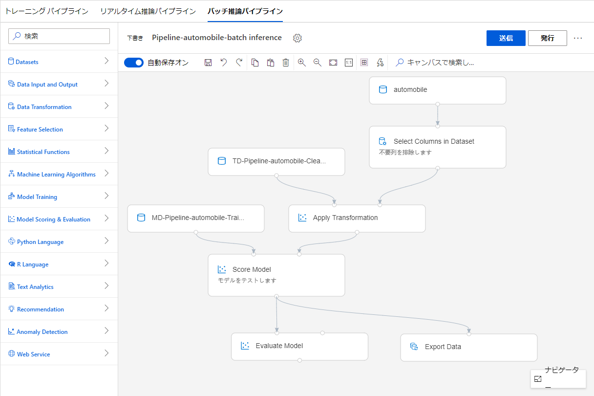
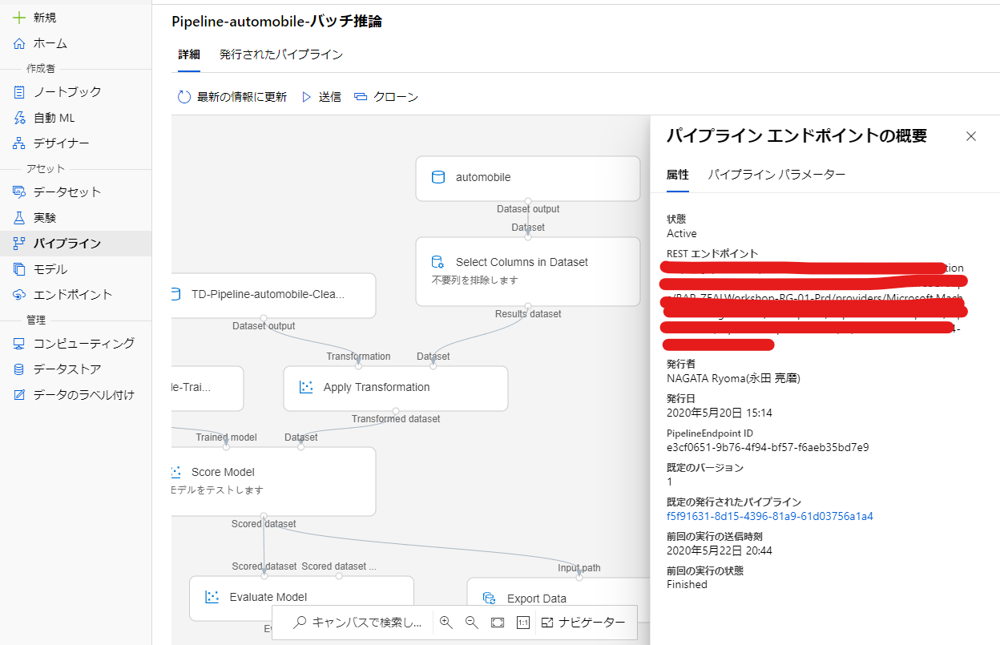
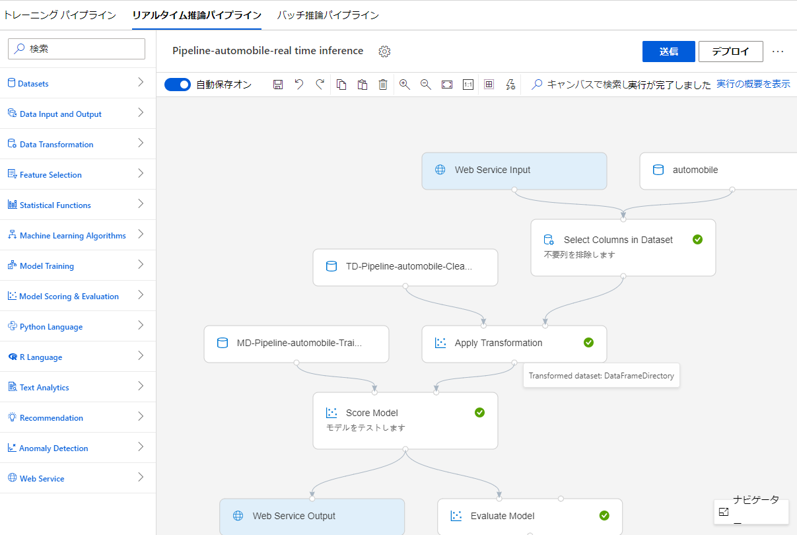
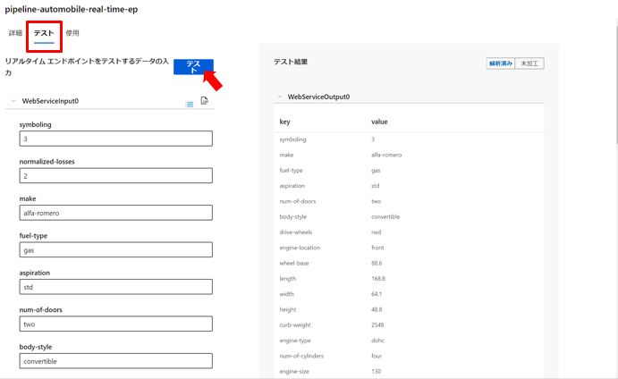

# Azure Machine Learning デザイナーについて整理する

<!-- TOC -->

- [Azure Machine Learning デザイナーについて整理する](#azure-machine-learning-デザイナーについて整理する)
  - [はじめに](#はじめに)
  - [デザイナーについて](#デザイナーについて)
    - [Azure ML Studio](#azure-ml-studio)
    - [過去のAzure ML Studio(classic)](#過去のazure-ml-studioclassic)
  - [機械学習パイプライン](#機械学習パイプライン)
    - [トレーニングパイプラインと推論パイプライン](#トレーニングパイプラインと推論パイプライン)
  - [バッチ推論とリアルタイム推論について](#バッチ推論とリアルタイム推論について)
    - [バッチ推論](#バッチ推論)
    - [リアルタイム推論](#リアルタイム推論)
  - [デザイナーで構成する推論パイプライン](#デザイナーで構成する推論パイプライン)
    - [バッチ推論](#バッチ推論-1)
      - [バッチ推論パイプライン](#バッチ推論パイプライン)
      - [バッチ推論エンドポイント](#バッチ推論エンドポイント)
    - [リアルタイム推論](#リアルタイム推論-1)
      - [リアルタイム推論パイプライン](#リアルタイム推論パイプライン)
      - [リアルタイム推論エンドポイント](#リアルタイム推論エンドポイント)

<!-- /TOC -->

## はじめに

Azure Machine Learning (以下、Azure ML） ではPythonユーザだけでなく、GUIでの機械学習（自動機械学習も含む）をサポートし、機械学習の民主化というメッセージでサービスが提供されています。

GUIでの機械学習モデル開発機能をデザイナーと呼びますが、関連機能と用語が少々複雑だったため、それぞれの位置づけを整理します。

## デザイナーについて

「Azure ML Studio」と呼ばれる統合管理UIの一部です。
ドラッグアンドドロップで前処理や学習のモジュールをフローチャートのような形で配置し、「機械学習パイプライン」を開発することができます。

画面イメージ：

### Azure ML Studio

Azure MLはPythonからの利用か、GUIからの利用かを選択できますが、GUIでの管理画面をAzure ML Studioと呼びます。

ややこしいのが、過去に同一名称のAzureサービスが存在していました。現在ではAzure Machine Learning Studio(Classic)とサービス名を改めています。
現在は下記のような位置づけとなっています。

|Azure サービス名|インターフェース  |説明  |
|---------|---------|---------|
|Azure Machine Learning     | Azure Machine Learning Studio        |現在のAzure ML であり、GUIによる機械学習開発（自動機械学習、デザイナー）や計算環境、データセットなどの管理が行える統合管理画面です。         |
|Azure Machine Learning     | AzureML Python SDK  |現在のAzure ML であり、Pythonを通して、Azure ML を呼び出し、管理や学習コードの発行を行います。 |
|Azure Machine Learning Studio(Classic)     |GUI         |GUIによる機械学習の開発環境です。最も最初に提供されたAzure MLで、現在はデザイナーとして同様の開発が可能です        |

### 過去のAzure ML Studio(classic)

画面イメージはこのような形。

画面イメージ：

デザイナーとほぼ同じであることがわかるかと思います。

## 機械学習パイプライン

機械学習の文脈でのパイプラインは前処理からモデル学習などのフローをカプセル化することを言います。

デザイナーではこのStepを配置・設定していくことを機械学習パイプラインの開発と呼びます。
※デザイナで可能なことは基本的にPython SDKからも実行可能です。

### トレーニングパイプラインと推論パイプライン

パイプラインはモデルの学習だけではありません。
前処理やアルゴリズムを試行錯誤し、学習済みモデルを得るためのパイプラインをトレーニングパイプラインと呼びます

推論結果を得るための前処理と予測結果の返答をするために作成するパイプラインを推論パイプラインと呼びます。

デザイナーでトレーニングパイプラインを作成すると、同様に2種類の推論パイプラインが作成可能となります。

デザイナー上の画面:

## バッチ推論とリアルタイム推論について

一般に、推論結果の利用には二つの方式があります。

推論利用の方式:

参考：有賀 康顕(2018). 仕事ではじめる機械学習  オライリージャパン
https://www.amazon.co.jp/dp/4873118255/ref=cm_sw_r_tw_dp_U_x_Q65XEb25H297S

### バッチ推論

バッチ推論ではエンドポイントはバッチ推論パイプラインの実行を呼び出すためにのAPIとして構成されます。実行により、外部データストアに推論結果が出力されるので、データストアを通して推論結果を利用することになります。

### リアルタイム推論

リアルタイム推論推論ではエンドポイントはリアルタイム推論パイプラインに対象データを送信して、推論結果を受け取るためのAPIとして構成されます。実行により、送信元に直接推論結果が返されるので、アプリなどで推論結果を利用することになります。

## デザイナーで構成する推論パイプライン

上記で説明したように２つの方式の推論パイプラインが構成可能です。
トレーニングパイプラインで作成した、「前処理」、「学習済みモデル」はモジュール化され推論パイプラインで利用されます。

### バッチ推論

#### バッチ推論パイプライン

推論結果を別のストレージに吐き出すなどして利用します。
Inputデータをパラメータ化して、指定のデータセットに対して推論を実行することが可能です。

#### バッチ推論エンドポイント

バッチ推論パイプラインをAzure MLに発行するとバッチ推論エンドポイントが利用可能となります。エンドポイントはREST APIから呼び出し可能なため、Azure Data Factory などから呼び出すことが可能です。

### リアルタイム推論

#### リアルタイム推論パイプライン

エンドポイントに対して対象データを送信して利用します。
Web Service Input/Outputのモジュールが追加され、エンドポイント利用時の入力/出力として構成されます。

#### リアルタイム推論エンドポイント

リアルタイム推論パイプラインをAzure MLに発行する際にはパイプラインの実行とAPIをホストする場所として、AKSが指定されます。
エンドポイントはREST APIから利用しますが、Azure ML Studioからも簡単なテストが可能です。

