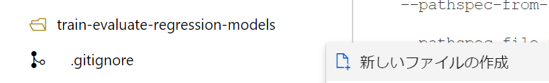
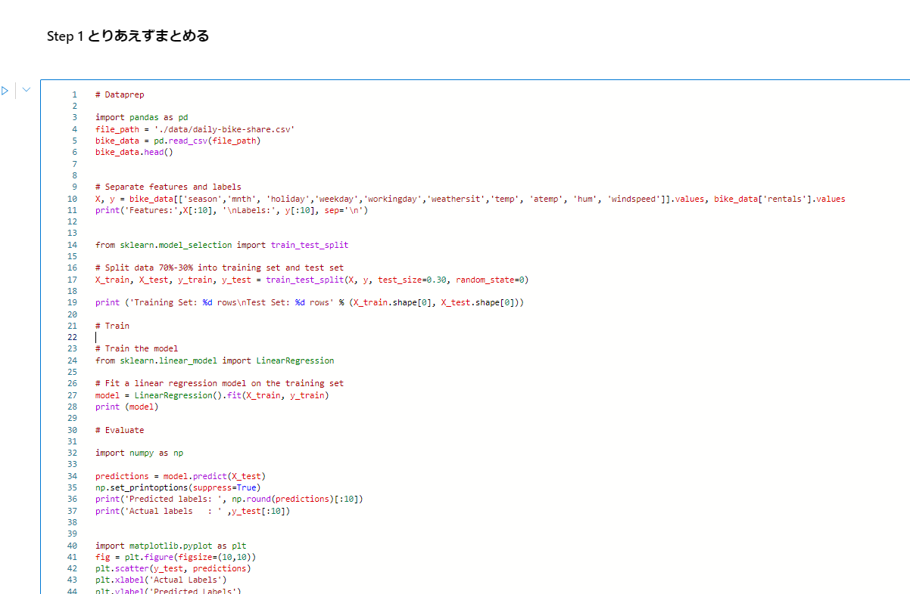

#  Cloud Skill Charenge を題材に Azure Machine Learning SDK v2 で MLOpsの扉を開いた - 回帰モデル

## はじめに


[Build: Data and AI: Who Hacked? Challenge](https://docs.microsoft.com/en-us/users/cloudskillschallenge/collections/e6kjadkywnqo?WT.mc_id=cloudskillschallenge_6e76f1bd-257e-48d5-875b-b6f1e25cf028)

皆様 Microsoft Build 2022 Cloud Skill Challengeはしっかり完了できましたでしょうか？
私は駆け込みで完了させてなんとかバウチャーを得ることができそうです。

AIのシナリオを選択したわけですが、せっかくなので、Build 2022でプレビューとなったAzure ML Python SDK v2を使ってMLOpsに取り組むことでSkillingすることにしました。

今回は [回帰モデルをトレーニングして評価する](https://docs.microsoft.com/ja-jp/learn/modules/train-evaluate-regression-models/?WT.mc_id=cloudskillschallenge_6e76f1bd-257e-48d5-875b-b6f1e25cf028) を実施してその内容を共有します。

### MLOpsについて

色々と資料があります。

[MLOps: Azure Machine Learning を使用したモデルの管理、デプロイ、系列追跡、監視](https://docs.microsoft.com/ja-jp/azure/machine-learning/concept-model-management-and-deployment)

[機械学習の DevOps ガイド](https://docs.microsoft.com/ja-JP/azure/cloud-adoption-framework/ready/azure-best-practices/ai-machine-learning-mlops)

[MLOps 基盤の主な要件](https://cloud.google.com/blog/ja/products/ai-machine-learning/key-requirements-for-an-mlops-foundation)

[MLOps on Azure](https://github.com/microsoft/MLOps)

CICDはこの実習じゃたどり着かないかもなあと思うので、

[Azure Machine Learningを中心としたMSのMLOpsソリューションの概要とアーキテクチャ](https://speakerdeck.com/shisyu_gaku/external-20220202-kurasukai-cui-azure-machine-learningwozhong-xin-tositamsfalsemlopssoriyusiyonfalsegai-yao-toakitekutiya)

のLevel 2くらいまでいきたいですね


### 注意

2022/6時点の情報です。

## 環境構築

[クイックスタート: Azure Machine Learning の利用を開始するために必要なワークスペース リソースを作成する](https://docs.microsoft.com/ja-jp/azure/machine-learning/quickstart-create-resources) 通りに作成します

リソースはほぼデフォルト


コンピューティングインスタンスだけ建てます。


一応Githubと連携しておきます。

方法はこちら（VSCodeにしておけばよかったかもしれない

https://docs.microsoft.com/en-us/azure/machine-learning/concept-train-model-git-integration#clone-git-repositories-into-your-workspace-file-system

## 演習 - 回帰モデルをトレーニングして評価する

MS Learn内では、座学のあと、簡単な3つの演習があるのでここでAzure MLを使っていきます。
ただ流すだけではなく、MLOps的な観点をふまえてこれを実践していきます。

細かいコード全体を載せるのは辛そうなので、適宜画像等でカットしてます。
コードはすべて公開したのでこちらから確認してください。

[ryoma-nagata/mslearn-skill2022](https://github.com/ryoma-nagata/mslearn-skill2022/tree/main/train-evaluate-regression-models)

### データ探索

まずはデータ理解です。

データ探索用のノートブックファイルを作成します。



お作法として、Azure ML のワークスペースと接続しておきます。

```python

import azure.ai.ml 
from azure.ai.ml import MLClient
from azure.identity import DefaultAzureCredential, InteractiveBrowserCredential
from azureml.core import Workspace

ws = Workspace.from_config()
print('Workspace name: ' + ws.name, 
      'Azure region: ' + ws.location, 
      'Subscription id: ' + ws.subscription_id, 
      'Resource group: ' + ws.resource_group, sep='\n')


try:
    credential = DefaultAzureCredential()
    # Check if given credential can get token successfully.
    credential.get_token("https://management.azure.com/.default")
except Exception as ex:
    # Fall back to InteractiveBrowserCredential in case DefaultAzureCredential not work
    # This will open a browser page for
    credential = InteractiveBrowserCredential()

try:
    ml_client = MLClient.from_config(credential=credential)
except Exception as ex:
    # NOTE: Update following workspace information if not correctly configure before
    client_config = {
        "subscription_id": ws.subscription_id,
        "resource_group": ws.resource_group,
        "workspace_name": ws.name,
    }

    if client_config["subscription_id"].startswith("<"):
        print(
            "please update your <SUBSCRIPTION_ID> <RESOURCE_GROUP> <AML_WORKSPACE_NAME> in notebook cell"
        )
        raise ex
    else:  # write and reload from config file
        import json, os

        config_path = "../.azureml/config.json"
        os.makedirs(os.path.dirname(config_path), exist_ok=True)
        with open(config_path, "w") as fo:
            fo.write(json.dumps(client_config))
        ml_client = MLClient.from_config(credential=credential, path=config_path)
print(ml_client)


```


後は順に流すだけですが、微妙に最初のデータロードを変えます。

```python

# load the training dataset
!wget -P ./data https://raw.githubusercontent.com/MicrosoftDocs/mslearn-introduction-to-machine-learning/main/Data/ml-basics/daily-bike-share.csv

import pandas as pd
file_path = './data/daily-bike-share.csv'
bike_data = pd.read_csv(file_path)
bike_data.head()


```


OKです。dataフォルダにあったほうが見通しがいいです。

ここからは一旦流していきます。

平日と休日の自転車のレンタル回数の比較とか特徴をみていますね。

**Train a Regression Model** の手前までがデータの探索部となります。


### 最初のモデルトレーニング

ではモデルトレーニングに移ります。
多分好みですが、新しいノートブックにします。


先頭に以下を張ります。

```python

import azure.ai.ml 
from azure.ai.ml import MLClient
from azure.identity import DefaultAzureCredential, InteractiveBrowserCredential
from azureml.core import Workspace

ws = Workspace.from_config()
print('Workspace name: ' + ws.name, 
      'Azure region: ' + ws.location, 
      'Subscription id: ' + ws.subscription_id, 
      'Resource group: ' + ws.resource_group, sep='\n')


try:
    credential = DefaultAzureCredential()
    # Check if given credential can get token successfully.
    credential.get_token("https://management.azure.com/.default")
except Exception as ex:
    # Fall back to InteractiveBrowserCredential in case DefaultAzureCredential not work
    # This will open a browser page for
    credential = InteractiveBrowserCredential()

try:
    ml_client = MLClient.from_config(credential=credential)
except Exception as ex:
    # NOTE: Update following workspace information if not correctly configure before
    client_config = {
        "subscription_id": ws.subscription_id,
        "resource_group": ws.resource_group,
        "workspace_name": ws.name,
    }

    if client_config["subscription_id"].startswith("<"):
        print(
            "please update your <SUBSCRIPTION_ID> <RESOURCE_GROUP> <AML_WORKSPACE_NAME> in notebook cell"
        )
        raise ex
    else:  # write and reload from config file
        import json, os

        config_path = "../.azureml/config.json"
        os.makedirs(os.path.dirname(config_path), exist_ok=True)
        with open(config_path, "w") as fo:
            fo.write(json.dumps(client_config))
        ml_client = MLClient.from_config(credential=credential, path=config_path)
print(ml_client)


```

追加で、実験の名称を決めておきましょう。
mlflowで構成します。MSの方のやり方を真似します。

[Azure Machine Learning と MLflow を使って最速で実験管理を行う方法](https://qiita.com/ShuntaIto/items/9daae0f87dbeca48ccdc)


```python

import mlflow

tracking_uri = ml_client.workspaces.get(name=ws.name).mlflow_tracking_uri
mlflow.set_tracking_uri(tracking_uri)
experiment_name = "skill-challenge-train-evaluate-regression-models" 
mlflow.set_experiment(experiment_name)

```


このあとの流れとしては、データの準備→モデルトレーニング→評価となっているのでこれを意識しながら進めます。

#### データ準備

まずは、データの準備です。

```python

import pandas as pd
file_path = './data/daily-bike-share.csv'
bike_data = pd.read_csv(file_path)
bike_data.head()


```

データを読み取ったらMS Learnと同じように進めます。


これでデータの分割等の準備が完了しました。


#### モデルトレーニング

MSLearnだといきなりトレーニングに進みますが、ここで実験管理のためにmlflowのrunを開始しておきます。

これでここからのメトリックなどを記録していきます。

```python

import time 

run_name = f'sand_sklearn_LinearRegression_run_{int(time.time())}' # 実行ごとにかぶらないようにしつつ好きな名前を指定
run = mlflow.start_run(run_name=run_name)
# enable auto logging
mlflow.autolog()

```

その後実験を実行します。


#### モデルの評価


prediction後から結果をプロットしたりメトリックを表示しますが、この時にMLflowを使っていきます。

matplotの部分では、mlflow.log_figureにて描画オブジェクトを成果物として登録します。


```python

import matplotlib.pyplot as plt
fig = plt.figure(figsize=(10,10))
plt.scatter(y_test, predictions)
plt.xlabel('Actual Labels')
plt.ylabel('Predicted Labels')
plt.title('Daily Bike Share Predictions')
# overlay the regression line
z = np.polyfit(y_test, predictions, 1)
p = np.poly1d(z)
plt.plot(y_test,p(y_test), color='magenta')

mlflow.log_figure(fig,"evaluate.png")

```


次にMSE,RMSE,R2を表示する箇所では、mlflow.log_metricsを使ってメトリックを記録します。

```python

from sklearn.metrics import mean_squared_error, r2_score

mse = mean_squared_error(y_test, predictions)
print("MSE:", mse)

rmse = np.sqrt(mse)
print("RMSE:", rmse)

r2 = r2_score(y_test, predictions)
print("R2:", r2)

metric = {
    "MSE": mse,
    "RMSE":rmse,
    "R2":r2
}
mlflow.log_metrics(metric)


```

最後に実行を終了します。

```python

mlflow.end_run()

```


これで最初のトレーニングが実行できました。

実験管理がしっかりされていることを確認してみます。

しっかり記録されています（作業しながらなのでちょっとムダに時間かかってます。


## mlopsとして完成度を上げる

AzureML Python SDK v2では、トレーニングジョブをクラウドに送信するように構成することで実験の再現性が高まります。

[Azure ML Python SDK v2 (プレビュー) を使用してモデルをトレーニングする](https://docs.microsoft.com/ja-jp/azure/machine-learning/how-to-train-sdk)


MSのセミナー動画 [Azure Machine Learning による MLOps とそのポイント](https://www.bing.com/videos/search?q=ms+tech+community+mlops+youtube+%e6%97%a5%e6%9c%ac&docid=608046672316627142&mid=851DE7EC5DC39B998787851DE7EC5DC39B998787&view=detail&FORM=VIRE)
より、ML Ops Level 2の状態はこのように考えられます。


ここまで実施したコードでは実験管理という側面で以下のような状態となります。

- データセット：実験に使ったデータは結果と紐づく形で管理されていない
- 実験環境：Computing Instanceでのローカル実行で依存関係などを保管していない
- コード；実験で流れたコードは結果と紐づく形で管理されていない
- ログ/メトリクス：記録されている
- 出力結果：一部記録されている


ここからこれを一つずつ改善していきます。

### コードをリファクタリングして、トレーニングジョブをクラウドに送信するように構成する


現在はipynb形式でインタラクティブに実験を行っていますが、これを.py形式に整えていきます。

#### Step 1 とりあえずまとめる

まずは、notebookセルに分割されているコードをまとめます。mlflow.run関係はなしでOKです。autologとメトリック関連だけ残しましょう。

>Azure Machine Learning で MLflow Tracking を使用すると、リモート実行からログに記録されたメトリックと成果物を Azure Machine Learning ワークスペースに格納できます。  
>その中で MLflow Tracking コードを使用して実行すると、メトリックのログが自動的にワークスペースに記録されます。

https://docs.microsoft.com/ja-jp/azure/machine-learning/how-to-use-mlflow-cli-runs?tabs=mlflow#track-remote-runs-with-azure-machine-learning-cli-v2

こんな感じになります。





#### Step 2 関数に分割する

機械的にステップごとに関数としていきます。この時点ではまだ不完全です。


#### Step 3 パラメータを整理する

ちょっとそれっぽくなってきます。各関数内で定義されていないものを引数にしちゃいましょう


#### Step 4 main を作成し、整える

ここでほぼ完成となるのでデバッグします。
mlflowのお作法を入れ込んでおきます。


#### Step 5 コードにargを作成し、main.pyを作成する

最後の仕上げとしてこのMLコードに対してパラメータが入力できるようにします。

srcフォルダを作成し、


```python

import os

src_dir = "./src"
os.makedirs(src_dir, exist_ok=True)

```

ファイルを書き込みます。


```python

%%writefile ./src/main.py

import numpy as np
import pandas as pd
import matplotlib.pyplot as plt
import mlflow
import argparse # 追加

from sklearn.model_selection import train_test_split
from sklearn.linear_model import LinearRegression
from sklearn.metrics import mean_squared_error, r2_score

# enable auto logging
mlflow.autolog()

def main(args):


    with mlflow.start_run():
        # file_path = './data/daily-bike-share.csv'
        bike_data = pd.read_csv(args.input_data)
        bike_data.head()

        X_train, X_test, y_train, y_test = data_prep(bike_data)

        model = train_mode(X_train, y_train)

        metric ,fig  = evaluate_model(model,X_test,y_test)

        mlflow.log_figure(fig,"evaluate.png")
        mlflow.log_metrics(metric)


# Dataprep
def data_prep(bike_data):

    # Separate features and labels
    X, y = bike_data[['season','mnth', 'holiday','weekday','workingday','weathersit','temp', 'atemp', 'hum', 'windspeed']].values, bike_data['rentals'].values
    print('Features:',X[:10], '\nLabels:', y[:10], sep='\n')

    # Split data 70%-30% into training set and test set
    X_train, X_test, y_train, y_test = train_test_split(X, y, test_size=0.30, random_state=0)
    print ('Training Set: %d rows\nTest Set: %d rows' % (X_train.shape[0], X_test.shape[0]))

    return X_train, X_test, y_train, y_test
    
# Train
def train_mode(X_train, y_train):

    # Train the model
    # Fit a linear regression model on the training set
    model = LinearRegression().fit(X_train, y_train)
    print (model)

    return model

# Evaluate
def evaluate_model(model,X_test,y_test):

    predictions = model.predict(X_test)
    np.set_printoptions(suppress=True)
    print('Predicted labels: ', np.round(predictions)[:10])
    print('Actual labels   : ' ,y_test[:10])
    
    fig = plt.figure(figsize=(10,10))
    plt.scatter(y_test, predictions)
    plt.xlabel('Actual Labels')
    plt.ylabel('Predicted Labels')
    plt.title('Daily Bike Share Predictions')
    # overlay the regression line
    z = np.polyfit(y_test, predictions, 1)
    p = np.poly1d(z)
    plt.plot(y_test,p(y_test), color='magenta')

    

    mse = mean_squared_error(y_test, predictions)
    print("MSE:", mse)

    rmse = np.sqrt(mse)
    print("RMSE:", rmse)

    r2 = r2_score(y_test, predictions)
    print("R2:", r2)

    metric = {
        "MSE": mse,
        "RMSE":rmse,
        "R2":r2
    }
    

    return metric , fig
    
def parse_args():
   
    # setup arg parser
    parser = argparse.ArgumentParser()
    parser.add_argument("--input_data", type=str)

    args = parser.parse_args()

    # return args
    return args


# run script
if __name__ == "__main__":
    # parse args
    args = parse_args()


    # run main function
    main(args)

```

### データ資産を作成し、実験にデータを紐づけつつ再利用性を向上する

Azure MLではデータセットと呼ばれるデータを登録しておくことで、実験ジョブに利用されたデータを管理し、再利用することが可能になります。

[Azure Machine Learning のデータ](https://docs.microsoft.com/ja-jp/azure/machine-learning/concept-data)

[データ資産を作成する](https://docs.microsoft.com/ja-jp/azure/machine-learning/how-to-create-register-data-assets?tabs=CLI)

[SDK v2 プレビューを使ってデータを操作する](https://docs.microsoft.com/ja-jp/azure/machine-learning/how-to-use-data?tabs=use-local%2Crw-blob)

以下のように登録しておくと各バージョンでデータが管理され、実験ジョブに利用可能になります。

```python

from azure.ai.ml.entities import Data
from azure.ai.ml.constants import AssetTypes

file_path = './data/daily-bike-share.csv'

my_data = Data(
    path=file_path,
    type=AssetTypes.URI_FILE,
    description="bike share",
    name="daily-bike-share-sdkv2"
)
my_data = ml_client.data.create_or_update(my_data)
print(
    f"Dataset with name {my_data.name} was registered to workspace, the dataset version is {my_data.version}"
)

```

登録するとこんな感じ


探索はまだちょっと弱いです。v1はいろいろできましたが、発展途上のようです。


### Computing Cluster を作成し、実験jobを送信する

Azure MLがオンデマンドで提供する計算環境としてComputing Cluster を作成します。
実験の時以外は0ノードということでほぼ無料となります。

[コンピューティング ターゲットのトレーニング](https://docs.microsoft.com/ja-jp/azure/machine-learning/concept-compute-target)


```python

from azure.ai.ml.entities import AmlCompute

cpu_compute_target = "cpu-cluster"

try:
    # let's see if the compute target already exists
    cpu_cluster = ml_client.compute.get(cpu_compute_target)
    print(
        f"You already have a cluster named {cpu_compute_target}, we'll reuse it as is."
    )

except Exception:
    print("Creating a new cpu compute target...")

    # Let's create the Azure ML compute object with the intended parameters
    cpu_cluster = AmlCompute(
        # Name assigned to the compute cluster
        name=cpu_compute_target,
        # Azure ML Compute is the on-demand VM service
        type="amlcompute",
        # VM Family
        size="STANDARD_DS11_V2",
        # Minimum running nodes when there is no job running
        min_instances=0,
        # Nodes in cluster
        max_instances=2,
        # How many seconds will the node running after the job termination
        idle_time_before_scale_down=180,
        # Dedicated or LowPriority. The latter is cheaper but there is a chance of job termination
        tier="Low_priority",
    )

    # Now, we pass the object to MLClient's create_or_update method
    cpu_cluster = ml_client.begin_create_or_update(cpu_cluster)

print(
    f"AMLCompute with name {cpu_cluster.name} is created, the compute size is {cpu_cluster.size}"
)

```


### 実験ジョブの送信

ではお待ちかねとなります。Python SDKv2 によるジョブ実行です。

まずは、先ほど登録したデータセットを呼び出します。

```python


registered_data_asset = ml_client.data._get_latest_version(name="sdkv2-daily-bike-share")


```

最後にジョブを実行します。

ジョブ実行はジョブ定義をml_clientにて作成/更新することで実行されます。
このとき、環境のイメージや、実行環境、コードの配置フォルダ実験ジョブの結果に記録されます。

```python

import time 

from azure.ai.ml import command, Input, Output
from azure.ai.ml.entities import Data
from azure.ai.ml.constants import AssetTypes


experiment_name = "mslean-train-evaluate-regression-models" 
run_name = f'job_sklearn_LinearRegression_run_{int(time.time())}' # 実行ごとにかぶらないようにしつつ好きな名前を指定

my_job_inputs = {
    "input_data": Input(type=AssetTypes.URI_FILE, path=registered_data_asset.id)
}

job = command(
    code="./src",
    command="python main.py --input_data ${{inputs.input_data}}",
    inputs=my_job_inputs,
    environment="AzureML-sklearn-0.24-ubuntu18.04-py37-cpu:9",
    compute="cpu-cluster",
    experiment_name=experiment_name,
    display_name=run_name,
)

# submit the command
returned_job = ml_client.create_or_update(job)
# get a URL for the status of the job
returned_job.services["Studio"].endpoint

```

このコードでは、ジョブの結果画面のリンクが表示されるようになっています。


数分待つと実験ジョブの結果が確認可能です。


モデル、詳細なログや、実験コードのスナップショットなどが追加されています。


実験管理内容は以下のようにかなり充実したことがわかります。

- データセット：実験に使ったデータは結果とバージョンが紐づけられている
- 実験環境：イメージと計算環境が記録されている
- コード:実験で実行されたコードのスナップショットおよびGit情報が記録されている
- ログ/メトリクス：記録されている
- 出力結果：モデルも含めて記録されている

この状態で続きの演習を進めていきます。


## 演習 - より強力な回帰モデルで実験する

次の演習に進みます。他のアルゴリズムを利用して実験を試みるパートとなります。


### Lasso

基本的にtrainの部分を変えるだけでOKです。（import を忘れずに


実行名だけ修正して実行してみましょう

```python

import time 

from azure.ai.ml import command, Input, Output
from azure.ai.ml.entities import Data
from azure.ai.ml.constants import AssetTypes


experiment_name = "skill-train-evaluate-regression-models" 
run_name = f'job_sklearn_Lasso_run_{int(time.time())}' # 実行ごとにかぶらないようにしつつ好きな名前を指定

my_job_inputs = {
    "input_data": Input(type=AssetTypes.URI_FILE, path=registered_data_asset.id)
}

job = command(
    code="./src",
    command="python main.py --input_data ${{inputs.input_data}}",
    inputs=my_job_inputs,
    environment="AzureML-sklearn-0.24-ubuntu18.04-py37-cpu:9",
    compute="cpu-cluster",
    experiment_name=experiment_name,
    display_name=run_name,
)

# submit the command
returned_job = ml_client.create_or_update(job)
# get a URL for the status of the job
returned_job.services["Studio"].endpoint

```


### DecisionTreeRegressor

続けて他のアルゴリズムを試していきます。
実行名の変更は忘れずに。


```python

import time 

from azure.ai.ml import command, Input, Output
from azure.ai.ml.entities import Data
from azure.ai.ml.constants import AssetTypes


experiment_name = "skill-train-evaluate-regression-models" 
run_name = f'job_sklearn_DecisionTreeRegressor_run_{int(time.time())}' # 実行ごとにかぶらないようにしつつ好きな名前を指定

my_job_inputs = {
    "input_data": Input(type=AssetTypes.URI_FILE, path=registered_data_asset.id)
}

job = command(
    code="./src",
    command="python main.py --input_data ${{inputs.input_data}}",
    inputs=my_job_inputs,
    environment="AzureML-sklearn-0.24-ubuntu18.04-py37-cpu:9",
    compute="cpu-cluster",
    experiment_name=experiment_name,
    display_name=run_name,
)

# submit the command
returned_job = ml_client.create_or_update(job)
# get a URL for the status of the job
returned_job.services["Studio"].endpoint

```

### RandomForestRegressor

アンサンブル学習に突入しました。
どんどんやっていきます。

```python


import time 

from azure.ai.ml import command, Input, Output
from azure.ai.ml.entities import Data
from azure.ai.ml.constants import AssetTypes


experiment_name = "skill-train-evaluate-regression-models" 
run_name = f'job_sklearn_RandomForestRegressor_run_{int(time.time())}' # 実行ごとにかぶらないようにしつつ好きな名前を指定

my_job_inputs = {
    "input_data": Input(type=AssetTypes.URI_FILE, path=registered_data_asset.id)
}

job = command(
    code="./src",
    command="python main.py --input_data ${{inputs.input_data}}",
    inputs=my_job_inputs,
    environment="AzureML-sklearn-0.24-ubuntu18.04-py37-cpu:9",
    compute="cpu-cluster",
    experiment_name=experiment_name,
    display_name=run_name,
)

# submit the command
returned_job = ml_client.create_or_update(job)
# get a URL for the status of the job
returned_job.services["Studio"].endpoint

```

### GradientBoostingRegressor

さあ最後です。trainを書き換えて、


実行します。


```python


import time 

from azure.ai.ml import command, Input, Output
from azure.ai.ml.entities import Data
from azure.ai.ml.constants import AssetTypes


experiment_name = "skill-train-evaluate-regression-models" 
run_name = f'job_sklearn_GradientBoostingRegressor_run_{int(time.time())}' # 実行ごとにかぶらないようにしつつ好きな名前を指定

my_job_inputs = {
    "input_data": Input(type=AssetTypes.URI_FILE, path=registered_data_asset.id)
}

job = command(
    code="./src",
    command="python main.py --input_data ${{inputs.input_data}}",
    inputs=my_job_inputs,
    environment="AzureML-sklearn-0.24-ubuntu18.04-py37-cpu:9",
    compute="cpu-cluster",
    experiment_name=experiment_name,
    display_name=run_name,
)

# submit the command
returned_job = ml_client.create_or_update(job)
# get a URL for the status of the job
returned_job.services["Studio"].endpoint

```

ここまで5つの実験を実行しましたが、それぞれが再現性、実験の証跡としての品質が保たれ、精度の推移まで見ることができます。


## 演習 - モデルを最適化して保存する

次はパラメータチューニングに入ります。

GridSearchCVを利用するためにtrainとmainの部分をちょっと変えてやります。


ジョブ実行します。


```python


import time 

from azure.ai.ml import command, Input, Output
from azure.ai.ml.entities import Data
from azure.ai.ml.constants import AssetTypes


experiment_name = "skill-train-evaluate-regression-models" 
run_name = f'job_sklearn_GridSearch_run_{int(time.time())}' # 実行ごとにかぶらないようにしつつ好きな名前を指定

my_job_inputs = {
    "input_data": Input(type=AssetTypes.URI_FILE, path=registered_data_asset.id)
}

job = command(
    code="./src",
    command="python main.py --input_data ${{inputs.input_data}}",
    inputs=my_job_inputs,
    environment="AzureML-sklearn-0.24-ubuntu18.04-py37-cpu:9",
    compute="cpu-cluster",
    experiment_name=experiment_name,
    display_name=run_name,
)

# submit the command
returned_job = ml_client.create_or_update(job)
# get a URL for the status of the job
returned_job.services["Studio"].endpoint

```

結果を確認すると、ベストモデルが実験に登録されて、


子ジョブもしっかり記録されています。


※子ジョブに関してはMLflowのサーバUIのほうが見やすいなと感じるところはありましたが、そこまで問題にはならなそうです。

※対話式でランすると子ジョブが登録されないのは仕様ぽいですが、知見のあるかたご指摘お願いいたします。。

さて、演習に指摘される通り、単純なパラメータチューニングではそれほどいい向上は得られませんでした。


そこで、数値の特徴量とカテゴリの特徴量について正規化処理を実装していきます。

演習では、この前処理をモデルトレーニングとパイプライン化するようにしているので、train部を以下のように修正します。

```python

def train_mode(X_train, y_train,params):

    # Train the model


    # Define preprocessing for numeric columns (scale them)
    numeric_features = [6,7,8,9]
    numeric_transformer = Pipeline(steps=[
        ('scaler', StandardScaler())])

    # Define preprocessing for categorical features (encode them)
    categorical_features = [0,1,2,3,4,5]
    categorical_transformer = Pipeline(steps=[
        ('onehot', OneHotEncoder(handle_unknown='ignore'))])

    # Combine preprocessing steps
    preprocessor = ColumnTransformer(
        transformers=[
            ('num', numeric_transformer, numeric_features),
            ('cat', categorical_transformer, categorical_features)])

    # Create preprocessing and training pipeline
    pipeline = Pipeline(steps=[('preprocessor', preprocessor),
                            ('regressor', GradientBoostingRegressor())])


    # fit the pipeline to train a linear regression model on the training set
    model = pipeline.fit(X_train, (y_train))
    print (mode)

    return model

```

前に追加したGridSearchCVのパラメータはコメントアウトしておきましょう


続けて、別にアルゴリズムでも実施してみます。

```python

    # Create preprocessing and training pipeline
    pipeline = Pipeline(steps=[('preprocessor', preprocessor),
                            ('regressor', RandomForestRegressor())])

```

演習でも様々な奴を試してね、とあるので、トレーニングの最後としてGridSearchCVとGradientBoostingRegressorのあわせ技を試しておきましょう。

```python

%%writefile ./src/main.py


import numpy as np
import pandas as pd
import matplotlib.pyplot as plt
import mlflow
import argparse # 追加

from sklearn.model_selection import train_test_split
from sklearn.linear_model import LinearRegression
from sklearn.linear_model import Lasso
from sklearn.metrics import mean_squared_error, r2_score
from sklearn.tree import DecisionTreeRegressor
from sklearn.tree import export_text
from sklearn.ensemble import RandomForestRegressor
from sklearn.ensemble import GradientBoostingRegressor
from sklearn.model_selection import GridSearchCV
from sklearn.metrics import make_scorer, r2_score
from sklearn.compose import ColumnTransformer
from sklearn.pipeline import Pipeline
from sklearn.impute import SimpleImputer
from sklearn.preprocessing import StandardScaler, OneHotEncoder


# enable auto logging
mlflow.autolog()

def main(args):

    with mlflow.start_run():
        # file_path = './data/daily-bike-share.csv'
        bike_data = pd.read_csv(args.input_data)
        # bike_data.head()

        # Try these hyperparameter values

        params = {
            'regressor__n_estimators': list(range(20, 101, 10)),
            'regressor__learning_rate': list(np.arange(0.05, 0.20, 0.01))
            }
        mlflow.log_params(params)

        X_train, X_test, y_train, y_test = data_prep(bike_data)
        model = train_model(X_train, y_train,params)
        metric ,fig  = evaluate_model(model,X_test,y_test)

        mlflow.log_figure(fig,"evaluate.png")
        mlflow.log_metrics(metric)

# Dataprep
def data_prep(bike_data):

    # Separate features and labels
    X, y = bike_data[['season','mnth', 'holiday','weekday','workingday','weathersit','temp', 'atemp', 'hum', 'windspeed']].values, bike_data['rentals'].values
    print('Features:',X[:10], '\nLabels:', y[:10], sep='\n')

    # Split data 70%-30% into training set and test set
    X_train, X_test, y_train, y_test = train_test_split(X, y, test_size=0.30, random_state=0)
    print ('Training Set: %d rows\nTest Set: %d rows' % (X_train.shape[0], X_test.shape[0]))

    return X_train, X_test, y_train, y_test
    
# Train

def train_model(X_train, y_train,params):

    # Train the model


    # Define preprocessing for numeric columns (scale them)
    numeric_features = [6,7,8,9]
    numeric_transformer = Pipeline(steps=[
        ('scaler', StandardScaler())])

    # Define preprocessing for categorical features (encode them)
    categorical_features = [0,1,2,3,4,5]
    categorical_transformer = Pipeline(steps=[
        ('onehot', OneHotEncoder(handle_unknown='ignore'))])

    # Combine preprocessing steps
    preprocessor = ColumnTransformer(
        transformers=[
            ('num', numeric_transformer, numeric_features),
            ('cat', categorical_transformer, categorical_features)])

    # Create preprocessing and training pipeline
    pipeline = Pipeline(steps=[('preprocessor', preprocessor),
                            ('regressor', GradientBoostingRegressor())])

    score = make_scorer(r2_score)
    gridsearch = GridSearchCV(pipeline, params, scoring=score, cv=3, return_train_score=True)
    gridsearch.fit(X_train, y_train)
    model = gridsearch.best_estimator_

    print("Best parameter combination:", gridsearch.best_params_, "\n")

    print (model)

    return model

# Evaluate
def evaluate_model(model,X_test,y_test):

    predictions = model.predict(X_test)
    np.set_printoptions(suppress=True)
    print('Predicted labels: ', np.round(predictions)[:10])
    print('Actual labels   : ' ,y_test[:10])
    
    fig = plt.figure(figsize=(10,10))
    plt.scatter(y_test, predictions)
    plt.xlabel('Actual Labels')
    plt.ylabel('Predicted Labels')
    plt.title('Daily Bike Share Predictions')
    # overlay the regression line
    z = np.polyfit(y_test, predictions, 1)
    p = np.poly1d(z)
    plt.plot(y_test,p(y_test), color='magenta')
   
    mse = mean_squared_error(y_test, predictions)
    print("MSE:", mse)

    rmse = np.sqrt(mse)
    print("RMSE:", rmse)

    r2 = r2_score(y_test, predictions)
    print("R2:", r2)

    metric = {
        "MSE": mse,
        "RMSE":rmse,
        "R2":r2
    }
    
    return metric , fig
    
def parse_args():
   
    # setup arg parser
    parser = argparse.ArgumentParser()
    parser.add_argument("--input_data", type=str)

    args = parser.parse_args()

    # return args
    return args

# run script
if __name__ == "__main__":
    # parse args
    args = parse_args()

    # run main function
    main(args)


```

ここまでのすべての実行結果は以下のようになりました。


すぱすぱ実行内容を変えていましたが、内容がすべて保存されているのは非常に安心です。特にコードはこの実行どういう内容だっけ？というのがすぐわかってよいです。


## モデルのテスト、デプロイ

では最後にモデルをテストしていきます。

モデルは実行と紐づく形で保存されているので、ダウンロードしてローカルテストしてみます。

ワークスペース設定後、デプロイしたいモデルの実行IDから成果物をダウンロードして読み込みます。

実行IDは実行結果から遷移できるモデル画面から確認可能です。


```python

run_id="boring_okra_ys612y5fdv"
client.list_artifacts(run_id)
client.download_artifacts(run_id, "model", ".")

import joblib
loaded_model = joblib.load("model/model.pkl")

```

サンプルをぶつけてテストします。ここまでは演習通りです。


ではせっかくオンラインマネージドエンドポイントが発表されているので、これを使ってデプロイしてみましょう。

[モデルをオンライン エンドポイントとしてデプロイする](https://docs.microsoft.com/ja-jp/azure/machine-learning/tutorial-pipeline-python-sdk#deploy-the-model-as-an-online-endpoint) 通りなので画像でさらりと。詳細はnotebookみてね。

まずはエンドポイントを作成します。ここまでは論理的な作成です。


次にデプロイを進めます。ここでクォータが足りない人は申請しましょう。一番小さいのにしときました。

デプロイには5,6分かかります。


最後にweb リクエストで確認します。大勝利。


ちなみにStudioの管理画面からエンドポイントを確認して、GUI上でリクエストのテストも可能です。


モデルもひもづいてますね（削除中の場面を撮ってしまった）


## おわりに

Skill Challengeを実践的にこなすことで、MLOpsへの入門が完全に完了することができ他と思います。

また、やる中で感じたこととして、Azure ML 自体がMLOpsについてよく考えられており、特にSDK v2の作法にのっとると半強制的にMLOpsが実践されるという体感がありました。

余裕があれば続きのSkillingもMLOpsで実践したいと思います。


## 参考など

色々みたのではっておきます。

https://qiita.com/holyeightmonk/items/a1c814ad281d39fae3fc

azure ml with mlflow

https://docs.microsoft.com/ja-jp/azure/machine-learning/how-to-use-mlflow-cli-runs?tabs=mlflow
https://github.com/Azure/azureml-examples/blob/sdk-preview/sdk/jobs/configuration.ipynb

dataset

https://docs.microsoft.com/ja-jp/azure/machine-learning/how-to-create-register-data-assets?tabs=CLI

https://docs.microsoft.com/en-us/python/api/azure-ai-ml/azure.ai.ml.entities.data?view=azure-python-preview&viewFallbackFrom=azure-ml-py

https://docs.microsoft.com/ja-jp/azure/machine-learning/how-to-use-data?tabs=use-local%2Crw-blob

https://github.com/Azure/azureml-examples/tree/sdk-preview/sdk/assets/data


https://docs.microsoft.com/en-us/azure/machine-learning/how-to-use-data?tabs=use-local%2Crw-blob#consuming-v1-dataset-assets-in-v2


sdk-v2の参考に

https://qiita.com/aical/items/eee4fc33f206855c84fd#sdk-v2-references
