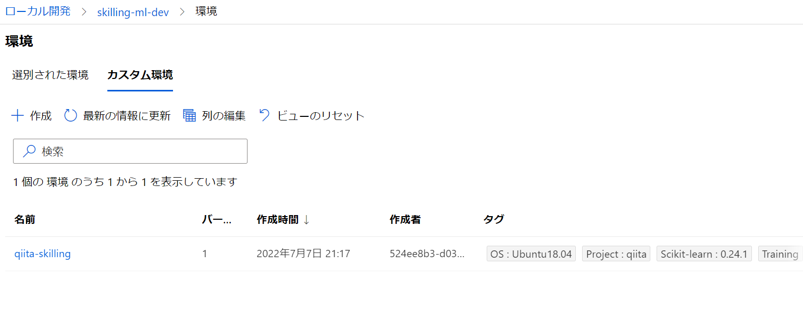
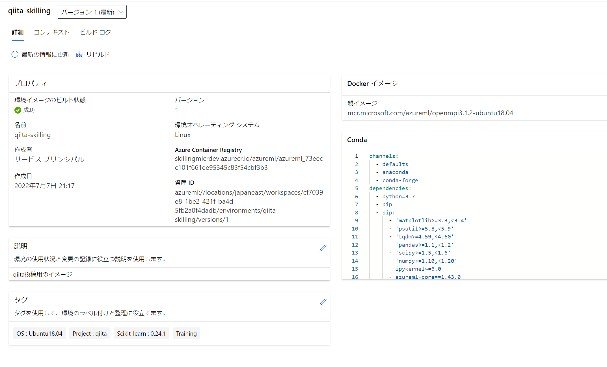
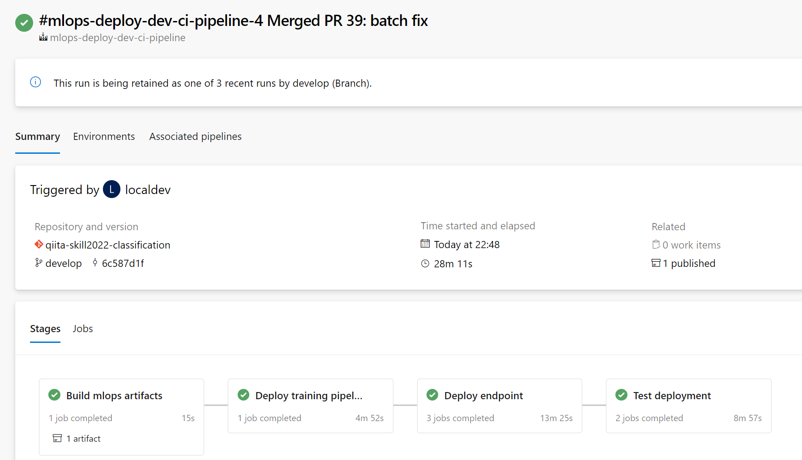
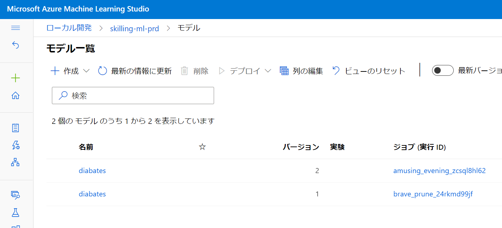

## はじめに


[Build: Data and AI: Who Hacked? Challenge](https://docs.microsoft.com/en-us/users/cloudskillschallenge/collections/e6kjadkywnqo?WT.mc_id=cloudskillschallenge_6e76f1bd-257e-48d5-875b-b6f1e25cf028)

Build 2022でプレビューとなった機能も含めてAzur Machine Learningをフル活用して、Skil Challengeを題材にMLOpsを実践してみます。
前回：[Cloud Skill Challenge を題材に Azure Machine Learning SDK v2 で MLOpsの扉を開いた - 回帰モデル](https://qiita.com/ryoma-nagata/items/e5123359a4d7dd93dd9f)

今回は [分類モデルをトレーニングして評価する](https://docs.microsoft.com/ja-jp/learn/modules/train-evaluate-classification-models/?WT.mc_id=cloudskillschallenge_6e76f1bd-257e-48d5-875b-b6f1e25cf028) を実施してその内容を共有します。

## 今回のMLOps成熟度の目標

今回は、Level 3 強　を目指したいと思います。


参考：[MLOps Maturity Model with Azure Machine Learning](https://techcommunity.microsoft.com/t5/ai-machine-learning-blog/mlops-maturity-model-with-azure-machine-learning/ba-p/3520625)

また、これを目指すにあたり、

1. 仮説検証：データサイエンティストによる試行錯誤
2. 継続的トレーニングとCICD:クラウド自動トレーニング、テストの構成
3. モデル成果物の承認による推論エンドポイントの自動展開

という流れで回して、以下のようなサイクルを意識しています。


## 1. 環境準備

### MLOps実施用のレポジトリ

MLOpsを実践するために、テンプレートリポジトリを用意しました

https://github.com/ryoma-nagata/mlops-template

MSが公開している各種のMLOps用のテンプレートをアレンジしたものです。

- [dstoolkit-mlops-base](https://github.com/microsoft/dstoolkit-mlops-base)
- [mlops-v2](https://github.com/Azure/mlops-v2)

これをAzure DevOps環境でインポートして使用します。

1. リポジトリのインポート


2. ブランチの作成


### Azure リソース

dev開発環境）,とprd(本番環境)という構成でやってみます。


また、これを実施するためのAzure Deployボタンを作りましたのでご活用ください。

[](https://portal.azure.com/#create/Microsoft.Template/uri/https%3A%2F%2Fraw.githubusercontent.com%2Fryoma-nagata%2Fmlops-template%2Fmaster%2Finfra%2Fmain.json)


## 2. 仮説検証のためのデータサイエンス

データサイエンティストの役割となる仮説検証、データサイエンス作業です。

### コーティング環境の準備

コンピューティングインスタンスを立ち上げます


が、これに対して[vscodeのMachine Learning拡張機能](https://marketplace.visualstudio.com/items?itemName=ms-toolsai.vscode-ai)によりリモート開発をします。

拡張機能の画面からCompute instanceに接続します。


compute instanceにログインしたら先ほどのリポジトリをcloneしましょう。


ssh-keygen -t rsa -b 4096 -C "localdev@ryomanagatazdhco.onmicrosoft.com"


#### conda環境の作成と利用

せっかくなので、python環境も定義してcondaでコード化しておきます。
Azure MLの環境ですでに作成されているものをパクることにします。


これを、こんな感じでconda.ymlにして、


[Azure Machine Learningで使用するAnaconda仮想環境の構築とJupyterとの連携方法](https://qiita.com/aical/items/107928086af5c29f8be1) を参考にして、カーネルを追加、切り替えます。

まずはconda env

```bash

conda env create -n qiita --file data-science/environment/train-conda.yml 
conda activate qiita
ipython kernel install --user --name=qiita --display-name=qiita

```

vscodeを開きなおして、notebookを開いてカーネルを切り替えます。


### MS Learnの内容を試行する

では、データサイエンスしていきます。
まずは [演習 - 分類モデルをトレーニングして評価する](https://docs.microsoft.com/ja-jp/learn/modules/train-evaluate-classification-models/3-exercise-model)
の内容をコピペしながら進めていきます。


#### データ取得

まずはデータの取得は以下のようにして、dataフォルダに入るようにします。

```python

import pandas as pd

# load the training dataset
!wget -P ../../data https://raw.githubusercontent.com/MicrosoftDocs/mslearn-introduction-to-machine-learning/main/Data/ml-basics/diabetes.csv
diabetes = pd.read_csv('../../data/diabetes.csv')
diabetes.head()

```


後続のデータ探索は割愛します。

#### 実験設定

実験のmlflow初期設定をします。

お作法として2つ実行しましょう

```python


import azure.ai.ml 
from azure.ai.ml import MLClient
from azure.identity import DefaultAzureCredential, InteractiveBrowserCredential
from azureml.core import Workspace

ws = Workspace.from_config()
print('Workspace name: ' + ws.name, 
      'Azure region: ' + ws.location, 
      'Subscription id: ' + ws.subscription_id, 
      'Resource group: ' + ws.resource_group, sep='\n')


try:
    credential = DefaultAzureCredential()
    # Check if given credential can get token successfully.
    credential.get_token("https://management.azure.com/.default")
except Exception as ex:
    # Fall back to InteractiveBrowserCredential in case DefaultAzureCredential not work
    # This will open a browser page for
    credential = InteractiveBrowserCredential()

try:
    ml_client = MLClient.from_config(credential=credential)
except Exception as ex:
    # NOTE: Update following workspace information if not correctly configure before
    client_config = {
        "subscription_id": ws.subscription_id,
        "resource_group": ws.resource_group,
        "workspace_name": ws.name,
    }

    if client_config["subscription_id"].startswith("<"):
        print(
            "please update your <SUBSCRIPTION_ID> <RESOURCE_GROUP> <AML_WORKSPACE_NAME> in notebook cell"
        )
        raise ex
    else:  # write and reload from config file
        import json, os

        config_path = "../.azureml/config.json"
        os.makedirs(os.path.dirname(config_path), exist_ok=True)
        with open(config_path, "w") as fo:
            fo.write(json.dumps(client_config))
        ml_client = MLClient.from_config(credential=credential, path=config_path)
print(ml_client)


```

```python

import mlflow

tracking_uri = ml_client.workspaces.get(name=ws.name).mlflow_tracking_uri
mlflow.set_tracking_uri(tracking_uri)
experiment_name = "skill-challenge-train-evaluate-classification-models" 
mlflow.set_experiment(experiment_name)


```


#### 実験開始

mlflow実験を残します。自動ログも有効化しておきます。

```python

import time
run_name = f'sand_sklearn_LogisticRegression_run_{int(time.time())}' # 実行ごとにかぶらないようにしつつ好きな名前を指定
run = mlflow.start_run(run_name=run_name)

mlflow.autolog()

```


#### データ分割～モデル生成・評価

探索と前後しますが、特徴量抽出とデータ分割します。


ロジスティック回帰で分類モデルを生成、評価します。


#### 実験終了

```python

mlflow.end_run()

```

はい、これで初回の試行が完了しました。
サンドボックス的な位置づけでしたが、mlflowできちんと実験管理もできてますね。


## 3. MLOpsパイプラインの作成

ここからはMLエンジニアとデータサイエンティストの協調作業となると考えます。
（今回は私一人ですが）

仮説検証のベースが固まったら、これをパイプラインとしてパッケージ化、MLOpsサイクルに組み込む必要があります。
このために、Azure Machine Learningのcli v2ではDevOpsに組み込みやすいコマンドラインとyamlファイルによるMLOps資産定義を使って自動化を構成します。

### リファクタリング

ipynb形式はデバッグしやすい半面、gitレポ上でのレビューがしにくく、テストを適用することが難しいです。
この解決策は各社ありますが、Azure MLでは.pyへのリファクタリングを実施します。

流れは、前回の実践通りです。以下のようになりました。

```python

%%writefile ../src/main.py
import pandas as pd
from sklearn.model_selection import train_test_split
from sklearn.linear_model import LogisticRegression
from sklearn.metrics import accuracy_score
import mlflow
import argparse 

mlflow.autolog()

parser = argparse.ArgumentParser()
parser.add_argument("--input_data", type=str)
args = parser.parse_args()

def main():
    # diabetes = pd.read_csv('../../data/diabetes.csv')
    diabetes = pd.read_csv(args.input_data)
    # diabetes.head()
    with mlflow.start_run():
        X_train, X_test, y_train, y_test = prep(diabetes)
        model = train(X_train, y_train)
        Accuracy = evaluate(model,X_test ,y_test)

        mlflow.sklearn.log_model(model,artifact_path="log_model")
        mlflow.log_metric('Accuracy',Accuracy)

def prep(diabetes):

    # Separate features and labels
    features = ['Pregnancies','PlasmaGlucose','DiastolicBloodPressure','TricepsThickness','SerumInsulin','BMI','DiabetesPedigree','Age']
    label = 'Diabetic'
    X, y = diabetes[features].values, diabetes[label].values

    for n in range(0,4):
        print("Patient", str(n+1), "\n  Features:",list(X[n]), "\n  Label:", y[n])

    # Split data 70%-30% into training set and test set
    X_train, X_test, y_train, y_test = train_test_split(X, y, test_size=0.30, random_state=0)

    print ('Training cases: %d\nTest cases: %d' % (X_train.shape[0], X_test.shape[0]))
    return X_train, X_test, y_train, y_test

def train(X_train, y_train):
    # Train the model
    # Set regularization rate
    reg = 0.01
    # train a logistic regression model on the training set
    model = LogisticRegression(C=1/reg, solver="liblinear").fit(X_train, y_train)
    print (model)
    return model

def evaluate(model,X_test ,y_test):
    predictions = model.predict(X_test)
    print('Predicted labels: ', predictions)
    print('Actual labels:    ' ,y_test)
    print('Accuracy: ', accuracy_score(y_test, predictions))

    Accuracy=accuracy_score(y_test, predictions)
    return Accuracy

if __name__ == "__main__":
    # run main function
    main()

```


このあたりでfeatureブランチでコミットしておきましょう。今回はiterationという建付けにしました


### 各種ML資産の定義


mlopsフォルダのconfigファイルにて環境情報や、MLオブジェクトの名称を定義します。


- mlops/config-infra-dev.yml: **開発環境の** サブスクリプション、リソースグループ、Azure ML ワークスペース名
- mlops/config-infra-prod.yml: **本番環境の** サブスクリプション、リソースグループ、Azure ML ワークスペース名
- mlops/config-mlops.yml: 環境、データセット、実験名、モデル名や、成果物パス、バッチ推論各種名称、リアルタイム推論各種情報

なお、今回、DevOpsパイプラインを構成するにあたり、yaml + Azure CLI ML v2でのCICDタスク実施を構成していますが、MLエンジニアのスキルセットで選ぶのがよいでしょう。
私の考えとしては、DevOpsパイプライン開発はサイエンティストの領分ではないと考え、CLIを採用しました。

>Azure Machine Learning には、パイプラインを構築するためのさまざまな方法が用意されています。 DevOps プラクティスに慣れているユーザーには、CLI を使用することをお勧めします。 Python に精通しているデータ サイエンティストには、Azure ML SDK を使用したパイプラインの作成をお勧めします。 
https://docs.microsoft.com/ja-jp/azure/machine-learning/concept-ml-pipelines#getting-started-best-practices


#### 継続的トレーニングのための情報

ソースコードがどのようなパイプラインで実行され、何のデータを利用し、どんなモデルを出力するのか、定義します。

##### 環境

参考：[CLI (v2) を使用した Azure Machine Learning 環境の管理](https://docs.microsoft.com/ja-jp/azure/machine-learning/how-to-manage-environments-v2)

データサイエンティストの作成したconda ファイルを参照し、ベースイメージを定義することで、Azure ML上に環境イメージを再利用可能な形で保管できます。今回は自動学習時の環境として再利用することにします。

yamlではとりあえず、sklearnの既定イメージからcondaを起こしたのでイメージも同じにしておきます。
タグなどもつけておくとよいでしょう

mlops/config-mlops.yml

```yml

  TRAINING_ENVIRONMENT_NAME: qiita-skilling

```


mlops/continuous-training/train-env.yml

```yml

$schema: https://azuremlschemas.azureedge.net/latest/environment.schema.json
name: "override config-mlops.yml"
image: mcr.microsoft.com/azureml/openmpi3.1.2-ubuntu18.04
conda_file: ../../data-science/environment/train-conda.yml
description: 'qiita投稿用のイメージ'
tags:
  OS : Ubuntu18.04
  Scikit-learn : 0.24.1
  Training : ''
  Project: 'qiita'


```

[CLI (v2) 環境 YAML スキーマ](https://docs.microsoft.com/ja-jp/azure/machine-learning/reference-yaml-environment)


###### データセット

参考：[データ資産を作成する](https://docs.microsoft.com/ja-jp/azure/machine-learning/how-to-create-register-data-assets?tabs=CLI)

Azure MLには実験に使用したデータを資産化して管理する機能があります。
今回は、実験に利用したデータは明示的にデータセットとして資産管理の対象とします。（登録しない場合でも記録されますが、アセットとして登録しておくと、管理性がいいです。）

yamlではローカルファイルや、クラウド上のファイルなど選択できますが、今回は./dataフォルダで管理するようになっています。
説明情報もつけておくとよいです。

mlops/config-mlops.yml

```yml

  TRAINING_DATASET_NAME: qiita-diabates

```


mlops/continuous-training/dataset.yml

```yml

$schema: https://azuremlschemas.azureedge.net/latest/data.schema.json
name: "override config-mlops.yml"
description: "糖尿病データセット"
type: uri_file
path: ../../data/diabetes.csv
tags:
  Training : ''
  Project: 'qiita'

```
[CLI (v2) データ YAML スキーマ](https://docs.microsoft.com/ja-jp/azure/machine-learning/reference-yaml-data)

##### パイプライン

参考：[CLI (v2) を使用してモデルをトレーニングする](https://docs.microsoft.com/ja-jp/azure/machine-learning/how-to-train-cli)

pythonコードをどのような設定で実行するかを定義します。
複数ステップでコンポーネントを定義することで再利用性が高まりますが、今回は単一のステップ(コマンドジョブ)で定義します。
このときに、どのデータ、環境を利用するかを指定します。

mlops/config-mlops.yml

```yml

  TRAINING_EXPERIMENT_NAME: skill-challenge-train-evaluate-classification-models


```

mlops/continuous-training/pipeline.yml

```yml

$schema: https://azuremlschemas.azureedge.net/latest/commandJob.schema.json
code: ../../data-science/src
command: >-
  python main.py 
  --input_data ${{inputs.input}} 
inputs:
    input:
      type: uri_file #要依存確認
      path: azureml:qiita-diabates@latest #要依存確認
environment: azureml:qiita-skilling@latest #要依存確認
compute: azureml:cpu-cluster 
experiment_name: "override config-mlops.yml"
description: "分類モデルのパイプライン"
tags:
  Project: 'qiita'
  
```

[CLI (v2) コマンド ジョブ YAML スキーマ](https://docs.microsoft.com/ja-jp/azure/machine-learning/reference-yaml-job-command)

##### モデル

参考:[Azure Machine Learning スタジオを使用してデプロイする](https://docs.microsoft.com/ja-jp/azure/machine-learning/how-to-deploy-mlflow-models-online-endpoints?tabs=endpoint%2Cstudio#deploy-using-azure-machine-learning-studio)

学習パイプラインから生成（Build）されたモデルの定義を決めておきます。
今回はMLflowによりログ記録する予定なので、typeはmlflow_modelです。ちなみにmlflow modelのときには推論時にスクリプトを書かなくていい場合があります


https://docs.microsoft.com/ja-jp/azure/machine-learning/reference-yaml-deployment-batch

mlops/config-mlops.yml

```yml

  # Model registry
  MODEL_NAME: diabates
  MODEL_PATH: log_model #MLflowでログを記録したパス

```

mlops/continuous-training/model.yml

```yml

$schema: https://azuremlschemas.azureedge.net/latest/model.schema.json
name: "override config-mlops.yml"
description: "糖尿病分類モデル"
type: mlflow_model 
# azureml://jobs/<jobId>/outputs/artifacts/paths/model/ 
tags:
  Project: 'qiita'

```

[LI (v2) モデル YAML スキーマ](https://docs.microsoft.com/ja-jp/azure/machine-learning/reference-yaml-model)

#### 継続的デプロイのための情報

リアルタイム推論、バッチ推論時にどのモデルを利用するか、テストで利用するデータの場所などを定義します。

##### バッチ推論

参考：[バッチ エンドポイントを使用したバッチ スコアリング](https://docs.microsoft.com/ja-jp/azure/machine-learning/how-to-use-batch-endpoint)

###### エンドポイント

パイプラインをキックするためのエンドポイントです。認証方法を定義します。

mlops/config-mlops.yml

```yml

  BATCH_ENDPOINT_NAME: qiita-diabates-bep # バッチジョブの実験名になります.リージョンで一意になること

```

mlops/deploy/batch/batch-endpoint.yml

```yml

$schema: https://azuremlschemas.azureedge.net/latest/batchEndpoint.schema.json
name: "override config-mlops.yml" 
description: "糖尿病バッチ推論エンドポイント"
auth_mode: aad_token
tags:
  Project: 'qiita'

```

[CLI (v2) バッチ エンドポイント YAML スキーマ](https://docs.microsoft.com/ja-jp/azure/machine-learning/reference-yaml-endpoint-batch)

###### デプロイ

エンドポイントにN個紐づく、処理内容です。推論に使用されるモデル、計算リソース等を指定します。
テスト用の定義も入れておきます。

mlops/config-mlops.yml

```yml

  BATCH_DEPLOYMENT_NAME: qiita-diabates-bdp
  # Test batch
  BATCH_SAMPLE_REQUEST: data/batch-diabates.csv
  BATCH_REQUEST_TYPE: uri_file

```

テストデータはこんな感じ

```

Pregnancies,PlasmaGlucose,DiastolicBloodPressure,TricepsThickness,SerumInsulin,BMI,DiabetesPedigree,Age
2,180,74,24,21,23.9091702,1.488172308,22

```


mlops/deploy/batch/batch-deployment.yml

```yml

$schema: https://azuremlschemas.azureedge.net/latest/batchDeployment.schema.json
name: devopsbatch-dp
endpoint_name: "override config-mlops.yml"
# model: "override config-mlops.yml"
compute: azureml:cpu-cluster
resources:
  instance_count: 1
max_concurrency_per_instance: 2
mini_batch_size: 10
output_action: append_row
output_file_name: predictions.csv
retry_settings:
  max_retries: 3
  timeout: 30
error_threshold: -1
logging_level: info
tags:
  Project: 'qiita'

```

[CLI (v2) バッチ デプロイ YAML スキーマ](https://docs.microsoft.com/ja-jp/azure/machine-learning/reference-yaml-deployment-batch)

##### リアルタイム推論

参考：[オンライン エンドポイントを使用して機械学習モデルをデプロイおよびスコア付けする](https://docs.microsoft.com/ja-jp/azure/machine-learning/how-to-deploy-managed-online-endpoints)

###### エンドポイント

APIリクエストを送信するエンドポイントです。認証方法を定義します。

mlops/config-mlops.yml

```yml

  # Online deploy
  ONLINE_ENDPOINT_NAME: qiita-diabates-oep # リージョンで一意になること

```

mlops/deploy/online/online-endpoint.yml

```yml

$schema: https://azuremlschemas.azureedge.net/latest/managedOnlineEndpoint.schema.json
name: "override config-mlops.yml"
description: "糖尿病オンライン推論エンドポイント"
auth_mode: key
tags:
  Project: 'qiita'

```
[CLI (v2) オンライン エンドポイント YAML スキーマ](https://docs.microsoft.com/ja-jp/azure/machine-learning/reference-yaml-endpoint-online)

###### デプロイ

エンドポイントにN個紐づく、処理内容です。推論に使用されるモデル、計算リソース等を指定します。
デプロイにつき1セットの計算リソースが必要です。
今回は低スペックを1台となっています。
私の環境はクオータが足りなくて複数デプロイできない・・・

mlops/config-mlops.yml

```yml

  ONLINE_DEPLOYMENT_NAME: qiita-diabates-odp
  # Test online
  ONLINE_SAMPLE_REQUEST: data/online-diabetes.json

```

テストデータ

```json

{
    "input_data": [
        [2,180,74,24,21,23.9091702,1.488172308,22]
    ]
}

```


mlops/deploy/online/online-deployment.yml

```yml

$schema: https://azuremlschemas.azureedge.net/latest/managedOnlineDeployment.schema.json
name: "override config-mlops.yml"
endpoint_name: devopsbiketyrey #上書きされる
# model: azureml:tetesetesaz@latest 
instance_type: Standard_E2s_v3
instance_count: 1
tags:
  Project: 'qiita'

```

[CLI (v2) マネージド オンライン デプロイ YAML スキーマ](https://docs.microsoft.com/ja-jp/azure/machine-learning/reference-yaml-deployment-managed-online)

###### 最終系

mlops/config-mlops.ymlは最終的にはこうなりました。

```yml

variables:
  # override parameters of azure ml 
  # Train
  TRAINING_ENVIRONMENT_NAME: qiita-skilling
  TRAINING_DATASET_NAME: qiita-diabates
  TRAINING_EXPERIMENT_NAME: skill-challenge-train-evaluate-classification-models

  # Model registry
  MODEL_NAME: diabates
  MODEL_PATH: log_model #MLflowでログを記録したパス

  # Batch deploy
  SCORING_DATASET_NAME: <sample-string> #現状使わない
  BATCH_ENDPOINT_NAME: qiita-diabates-bep # バッチジョブの実験名になります.リージョンで一意になること
  BATCH_DEPLOYMENT_NAME: qiita-diabates-bdp
  # Test batch
  BATCH_SAMPLE_REQUEST: data/batch-diabetes.csv
  BATCH_REQUEST_TYPE: uri_file

  # Online deploy
  ONLINE_ENDPOINT_NAME: qiita-diabates-oep # リージョンで一意になること
  ONLINE_DEPLOYMENT_NAME: qiita-diabates-odp
  # Test online
  ONLINE_SAMPLE_REQUEST: data/online-diabetes.json

```


###### インフラ定義

mlops/config-infra-dev.yml

mlops/config-infra-prod.yml

にも情報を入れておきましょう。


### Azure DevOpsによる自動化

#### セットアップ

まずは3環境作ります。

- dev: 開発環境と指す
- prod: 本番環境を指す。モデルの登録に承認ゲートをいれるために定義
- blue: 本番のリアルタイム推論のリリース環境を指す。推論エンドポイントをスワップするための承認ゲートをいれるために定義（スワップは今回未実装・・・


承認ゲートも設定しておきます。これでDevOpsパイプラインで当該環境へのデプロイを検知した際には承認が必要となります。


次にパイプラインをセットアップします。

パイプラインをインポートします。


対象のパイプラインを選んでいきます。


対象は3つあり、それぞれ以下の役割とトリガー条件になります。

- /.ado/mlops-qa-ci-pipeline.yml: src内のpythonファイルの単体テストを実行する。feature->developのPRの際に実行される
- /.ado/mlops-deploy-dev-ci-pipeline.yml: dev環境へのデプロイと一連のテストを実行。developへのマージで実行される
- /.ado/mlops-deploy-prod-ct-cd-pipeline.yml: prod環境でのモデルトレーニングとリリースを実行。masterへのマージで実行される。なお、モデルの登録時と、リリース時でそれぞれ承認が発生

とりあえず保存だけして実行はしません


 /.ado/mlops-deploy-dev-ci-pipeline.ymlに関しては、prodのパイプラインからビルドパイプラインとして参照させているので名前を **mlops-deploy-dev-ci-pipeline** としておきましょう。（というかわかりづらいので名称は全部変えておくこと）


次にPRトリガーはyamlで定義できないので、ブランチポリシーを変更しておきます。


master も保護しておきます。


全体のCICDフローはこんな感じを予定してます。


### 実行確認

PR,Mergeを通して実行してみましょう。

まずは、iterationブランチをpushしたあと、PRを作成します。


#### 単体テスト

PRを作成すると、自動でコードテストが実行されます。


ずたずたですが、


気にせずマージしちゃいます。


#### 開発環境への展開（学習）

ここでは、単体テストと併せて、開発したコードをデリバリー可能な成果物とするためのテストなどを実施されます。


DevOpsでは、マージを検知して、開発環境への展開が開始します。


DevOpsのステージは以下のようになってます。


- build: srcや、mlopsフォルダのyml、データフォルダの内容などをコード成果物としてパブリッシュします。
- Training: dev環境で以下を実施します。
  - 環境の登録（バージョンが更新されます。）
  - データセットの登録（バージョンが更新されます。）
  - 最新の環境、データセットを使用したジョブ実行


実行中の画面となりました。


環境と






データが登録され、


ジョブの実行が確認できます。今回の実行では環境を作成し、初回となるため学習環境のイメージがビルドされるのに少々時間がかかります。


実行が完了すると次のステップにすすみます。


#### 開発環境への展開（推論）

続きでは、以下のようになります。


- Deploy endpoint: 開発環境でデプロイを行います。
  - Register model: Trainingステージで生成されたモデルをAzure MLに登録します
  - Batch: バッチエンドポイントにバッチ推論ジョブをデプロイします。
  - Online: オンラインエンドポイントにリアルタイム推論をデプロイします。


初回実行時にはパイプラインから環境へのアクセス許可を求められます。


ジョブと紐づいた状態でモデルが登録され、


バッチエンドポイントおよび、デプロイが登録され、


オンラインエンドポイントおよび、デプロイが登録されます。


#### 開発環境への展開（推論テスト）

さらにテストプロセスを実行します。開発環境で自動結合テストの成功を確認したら、ステージ環境を設けてそちらでもシステムテストするのがいいでしょう。
今回は省略してます。

流れは以下です。

- Test deployment
  - Test batch deploy: 実際にバッチエンドポイントを呼び出して、テストデータに推論を行います。
  - Test online deploy: 実際にオンラインエンドポイントを呼び出して、テストリクエストを送信します。


オンライン推論がテストされ、


バッチ推論によりジョブが実行されます。


出力結果から推論結果を確認可能です。


トータル30分ほどでdev環境でのパイプライン実行が完了しました。
途中でジョブを並列化させているのですが、無償範囲では並列化されず、余分な時間がかかっています。。



#### 本番環境へのコードの展開と学習→モデルの承認と推論のリリース

次に、コードとデータの成果物をもとに本番環境でモデルを生成します。生成後、モデルに承認が通ることで推論エンドポイントにモデルがデリバリーされます。
このパイプラインはCICDの流れとは別に単独でも実行可能で、任意のタイミングで再学習からデプロイできることを狙っています。
今回はgit上のデータを学習データにしているのでわかりづらいですが、クラウドのパスを学習データにしている場合、そのパスのデータが最新化されたらこのパイプラインを実行してやることでモデルが最新化されていきます。


masterにマージして実行してみましょう。


マージを検知して、prod用のパイプラインが開始します。


流れは以下です。

- Training: devと同様だが、devのパイプライン実行時にpublishされた、コード等定義をダウンロードしてトレーニングします。
- Deploy endpoint: devと同様だが、モデルの登録に進むために承認ゲートがあります。
- Release online deploy: 推論エンドポイントのデプロイへトラフィックを割り当てます。

トレーニング終了後、prod環境へのデプロイの承認を要求されます。


承認者はprod環境のトレーニング結果からモデルのパフォーマンスを確認し、問題なければ承認→モデル登録デプロイに進みます。


モデルが本番に登録されます


さらにデプロイが完了し、本番環境で動作確認が可能になります。
ここからブルーグリーンとして、二つのデプロイを割り当てて、トラフィックを徐々に割り当てる、など考えられます。

今回は承認だけでトラフィックを完全に割り当てます。

承認をして、


本番環境でトラフィックが100になっていることが確認できます。


## 4. コードの修正とモデル更新却下のパターン

演習のサマリ以降では、メトリックスをより多く確認し、sklearnのパイプラインを使ったモデル学習にコードを更新しています。
実際にコードを改変して、パイプラインを回してみましょう。（mlflowでメトリックスはいろいろ取れているので割愛）

ただしモデルの評価の結果、新しい仮説を要求した、というシナリオにしてみます。


演習はこの辺ですね。


main.pyを更新し、以下のようになりました。


```python

%%writefile ../src/main.py
import pandas as pd
from sklearn.model_selection import train_test_split
from sklearn.linear_model import LogisticRegression
from sklearn.metrics import accuracy_score
import mlflow
import argparse 
# Train the model
from sklearn.compose import ColumnTransformer
from sklearn.pipeline import Pipeline
from sklearn.preprocessing import StandardScaler, OneHotEncoder
import numpy as np

mlflow.autolog()

parser = argparse.ArgumentParser()
parser.add_argument("--input_data", type=str)
args = parser.parse_args()

def main():
    # diabetes = pd.read_csv('../../data/diabetes.csv')
    diabetes = pd.read_csv(args.input_data)
    # diabetes.head()
    with mlflow.start_run():
        X_train, X_test, y_train, y_test = prep(diabetes)
        model = train(X_train, y_train)
        Accuracy = evaluate(model,X_test ,y_test)
        mlflow.sklearn.log_model(model,artifact_path="log_model")
        mlflow.log_metric('Accuracy',Accuracy)

def prep(diabetes):

    # Separate features and labels
    features = ['Pregnancies','PlasmaGlucose','DiastolicBloodPressure','TricepsThickness','SerumInsulin','BMI','DiabetesPedigree','Age']
    label = 'Diabetic'
    X, y = diabetes[features].values, diabetes[label].values

    for n in range(0,4):
        print("Patient", str(n+1), "\n  Features:",list(X[n]), "\n  Label:", y[n])

    # Split data 70%-30% into training set and test set
    X_train, X_test, y_train, y_test = train_test_split(X, y, test_size=0.30, random_state=0)

    print ('Training cases: %d\nTest cases: %d' % (X_train.shape[0], X_test.shape[0]))
    return X_train, X_test, y_train, y_test

def train(X_train, y_train):
    # Train the model
    
    # Set regularization rate
    reg = 0.01
    # Define preprocessing for numeric columns (normalize them so they're on the same scale)
    numeric_features = [0,1,2,3,4,5,6]
    numeric_transformer = Pipeline(steps=[
        ('scaler', StandardScaler())])

    # Define preprocessing for categorical features (encode the Age column)
    categorical_features = [7]
    categorical_transformer = Pipeline(steps=[
        ('onehot', OneHotEncoder(handle_unknown='ignore'))])

    # Combine preprocessing steps
    preprocessor = ColumnTransformer(
        transformers=[
            ('num', numeric_transformer, numeric_features),
            ('cat', categorical_transformer, categorical_features)])

    # Create preprocessing and training pipeline
    pipeline = Pipeline(steps=[('preprocessor', preprocessor),
                            ('logregressor', LogisticRegression(C=1/reg, solver="liblinear"))])


    # fit the pipeline to train a logistic regression model on the training set
    model = pipeline.fit(X_train, (y_train))
    return model

def evaluate(model,X_test ,y_test):
    predictions = model.predict(X_test)
    print('Predicted labels: ', predictions)
    print('Actual labels:    ' ,y_test)
    print('Accuracy: ', accuracy_score(y_test, predictions))

    Accuracy=accuracy_score(y_test, predictions)
    return Accuracy

if __name__ == "__main__":
    # run main function
    main()


```

ここからPRし、dev->masterにマージしていきます。


が、本番パイプラインを確認して以前のジョブ結果と比べてみて、ここではモデル承認は却下してしまいましょう。


精度はぶっちゃけあがってますが、あえての却下です。


## 4. 次の仮説検証と自動展開

最後にRandomForestClassifierを採用していきます。


開発環境での学習ジョブ結果の推移


本番環境での学習ジョブ結果の推移（異なるメトリックを表示しているので逆になってますが、精度が向上してます。


この結果をふまえて、承認することで、本番のモデルがバージョン2という形で登録され、新しい推論デプロイがリリースされました。




## まとめ

MLOps、実現の仕方はそれぞれの解釈、解像度によって異なるのが現状ではあると思いますが、Azure MLとAzure DevOpsを利用した場合の全体のフローの一つの形は実現できたかなと思います。
今回使用したMLOpsのテンプレートリポジトリはぜひ活用してみてください。


### 今後の課題

今回実施する中で、いくつか改善ポイントがわかりました。
もっと研究してテンプレートの質を上げていけたらと思います。

- データの登録→開発データでモデル訓練後、本番データで再トレーニングをするにはどうするか
  - データセットをクラウド上のURIにする。ある場所のファイルが更新されます、という仕組みであれば、再学習時には更新された状態でのデータが可能なはず。
- 本番環境のトレーニングにあたり、説明や、公平性といったモデル解釈性をパイプラインに盛り込みたい
- 本番推論のモニタリングと完全な自動トレーニングのトリガーをどうするか
  - データドリフトトリガーや、Azure Monitorでのトリガーが考えられるが未調査（特に前者はv2でまだデータセット周りの機能が実装されていない）

ここの話です。


- 本番推論の安全なロールアウト（ブルーグリーンデプロイメント、カナリアリリース）
  - 今回は私のサブスクリプションのクォータ制限により複数のデプロイを割当てることができなかった。。。DevOpsパイプラインまでは落としこんでいるので申請通ったらやってみる所存
- 本番環境の推論エンドポイントの性能
  - infraとしてarmで処理するか、本番はSKUを変更できるようにしておいたほうがいいんじゃね？という気がしている
- CICDテンプレートに関しては開発環境ではデプロイ×2 -> テスト×2ではなくて、（デプロイ→テスト） ×2というフローにしたほうが時間を節約できそう


## その他の参考

mlops関連

https://ktksq.hatenablog.com/entry/mlops-cicd-ctcm

https://microsoft.github.io/azureml-ops-accelerator/4-Migrate/dstoolkit-mlops-base/docs/how-to/BranchingStrategy.html

