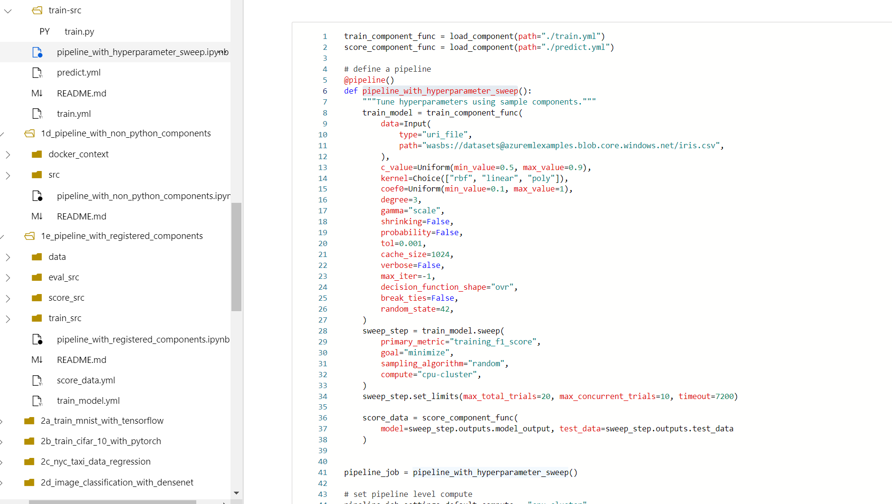

## 目的

Python SDK v2でML pipeline作ろうとしたら複雑だったのでGithubのサンプルコードを使って自分用に整理した

### Azure ML Pipelineについて

[Azure Machine Learning パイプラインとは](https://docs.microsoft.com/ja-jp/azure/machine-learning/concept-ml-pipelines)

[Azure Machine Learning コンポーネントとは](https://docs.microsoft.com/ja-jp/azure/machine-learning/concept-component)

[Azure Machine Learning SDK v2 でコンポーネントを使用して機械学習パイプラインを作成して実行する (プレビュー)](https://docs.microsoft.com/ja-jp/azure/machine-learning/how-to-create-component-pipeline-python)

[Azure Machine Learning Python SDK v2 (プレビュー)](https://docs.microsoft.com/ja-jp/azure/machine-learning/concept-v2#azure-machine-learning-python-sdk-v2-preview)

[Python SDK v2](https://docs.microsoft.com/ja-jp/python/api/azure-ai-ml/azure.ai.ml?view=azure-python-preview&viewFallbackFrom=azure-ml-py)

## 整理結果

## yamlからComponentsでパイプラインを構築する

https://github.com/Azure/azureml-examples/tree/sdk-preview/sdk/jobs/pipelines/1a_pipeline_with_components_from_yaml

>**学習目標** - このチュートリアルの終了時には、以下のことができるようになっているはずです。
>- Python SDKからAMLワークスペースに接続する。
>- YAML から `CommandComponent` を定義してロードする。
>- ロードしたコンポーネントを使用してパイプラインを作成する。
> 
>**このノートブックでは、ユーザーがyamlを使ってコンポーネントを定義し、そのコンポーネントを使用してパイプラインを構築するシナリオを扱います。**

### コンポーネント 

#### Load:yamlをload_component 

yaml(python実行コマンド)

python

### Pipeline

#### CreateSubmit:デコレータ defのみ

## command_component で装飾された python 関数でパイプラインを構築する。

https://github.com/Azure/azureml-examples/tree/sdk-preview/sdk/jobs/pipelines/1b_pipeline_with_python_function_components

> **学習目標** - このチュートリアルの終わりまでに、あなたはできるようになるはずです。
>- Python SDKからAMLワークスペースに接続する。
>- Python の関数と `command_component` デコレーターを使用して `CommandComponent` を定義する。
>- command_component` で定義されたコンポーネントを使用して `Pipeline` を作成する。
>
> **このノートでは、Python の関数と `@command_component` デコレータを使用して `CommandComponent` を定義し、コマンドコンポーネントを使用してパイプラインを構築する方法について説明します。**

### Component 

designer sdkが必要（Compute instanceになし

#### Load:デコレータつきpython import

python 

### Pipeline 

#### CreateSubmit:デコレータdef（cluster

## sweep ノードでパイプラインを構築する

https://github.com/Azure/azureml-examples/tree/sdk-preview/sdk/jobs/pipelines/1c_pipeline_with_hyperparameter_sweep

>**学習目標** - このチュートリアルの終わりまでに、あなたはできるようになるはずです。
>- Python SDK から AML ワークスペースに接続する。
>- スイープノードを `sweep()` で作成する。
>- スイープノードを使用してパイプラインを作成します。
>
>**このノートでは、`sweep()` を使用してスイープノードを作成し、それをパイプラインで使用する方法について説明します。sweepノードは、特定のコマンドコンポーネントに対して、指定された計算機(ローカルまたはクラウド)でハイパーパラメータチューニングを有効にするために使用することができます。ターゲット出力を検索するた>めの `search_space` と `objective` を定義することができます。** 

### Component 

#### Load:yamlをload_component 

※ Pipeline セルでロード

ソース内

### Pipeline 

#### CreateSubmit : デコレータdef（tag、sweep stepつき

## コマンド機能でパイプラインを構築する

https://github.com/Azure/azureml-examples/tree/sdk-preview/sdk/jobs/pipelines/1d_pipeline_with_non_python_components

>**学習目標** - このチュートリアルの終わりまでに、あなたはできるようになるはずです。
>- Python SDKからAMLワークスペースに接続する。
>- command()関数を使用して `CommandComponent` を定義する。
>- command()関数で定義されたコンポーネントを使用して、`Pipeline`を作成する。>
>
>**このノートでは、コマンド関数を使って `CommandComponent` を定義し、コマンドコンポーネントを使用してパイプラインを作成する方法を説明します。コマンドコンポーネントは、Azure機械学習パイプラインの基本的な構成要素です。指定したコンピュート（ローカルまたはクラウド）上でタスクを実行するために使用することができます。コマンドコンポーネントは、必要なインフラストラクチャをセットアップするために `Environment` を受け取ります。このインフラストラクチャで実行する `Command` を `inputs` と共に定義します。同じ >`Component` を別のパイプラインで再利用することができます。** 

### Compornent 

#### command関数で定義

Rソース（Rわからん。。。

### Pipeline 

#### CreateSubmit:デコレータdef（tag

## 登録されたコンポーネントでパイプラインを構築する

https://github.com/Azure/azureml-examples/tree/sdk-preview/sdk/jobs/pipelines/1e_pipeline_with_registered_components

>**学習目標** - このチュートリアルの終わりまでに、あなたはできるようになるはずです。
>- Python SDKからAMLワークスペースに接続する。
>- YAML、`command_component`デコレーターを使用して、`CommandComponent`を定義する。
>- ワークスペースにコンポーネントを作成する
>- 登録されたコンポーネントを使用して `Pipeline` を作成する。
>
>**このノートでは、SDKからコンポーネントを作成し、そのコンポーネントを使用してパイプラインを構築する方法を説明します。**

### Compornent 

#### Load:yamlをload_component 

yaml

#### Create

#### デコレータつきpython import

python

#### Create 

### Pipeline 

#### CreateSubmit:デコレータdefのみ

## スケジュールを使ってパイプラインを構築する

https://github.com/Azure/azureml-examples/tree/sdk-preview/sdk/jobs/pipelines/1f_pipeline_using_schedule

>**学習目標** - このチュートリアルの終わりまでに、あなたはできるようになるはずです。
>- Python SDKからAMLワークスペースに接続する。
>- YAML から `CommandComponent` を定義してロードする。
>- ロードしたコンポーネントを使用して `Pipeline` を作成する。
>- パイプラインのスケジュールを設定する。
>
>**このノートでは、スケジュールを使用してパイプラインを作成する方法を説明します。**

### Component

#### Load:yamlをload_component 

yaml 

### Pipeline 

#### Create

#### Submit Schedule

## 並列コンポーネントでシンプルなMLパイプラインを構築する

https://github.com/Azure/azureml-examples/tree/sdk-preview/sdk/jobs/pipelines/1g_pipeline_with_parallel_nodes

>**学習目標** - このチュートリアルの終わりまでに、あなたはできるようになるはずです。
>- Python SDKからAMLワークスペースに接続する。
>- 並列ノードによる `Pipeline` の作成
>- 並列ノードを使ってファイル/表形式データを処理する。
>
>**この例では、パラレルノードを作成し、それをパイプラインで使用する方法を説明します。並列ノードは、1つの>メインデータ入力を複数のミニバッチに自動分割し、ミニバッチごとに並列タスクを作成し、すべての並列タスクを計算機クラスタに分散して並列実行します。タスクの実行状況を監視し、データ/コード/プロセスに障害が発生した場合はタスクを自動再試行し、ユーザが設定した場所に出力を保存します。**

### Component

#### Load:yamlをload_component 

yaml

### parallel step:parallel関数で定義

### Pipeline

#### CreateSubmit

## AutoML in pipeline※Auto MLはコンポーネントなし

https://github.com/Azure/azureml-examples/tree/sdk-preview/sdk/jobs/pipelines/1h_automl_in_pipeline/automl-classification-bankmarketing-in-pipeline

**学習目標** - このチュートリアルの終わりまでに、あなたはできるようになるはずです。
- Classification AutoMLタスクでパイプラインを作成する。

**このノートブックでは、パイプラインの中でClassification AutoMLタスクを使用する方法について説明します。

### Component なし

### Pipeline 

#### Create デコレータ ( tag description

