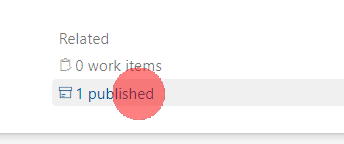
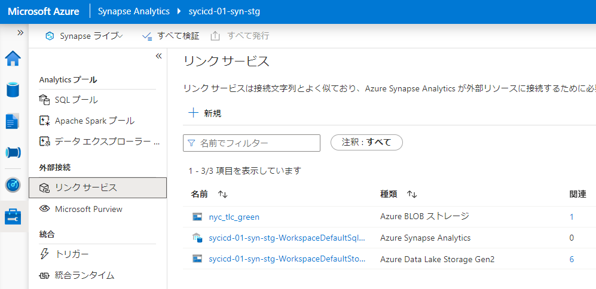

# Azure Synapse Analyticsの環境反映【基本編(yamlパイプライン)】

## はじめに

Synapse Analytics (workspace)の開発環境から本番環境への反映方法についてまとめます。

いくつかオプションがあるのですが、今回は **基本編** です

2022/05時点の情報です。

### 参考

[Azure Synapse Analytics ワークスペースの継続的インテグレーションとデリバリー](https://docs.microsoft.com/ja-jp/azure/synapse-analytics/cicd/continuous-integration-delivery)

[How to use CI/CD integration to automate the deploy of a Synapse Workspace to multiple environments](https://techcommunity.microsoft.com/t5/azure-synapse-analytics-blog/how-to-use-ci-cd-integration-to-automate-the-deploy-of-a-synapse/ba-p/2248060)

[Synapse workspace deployment](https://marketplace.visualstudio.com/items?itemName=AzureSynapseWorkspace.synapsecicd-deploy&ssr=false#overview)

[CI CD in Azure Synapse Analytics Part 5 - Deploying Azure Synapse Workspace from ARM](https://techcommunity.microsoft.com/t5/data-architecture-blog/ci-cd-in-azure-synapse-analytics-part-5-deploying-azure-synapse/ba-p/2775403)

[Azure/Synapse-workspace-deployment](https://github.com/Azure/Synapse-workspace-deployment)

[Azure Synapse Studio CICD using YAML pipelines](https://techcommunity.microsoft.com/t5/azure-synapse-analytics-blog/azure-synapse-studio-cicd-using-yaml-pipelines/ba-p/3045553)

[santiagxf/synapse-cicd](https://github.com/santiagxf/synapse-cicd)

## 概念

### Data Factory / Synapse workspaceのgit構成時のイメージ

Data Factory と Synapse workspaceをgit構成すると、このようなイメージになります。

**DevOps組織/プロジェクト/リポジトリ** : ソースコードを管理するリポジトリ

**コラボレーションブランチ** : 各作業ブランチを統合して、Data Factory / Synapse workspace のリソースに反映するブランチ。 main ブランチやdevelopment ブランチが該当することになります。

**発行ブランチ** : Data Factory / Synapse workspace のリソースに反映する際にテンプレートを配置するブランチ。発行ボタンを押すと更新されます。

### Data Factory と Synapse workspaceの違い

#### Data Factoryの考え方

Data Factoryで作成した成果物（パイプラインなど）はすべてAzure Resource Manager にてサブリソースとして管理され、ARM テンプレートファイルで操作可能な状態になっています。

したがって、adf_publishブランチのテンプレートを手動[ARMテンプレートファイルによるデプロイ](https://qiita.com/ryoma-nagata/items/5fa5ef1d7f5f8029cfa4)での一括反映に利用ができます。（自動の場合は、ARM テンプレートデプロイタスクが利用可能）

#### Synapse workspace での違い

Synapse workspaceでは、作成した成果物は基本的に ARMで操作できない、**リソース固有のデータ** として扱われています。

このため、workspace_publish 内に保管されたテンプレートはSynapse workspaceのdevエンドポイントを通してしか利用ができず、Data Factory のようにARMテンプレートファイルによる手動での一括反映は不可となっています。

## 自動反映構成方法

Github上にハンズオンのリポジトリを作成したのでこれを利用していきます。一旦リソースのデプロイ後、git構成まで進めておきます。※DevOpsが利用しているサービスプリンシパルを **Synapse 管理者** にするのを忘れないようにしてください。

https://github.com/ryoma-nagata/SynapseCICD-HOL

### DevOpsパイプラインの構成

1.開発環境側をgit構成すると以下のような状態となります。

2.発行ボタンを押すと、workspace_publishブランチが作成され、テンプレートファイル（ARM用ではない）と対応したパラメータファイルが作成されます。

3.CICDパイプラインをセットアップします。

[https://github.com/ryoma-nagata/SynapseCICD-HOL/blob/master/.ado/synapse/azure-pipelines.yml](https://github.com/ryoma-nagata/SynapseCICD-HOL/blob/master/.ado/synapse/azure-pipelines.yml) ファイルをuploadし、変数を編集します。

変数では、開発環境のSynapse Workspaceと ステージング環境のSynapse Workspaceの名称とリソースグループ名などを入れます。

4.workspace_publishにはテンプレートのパラメータファイルがありますので、これをrenameして内容を編集します。※次に発行した際に再度元のファイルが作成されます。

名称は **TemplateParametersForWorkspace_stg.json** としましょう。パイプラインから参照させる予定です。

5.パイプラインを作成し、Run します。※詳細手順はGithubリポジトリを参照

woskspace_publishブランチ上のパイプラインを選択するので注意です。

#### パイプラインの内容

マルチステージパイプラインとなっています。

##### PublishArtifact

成果物として、workspace_publish内のテンプレートファイルを **synapse** という名称で発行しています。
発行したファイルはpublishedから確認できます。

##### Deployment STG

以下を順番に実行しています。

1.成果物のダウンロード:前ステージで発行した成果物をダウンロードします。(deploymentステージでは既定で実行されます)

2.Synapse WorkspaceのIPフィルタのホワイトリストにDev OpsエージェントのパブリックIPを追加します。（認証が成功してからネットワーク許可をするゼロトラスト的発想）

3.Triggerを全停止します。

4.ダウンロードしたテンプレートファイルを利用してデプロイします。

5.Triggerを全再開します。

6.DevOpsエージェントのパブリックIPをホワイトリストから削除します。

どうもファイアウォールの変更が非同期に動いてしまうようなので、waitを入れていたりもします。

### 開発環境

パイプラインが正常実行できたら、OKなわけですが、パラメータファイルの使い方を抑えるためにリンクサービスの追加をしてみます。

ナレッジセンターに移動します。

適当なデータセットを追加します。

リンクサービスが追加されているはずです。

SAS トークンが初期化されていると思いますが、パブリックなblobのため、トークンに **''** (空文字)を入力します。

[テンプレートファイル](https://github.com/ryoma-nagata/SynapseCICD-HOL/blob/master/sample/nyc_load.zip)をインポートしてみます。

デバッグの成功確認後、発行ボタンを押すとworkspace_publishブランチが更新され、CICDが自動実行されます。

### stg環境

自動デプロイ後、成果物の反映を確認できます。

が、リンクサービスがつながらない状態となります。

理由はパラメータファイルです。

#### パラメータファイルの編集

パラメータファイル内の接続情報は機密情報としてみなされるため、空となります。
既定で出力されるTemplateParametersForWorkspace.json　をみてみます。

デプロイの際には _stg.jsonを利用していますが、そこには新しく追加したリンクサービス情報がありません。

これを正しい形に編集します。

開発環境のリンクサービス内容を確認します。

sasUriの値をコピーします。

sasトークンは空文字を設定しているので、以下のようにします。

[参考：Azure Data Factory でパブリック公開されているAzure Storageに接続する方法](https://qiita.com/ryoma-nagata/items/62544c049b23bb40f992)

※なお、Defaultと入っている情報はデプロイ対象外となるので変更不要です。

Commitすると再度パイプラインが実行されます。

完了後、リンクサービスを確認すると接続が成功します。

