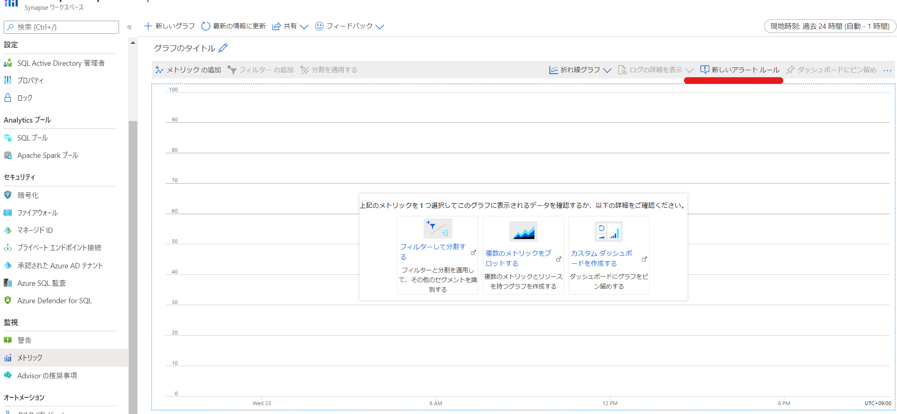
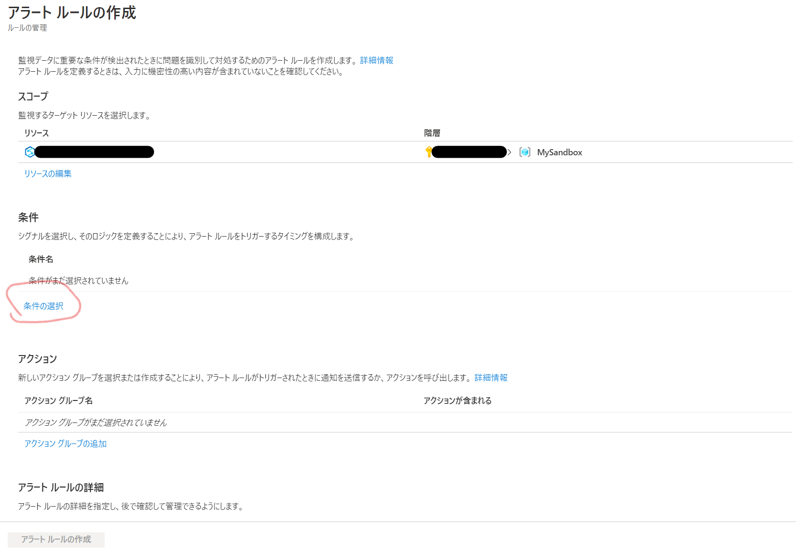
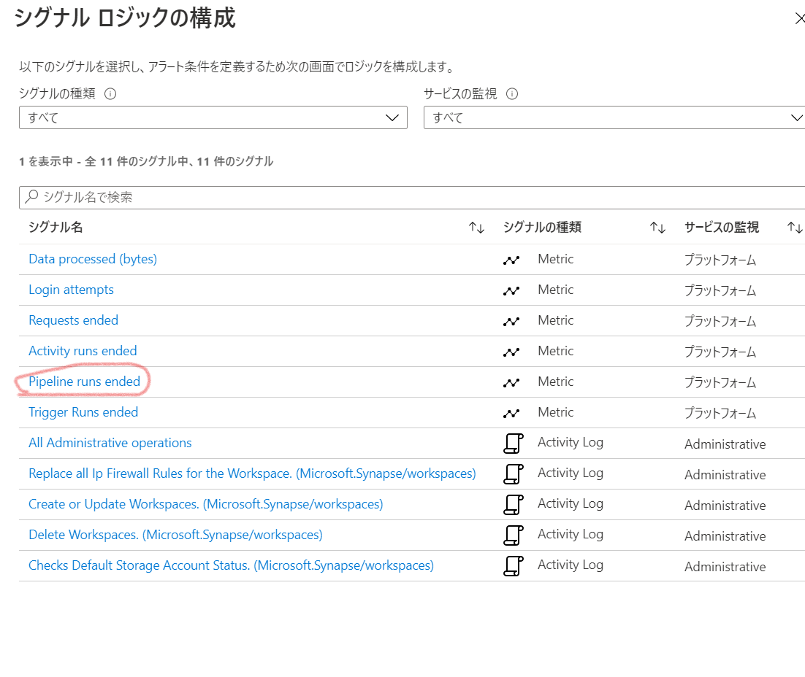
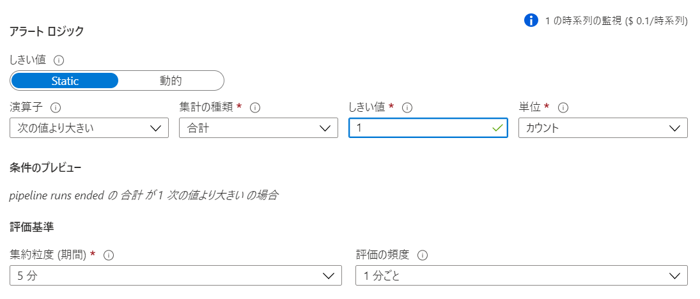
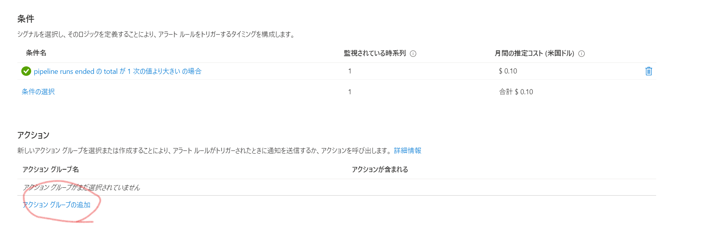
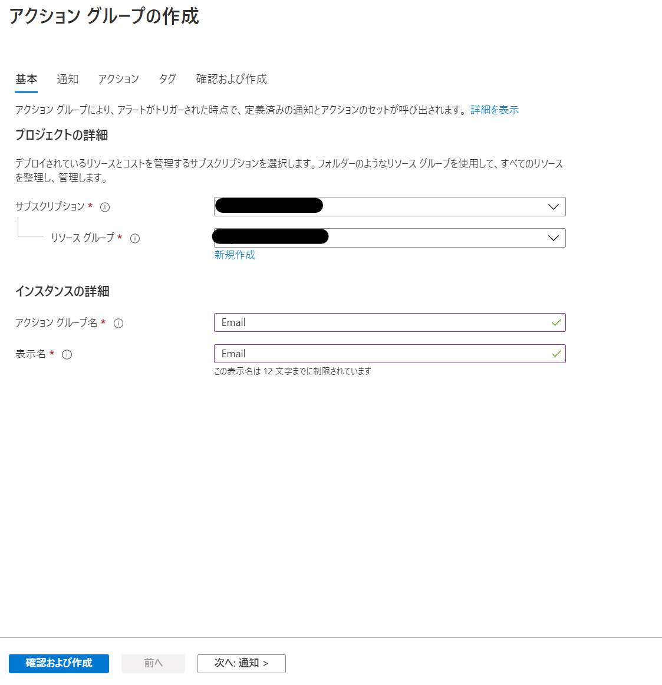
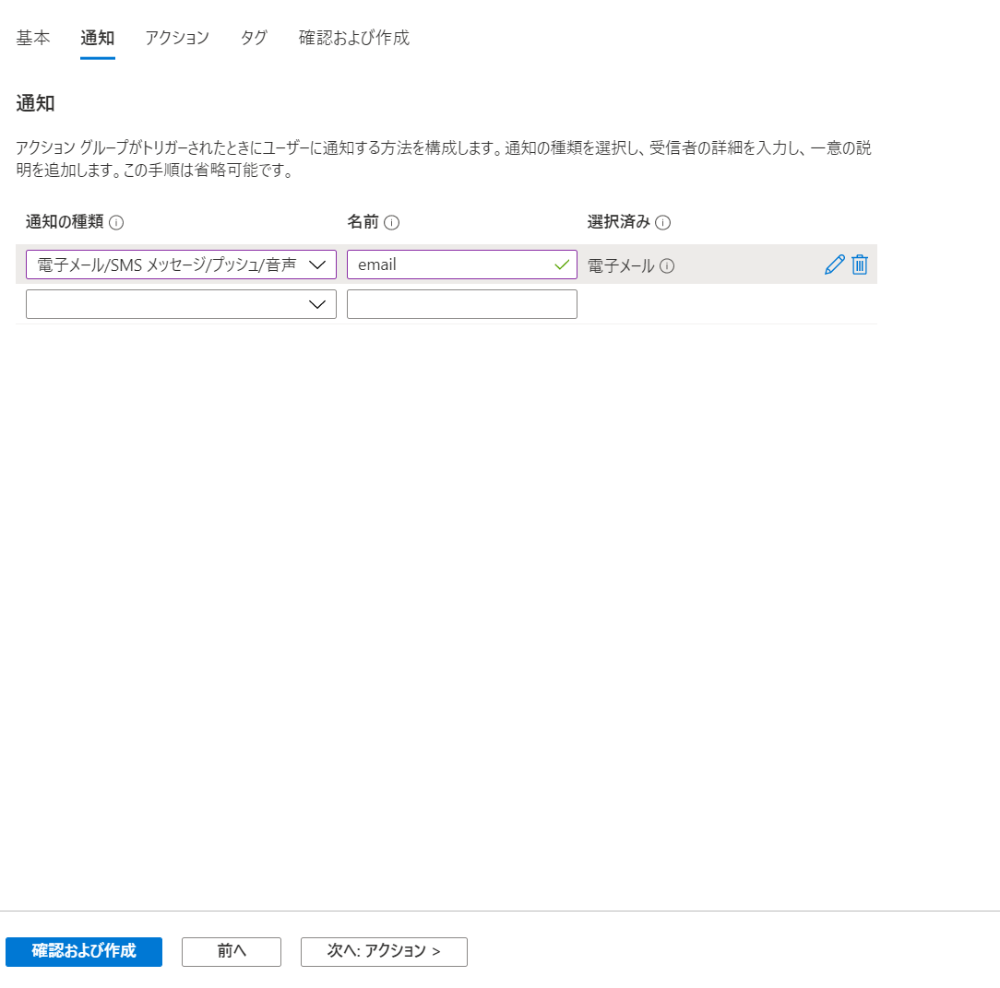
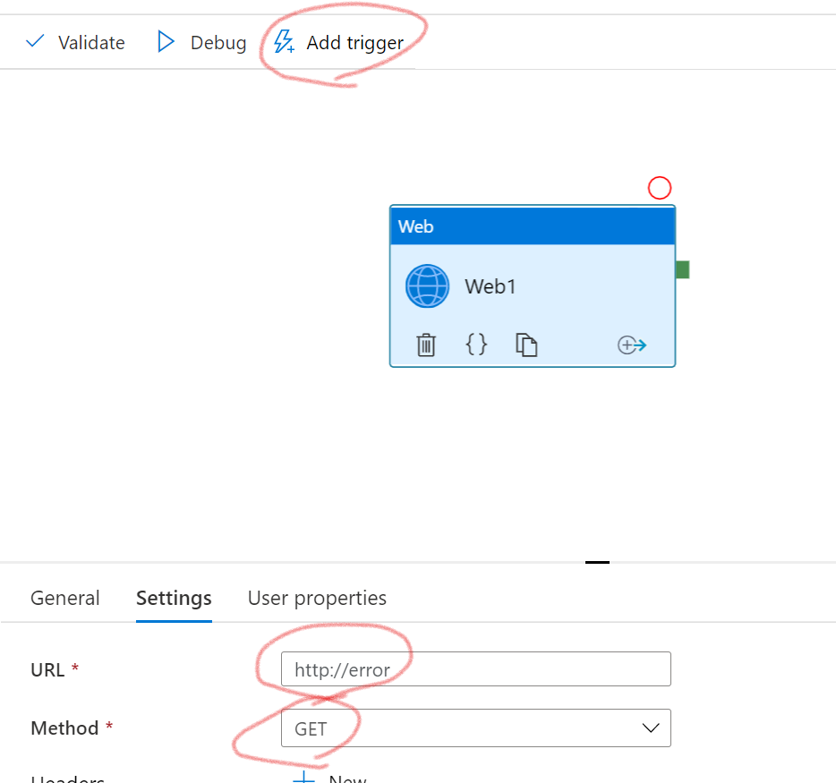
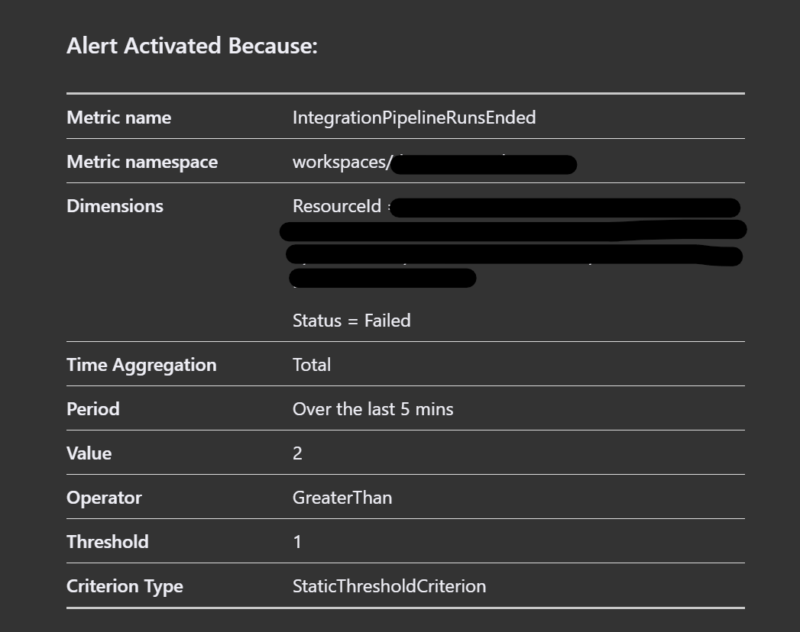

## はじめに

Azure Synapse Analytics ではPipelineのメトリックの種類がDataFactoryと異なり、Monitor統合がまだまだなのか、Pipelineの失敗アラート設定がdocsにも見当たらなかったので実装方法を案内します。

(2020/12時点の情報)

## メトリクスと設定内容について

以下のリンクから取得できるメトリックの情報を確認します。

https://docs.microsoft.com/ja-jp/azure/azure-monitor/platform/metrics-supported#microsoftsynapseworkspaces

OrchestrationTriggersEnded　からはトリガーの終了数と、ディメンション項目が取得可能です。

Resultには成功と失敗の内容が記録されますので、Result = Faildとなっているパイプライン実行の終了数が1より大きい場合にアラートが飛ぶようにしてみます。

今回は、さくっとテストするためにOrchestrationPipelineRunsEndedでやってみます。

## 手順
手順の概要

1. アラートの設定
2. 失敗するパイプラインの構成と実行
3. 確認

### 前提

事前にSynapse Analytics Workspaceをデプロイしておきましょう。

### 1. アラートの設定

はじめにメトリック画面で、「新しいアラートルール」をクリックします。

リソースが選択されていることを確認して、「条件の選択」をクリックします。

Pipeline runs endedを選択します。  
※Trigger実行に対してのアラートを設定するときはTrigger Runs Endedを選択してください

ディメンションで「Result」を選択して、ディメンションの値にはFailedを入力します。

しきい値を設定します。

次に「アクショングループの追加」選択します。

アクショングループの名前と、

通知設定を行います。

確認と作成をクリックして、アラートルール名を設定後、アラートの設定を完了します。

### 2. 失敗するパイプラインの構成と実行

今回はでたらめなurlにgetをおこなうwebアクティビティを配置しました。
どうやっても失敗します。
作成後、publishしてtrigger nowを実行します。

### 3. 確認

こんなメールが飛んできます。
カスタマイズするならwebhookやlogic appsなどと連携したほうがよいでしょう

