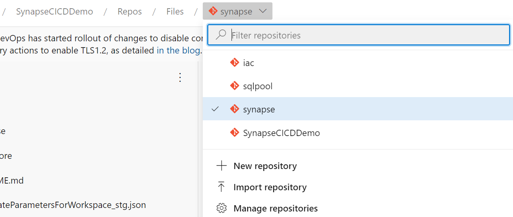

## はじめに

Synapse のupdateを眺めていたら、any branch でデプロイできるよ、との表示があったので試してみます。

## 参考

[Azure Synapse Analytics workspace成果物の Azure DevOps によるCI/CD【基本編(yamlパイプライン)】](https://qiita.com/ryoma-nagata/items/29a0183a14a8cee03924)

### any branch デプロイとは

要するに、発行ボタンを押さずともmaster/main ブランチなどのマージをトリガーにしてデプロイパイプラインが実行できるということです。

Data Factoryでは、新しい **CI/CDフロー** と呼ばれていました。
Data Factory の場合は以下の記事が丁寧です。

[Azure Data FactoryのCI/CDをAzure DevOpsで実装する](https://qiita.com/whata/items/7cad0c01e76d2f22e257#2-%E6%96%B0%E3%81%97%E3%81%84cicd%E3%81%AE%E3%83%95%E3%83%AD%E3%83%BC)

Synapseでは成果物をテンプレートに変えることが発行ボタンしかなかったのですが今回のアップデートでciパイプラインの中でテンプレート生成ができるようになりました。

### Synapse Deployment タスク

cicdパイプラインでは [Synapse-workspace-deployment](https://github.com/Azure/Synapse-workspace-deployment)　を利用します。

リンク先はgit hubアクションでの定義になっていますが、大体同じパラメータをDevOpsでも使用できます。

## 試してみる

例によってtemplate的に使えるGithubリポジトリを用意したのでこれを利用します。

### 前提条件

- 2つのSynapse Workspaceリソースを配置
- 双方のSynapse Workspace リソースで、DevOps用のサービスプリンシパルをSynapse 管理者に設定
- DevOpsサービス接続を作成済み
- DevOps Environment「STG」が作成済み

※ [SynapseCICD-HOL](https://github.com/ryoma-nagata/SynapseCICD-HOL)　を参照ください。

### Synapse Workspace × DevOps連携を構成

DevOpsで、**Import Repositry** を選択し、

　

[https://github.com/ryoma-nagata/SynapseCICD-template-workspace.git](https://github.com/ryoma-nagata/SynapseCICD-template-workspace.git) を取り込みます。

完了しました。

次に、Synapse Workspaceとこのリポジトリを紐づけます。

接続が完了し、既存の成果物がmainブランチにインポートされました。

### パラメータファイルの作成

発行ボタンを押して、ワークスペーステンプレートファイルを生成しておきます。

生成された **TemplateParametersForWorkspace.json** の内容をコピーしておきます。

任意のブランチ（例ではmain）　で、**TemplateParametersForWorkspace_stg.json**ファイルを作成をします。

※パラメータ内容は適宜更新しておきましょう。

### パイプラインの構成

**New pipeline** を選択

**Azure Repos Git ** を選択

インポートしたリポジトリを選択

**Existing Azure Pipelines YAML file** を選択

**azure-pipelines-ci-cd-synapse-artifacts.yml** を選択

変数を変更します。

- ARTIFACTS_FOLDER: Git構成をした際にRootFolderで設定した値から入力
- AZURE_RESOURCE_MANAGER_CONNECTION_NAME:使用するサービス接続名を入力
- TARGET_WORKSPACE_NAME_STG:デプロイ先のSynapse Woekspace名
- TARGET_RESOURCE_GROUP_NAME_STG:デプロイ先のSynapse Woekspaceが存在するリソースグループ名

私の環境だとこうなりました。

**Save and run** を選択

正常終了し、STG環境に成果物が反映されます。

### CI,CDパイプラインを分ける場合、

リリースは手動で実行したいというケースがあるので、分割版を作成しました。

#### CIパイプライン

パイプラインの作成時に、 **azure-pipelines-ci-synapse-artifacts.yml** を選択

Save後、URLからプロジェクト名とパイプラインのIDを確認しておきます。

例では
- ProjectName=SynapseCICDDemo
- PipelineId=29

となります。

#### CDパイプライン

パイプラインの作成時に、 **azure-pipelines-cd-synapse-artifacts.yml** を選択

各変数を設定

実行することで、CIパイプラインの最新の実行結果からArtifactをダウンロードし、デプロイに進みます。

以降は手動でリリースパイプラインとして利用可能となります。