## はじめに

Azure Data lake Storage Gen2 には、Blob / Data Lake のREST APIの口があるので、pipelineからMSI認証でデータを書き込んでみる

## モチベーション

copyアクティビィでRESTをソースに処理ができますが、たまにうまくパースされないレスポンスを返すサービスがあり、方法を探していました。

そこで以下の記事を見つけたのですが、認証方法に改善の余地があるので、MSI認証で通す方法を検討しました。

## Put Blob ※Blob APIの利用

非常に簡単です。
今回は、https://www.e-stat.go.jp/api/ からデータを取得してblobを書き込んでみようと思います。


### 準備

利用するのは、Synapse（マネージドVnet有効、データレイクにはファイアウォール設定あり）です。


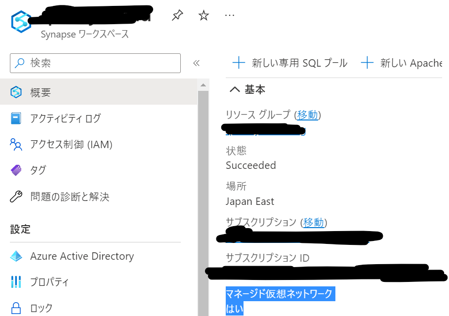

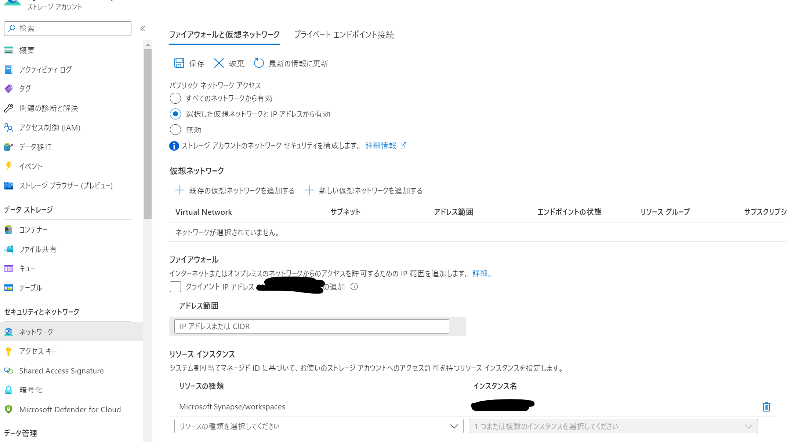


まずは、e-statのサイトでAPI登録を行い、APP_IDを入手します。

1.会員登録後、マイページからAPI機能(アプリケーションID発行)をクリックします。

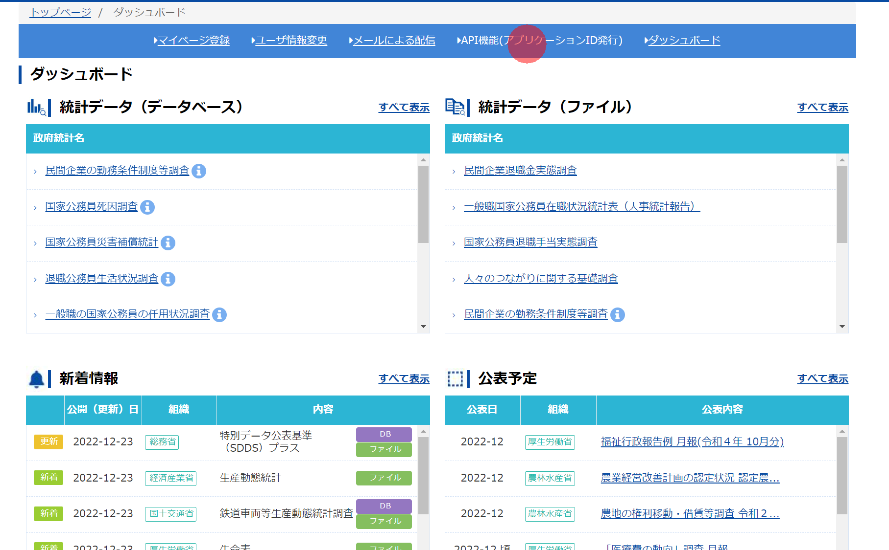

2.APPの情報を入力すると、APPIDが払い出されます。

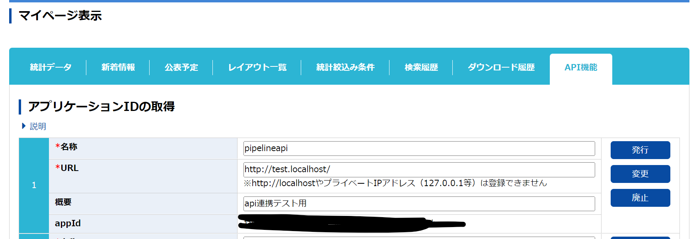

3.https://www.e-stat.go.jp/api/api-dev/how_to_use のページでサンプルがあるので、こちらをそのまま使います。URLパラメータにAPPIDを入れれば簡単に取得できる仕組みです。

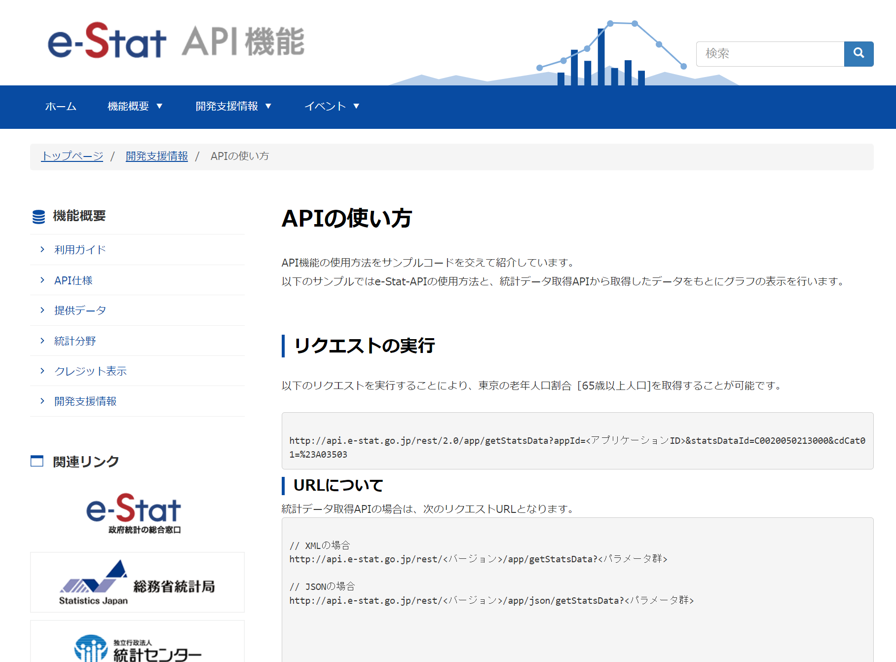

### 手順

1.PL_putblob_qiitaという名称で、パイプラインを作成します。{}ボタンから以下のコードを貼り付けます。

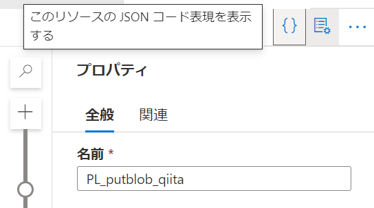


``` json:

{
    "name": "PL_putblob_qiita",
    "properties": {
        "activities": [
            {
                "name": "put blob",
                "type": "WebActivity",
                "dependsOn": [],
                "policy": {
                    "timeout": "0.12:00:00",
                    "retry": 0,
                    "retryIntervalInSeconds": 30,
                    "secureOutput": false,
                    "secureInput": false
                },
                "userProperties": [],
                "typeProperties": {
                    "url": {
                        "value": "https://@{pipeline().parameters.accountName}.blob.core.windows.net/@{pipeline().parameters.containerName}/@{pipeline().parameters.path}",
                        "type": "Expression"
                    },
                    "connectVia": {
                        "referenceName": "AutoResolveIntegrationRuntime",
                        "type": "IntegrationRuntimeReference"
                    },
                    "method": "PUT",
                    "headers": {
                        "x-ms-blob-type": "BlockBlob",
                        "x-ms-version": "2021-06-08"
                    },
                    "body": {
                        "value": "@pipeline().parameters.body",
                        "type": "Expression"
                    },
                    "authentication": {
                        "type": "MSI",
                        "resource": "https://storage.azure.com/"
                    }
                }
            }
        ],
        "parameters": {
            "accountName": {
                "type": "string"
            },
            "containerName": {
                "type": "string"
            },
            "path": {
                "type": "string"
            },
            "body": {
                "type": "object"
            }
        },
        "annotations": []
    }
}

```

貼り付けると今回作ったものが再現されます。


パラメータの内容は以下のようになっています。

- accountName: ストレージアカウント名
- containerName: コンテナの名前
- path: ファイルパス
- body: 書き込みたい内容

設定はこんな感じ

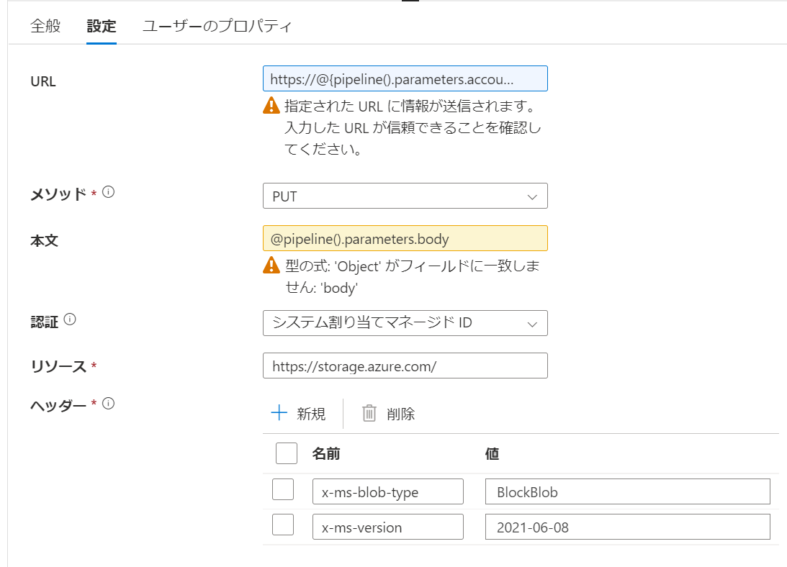

urlはパラメータからblobエンドポイント上のファイル名を作成するようになっています。

```

https://@{pipeline().parameters.accountName}.blob.core.windows.net/@{pipeline().parameters.containerName}/@{pipeline().parameters.path}

```


MSI認証でREST APIを実行するときは実行したい操作を管理しているリソースのエンドポイントのURLをリソースとして入力します。
今回はhttps://storage.azure.com/ でした。

参考：https://learn.microsoft.com/ja-jp/rest/api/storageservices/authorize-with-azure-active-directory#use-oauth-access-tokens-for-authentication

2.次にe-statsからデータを取得するためのパイプラインを作成し、webアクティビティを配置します。
内容は先ほど確認したサンプルURLを入れています。

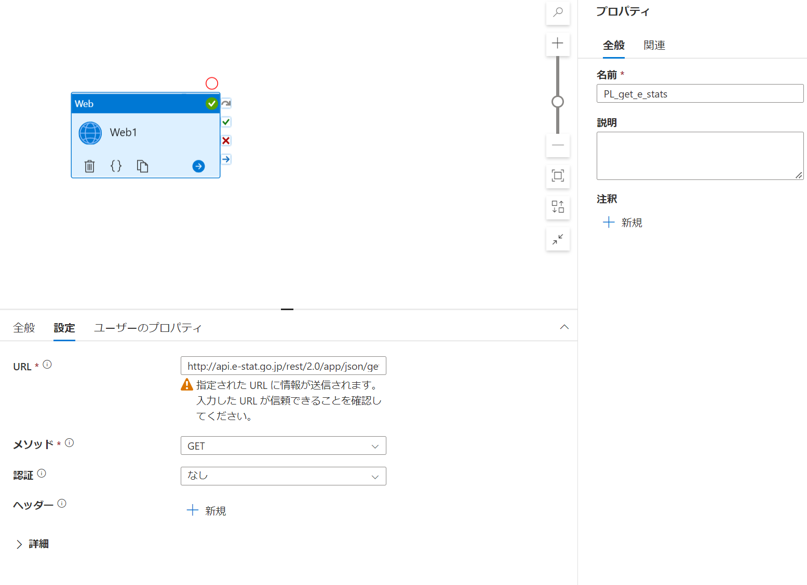

3.デバッグすると、出力結果からレスポンスの内容が確認できます。

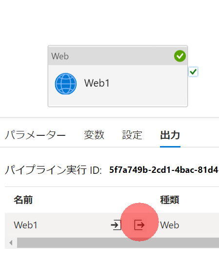

GET_STATS_DATAという部分に結果が出ています。

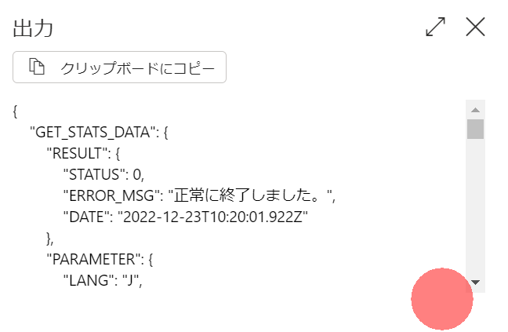

4.先ほど作成したPL_putblob_qiitaを実行するように構成します。

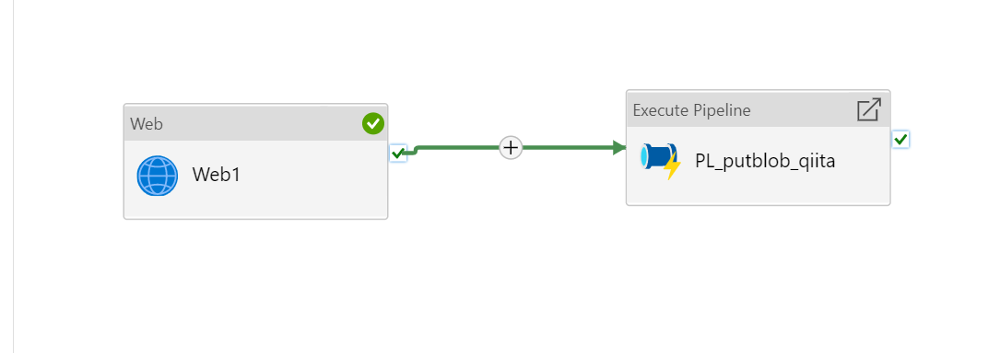

5.パラメータのbodyを動的なコンテンツで構成します。

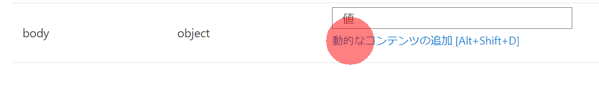

@activity('Web1').output.GET_STATS_DATA と入力してやります。

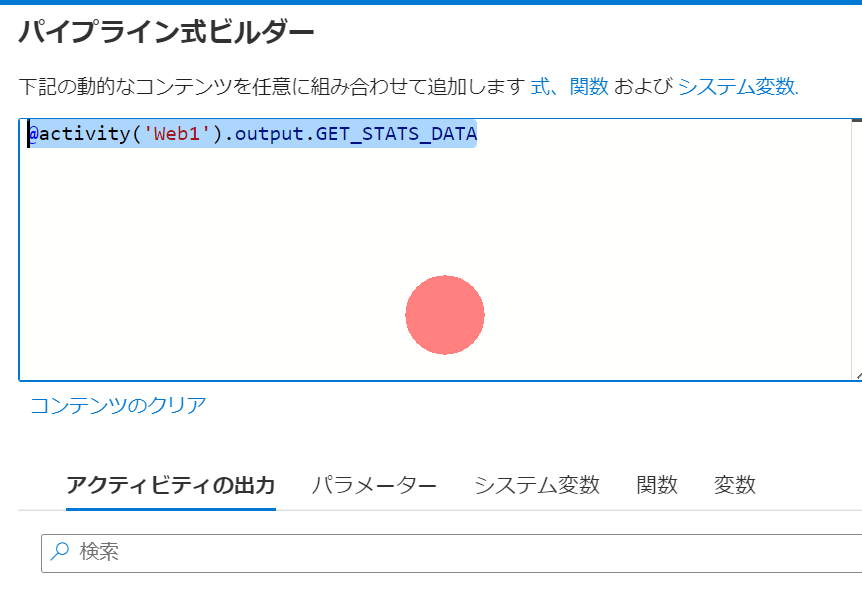

6.他のパラメータを入力してデバッグします。

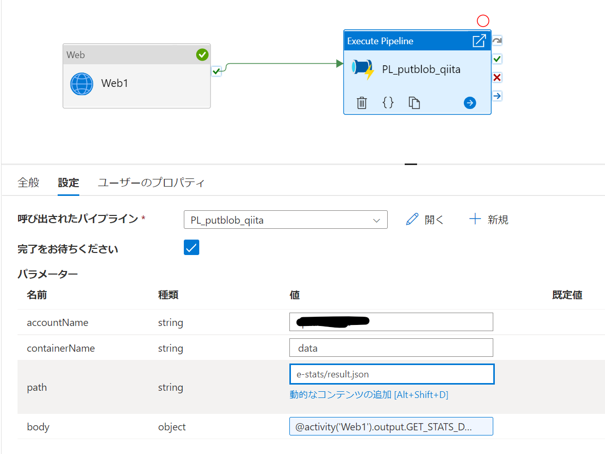


7.成功するとblobが書き込まれます。


## (供養) ※Data Lake APIの利用

こちらの方法はPipelineでは不適と判断しましたが、学びがあったのでメモだけ残します。

参考：
- https://techcommunity.microsoft.com/t5/azure-paas-blog/how-use-storage-adls-gen2-rest-api-to-upload-file-via-aad-access/ba-p/2108778
- 

Data Lake APIでのファイルの書き込み方法は以下の3ステップで行います

1.ファイルの作成(create)
2.ファイルの書き込み(append)
3.ファイルの書き込みのコミット＝フラッシュ(flush)

2で実際にデータを投入しますが、フラッシュしない限りファイルに反映されません。これが色々と厄介な仕様でした。

フラッシュ時には書き込んだバイト数を計算して、positionパラメータを指定しないと

>{"error":{"code":"InvalidFlushPosition","message":"The uploaded data is not contiguous or the position query parameter value is not equal to the length of the file after appending the uploaded data.

のようなエラーが返ります。今回e-statsからcontents-lengthが取れたので使いましたが、数字は一致せず。。。動的にpositionをとることはpipeline上では難しいという判断にいたりました。


なお、2のappendと同時にフラッシュするっぽいパラメータflush=trueはうまく動作しませんでしたので、私のわかる範囲だとこの3ステップが必須です。

内容は以下に供養します。　　
パイプライン名をPL_create_file_qiitaにして以下のコードを貼り付けて下さい

```json:


{
    "name": "PL_create_file_qiita",
    "properties": {
        "activities": [
            {
                "name": "create path",
                "type": "WebActivity",
                "dependsOn": [],
                "policy": {
                    "timeout": "0.12:00:00",
                    "retry": 0,
                    "retryIntervalInSeconds": 30,
                    "secureOutput": false,
                    "secureInput": false
                },
                "userProperties": [],
                "typeProperties": {
                    "url": {
                        "value": "https://@{pipeline().parameters.accountName}.dfs.core.windows.net/@{pipeline().parameters.filesystemName}/@{pipeline().parameters.path}?resource=file",
                        "type": "Expression"
                    },
                    "connectVia": {
                        "referenceName": "AutoResolveIntegrationRuntime",
                        "type": "IntegrationRuntimeReference"
                    },
                    "method": "PUT",
                    "authentication": {
                        "type": "MSI",
                        "resource": "https://storage.azure.com/"
                    }
                }
            },
            {
                "name": "append",
                "type": "WebActivity",
                "dependsOn": [
                    {
                        "activity": "create path",
                        "dependencyConditions": [
                            "Succeeded"
                        ]
                    }
                ],
                "policy": {
                    "timeout": "0.12:00:00",
                    "retry": 0,
                    "retryIntervalInSeconds": 30,
                    "secureOutput": false,
                    "secureInput": false
                },
                "userProperties": [],
                "typeProperties": {
                    "url": {
                        "value": "https://@{pipeline().parameters.accountName}.dfs.core.windows.net/@{pipeline().parameters.filesystemName}/@{pipeline().parameters.path}?action=append&position=0",
                        "type": "Expression"
                    },
                    "connectVia": {
                        "referenceName": "AutoResolveIntegrationRuntime",
                        "type": "IntegrationRuntimeReference"
                    },
                    "method": "PATCH",
                    "body": {
                        "value": "@pipeline().parameters.body",
                        "type": "Expression"
                    },
                    "authentication": {
                        "type": "MSI",
                        "resource": "https://storage.azure.com/"
                    }
                }
            },
            {
                "name": "flush",
                "type": "WebActivity",
                "dependsOn": [
                    {
                        "activity": "append",
                        "dependencyConditions": [
                            "Succeeded"
                        ]
                    }
                ],
                "policy": {
                    "timeout": "0.12:00:00",
                    "retry": 0,
                    "retryIntervalInSeconds": 30,
                    "secureOutput": false,
                    "secureInput": false
                },
                "userProperties": [],
                "typeProperties": {
                    "url": {
                        "value": "https://@{pipeline().parameters.accountName}.dfs.core.windows.net/@{pipeline().parameters.filesystemName}/@{pipeline().parameters.path}?action=flush&position=@{pipeline().parameters.position}",
                        "type": "Expression"
                    },
                    "connectVia": {
                        "referenceName": "AutoResolveIntegrationRuntime",
                        "type": "IntegrationRuntimeReference"
                    },
                    "method": "PATCH",
                    "headers": {
                        "content-length": {
                            "value": "0",
                            "type": "Expression"
                        }
                    },
                    "body": "",
                    "authentication": {
                        "type": "MSI",
                        "resource": "https://storage.azure.com/"
                    }
                }
            }
        ],
        "parameters": {
            "accountName": {
                "type": "string"
            },
            "filesystemName": {
                "type": "string"
            },
            "path": {
                "type": "string"
            },
            "body": {
                "type": "string",
                "defaultValue": "test"
            },
            "position": {
                "type": "int",
                "defaultValue": 4
            }
        },
        "variables": {
            "respheader": {
                "type": "String"
            }
        },
        "annotations": []
    }
}

```