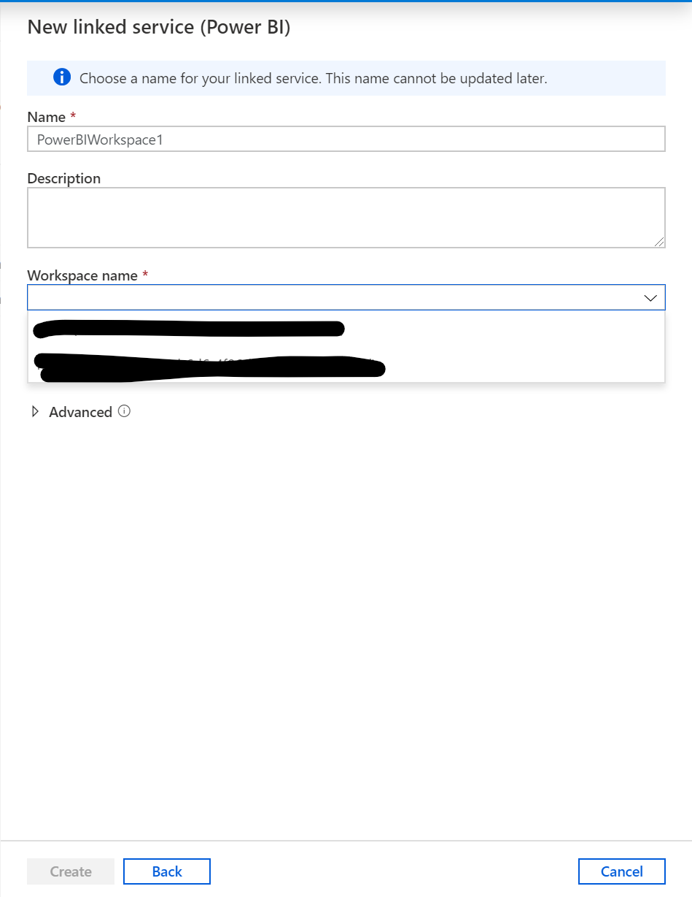

# 外部テナントのAzure Synapse AnalyticsでPower BI連携をする方法

<!-- TOC -->

- [外部テナントのAzure Synapse AnalyticsでPower BI連携をする方法](#外部テナントのazure-synapse-analyticsでpower-bi連携をする方法)
  - [はじめに](#はじめに)
  - [再現状況](#再現状況)
    - [Linked Service 作成時にOffice 365テナントで作成されたPower BI Workspaceは表示されません](#linked-service-作成時にoffice-365テナントで作成されたpower-bi-workspaceは表示されません)
  - [考察](#考察)
  - [回避手順](#回避手順)
  - [参考](#参考)

<!-- /TOC -->

## はじめに

以下の記事でPower BI の利用について記載しましたが、Office 365 AADテナントとAzure 開発用のAADテナントが分かれている環境で少し詰まったので共有します。

## 再現状況

hoge.com　= Office365テナント
fuga.com = Azure Synapse Analyticsのデプロイされたテナント
A@hoge.comさん = 普段はhoge.com内で、Outlookやteamsを利用しており、開発時にfuga.comで契約したAzure環境を利用しています。
B@fuga.comさん = この作業のために使用するユーザです。

この状況で、A@hoge.comさんがPower BI Linked Serviceを作成しようとするとこのような問題が発生します。

### Linked Service 作成時にOffice 365テナントで作成されたPower BI Workspaceは表示されません

## 考察

Azure Synapse AnalyticsをデプロイしたAADテナントが普段利用するOffice365用のテナントとは異なる場合、Linked Serviceを構成できません。
これは選択対象のPower BI WorkspaceがAzure Synapse Analyticsの属するAADテナントでの検索結果からになるためと考えられます。

## 回避手順

1. Azure Synapse Analyticsをデプロイしたテナントに所属するユーザ(B@fuga.com)でPower BI Workspaceを作成します。
2. コンテンツの作成を許可したいユーザ(A@hoge.com)を招待し、権限を設定します。
3. Azure Synapse Analytics Studioから表示されるようになります。

## 参考

[Azure AD B2B で外部ゲスト ユーザーに Power BI コンテンツを配布する](https://docs.microsoft.com/ja-jp/power-bi/admin/service-admin-azure-ad-b2b)