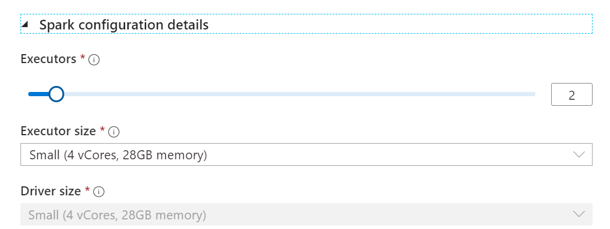
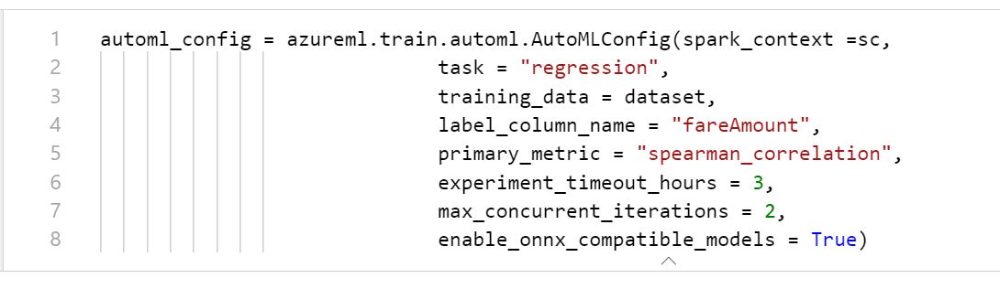
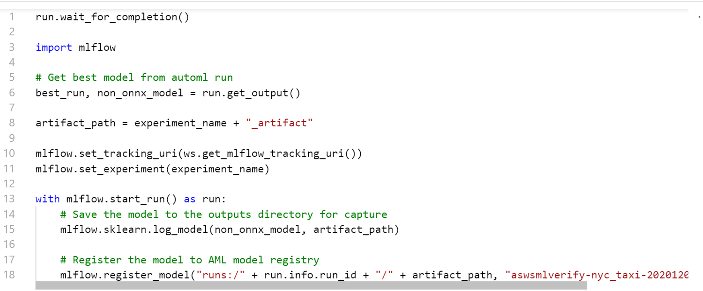
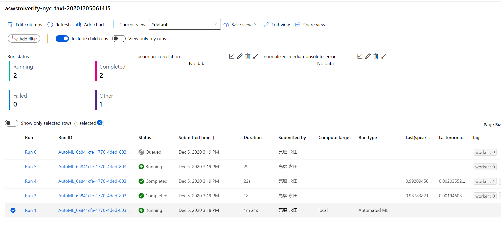
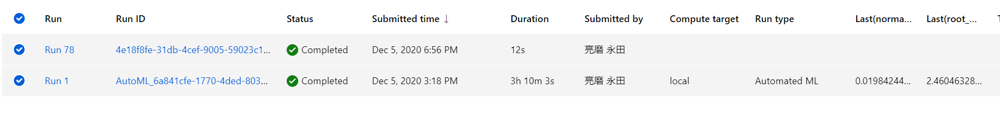
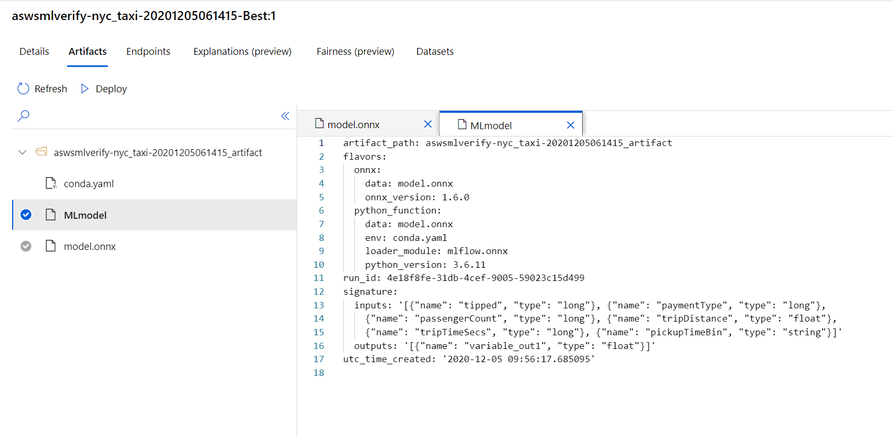
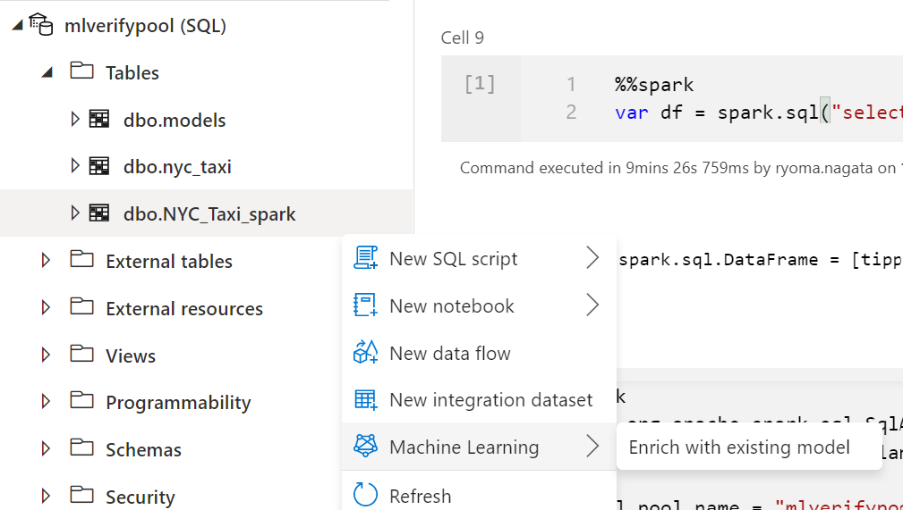
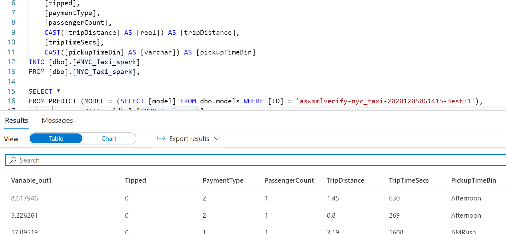

# AzureSynapseAnalyticsで機械学習を利用しよう② AutoML利用時のモデル学習とスコアリングの方式の整理

## はじめに

前回はAzure Syuapse Analytics(以下、Synapse)とAzure Machine Learning(以下、Azure ML) 連携の基本的な流れを検証しました。

スコアリングがGUIで実行できるということを検証しましたが、今回はモデルの学習部分にフォーカスし、チュートリアル＋αの紹介をしたいと思います。

(2020/12時点の情報です)

## Synapse Studio のAuto ML呼び出しについて

Azure MLにはAutoML機能が備わっており、Synapse Studioからこれを呼び出してAutoMLを利用したモデル学習が可能です。

Auto ML の実行方式として、GUI と Pytho SDKを利用するものがあります。

### GUI

Azure ML StudioにもGUIでのAuto ML ウィザードがありましたが、Synapse Spatkにも登場しています。

[Tutorial: Code free machine learning model training in Azure Synapse with AutoML (Preview)](https://docs.microsoft.com/ja-jp/azure/synapse-analytics/machine-learning/tutorial-automl)

### Python SDK

Synapse Sparkから、Azure ML Python SDKを利用して実行します。

[チュートリアル:Azure Automated ML と Apache Spark を使用した実験の実行](https://docs.microsoft.com/ja-jp/azure/synapse-analytics/spark/apache-spark-azure-machine-learning-tutorial)

## Synapse Workspaceを中心とした Auto ML 連携について

色々方式があって混乱しそうですが、現時点でとれるAuto ML連携の方式について整理します。

### スコアリング

以下の２つになるかと思います。

1. SQL PoolのスコアリングウィザードでモデルをSQL Poolに登録して、スコアリングを実行する  
   ONNXモデル、かつMLflowで登録されている必要あり
2. Synapse Spark上でモデルをロードしてスコアリングを実行する  
   柔軟ですが、定期的な実行では即時性にかける点がありそうです。（Synapse Sparkの呼び出しから実行に数分のオーバヘッドがあるため）

どこで保持されているデータに対してスコアリングを行いたいか、どの程度実行時間を見込めるかで決めるとよさそうです。

### モデル学習

上記のスコアリングを踏まえて以下の候補を検討します。

1. Azure ML SDKを使ってAuto ML を実行する  
   こちらはSynapse Studio、Azure ML Compute Instance、ローカル環境で実行可能です。スコアリングでSQL Poolを利用するのであれば、onnxおよびML FLowの利用について注意が必要です。  
   また、Auto ML を利用しない場合でもこちらの方式になるかと思います。
2. Synapse Studio上のAutoML ウィザードを利用する  
   新機能です。非常に簡単にAuto ML学習が可能です。ただし、学習環境がSynapse Sparkとなります。
3. Azure ML Studio上のAuto MLウィザードを利用する  
   実行条件をある程度制御できるようになっていますが、onnxとしての登録と、スコアリングが現時点で利用できないので、SQL Pool上でスコアリングするのであれば不可となるでしょう。

モデル学習についてもスコアリングをどうするかで決めるのがよいでしょう。

#### パイプライン化について

定期的に学習とスコアリングを処理する場合、Synapse Sparkを利用してAzure ML を実行するような形にすると、結構使い勝手がよさそうです。  
AzureMLにもパイプラインという機能がありますが、なかなか難解な一方でnotebook形式となるSynapse Sparkは簡単に始めることができます。  
Azure ML のパイプラインはmini_batchというような並列学習処理を組むことができるので、多数の製品それぞれに対するモデル作成が必要なケースなどで使い分けるのがよいでしょう。


## 検証

では、「Synapse Studio上のAutoML ウィザード」を検証します。
チュートリアルではスコアリングまでやっていなかったので、SQL Poolでのスコアリングまで検証してみます。

### Synapse Studio上のAutoML ウィザード

[Tutorial: Code free machine learning model training in Azure Synapse with AutoML (Preview)](https://docs.microsoft.com/ja-jp/azure/synapse-analytics/machine-learning/tutorial-automl)

#### モデル学習～登録

学習までは、チュートリアル通り実施します。
spark configurationはこんな感じ



ちなみに学習のコードは確認可能です。

AutoML Config  



MLFlow  
なんとMLflowでモデル登録してくれています。おそるべしSynapse Studio・・・




実行すると、Azure ML StudioでAutoMLが開始されます。


compute target がLocal Runとなっているので、Azure ML 上の計算リソース(Computing Cluster)ではなく、Synapse Spark上でAuto MLが実行されていることがわかります。  
このあたりはAutoMLの並列処理に影響があるかと思いましたが、chird runのtagにworker番号がふられていますね。うまく並列化されているようです。おそるべし・・・

完了すると、MLFlowのモデル登録がRunとして記録されています。(時間制限を既定にしたので3時間まるまる実行してしまいました・・・)




MLflowでモデル登録されたため、artifactにinputs,outputsの情報が載っています



#### スコアリング

SQL Poolでスコアリングをする場合、SQLPoolへのデータのロードが必要です。
Synapse Analytics APIを利用してSpark テーブルをSQL Poolにロードします。

``` :pyspark

%spark
// Create Dataframe
var df = spark.sql("select * from NYC_Taxi")

import org.apache.spark.sql.SqlAnalyticsConnector._
import com.microsoft.spark.sqlanalytics.utils.Constants

val sql_pool_name = "mlverifypool" // SQL pool 名
// SQL Poolへロード
df.write.sqlanalytics(s"$sql_pool_name.dbo.NYC_Taxi_spark", Constants.INTERNAL)

```

スコアリングウィザードを利用してスコアリングが可能となります。



結果はこちら。楽ちんです。

