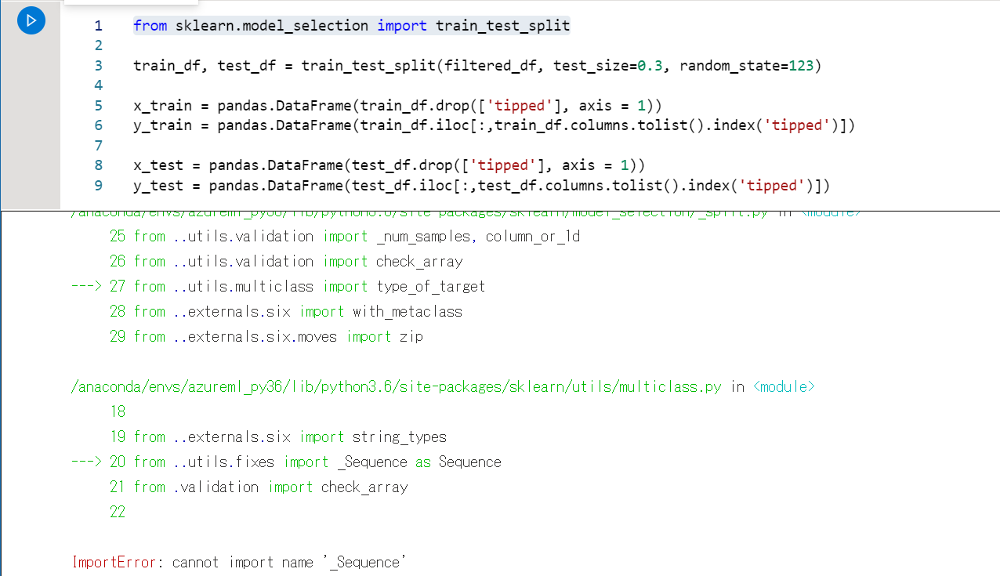
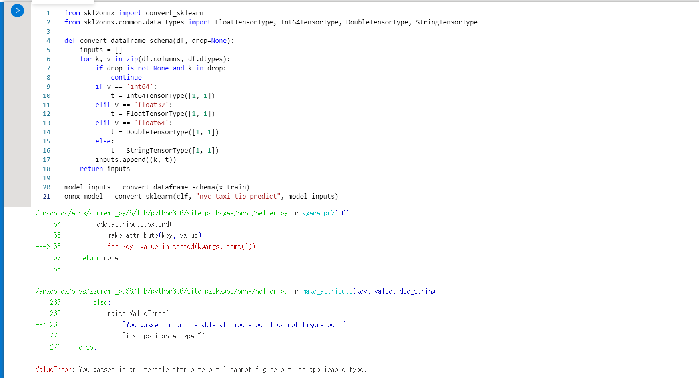
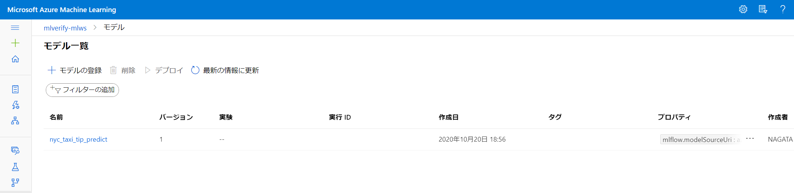
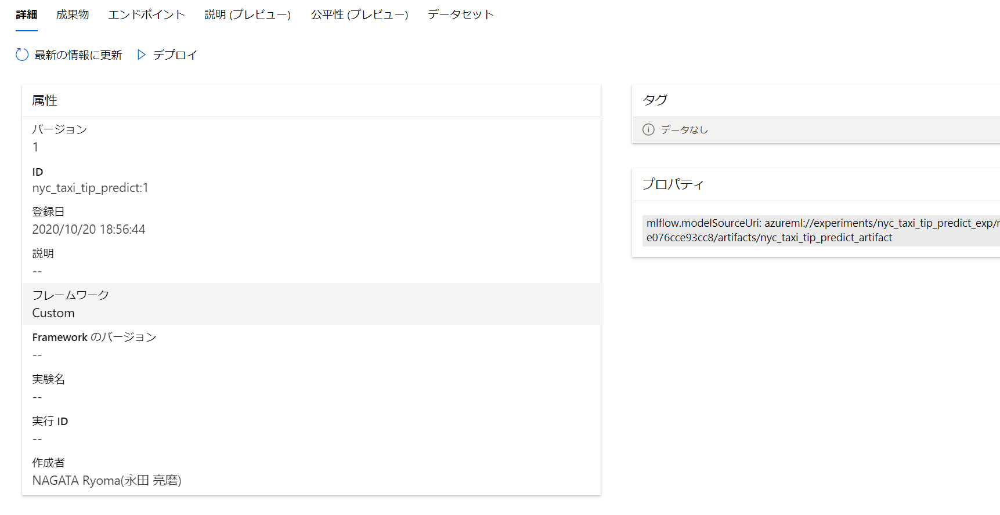
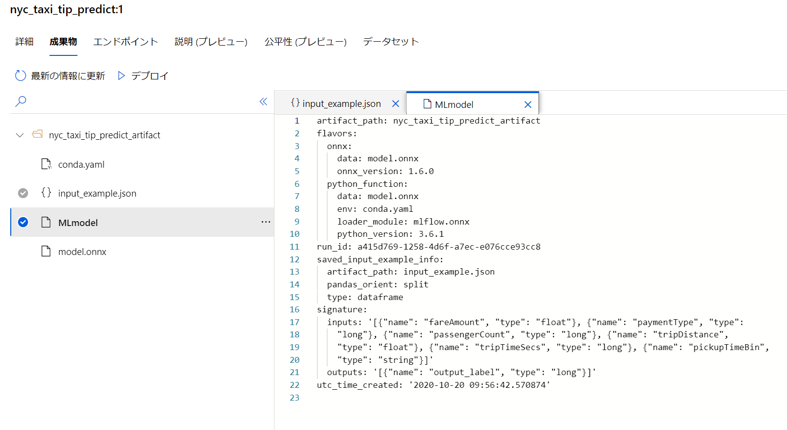

# AzureSynapseAnalyticsのAzureML連携を試してみる（試行錯誤記）

## はじめに

Azure Synapse Analytics(以下、ASA)上でのMLの利用について[Azure Synapse Analytics の Machine Learning 機能 (ワークスペース プレビュー)](https://docs.microsoft.com/ja-jp/azure/synapse-analytics/machine-learning/what-is-machine-learning)に記載されているような概要で機能が形になってきました。

今回はMLワークロードの中でもDWHデータに対するスコアリングができる[チュートリアル:Synapse SQL プール向けの機械学習モデル スコアリング ウィザード](https://docs.microsoft.com/ja-jp/azure/synapse-analytics/machine-learning/tutorial-sql-pool-model-scoring-wizard)で案内されているウィザードを使った結果を記載したいと思います。

この記事では上記のチュートリアルで紹介されているトレーニングのノートブック以外に、AutoMLのモデルを作った結果についても記します。

### スコアリング ウィザードについて

GUIでT-SQLのスコアリングスクリプトが生成されます。
特に、モデルへのInput、Outputが定義されている場合、テーブルの列とモデルへのマッピングがGUIでガイドされます。


## スコアリング ウィザード利用時に必要な仕様理解

注意しておくべき仕様をまとめました。MLflowの利用については私もさほど詳しくないので、ここでは割愛します。

1. 現状、Synapseから認識できるAzureMLのモデルはonnx形式のみです。ONNXモデル以外は選択肢として表示されません。
2. 現状 Azure MLの Auto MLではGUIでonnxモデルの作成ができません。
3. テーブルの列とモデルへのマッピングを使うためにはモデル登録にML Flowを利用する必要があります。

特に改善してほしいのは、1,2ですが、2については、GUIでもできるようにしてほしいところです。「ONNX モデルの互換性を有効または無効にする」が対応していない状況となっています。

[モデルの設定](https://docs.microsoft.com/ja-jp/azure/machine-learning/concept-automated-ml#model-settings)

>| |Python SDK|Studio Web エクスペリエンス|
>|----|:----:|:----:|
>|**最適なモデルの登録、デプロイ、説明可能性**| ✓|✓|
>|**投票アンサンブルとスタック アンサンブル モデルを有効にする**| ✓|✓|
>|**プライマリ メトリック以外に基づいて最適なモデルを表示する**|✓||
>|**ONNX モデルの互換性を有効または無効にする**|✓||
>|**モデルのテスト** | ✓| |

## モデル構築環境について

スコアリングウィザードを利用する際のモデルの訓練から登録について、チュートリアルのモデル学習～登録のNotebookを実行する環境として以下のパターンで試しました。

1. Azure ML Compute Instance上でモデル学習～登録(チュートリアル通り)
2. Spark Notebook上でモデル学習～登録

2については実際にSynapseを利用する際にはあるパターンかなと思って試しています。データの準備からモデル構築までをシームレスに実行できるようなイメージです。

## 準備

それぞれ環境を準備して、linked Serviceを作成しておきます。

[クイック スタート:Synapse ワークスペースを作成する](https://docs.microsoft.com/ja-jp/azure/synapse-analytics/quickstart-create-workspace)
[クイック スタート:Azure portal を使用して新しい Apache Spark プールを作成する](https://docs.microsoft.com/ja-jp/azure/synapse-analytics/quickstart-create-apache-spark-pool-portal)
[クイック スタート:Azure portal を使用して Synapse SQL プール (プレビュー) を作成する](https://docs.microsoft.com/ja-jp/azure/synapse-analytics/quickstart-create-sql-pool-portal)
[チュートリアル:Jupyter Notebook で Azure Machine Learning の作業を開始する](https://docs.microsoft.com/ja-jp/azure/machine-learning/tutorial-1st-experiment-sdk-setup)

[クイック スタート:Synapse で Azure Machine Learning のリンクされたサービスを新規作成する](https://docs.microsoft.com/ja-jp/azure/synapse-analytics/machine-learning/quickstart-integrate-azure-machine-learning)※コンピューティングインスタンスを作成するのみです。

## チュートリアル通りにやってみる

### 1st try Azure ML Compute Instance上でモデル学習～登録(チュートリアル通り)

pip list 上のscikit-learnのversionが指定と違ったので、importしなおして実行したところ、エラー・・・

> from sklearn.model_selection import train_test_split

がこけるという・・・



### 2st try Azure ML Compute Instance上でモデル学習～登録(チュートリアル通り)

気を取り直して、version変更をせずに実行


エラー！
> onnx_model = convert_sklearn(clf, "nyc_taxi_tip_predict", model_inputs)
> 
がこけました。鬼門となりそうです。



### 3rd try Spark Notebook上でモデル学習～登録

トラシューするときりがないので、Synapse上でやってみます.  
ライブラリのバージョンは一旦無視します。

ただし、mlflowはSynapse Sparkにはビルトインされていないようなので、以下の内容のrequirements.txtを用意してSynapse Sparkのパッケージ追加を行い、トライします

```:
azureml-mlflow
mlflow
```

Azure ML にonnxモデルが登録されました。AzureMLのエラーはなんだったのでしょう

一覧


詳細


成果物


このinput_exampleや、signatureが用意されていることが非常に重要でした。  
これがないと上述の**マッピング機能が利用できません**。MLFlowでの登録はこの作成をしてくれるようです。

さて、Synapse の確認ですが、この状態であれば、SQL Poolからも利用ができ、マッピングも用意されています。


### 4rd try Spark Notebook上でモデル学習～登録

