# AzureSynapseAnalyticsのPowerBI連携を試してみる

<!-- TOC -->

- [AzureSynapseAnalyticsのPowerBI連携を試してみる](#azuresynapseanalyticsのpowerbi連携を試してみる)
  - [はじめに](#はじめに)
  - [手順](#手順)
    - [SQL Poolの準備](#sql-poolの準備)
    - [Power BI Linked Serviceの作成](#power-bi-linked-serviceの作成)
    - [Power BI Datasetの作成と発行](#power-bi-datasetの作成と発行)
    - [Synapse Studioでのレポート発行](#synapse-studioでのレポート発行)

<!-- /TOC -->

## はじめに

Azure Synapse Analytics

## 手順

以下の流れになります。
1. SQL Poolの準備
2. Power BI Linked Serviceの作成
3. Power BI Datasetの作成と発行
4. Synapse Studioでのレポート発行
   
### SQL Poolの準備

レポート作成のためのDBを用意します。

1. Synapse Studio画面右上のGetting Start Hubを起動します。
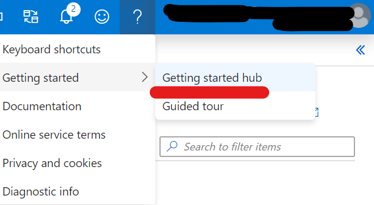

2. "Query Data"をクリックするとSQL Poolが作成されます。

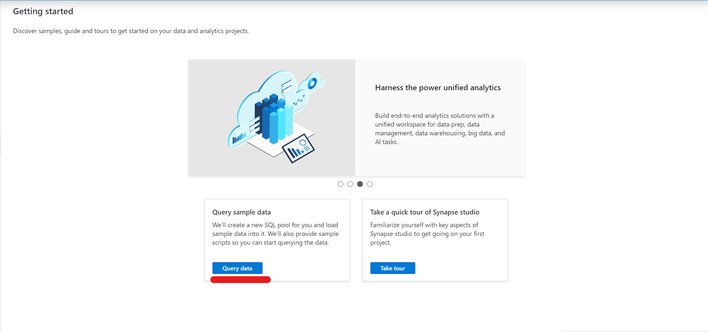

作成中...
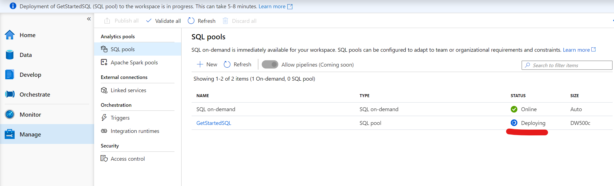

### Power BI Linked Serviceの作成

Synapse Studio上でPower BI への接続を構成します。

1. 「Managed Hub」-> 「Linked Service」-> 「+New」の順でクリックすると、Power BI への接続が表示されます。

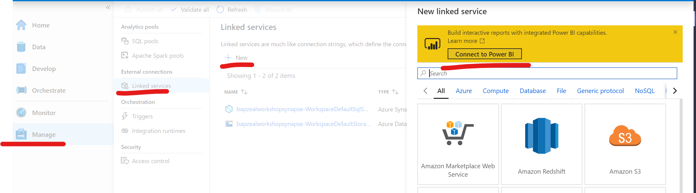

"Connect"をクリックすることでLinked Serviceの作成画面に移ります。

2. リンクしたいPower BI Workspaceを選択して作成します。

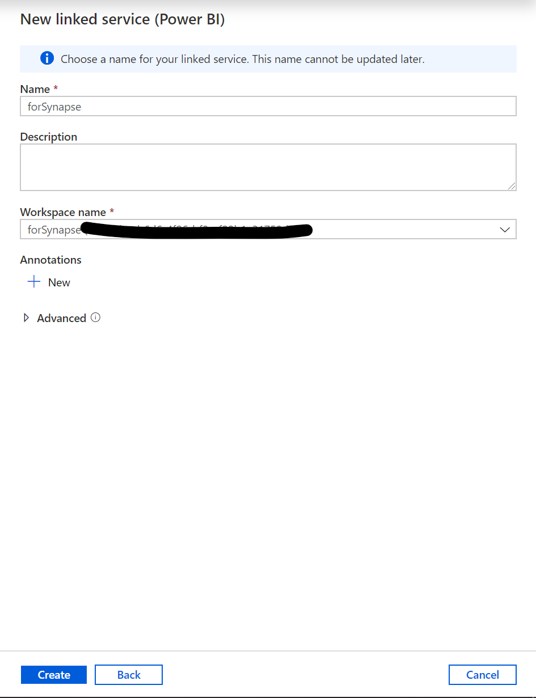

作成後

**※注意**
現時点（2020/5）ではPower BI のLinked ServiceはSynapse Analytics Workspaceにつき一つしか作成できないようです。

### Power BI Datasetの作成と発行

作成したSQL Poolに接続されるDatasetを作成します。

1. 「Develop hub」->「Power BI datasets」->「New Power BI Dataset」の順にクリックします
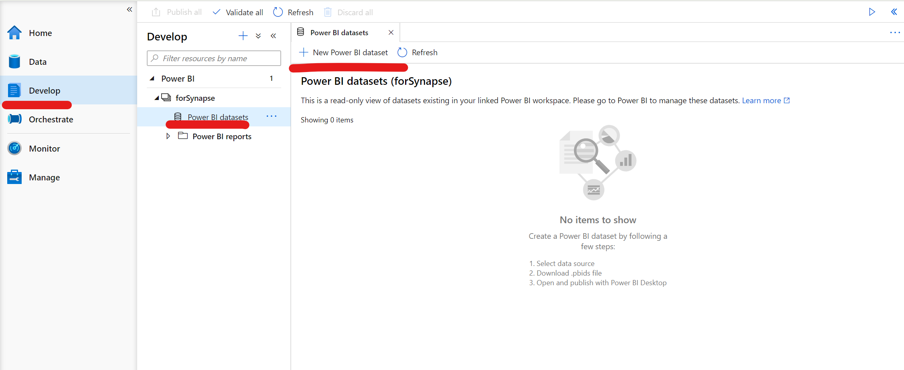

2. .pbidsファイルをダウンロードします。

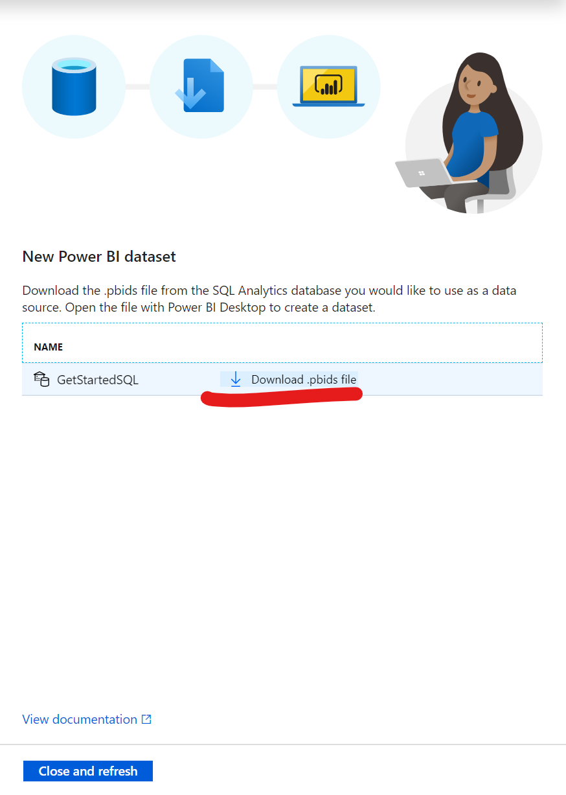

pbidsについては下記記事を参照ください
[Power BIの.pbix,.pbit,.pbids拡張子について](https://qiita.com/ryoma-nagata/items/5bc3a16973366f61ffed)

3. ファイルを開くと、認証を要求されます。マイクロソフトアカウントで認証しましょう

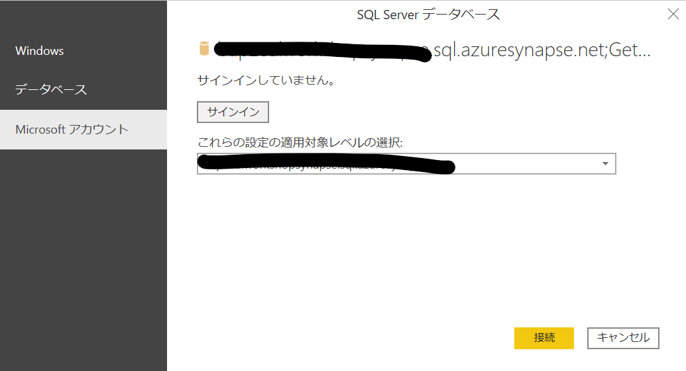

4. 認証後は、とりあえず全てのテーブルを読み込みます

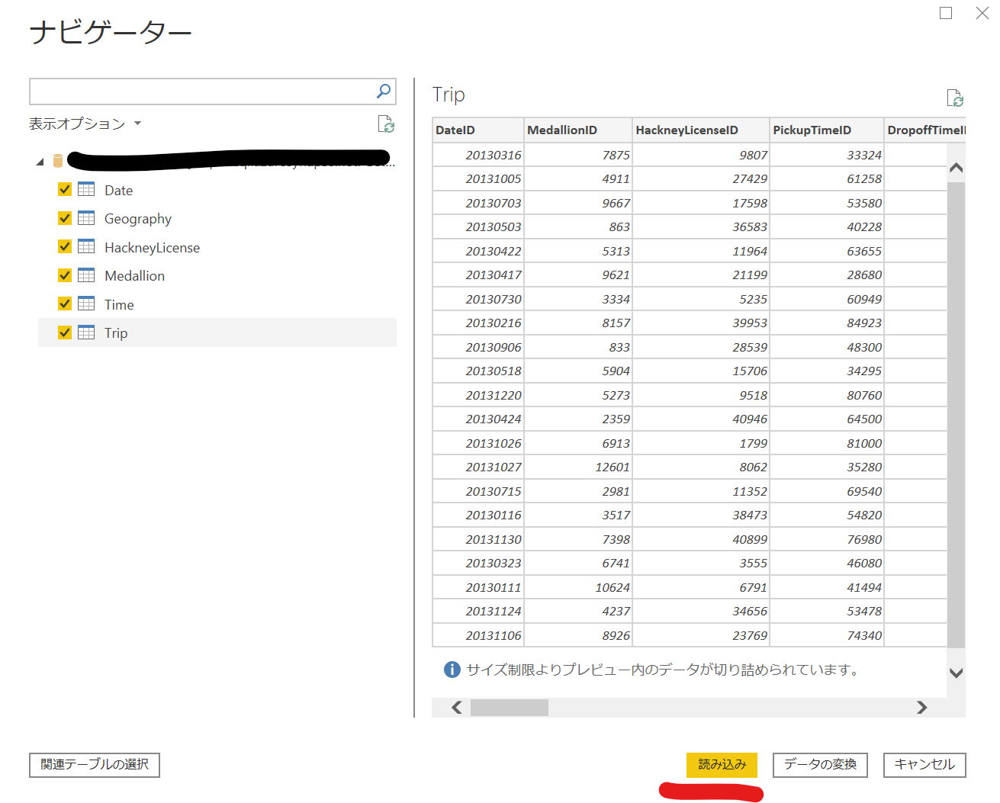

5. テーブルが読み込めたら発行します
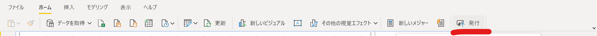

**※注意**

Direct Queryを利用する場合、一度Power BI Service画面からデータセットの接続の構成を設定する必要があります。

Power BI データセット管理画面
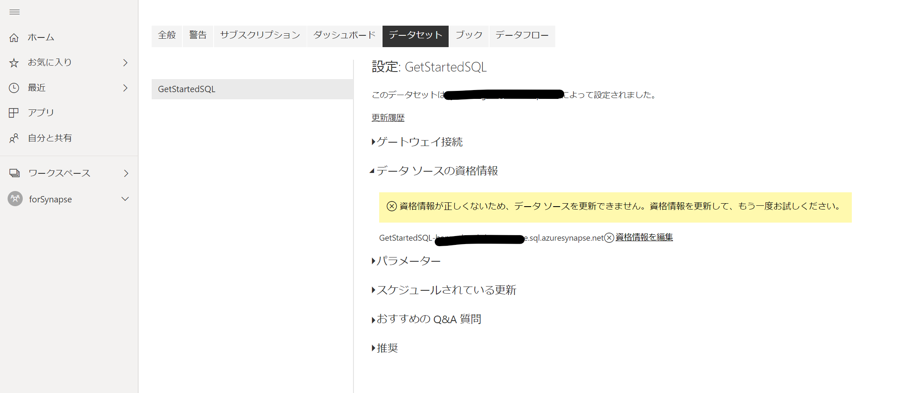

### Synapse Studioでのレポート発行
Synapse Studioで先ほど発行したデータセットをベースにレポート作成をします。

1. Develop Hubに戻ると発行したデータセットからレポート作成のボタンが利用できます
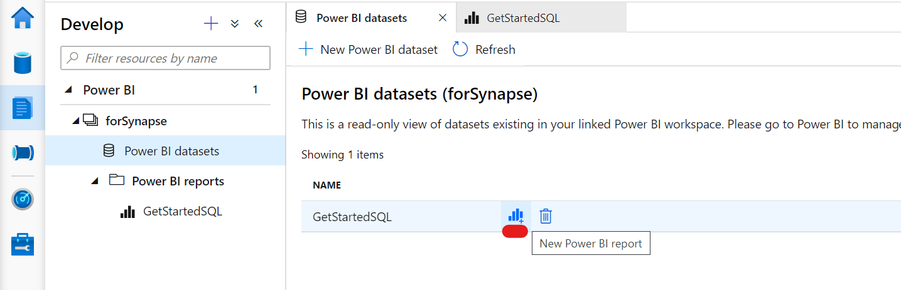

2. 適当なレポートを作成します。（今回はモデリングをしなかったので単純なmapを作りました。

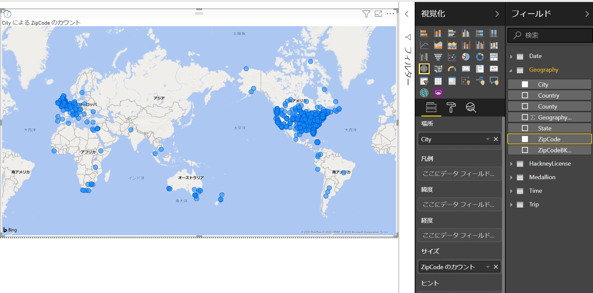

3. 名前を付けて保存します。
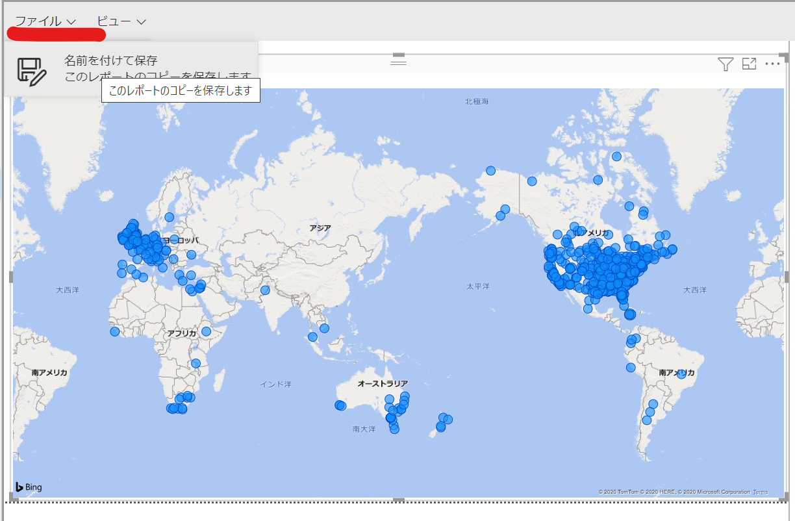

4. Power BI Service側からも確認可能です
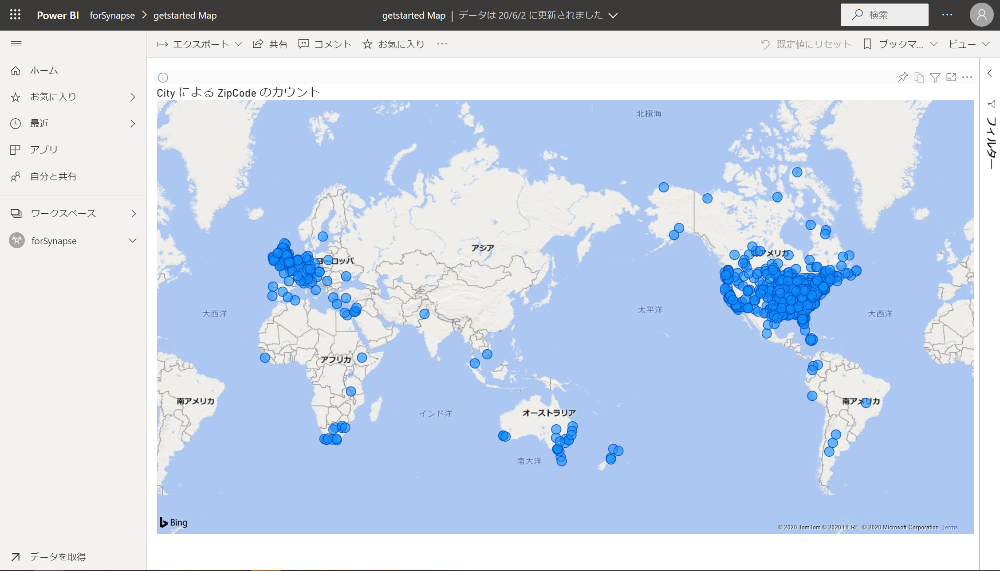