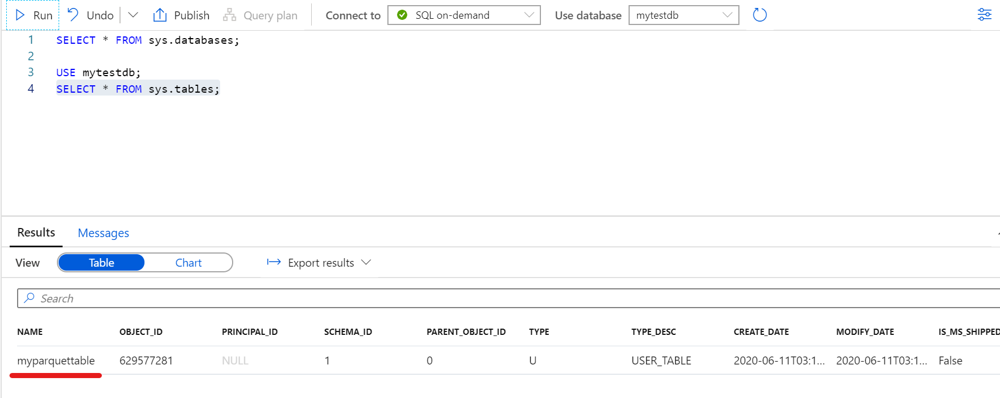

# AzureSynapseAnalyticsのメタデータ共有についてわかったこと

<!-- TOC -->

- [AzureSynapseAnalyticsのメタデータ共有についてわかったこと](#azuresynapseanalyticsのメタデータ共有についてわかったこと)
  - [はじめに](#はじめに)
    - [メタデータ共有](#メタデータ共有)
    - [参考リンク](#参考リンク)
  - [共有データベース](#共有データベース)
    - [サンプルコードと挙動](#サンプルコードと挙動)
  - [共有メタデータ テーブル](#共有メタデータ-テーブル)
    - [サンプルコードと挙動](#サンプルコードと挙動-1)
      - [マネージドテーブル](#マネージドテーブル)
      - [データ挿入](#データ挿入)
      - [外部テーブル](#外部テーブル)

<!-- /TOC -->

## はじめに

Synapse Analyticsで個人的に強力と考えている機能の一つにSpark PoolとSQL Pool間のメタデータ共有があります。

2020/6時点ではSQL On-demandのみの機能です。

### メタデータ共有

Sparkで作成したテーブル、データベースにSQL On-demandからDBオブジェクトのようにアクセスが可能な機能です。

※逆にSpark APIからSQLのテーブルを取得、作成する、SQLAnalyticsAPIという機能も提供されています。

下記のように、SQLのオブジェクトと同様の並びにSparkのオブジェクトが並んでいます。


### 参考リンク
[Azure Synapse Analytics の共有メタデータ](https://docs.microsoft.com/ja-jp/azure/synapse-analytics/metadata/overview)
[Azure Synapse Analytics の共有データベース](https://docs.microsoft.com/ja-jp/azure/synapse-analytics/metadata/database)
[Azure Synapse Analytics の共有メタデータ テーブル](https://docs.microsoft.com/ja-jp/azure/synapse-analytics/metadata/table)

## 共有データベース

SQL On-demandからスパークで作成した**DB**にアクセスする機能を指します。

### サンプルコードと挙動

参考リンクのコードをそのまま動かします

```python:pyspark
spark.sql("CREATE DATABASE mytestdb")
```

作成したDBがSQL PoolのDBと同列の位置に表示されます。


SQL On-demandからSQL文でデータベースのリストを表示した場合

```sql:sql
SELECT * FROM sys.databases;
```


## 共有メタデータ テーブル

SQL On-demandからスパークで作成したテーブルにアクセスする機能を指します。

> Spark には、Azure Synapse によって自動的に SQL で公開されるテーブルが 2 種類あります。
>
> ・マネージド テーブル
>
> Spark には、テキスト、CSV、JSON、JDBC、PARQUET、ORC、HIVE、DELTA、LIBSVM など、マネージド テーブルにデータを格納するためのオプションが多数用意されています。 これらのファイルは通常、マネージド テーブル データが格納される warehouse ディレクトリに格納されます。
>
> ・外部テーブル
> 
> Spark では、LOCATION オプションを指定するか、Hive 形式を使用することにより、既存のデータに対して外部テーブルを作成することもできます。 このような外部テーブルは、Parquet などのさまざまなデータ形式にできます。


### サンプルコードと挙動

#### マネージドテーブル

```python:pyspark
spark.sql(
    "CREATE TABLE mytestdb.myParquetTable\
    (id int \
    ,name string \
    ,birthdate date\
    )\
    USING Parquet"\
)
```

作成したテーブルが一覧に表示されます。


SQL On-demandからSQL文でテーブルのリストを表示した場合

```sql:sql
USE mytestdb;
SELECT * FROM sys.tables;
```


#### データ挿入 

```python:pyspark

from pyspark.sql.types import StructType,DoubleType, IntegerType, StringType, StructField, DateType
from pyspark.sql.functions import to_date

#Create Schema
schema = StructType([
    StructField("id",IntegerType())
    ,StructField("name",StringType())
    ,StructField("datestr",StringType())
])
#Create Data
data = [(1, 'a','2020-06-10'), (2, 'b', '2020-06-10'), (3, 'c', None)]

#Create Dataframe

tempdf = spark.createDataFrame(data, schema)
df = tempdf.withColumn("birthdate", to_date(tempdf.datestr)).drop("datestr")
#Insert
df.write.insertInto('mytestdb.myParquetTable',overwrite = False)

```

#### 確認

SQL On-demandからSQLを実行して確認します。

> **注意**
> SQL On-demandからは小文字でテーブル名を扱います

```sql:sql

SELECT * FROM mytestdb.dbo.myparquettable;

```


#### 外部テーブル

マネージドテーブルを作成した場合、既定のストレージ内のコンテナに"synapse/workspaces/workspace名/warehouse/mytestdb.db/myparquettable/"という形でフォルダが作成されます。

パスをコピーして、以下のコードに利用します。


```python:pyspark
spark.sql("""
    CREATE TABLE mytestdb.myExternalParquetTable
    USING Parquet
    LOCATION "abfss://<コンテナ名>@<storage名>.dfs.core.windows.net/synapse/workspaces/bapzealworkshopsynapse/warehouse/mytestdb.db/myparquettable/"
"""
)
```

SQL On-demandから確認します

```sql:sql
SELECT * FROM sys.tables;
```


そのままクエリを送信して、データを確認し、マネージドテーブルで作成されたParquetファイルが外部テーブルから利用できることを確認します。

```sql:sql

SELECT * FROM mytestdb.dbo.myexternalparquettable 

```


### マネージド テーブルと外部テーブルについて

Databricksなどではマネージドテーブルとアンマネージドテーブルと呼ばれていました。


[マネージテーブルとアン マネージテーブル](https://docs.microsoft.com/ja-jp/azure/databricks/data/tables#managed-and-unmanaged-tables)

#### Databricksにおけるマネージドテーブル

> マネージテーブルの場合、Databricks はメタデータとデータをアカウントの DBFS に格納します。
> 
> Spark SQL はテーブルを管理するため、 DROP TABLE example_data を実行すると、メタデータとデータの両方が削除されます。

#### Databricksにおけるアンマネージドテーブル

> 別の方法として、データの場所を制御しながら、Spark SQL でメタデータを管理することもできます
> これを_アンマネージテーブル_と呼びます。 
> 
> Spark SQL は関連するメタデータを管理するため、 DROP TABLE <example-table>を実行すると 、データ自体ではなく、メタデータのみが削除されます。 指定したパスには、データがまだ存在しています。


したがって、たとえばAzure Blob Storage上のデータをSpark テーブル化するような場合、実体となるファイルはDatabricksの管理するストレージ領域に保存されます。
Databricksの管理するストレージ領域はユーザがセキュリティカスタマイズすることができません。
そのため、ベストプラクティスとして、アンマネージドテーブルの利用を推奨していました。

[デフォルトの DBFS フォルダに本番データを保存しない](https://github.com/Azure/AzureDatabricksBestPractices/blob/master/toc.md#do-not-store-any-production-data-in-default-dbfs-folders)

#### Synapse Analyticsにおけるマネージドテーブルと外部テーブル

上記のDatabricksと同様の本機能ですが、Databricksにおいてセキュリティ上マネージドテーブルが常に非推奨だったことに対して、Synapse AnalyticsのマネージドテーブルはSynapseの既定のストレージにファイルが収められるためセキュリティ上の懸念は異なってきます。


### 挙動からわかったこと

メタデータ共有はSparkテーブルを共有する機能ですが、実際にデータを取得する際には**SQL On-demandからアクセスする際にはSparkが動くのではなく**、SQL On-demandが保管ファイルに直接アクセスして取得する仕組みのようです。

なので、Databricksのような感覚でSpark越しにDBテーブルを触る場合とは少し違う機能ということがわかりました。


### ちなみにDelta Tableを作成すると

```python:pyspark
df.write.format("delta").mode("overwrite").saveAsTable("mytestdb.myDeltaTable")
```

以下のように列が読み取れていません。DeltaLake形式は今のところメタデータ共有に対応していないようなので、今後に期待です。
