## はじめに

Apple Watchをゲットしたところで、ヘルスケア情報をクラウドに連携して活用できないかということで、Synapse Analytics , EventHubsを使って実現してみようと思います。

## アーキテクチャ

今回は赤枠部分を作ります。

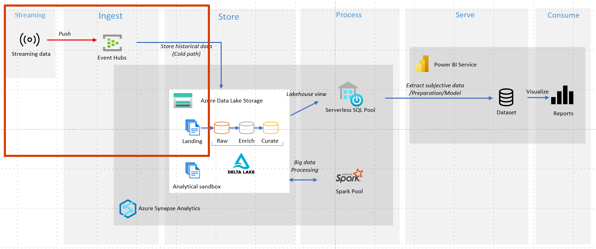

## Event Hubへの送信について

Azureに来てからは特に懸念はなかったのですが、一番の壁はここだと思います。


有償アプリの[Health Auto Export](https://www.healthyapps.dev/)ではじめは試していたのですが、

[Microsoft のKohei Ogawa さん | Twitter](https://twitter.com/shisyu_gaku) から  [iOS ショートカットと Power AutomateでヘルスケアデータをSharePointに保存する](https://qiita.com/h-nagao/items/37dc9e9e964458f0980d)を教えてもらい、無料でできる方法なのでiPhoneのオートメーションを利用することにしました。

※オートメーションの時間起動は「実行時に尋ねる」のOn Offに関わらずタップが必要らしく完全なオートメーションかというとちょっと悩ましいところです。

## 手順

### Synapse Analyticsの作成

1.Synapse ワークスペースの作成

[クイック スタート:Synapse ワークスペースを作成する](https://learn.microsoft.com/ja-jp/azure/synapse-analytics/quickstart-create-workspace)を参考にリソースを作成します。

Synapseの既定のコンテナは **workspace** という名称で作成しました。

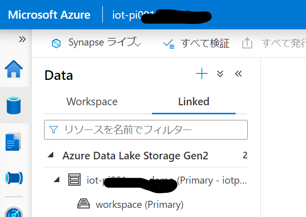

2.コンテナの追加

今回はLanding,Raw,Enrichなどのコンテナを追加して、データが置かれる場所を準備度合に応じて整理します。

参考：[DataLakeのベストプラクティス](https://speakerdeck.com/ryomaru0825/whats-data-lake-azure-data-lake-best-practice)

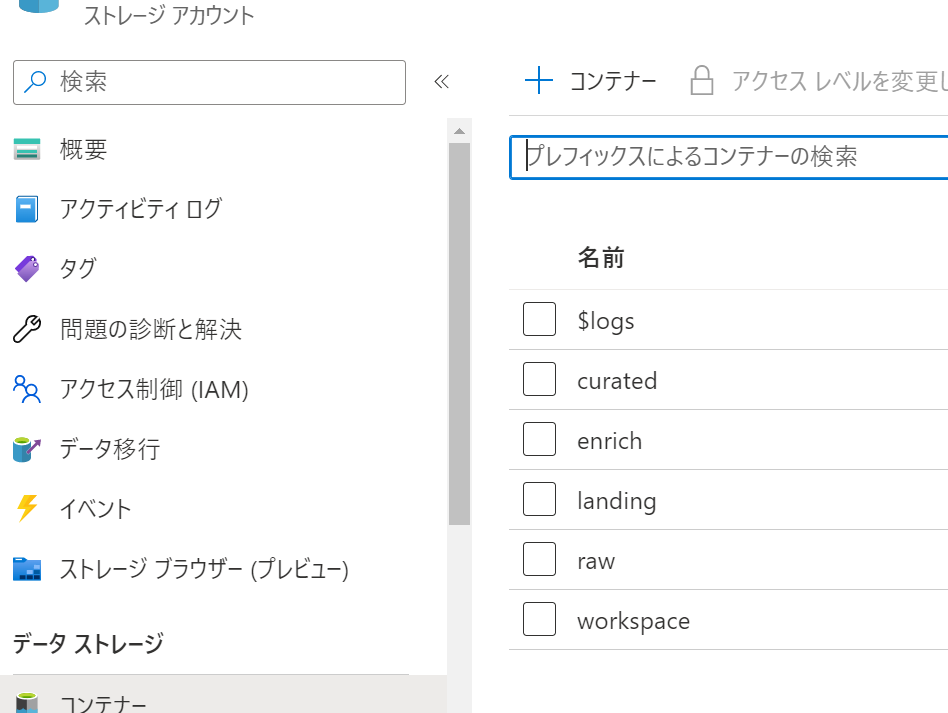


### Event Hubs 側の構成

1.EventHubs 名前空間（リソース）の作成

[クイック スタート:Azure portal を使用したイベント ハブの作成](https://learn.microsoft.com/ja-jp/azure/event-hubs/event-hubs-create)を参考にリソースを作成します。

ストレージへのイベントのキャプチャを利用したいのでStandardプランで作成しています。

2.Event Hubの作成

続けてAPI送信先となるEvent Hubを作成します。※手順は1の記事内に

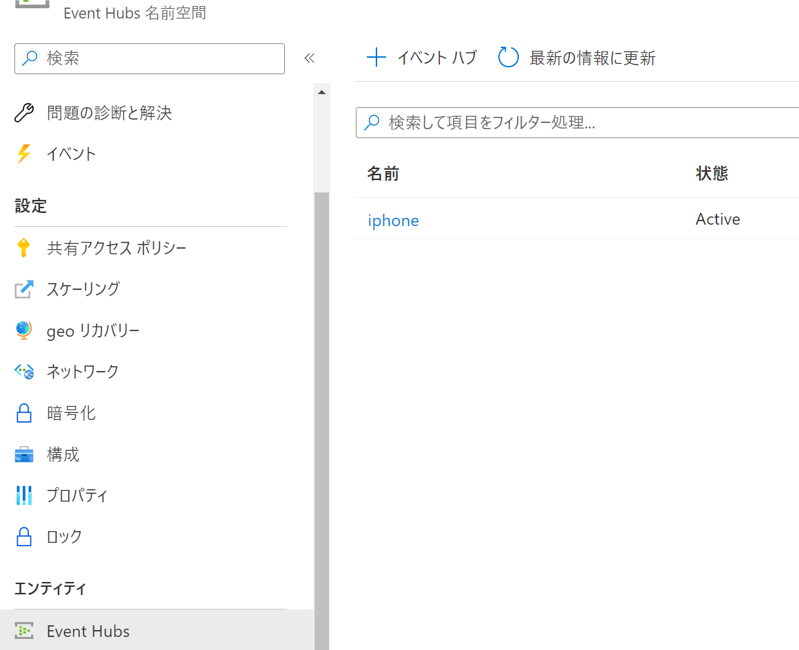


3.キャプチャの構成

[Azure Event Hubs で Azure Blob Storage または Azure Data Lake Storage にイベントをキャプチャする](https://learn.microsoft.com/ja-jp/azure/event-hubs/event-hubs-capture-overview) を利用してEvent Hubからデータレイクにデータを書き込みます。

avro形式で出力ができます。時間ウィンドウを1分にしてすぐ出力されるようにしておきつつ、出力先の指定します。

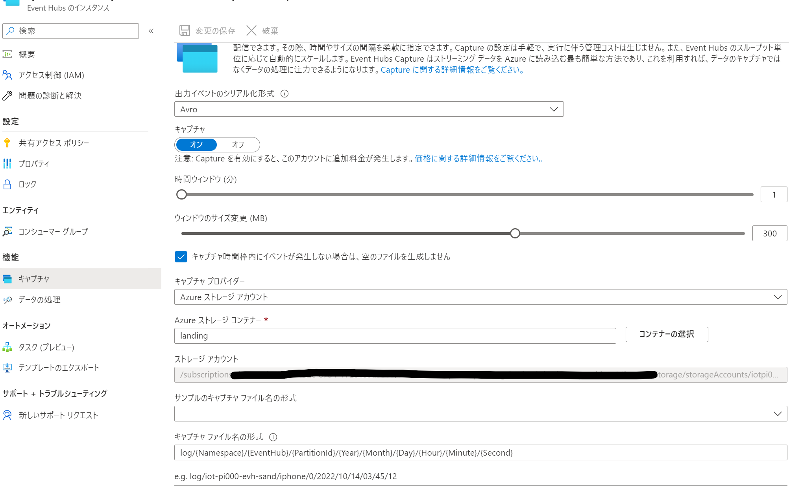


4.ポリシーの作成

作成したEvent Hubに移動して、SASポリシーを作成します。送信のためのポリシーなのでそのように構成します。（別のサービスからEvent Hubに送信されたイベントを読取りたい場合などはリッスンなどを使います。）

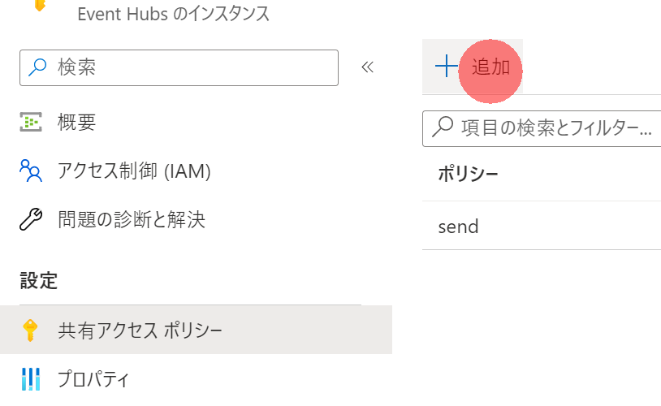

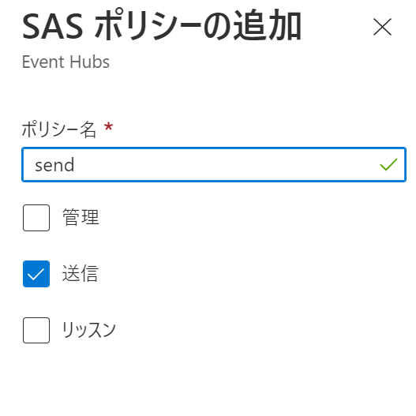

作成したSASポリシーをクリックすると以下のように接続文字列などの情報が取得できます。

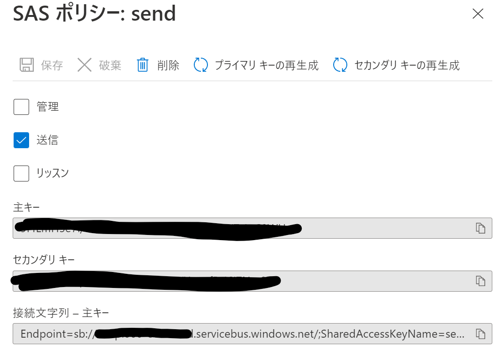

6.SASトークンの生成

REST APIでの送信ではSASトークンをあらかじめ生成しておく必要があるのでSASポリシーの情報を使って生成します。

[SAS トークンの生成](https://learn.microsoft.com/ja-jp/rest/api/eventhub/generate-sas-token#python)を参考に、pythonで生成してみました。VSCodeでDevContainerでPython環境をセットアップしたら%% でノートブックっぽく実行できるのでおすすめ

expiryNumは有効期間(秒)ですが、iPhoneのオートメーションから自動的にトークンをリフレッシュする仕組みはさすがに面倒なので3年間有効にしてます

```python:python

#%%

import time
import urllib
import hmac
import hashlib
import base64

def get_auth_token(sb_name, eh_name, sas_name, sas_value):
    """
    Returns an authorization token dictionary 
    for making calls to Event Hubs REST API.
    """
    uri = urllib.parse.quote_plus("https://{}.servicebus.windows.net/{}" \
                                  .format(sb_name, eh_name))
    sas = sas_value.encode('utf-8')
    expiryNum = 60*60*24*365*3
    expiry = str(int(time.time() + expiryNum))
    string_to_sign = (uri + '\n' + expiry).encode('utf-8')
    signed_hmac_sha256 = hmac.HMAC(sas, string_to_sign, hashlib.sha256)
    signature = urllib.parse.quote(base64.b64encode(signed_hmac_sha256.digest()))
    return  {"sb_name": sb_name,
             "eh_name": eh_name,
             "token":'SharedAccessSignature sr={}&sig={}&se={}&skn={}' \
                     .format(uri, signature, expiry, sas_name)
            }
# %%
get_auth_token(
    sb_name='<リソース名>',
    eh_name='<Event Hub名>',
    sas_name='SASポリシー名',
    sas_value='<SASポリシーの主キーの値>'
)

```

このようにtokenが帰ってきます。

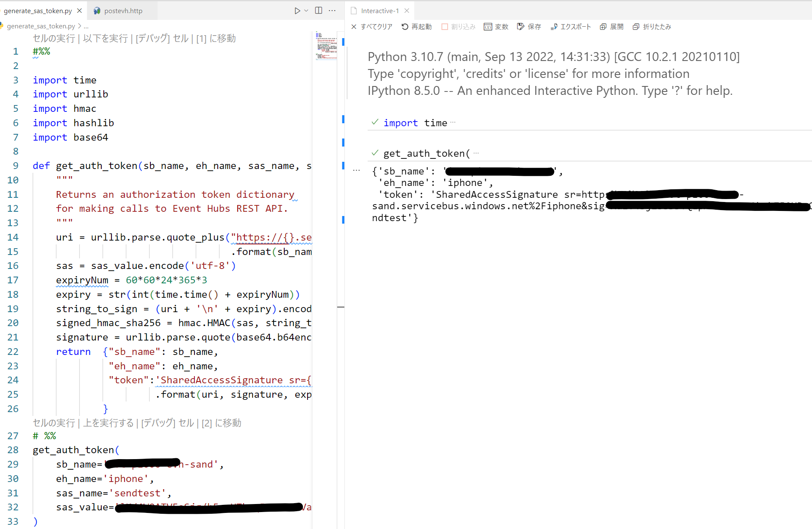

7.[イベントを送信します](https://learn.microsoft.com/ja-jp/rest/api/eventhub/send-event)
 を参考に、RESTAPIで疎通テストをします。成功しました。vscodeでは拡張機能で.httpの拡張子でREST APIの実行もテストできます。


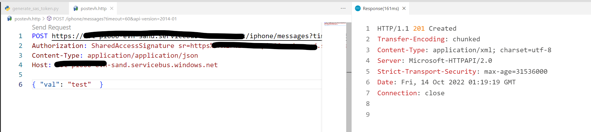

また、キャプチャ機能により、データレイク上にもデータ出力されます。

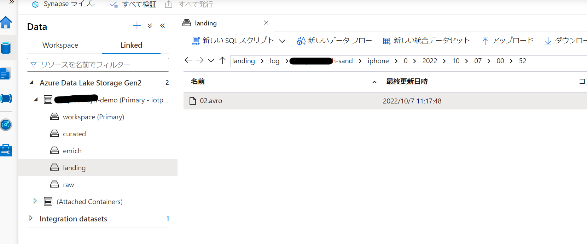

### iPhone側の構成

1.ショートカットで歩数を取得する

冒頭で紹介した[iOS ショートカットと Power AutomateでヘルスケアデータをSharePointに保存する](https://qiita.com/h-nagao/items/37dc9e9e964458f0980d)とほぼ同じですので変更したところだけ記載します。

フォーマットの仕方でタイムゾーンまでのるようにしました。

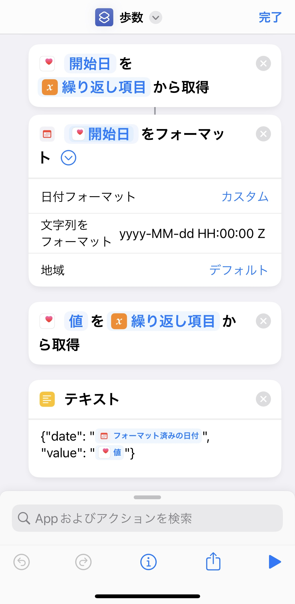


送信する文字列として歩数データは配列に格納して、データの種類と単位を記載するようにしました。

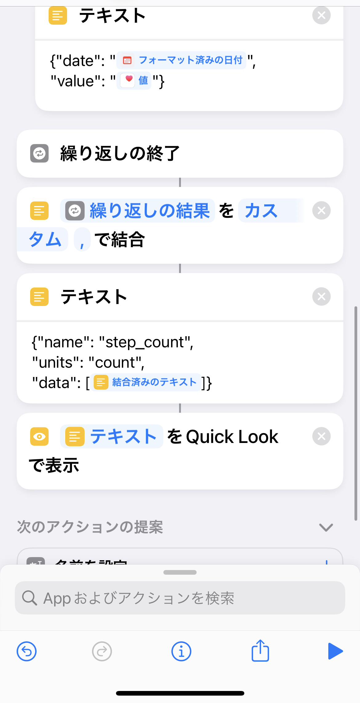

クイックルックで正常にjsonデータとして整形できていることがわかります

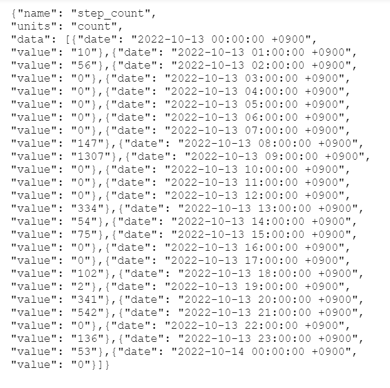

2.RESTAPIの送信

こちらも記事とほぼ同様ですが、ヘッダーなどを追加しています。

EventHubのテストをした際の情報と同じです。

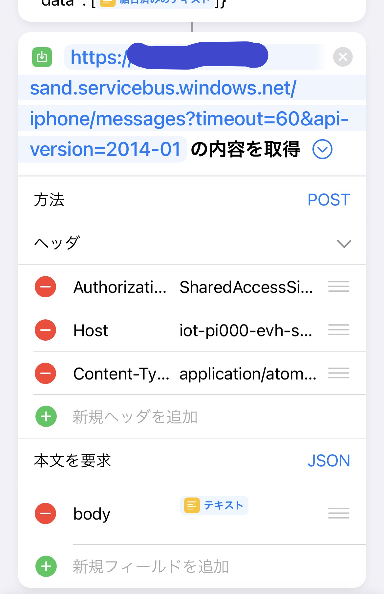


3.歩数と同様に、アクティブ消費と安静時消費などを作成してみます。

ショートカットを複製して、ヘルスケアサンプルの種類を変更すれば他の種類のデータも取れます。

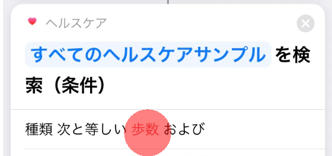

計3つのショートカットを作成しました。


4.オートメーション

あとは時間起動のオートメーションに組み込むだけです。

オートメーションの内容

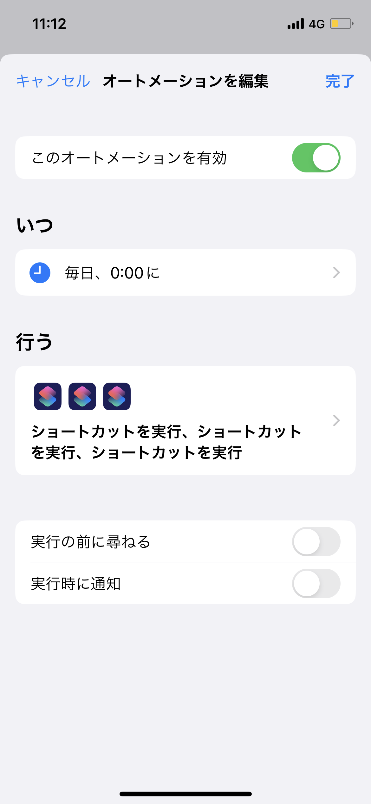

オートメーションで実行されるアクションの内容

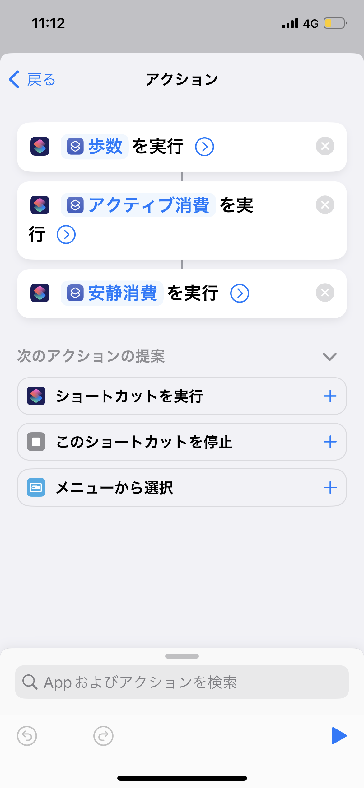

## ショートカットについて

テンプレとして参考までに共有します。

https://www.icloud.com/shortcuts/7efa58a622f74f6d859ac82c0b94afa8


## 次のパート

データ連携部は以上となります。
次のパートではSynapse Analyticsを利用してデータを準備して視覚化してみます。
