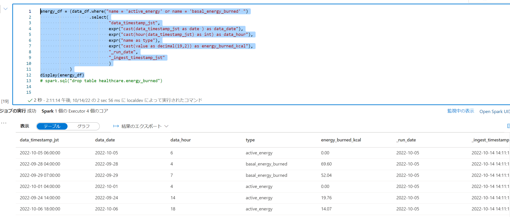

## はじめに

[Synapse AnalyticsでiPhoneヘルスケア（歩数、消費カロリー）を分析する Part1](https://qiita.com/ryoma-nagata/items/242ebf621dd7090d8ef1)の続きです。

## アーキテクチャ

この範囲を作ります。


## 手順

### Synapse Spark によるデータエンジニアリング

1.[Synapse Studioを利用してSparkプールを作成する](https://learn.microsoft.com/ja-jp/azure/synapse-analytics/quickstart-create-apache-spark-pool-studio)を参考にSpark Poolを作成します。

こんな感じです。とりあえずSpark3.xなら問題ないです。


2.Synapse Studioで出力されたavroを右クリックしてプロパティを確認します。


3.abfssを取得します。


4.ノートブックを開いて変数を設定しておきます。連携日ごとにパーティションを切りたかったのでデバッグ用に10/5で設定しておきます。

```python:python

run_date = '2022-10-05'

```

コンテナまでの部分を変数化しました。デバッグ時はworkspaceコンテナにファイル複製してここで変更できるようにしておくと楽かもしれません。


```python:python

landing_container_path = 'abfss://landing@<ストレージ名>.dfs.core.windows.net/'
raw_container_path = 'abfss://raw@<ストレージ名>.dfs.core.windows.net/'
enrich_container_path = 'abfss://enrich@<ストレージ名>.dfs.core.windows.net/'

```

5.とりあえずデータ確認のためにデータフレームへの読み取りを実行すると、bodyがバイナリになっています。

```python:python

path='<コピーしたabfssパス>'
input_df = (spark.read.format("avro").load(path)
            .show()
            )

```


6.castするときちんとエンコードされます。_run_dateや、取り込み時のタイムスタンプを付与します。また、複数ファイルが読みこまれるようにabgssパスをワイルドカードを使用したパスに変更します。

```python:python

from pyspark.sql.functions import *
from pyspark.sql.types import *

landing_fullpath = f'{landing_container_path}log/iot-pi000-evh-sand/iphone/*/*/*/*/*/*/*.avro'


input_df = (spark.read.format("avro").load(landing_fullpath)
    .withColumn('Body',col('Body').cast(StringType()))    
    .withColumn('_run_date',lit(run_date).cast(DateType()))
    .withColumn('_ingest_timestamp_jst',from_utc_timestamp(current_timestamp(),'JST'))
    )
display(input_df)


```


7.この状態のデータをDelta Lake形式でRawコンテナ内のinputフォルダに書き込みます。

```python:python

raw_input_fullpath = raw_container_path + 'log/iphone/healthcare/version=1/full/input/'
input_df.write.format("delta").mode('overwrite').option("mergeschema",'true').partitionBy('_run_date').save(raw_input_fullpath)

```
8.bodyに格納されている文字列をパースします。bodyとbody内の値の二段階でfrom_jsonを使用してパースしているので二つのjsonスキーマを定義しています。また、データ内のタイムスタンプがutcになっている部分はjstに変換しています。

```python:python

from pyspark.sql.functions import * 

evh_body_schema = StructType([
    StructField('body',StringType())
])

data_schema = StructType([
    StructField('name',StringType()),
    StructField('units',StringType()),
    StructField('data',ArrayType(
        StructType([
            StructField('date',StringType()),
            StructField('value',StringType())
        ])
    ))
])


data_df = (input_df
            .withColumn('json_value',from_json(input_df.Body,evh_body_schema))
            .withColumn('data',from_json('json_value.body',data_schema))
            .select('data.*','_run_date','_ingest_timestamp_jst')
            .withColumn('data',explode('data'))
            .select(
                'name',
                'units',
                from_utc_timestamp(col('data.date').cast('timestamp'),'JST').alias('data_timestamp_jst'),
                'data.value',
                '_run_date',
                '_ingest_timestamp_jst')            
            .distinct()
            )
            


display(data_df.orderBy("data_timestamp_jst"))

```

結果はこうなりました。


9.ここでクエリ可能データとしてsparkテーブルとして登録するためにデータベースを作成しておきます。

```sql:sql

%%sql
CREATE DATABASE IF NOT EXISTS healthcare

```

10.歩数と消費エネルギーの２種類のデータということでそれぞれ別のエンティティとして実体化していきます。まずは歩数。

```python:python

output_step_count_df = (data_df.where("name = 'step_count'")
                        .select(
                                "data_timestamp_jst",
                                expr("cast(data_timestamp_jst as date ) as data_date"),
                                expr("cast(hour(data_timestamp_jst) as int) as data_hour"),
                                expr("cast(value as int ) as step_count"),
                                "_run_date",
                                "_ingest_timestamp_jst"
                                )
                        )
display(output_step_count_df)

```


11.歩数をテーブル登録します。同時にRawコンテナ内のoutputフォルダにも吐いておきます。


```python

raw_output_step_count_fullpath = raw_container_path +  'log/iphone/healthcare/version=1/full/output/step_count/'
enrich_step_count_fullpath = enrich_container_path + 'log/iphone/healthcare_step_count/version=1/general/'

(output_step_count_df.write.format("delta").mode('overwrite')
                    .option("mergeschema",'true')
                    .option("overwriteSchema", "true")
                    .partitionBy('_run_date')
                    .save(raw_output_step_count_fullpath))

(output_step_count_df.write.format("delta").mode('overwrite')
                    .option("mergeschema",'true')
                    .option("overwriteSchema", "true")
                    .option("location",enrich_step_count_fullpath)
                    .saveAsTable("healthcare.step_count"))


```


12.消費エネルギーを展開します。


```python:python

energy_df = (data_df.where("name = 'active_energy' or name = 'basal_energy_burned' ")
                    .select(
                            "data_timestamp_jst",
                            expr("cast(data_timestamp_jst as date ) as data_date"),
                            expr("cast(hour(data_timestamp_jst) as int) as data_hour"),
                            expr("name as type"),
                            expr("cast(value as decimal(19,2)) as energy_burned_kcal"),
                            "_run_date",
                            "_ingest_timestamp_jst"
                            )
            )
display(energy_df)

```



13.消費エネルギーをテーブル登録します。同時にRawコンテナ内のoutputフォルダにも吐いておきます。

```python:python

raw_output_energy_fullpath = raw_container_path  + 'log/iphone/healthcare/version=1/full/output/energy/'
enrich_energy_fullpath = enrich_container_path +  'log/iphone/healthcare_energy/version=1/general/'


(energy_df.write.format("delta").mode('overwrite')
            .option("mergeschema",'true')
            .option("overwriteSchema", "true")
            .partitionBy('_run_date')
            .save(raw_output_energy_fullpath))
            
(energy_df.write.format("delta").mode('overwrite')
            .option("mergeschema",'true')
            .option("overwriteSchema", "true")
            .option("location",enrich_energy_fullpath)
            .saveAsTable("healthcare.energy_burned"))

```


### Synapse Pipeline によるワークフロー自動実行

Sparkノートブックを自動で実行できるようにします。

1.Sparkノートブックのrun_dateを設定しているセルをパラメータ化します。


2.パイプラインを作成して、ノートブックをドラッグ＆ドロップします。


3.設定で動作するSparkPoolなどを選択します。


4.パラメータとして以下の情報を入れておくことで、実行時の日本時間日付をrun_date に入力することができます。

```expresssion

@formatDateTime(addhours(pipeline().TriggerTime,9) ,'yyyy-MM-dd')

```

5.[スケジュールどおりにパイプラインを実行するトリガーの作成](https://learn.microsoft.com/ja-jp/azure/data-factory/how-to-create-schedule-trigger?tabs=data-factory#azure-data-factory-and-synapse-portal-experience) を参考に定期実行されるようにしておきます。

### Synapse Serverless SQL Poolでのクエリ確認およびView作成

今のところ、locationを指定した場合にDelta Lake形式のSparkテーブルでスキーマ情報がStudio上に表示されないので、Viewをかます構成にします。

1.作成したSparkのテーブル（レイクデータベーステーブル）を右クリックしてSQLスクリプトを生成します。


2.上記の問題でcol となってしまうので、*にでもしておきます。（できれば列、型を指定したほうがエコです。


3.うまくデータが入っていることが確認できているので、Serverless SQL PoolのSQLデータベースとviewを作成します。


```sql:sql

CREATE DATABASE [sql_healthcare]

CREATE View v_energy_burned AS
SELECT * 
 FROM [healthcare].[dbo].[energy_burned]


CREATE View v_step_count AS
SELECT * 
 FROM [healthcare].[dbo].[step_count]


```

作成が完了しました。※文字型で限界までとられてたりするのでview側で型を定義したほうエコというわけです。


### Power BI からの接続

1.Synapse Serverless SQL Poolのエンドポイントを取得するために、管理ハブから **Built-in** をクリックします。


2.プロパティからエンドポイントがコピーできます。


3.Power BI DesktopでSynapse SQLのソースを追加します。


4.先ほどコピーしたエンドポイント情報をペーストして接続すると、先ほど作成したViewが選択できます。


5.データを取得できたら、カレンダーも作っておきましょう。テーブル画面から **新しいテーブル** をクリックします


6.DAXをペーストして日付テーブルを作成します。

```dax:dax

Date = 
ADDCOLUMNS(
    CALENDAR(
        MIN(
            MIN(step_count[data_date]),
            MIN(energy_burned[data_date])
            ),
        MAX(
            MAX(step_count[data_date]),
            MAX(energy_burned[data_date])
        )
    ),
    "YEAR",YEAR([date]) ,
    "MONTH" , FORMAT([Date],"MM"),
    "YYYYMM" , FORMAT([Date],"YYYYMM"),
    "MONTH_NUMBER" , MONTH([date])
    )


```


7.日付テーブルとしてマークするとなおよしです。


8.モデリング画面からスタースキーマにしておきます。


9.ビジュアルを自由に作成できます。


10.Power BI Serviceに発行して、こちらも定期的に更新されるようにしておきます。


11.スマートフォンや、PCなどから活動量が確認できるようになりました。（もっと歩けとは言わないで）

