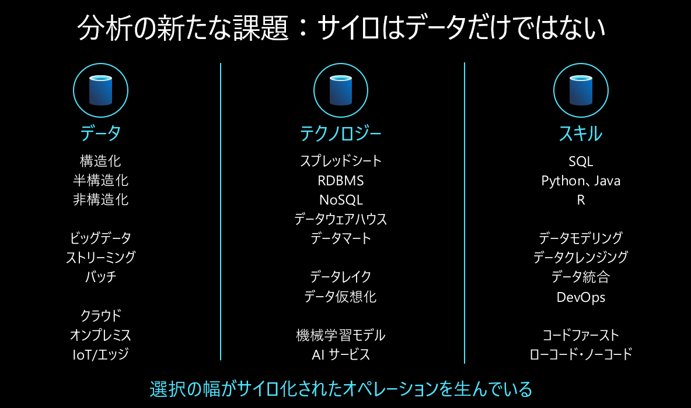
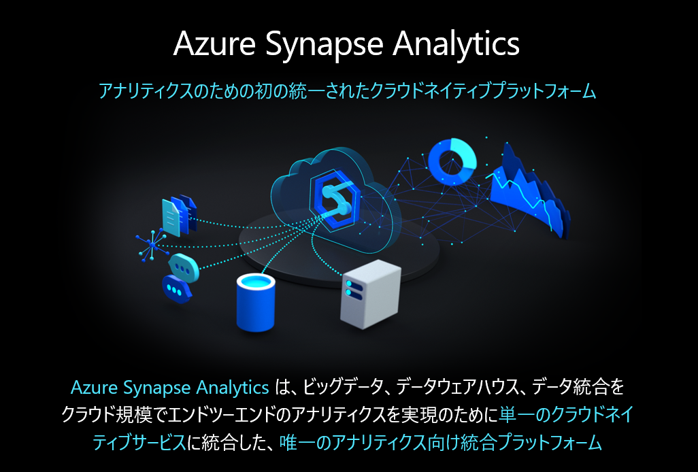

## はじめに

組織全体でコラボレーションしたデータ活用を意識して、Azure Synapse Analyticsを活用してみます。

## 新しい分析の課題について

データ活用では **データの民主化** が重要とされていますが、誰にとっての民主化でしょうか？ 
データ活用では様々なロールの人々が登場します。

たとえば データアナリスト のためのSQL分析、BI分析ができる環境は、データパイプラインジョブを開発するデータエンジニアにとっても嬉しい環境でしょうか？データサイエンティストにとってはどうでしょう。 
SQL分析、BI分析は彼らにとっても有用ではありますが、別のツール、環境でもって自分の実施したい作業をしてしまうのではないでしょうか。

分断され、手が届かなくなったモノを指して **サイロ** という言葉がよくデータ活用の課題を表すキーワードにされてます。 
データ活用におけるサイロとはデータの場所だけではありません。 
このような作業やスキルの違いで異なる環境を使わざるを得ないような状況も、**分析サイロ**である、というのが昨今の課題認識です。

分析サイロをなくすことで **データエンジニア** 、**データアナリスト**、**データサイエンティスト** といった様々なロールの人々がコラボレーションしたデータ活用を行います。

## Azure Synapse Analyticsの特徴

分析サイロをなくすためには、特定のロールの方が作業できるだけではなく、異なるスキルをもった人々が分断せずにコラボレーションして分析ができる環境が必要です。

しかし、**データエンジニアリング**、**SQL/BI分析**、**ML・データサイエンス** という目的に対して、取れるアプローチは多く、これらの目的それぞれで最適な技術選択をするのは非常に難しいです。

**Azure Synapse Analytics** はこの課題に向き合った統合分析プラットフォームです

Synapse Analyticsでは、あらゆる分析ワークロードを同じ環境で実施して、データ分析チームが分断せずにコラボレーションが可能です。

## 訪日外客数を使って実際に分析コラボレーションをしてみる

https://qiita.com/mimocihz/items/3c1fe6b06cd4da72c131 で実施されている作業をSynapse中心でやってみましょう。

### データエンジニアリング

こちらの記事で

### SQL/BI分析

準備中

### データサイエンス・ML

準備中