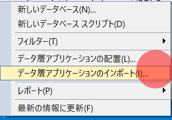
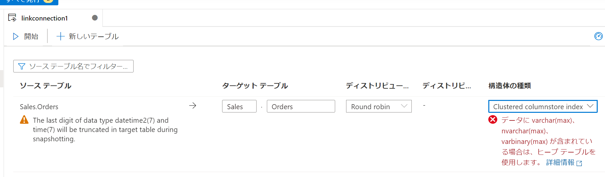
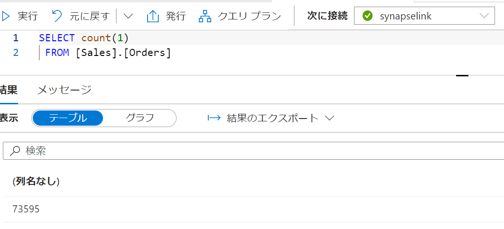
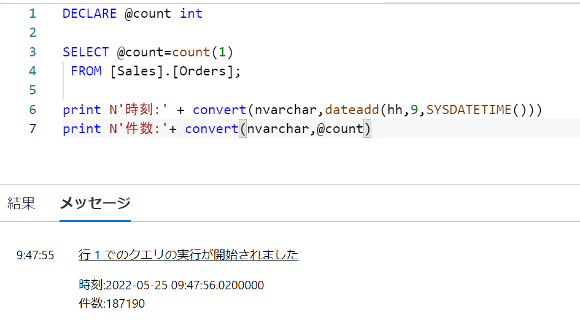

# Azure Synapse Link for SQL DB を試す

## はじめに

Build2022で発表されたAzure Synapse Link for SQL DBを試してみます。
Azure SQL DBに対してNoETLでDWHに連携する機能です。

[Build](https://mybuild.microsoft.com/ja-JP/home)

### 参考リンク

[Azure Synapse Link for SQL とは (プレビュー)](https://docs.microsoft.com/ja-jp/azure/synapse-analytics/synapse-link/sql-synapse-link-overview)

[Azure SQL Database 用 Azure Synapse Link (プレビュー)](https://docs.microsoft.com/ja-jp/azure/synapse-analytics/synapse-link/sql-database-synapse-link)

[Azure Synapse Link for Azure SQL Database (プレビュー) の構成](https://docs.microsoft.com/ja-jp/azure/synapse-analytics/synapse-link/connect-synapse-link-sql-database)


## 手順

### 準備

#### Synapse workspace 作成

synapse を作成します。
1. [Synapse ワークスペースの作成](https://docs.microsoft.com/ja-jp/azure/synapse-analytics/get-started-create-workspace) を参考にSynapse workspaceを作成します

設定全体


2. SQL Poolを作成します。


#### SQL DB作成

1. Azure Portalから論理SQL Serverを作成します。


設定全体


AD管理者の設定などをしています。
。

2. 作成後は **ネットワークタブ** にて自身のクライアントIPを登録しておきます


3. 同様に **IDタブ** にてシステム割当マネージドIDを有効化しておきます。


#### world wide importersの構成

 [world wide importers の作成](https://docs.microsoft.com/ja-jp/sql/samples/wide-world-importers-oltp-install-configure?view=sql-server-ver16#azure-sql-database)を参考にdbを構成します。

1. [wide-world-importers-release](https://github.com/Microsoft/sql-server-samples/releases/tag/wide-world-importers-v1.0)から対応バージョンのdacpacをダウンロードします。
2. SSMSからAD認証で対象sqlserverにログインし、データベースを右クリックして**データ層アプリケーションのインポート** を実行します。



設定画面


3. インポートが完了したらSynapseリソースをSQL DBのdb_ownerに指定します。

```sql

CREATE USER <workspace name> FROM EXTERNAL PROVIDER;
ALTER ROLE [db_owner] ADD MEMBER <workspace name>;

```


### 1. Synapse Lin for SQLの構成

1. 統合ハブから　**リンク接続** を選択します。


2. **リンク接続** から **新規** を選択します。


3. 準備で作成したDBを選択します。


4. ソーステーブルを選択します。


確認画面


5. リンク接続を確認します。


6. リンクの構成画面で、警告を確認します。



7. 対応外の型を含むのでHeapに変更します。


8. **発行** します。


9. 選択したテーブルのターゲットスキーマが存在する必要があるので、SQLPool上で作成しておきます

```sql

CREATE SCHEMA [Sales]

```


10. **開始** します。


11. 数分経つと開始が完了します。


監視画面がReplecatingとなります。


### 2.データの確認

#### 開始直後

まずは、ソーステーブルの件数を見ておきます。


専用SQL Pool側も開始が完了しているので、同じ件数になっています。



#### データ増幅確認

以下のクエリで雑にデータを増幅します。

```sql

DECLARE @maxOrder int
DECLARE @count int
SELECT @maxOrder = max( [OrderID])
  FROM [Sales].[Orders]


INSERT INTO [Sales].[Orders]
SELECT TOP 10000 @maxOrder  + [OrderID]
      ,[CustomerID]
      ,[SalespersonPersonID]
      ,[PickedByPersonID]
      ,[ContactPersonID]
      ,[BackorderOrderID]
      ,[OrderDate]
      ,[ExpectedDeliveryDate]
      ,[CustomerPurchaseOrderNumber]
      ,[IsUndersupplyBackordered]
      ,[Comments]
      ,[DeliveryInstructions]
      ,[InternalComments]
      ,[PickingCompletedWhen]
      ,[LastEditedBy]
      ,[LastEditedWhen]
  FROM [Sales].[Orders]
  order by 1 

print N'INSERT件数:'+ convert(nvarchar,@@ROWCOUNT)

SELECT @count=COUNT(1) FROM [Sales].[Orders]

print N'結果件数:'+ convert(nvarchar,@count)

```

（generatorが動かなかった..)

データの挿入を実行します。

SQL DB側の結果


約1分後にはデータが同期されています※ここだえタイムゾーンに気づかずにやっているので+9時間読み替え必要

Synapse側の結果


```sql

DECLARE @count int 

SELECT @count=count(1)
 FROM [Sales].[Orders];

print N'時刻:' + convert(nvarchar,dateadd(hh,9,SYSDATETIME()))
print N'件数:'+ convert(nvarchar,@count)

```

増やすためにTop句を外してみます。

SQL DB側の結果


これも即反映されています。

Synapse側の結果


300万件くらいから少しずつ反映に時間がかかるようになりました。
(この辺になるとSQLDB側の生成に時間がかかるようになります)

SQL DB側の結果


Synapse側の結果


## まとめ

SQLファミリーを利用されている方々はETL不要で分析環境にデータをエクスポートできるのでかなりいいんじゃないでしょうか。

このままでも運用DBに負荷をかけないまま分析クエリが効率化されると思いますが、
SQL Pool側でストアドプロシージャを組んで一定間隔で実行し、適切なモデリングや分散テーブルに整形するなどでニアリアルタイム分析もはかどりそうです。
外部テーブルと連携してデータレイクにオフロードするのもいいですね。

コスト面が気になるところです。

引き続きBuild2022 楽しんでいきましょう!