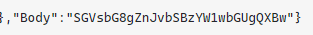
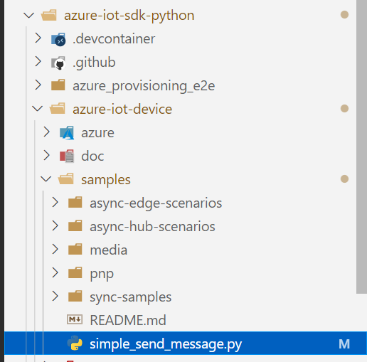

# IoT Hubのメッセージルーティングを利用した際に値が保存されない場合の確認ポイント

## はじめに

IoTデバイスから送信したメッセージをストレージに保存するときにエンコード周りで気を付けるべきポイントがあったので共有します。

## メッセージルーティング

メッセージルーティング機能については以下をご参照ください。
簡単に言うと、IoTHub自信がどこかにデータを書き込む機能です。

[Azure IoT Hubのメッセージルーティング](https://qiita.com/motoJinC25/items/cc6e76f2b73000410b60)

[IoT Hub メッセージ ルーティングを使用して device-to-cloud メッセージを別のエンドポイントに送信する](https://docs.microsoft.com/ja-jp/azure/iot-hub/iot-hub-devguide-messages-d2c)

[IoT Hub のメッセージ ルーティングと Event Grid の比較](https://docs.microsoft.com/ja-jp/azure/iot-hub/iot-hub-event-grid-routing-comparison)

[メッセージ ルーティングのトラブルシューティング](https://docs.microsoft.com/ja-jp/azure/iot-hub/troubleshoot-message-routing)

## 事象

Stream Analyticsなどからは正常にデータが読めるのに、ストレージに保存されるデータがおかしいといったことが起きます。

たとえばこんな感じでbodyに謎の値が入った状態でストレージに保存されます。



## 対処

対処というか、お作法です。
以下のようにメッセージにプロパティを設定して送信しましょう。

```python

msg.content_encoding = "utf-8"
msg.content_type = "application/json"

```

全体の例（メッセージ内容は私のコードの一部を抜粋してます）

```python

from azure.iot.device.aio import IoTHubDeviceClient
from azure.iot.device import  Message

conn_str = os.getenv("IOTHUB_DEVICE_CONNECTION_STRING")

# Create instance of the device client using the connection string
device_client = IoTHubDeviceClient.create_from_connection_string(conn_str)

msg = Message('{{"temperature": {temperature:0.1f},"humidity": {humidity:0.1f},"timestamp_jst":"{timestamp}"}}'.format(temperature = temperature, humidity = humidity,timestamp = dt))
msg.message_id = uuid.uuid4()
msg.correlation_id = "correlation-1234"
msg.content_encoding = "utf-8"
msg.content_type = "application/json"

# Send a single message
print(msg)
await device_client.send_message(msg)

```

## おまけ

私の場合、IoThubのコードサンプルに含まれていたpythonが以下のような状態でお作法を守っていない状態だったため、この事象が起きました。
超単純なメッセージ転送のコードなので、そのあたりは省かれているんですね。



```python


import os
import asyncio
from azure.iot.device.aio import IoTHubDeviceClient


async def main():

    # Fetch the connection string from an enviornment variable
    conn_str = os.getenv("IOTHUB_DEVICE_CONNECTION_STRING")

    # Create instance of the device client using the connection string
    device_client = IoTHubDeviceClient.create_from_connection_string(conn_str)

    # Connect the device client.
    await device_client.connect()
    
    # Send a single message
    print("Sending message...")
    await device_client.send_message("This is a message that is being sent")
    print("Message successfully sent!")

    # Finally, shut down the client
    await device_client.shutdown()


if __name__ == "__main__":
    asyncio.run(main())

```

## 参考

[IoT Hub message routing: now with routing on message body](https://azure.microsoft.com/en-us/blog/iot-hub-message-routing-now-with-routing-on-message-body/)
[Why IoT Hub message is not decoded corretly in storage JSON blob?](https://stackoverflow.com/questions/56257276/why-iot-hub-message-is-not-decoded-corretly-in-storage-json-blob)