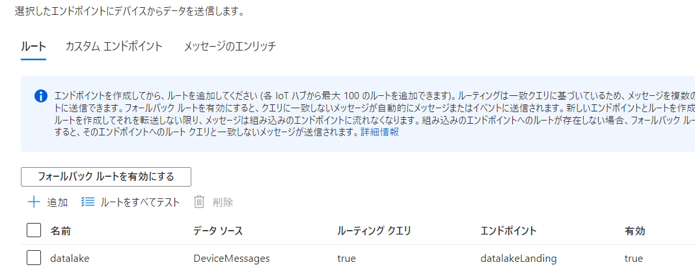
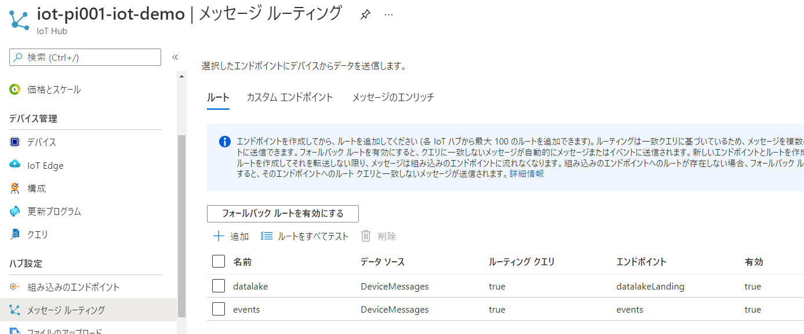

# IoT Hubのメッセージルーティングを利用する際に注意すること

## はじめに

知らないとやってしまいそうなので共有します。（というかやってしまった）
※今回の記事はDocsに思いっきり書いてあることです。きちんと読まないとですね

## 事象

以下のようなラムダアーキテクチャを構成する場合、

こんな感じでルーティングを組むと、コンシューマーグループなどからの読み取り＝ホットパス（赤線）/ウォームパス（オレンジ）が停止します。（読み取れなくなるというのが正しい？）

## 対処

eventsエンドポイントをへのルーティングを作成しましょう。

## おまけ

https://github.com/ryoma-nagata/iot-dashboard