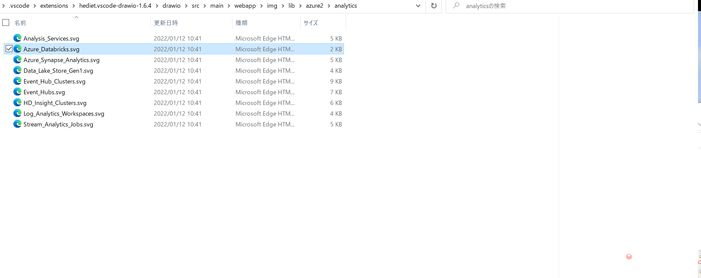

# Draw.ioに組み込みのアイコンセットがすごかったのでsvgの取得方法を共有

## はじめに

以下の記事でも簡単に紹介されていますが、Draw.ioのアイコンセットはすごい。衝撃でした。

[VSCodeでDraw.ioが使えるようになったらしい！](https://qiita.com/riku-shiru/items/5ab7c5aecdfea323ec4e#%E5%B0%8E%E5%85%A5%E6%96%B9%E6%B3%95)

ただ、パワポに使いたいときにはアイコンのsvg単体でほしいと思います。
このsvgの取得方法を共有します。

## 注意事項

2022/1時点の情報です

各アイコンは発行元の利用規約を守って利用してください。

## svgの場所

vscodeの拡張機能のフォルダにsvgが眠っています。

たとえばAzureのアイコン

C:\Users\(ユーザ名)\.vscode\extensions\hediet.vscode-drawio-1.6.4\drawio\src\main\webapp\img\lib\azure2

Analyticsはこんな感じ（右端にアイコンのプレビューが見えます。小さくてごめんなさい）

※エクスプローラで画像をプレビューできるようにPower Toysを入れています。

### 参考

公式のアイコンを簡単に

Azure
https://docs.microsoft.com/ja-jp/azure/architecture/icons/
Power BI
https://github.com/microsoft/PowerBI-Icons

Power Toys
https://docs.microsoft.com/ja-jp/windows/powertoys/

