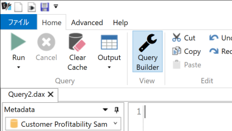
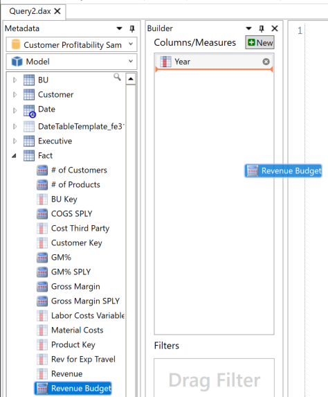

# 概要

DAX Studio 2.11.0にてプレビューとして実装されたQuery Builder機能をご紹介します。

GUIによるPivot形式でDAX Queryを記載できる便利な機能です。

>    

引用元：[DAX Studio 2.11.0 Released](https://darren.gosbell.com/2020/06/dax-studio-2-11-0-released/)

下記のことが実施可能なため、開発プロセスにもすぐに組み込めます。

-   ディメンション、メジャーの選択

-   メジャーの作成

-   フィルター処理の実施

-   DAX Queryの出力

    

## 事前準備

### ①DAX Studioを起動後、"ファイル"タブを選択

### ②"Options"→"Advanced"→"Show Query Builder Button"にチェックを入れます。

### ③"Home"タブにある"Query Builder"が表示されていることを確認します。

## 利用手順

### ①Power BI等のモデルに接続します。

### ②"Home"タブにある"Query Builder"を選択します。

### ③表示したい項目を、"Columns/Measures"にドラッグします。

### ④フィルター処理したい項目を、"Filters"にドラッグし、フィルタ条件を選択・入力します。

### ⑤下部にある"Run Query"を選択後、実行結果が表示されたことを確認します。

### ⑥"Edit Query"を選択することで、DAX Queryを出力できます。

以上です。

