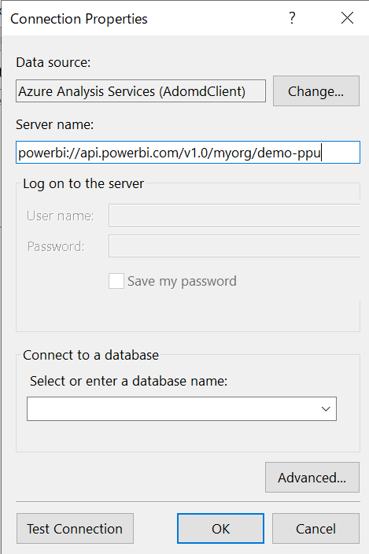
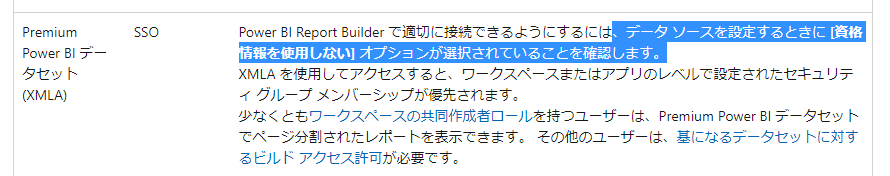

## はじめに

[Power BI 共有データセットを基づいて改ページ調整されたレポートを作成する](https://learn.microsoft.com/ja-jp/power-bi/paginated-reports/report-builder-shared-datasets) の通り、ページ分割されたレポート(Paginated Report)では、Power BI Datasetをソースにすることができます。

しかし、以下の対応データソースページに記載の制限事項を考慮する必要があります。

引用：https://learn.microsoft.com/ja-jp/power-bi/paginated-reports/paginated-reports-data-sources

## 準備

1 XMLA エンドポイントの設定確認

私の環境ではPower BI Premium Per Capacity ではなく、Premium Per User環境を使っているので、テナント設定のページの Premium Per Userのデータセットのワークロード設定を読取 or 読み取り、書き込みの状態にしておく必要があります。

2 XMLAエンドポイントの確認

対象のデータセットが存在するワークスペースにて、設定->Premiumから確認します

## 手順

1.Power BI Report Builder を起動して、Azure Analysis Services を選択します。

2.Build を選択します。

3.サーバー名にコピーした XMLA エンドポイントの値を入れます。

4.データベースを選択しようとするとサインインが走るので、サインインしてデータベースを選択します。

5.Credentials タブにて「 Do not use credentials 」をチェックしておきます。

これは冒頭の対応データソースページの案内にしたがっています。これがないと、 Report Builder 内のデータセットの追加がうまくいきません。

うまくいかないときのエラー

あとは、通常のデータセットに接続した差異の手順で続ければOKです。

## その他参考

https://learn.microsoft.com/ja-jp/power-bi/enterprise/service-premium-connect-tools#connecting-to-a-premium-workspace
