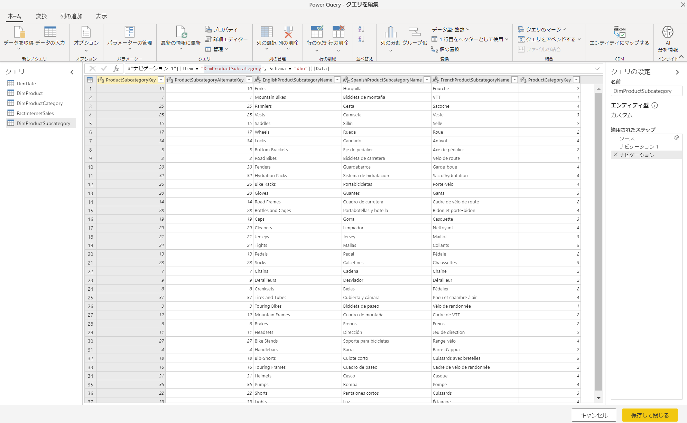
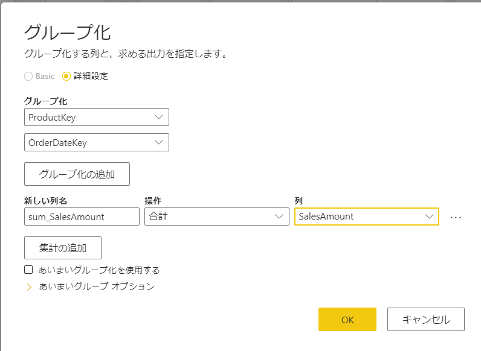
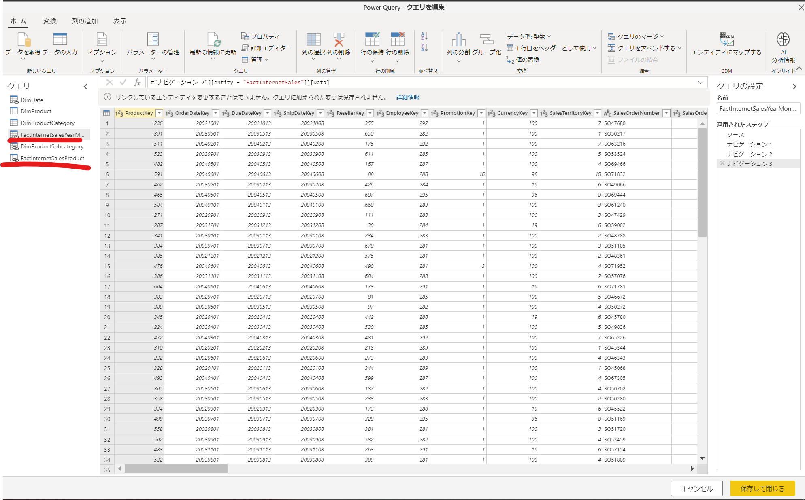

## はじめに

**2020/9 時点の情報です。**

[Power BI Premiumシリーズ](../README.md) 3つめ

Premium専用機能である、[拡張コンピューティング エンジン](https://docs.microsoft.com/ja-jp/power-bi/transform-model/service-dataflows-enhanced-compute-engine)について、どれくらいパフォーマンスが変わるか**超**簡単にテストします。

## 拡張コンピューティングについて

Power BI DataFlowsの実行にPower BI Premium専用容量を割り当てて、処理性能を最適化しよう、というもの。

こんな利点があるそうです。

>- 計算対象エンティティに対する、実行時間の長い ETL ステップ (joins、distinct、filters、group by の実行など) に必要な更新時間の大幅な短縮
>- エンティティに対して DirectQuery クエリの実行 (2020 年 2 月)

### 注意点
こんな盲点が、、、

> コンピューティング エンジンが既存のエンティティに対してしか機能しないことです。データフローがデータフローではないデータ ソースを参照している場合は、改善が見られません。 一部のビッグ データ シナリオでは、データを拡張コンピューティング エンジンに渡す必要があるため、データ ソースからの最初の読み取りが遅くなり、パフォーマンスが向上しません。

## 検証構成

以下のような構成で検証します。ちなみに、私のPower BI環境は東南アジアなので、Synapseも東南アジアで作成しています。私自身は日本からのアクセスです。


一応、ドキュメントのガイダンスに従って2段階構成です。

>コンピューティング エンジンを最大限に活用するには、次のように ETL ステージを 2 つの異なるデータフローに分割する必要があります。
>- データフロー 1: このデータフローでは、データ ソースから必要なすべてを取り込み、それをデータフロー 2 に配置するだけです。
>- データフロー 2: この 2 つ目のデータフローですべての ETL 操作が実行されますが、データフロー 1 が同じ容量にあり、それを参照していることを確認します。 また、コンピューティング エンジンが確実に使用されるように、他の演算を実行する前に、フォールドできる演算 (filter、group by、distinct、join) を確実に実行します。

**※補足**  
性能がどう変わるかを見るためなのでこの構成ですが、
個人的にはこの構成なら集計をするのであればテーブルそのままのデータフロー1は不要です。dataflowsは集計クエリをSynapse側にプッシュダウンできるので。  
DB + Excelを組み合わせて集計が欲しい、などの色々なデータソースをデータフロー１でまとめる、という場合にこのような構成になるかと思います。

## 手順

事前に専用容量を割り当てたPower BI Workspaceを用意して、以下の順番で実施します。

1. Azure Synapse Analytics SQL Poolの準備
2. Premium容量を割り当てたPower BI Workspaceの準備
3. データフロー1の作成・実行
4. データフロー2の作成・実行
5. 拡張コンピューティングを適用してデータフローの更新

### 1. Azure Synapse Analytics SQL Poolの準備


[SQL プールを作成する](https://docs.microsoft.com/ja-jp/azure/synapse-analytics/sql-data-warehouse/create-data-warehouse-portal#create-a-sql-pool)に従ってAdventureWorksDW サンプル データを含む SQL プールを作成します。

ちょっとデータ量が少なかったので、100万件まで増やしておきます。

```sql

create table [dbo].[FactInternetSales_new]
with(
 DISTRIBUTION = hash(ProductKey)
 ,CLUSTERED COLUMNSTORE INDEX
)
as 
select top 1000000 *  from [dbo].[FactResellerSales]
cross join [dbo].[DimCustomer]

RENAME OBJECT [dbo].[FactInternetSales] TO [FactInternetSales_old]
RENAME OBJECT [dbo].[FactInternetSales_new] TO [FactInternetSales]

```

### 2. Premium容量を割り当てたPower BI Workspaceの準備

今回は別記事となる、[Power BI Premium専用機能を従量課金でテストする方法](../Power%20BI%20Premium専用機能を従量課金でテストする方法/README.md)で構成しました。

### 3. データフロー1の作成

途中まで[Power BI でのデータフローの作成と使用](https://docs.microsoft.com/ja-jp/power-bi/transform-model/service-dataflows-create-use)と同じように進めていきます。

5つのテーブルを選択して、このような内容となりました。



データフロー名称を設定、保存して、今すぐ更新します。


はじめの二回はデータ量が少なく早すぎた結果です

### 4. データフロー2の作成・実行

以下のエンティティを作成します。計算コストの高そうなフローを組んでみます。
余談ですが、Igniteで出てたdata flowのフローダイヤグラムビュー楽しみですね。

- 2003年の月別売上集計
- 製品カテゴリ別の売上集計

FactInternetSalesで、キー項目で集計しておきます。


複製して名前を変えます。


FactInternetSalesYearMonthでDimDateと結合後、YearMonthで集計します。

同様にFactInternetSalesProductCategoryではProduct,ProductCategoryと結合、ProductCategoryで集計します。


参考までにMクエリを貼っておきます。

FactInternetSalesYearMonth

```

```

```
```


## 結果
