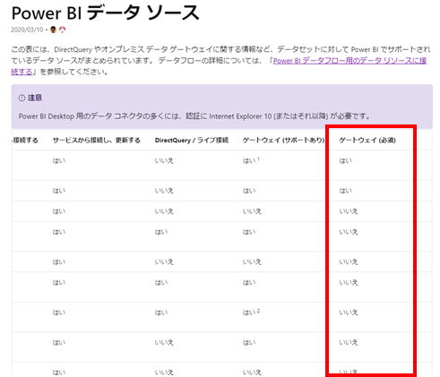
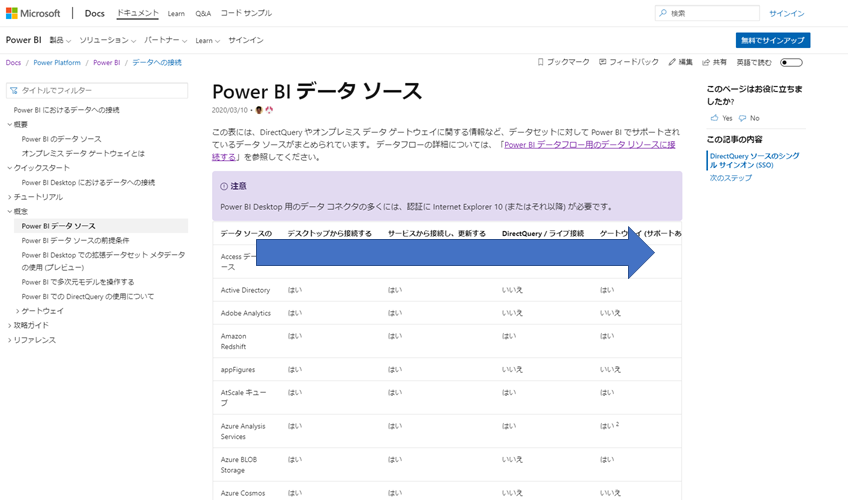

# Power BI Servicesに接続する際にゲートウェイが必要となるデータソースについて

<!-- TOC -->

- [Power BI Servicesに接続する際にゲートウェイが必要となるデータソースについて](#power-bi-services%e3%81%ab%e6%8e%a5%e7%b6%9a%e3%81%99%e3%82%8b%e9%9a%9b%e3%81%ab%e3%82%b2%e3%83%bc%e3%83%88%e3%82%a6%e3%82%a7%e3%82%a4%e3%81%8c%e5%bf%85%e8%a6%81%e3%81%a8%e3%81%aa%e3%82%8b%e3%83%87%e3%83%bc%e3%82%bf%e3%82%bd%e3%83%bc%e3%82%b9%e3%81%ab%e3%81%a4%e3%81%84%e3%81%a6)
  - [概要](#%e6%a6%82%e8%a6%81)

<!-- /TOC -->

## 概要

Power BI Servicesに接続する際にゲートウェイが必要となるデータソースの記載が、見つけにくいとろこにあったので共有します。

下記、マイクロソフト社Power BIドキュメント内の表右側にあります。

参考リンク　[Power BI データ ソース](https://docs.microsoft.com/ja-jp/power-bi/connect-data/power-bi-data-sources)

手順

1.  [Power BI データ ソース](https://docs.microsoft.com/ja-jp/power-bi/connect-data/power-bi-data-sources)に接続し、表内を右側にスクロール。

2.  "ゲートウェイ(必須)"列を確認

