## はじめに

Power BIでローコードでのリアルタイム変換処理を実装できるPower BI Streaming dataflowsがPublic Previewとなったので試してみます。

[Streaming dataflows in Power BI premium now available in public preview](https://powerbi.microsoft.com/en-us/blog/streaming-dataflows-in-power-bi-premium-now-available-in-public-preview/)

## 従来のリアルタイムデータセットとの違い

Power BI でリアルタイムデータの可視化を考えたとき、工程を「収拾」→「変換」→「BIモデル化」→「レポート」のように整理してどう異なるか考えてみます。

### リアルタイムデータセット

従来のリアルタイムデータセットでは、以下のようなイメージで、変換処理層はPower BI 側では持たず、モデルに対してデータを送信してもらうことで、レポートにつながっています。
※Azureで実装する場合はStreaming AnalyticsなどでSQLライクな言語で実装を行う

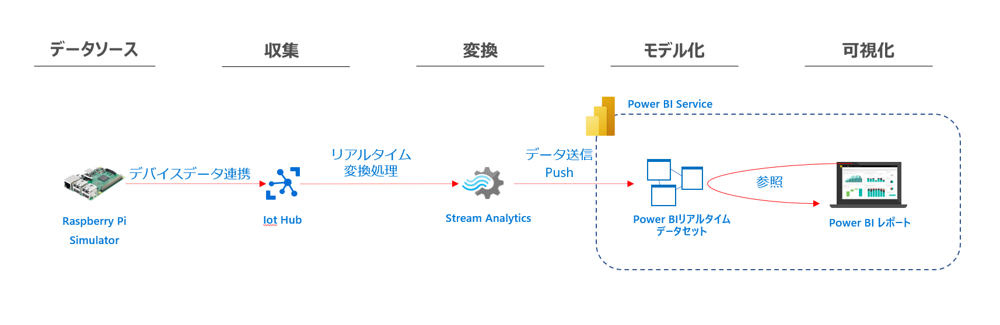

参考：

[https://docs.microsoft.com/ja-jp/power-bi/connect-data/service-real-time-streaming#types-of-real-time-datasets](https://docs.microsoft.com/ja-jp/power-bi/connect-data/service-real-time-streaming#types-of-real-time-datasets)

[チュートリアル:Stream Analytics で不正な通話のデータを分析し、Power BI ダッシュボードで結果を視覚化する](https://docs.microsoft.com/ja-jp/azure/stream-analytics/stream-analytics-real-time-fraud-detection)

### Streaming dataflows

Streaming Dataflowsは、以下のようにリアルタイム変換処理を担います。
変換処理はローコードで実装が可能で、変換結果はhot data あるいはcoldデータという形でPower BI データセットに提供されます。

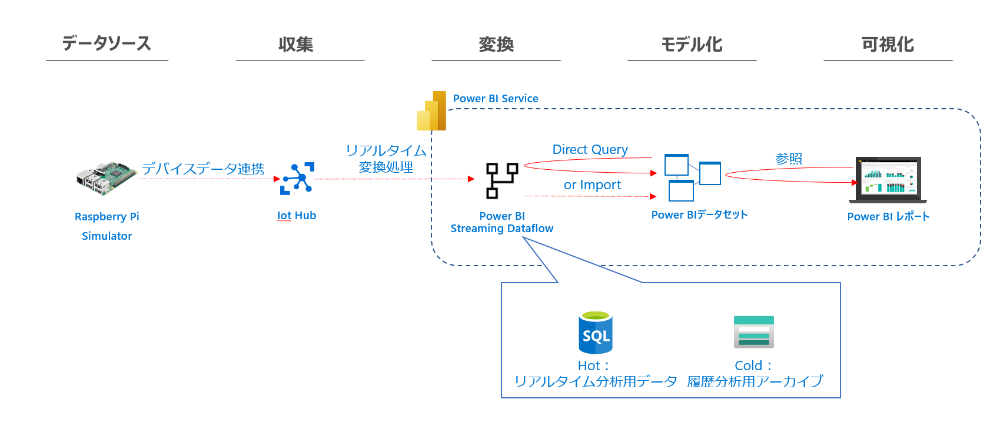

すでに機能提供されているPower BI Dataflowsも変換処理をローコードかつPower BI Service上で実装できるものであり、dataflowという言葉はMicrosoft製品ではデータ変換機能を指すような流れとなっています。

## 手順

それでは以下の手順で実際に試してみます。
docsのチュートリアルがなかなか親切ですが、補完するような形で画面イメージを案内いたします。

1. Pi Webシミュレータ、IoT Hubの準備
2. Power BI WorkspaceでのStreaming Dataflowsの作成
3. Power BI Desktopからのモデル作成
4. Power BI Service上で確認

docs：
[ストリーミング データフロー (プレビュー)](https://docs.microsoft.com/ja-jp/power-bi/transform-model/dataflows/dataflows-streaming#limitations-and-considerations)

### 前提条件

Power BI ライセンス：Premium以上が必要です。(Power BI Embedded環境で試す場合はProでOK)

### 制限事項

その他制限事項は以下の通り。

>- ストリーミング データ フローを作成および実行するには、Power BI Premium サブスクリプション (容量または PPU) が必要です。
> - ワークスペースごとに許可されるデータフローのタイプは 1 つだけです。
> - 通常データフローとストリーミングデータフローのリンクはできません。
> - A3 より小さい容量では、ストリーミング データ フローを使用できません。
> - テナントでデータフローまたは拡張計算エンジンが有効になっていない場合、ストリーミングデータフローを作成または実行することはできません。
> - ストレージ アカウントに接続されているワークスペースはサポートされていません。
> - 各ストリーミング データ フローは、最大 1 メガバイト/秒のスループットを提供できます。

[制限事項と考慮事項](https://docs.microsoft.com/ja-jp/power-bi/transform-model/dataflows/dataflows-streaming#limitations-and-considerations)

### Pi Webシミュレータ、IoT Hubの準備

データソースを構成します。以下の手順にしたがってIoT Hubを作成してください

[Raspberry Pi オンライン シミュレーターの Azure IoT Hub への接続](https://docs.microsoft.com/ja-jp/azure/iot-hub/iot-hub-raspberry-pi-web-simulator-get-started#what-you-do)

作成後、概要画面からデータの流入が確認できます。
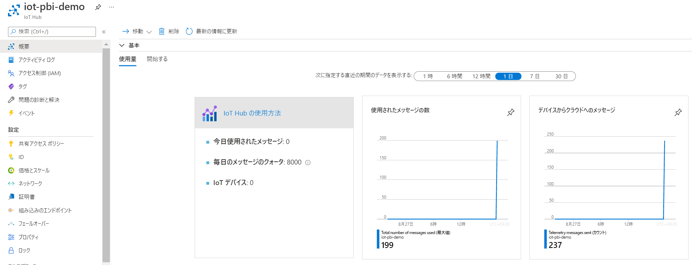

### Power BI WorkspaceでのStreaming dataflowsの作成

#### ワークスペースの準備

##### Power BI Premium Per User ライセンスを保持している場合

ワークスペースの作成時/設定画面から割当て可能です。

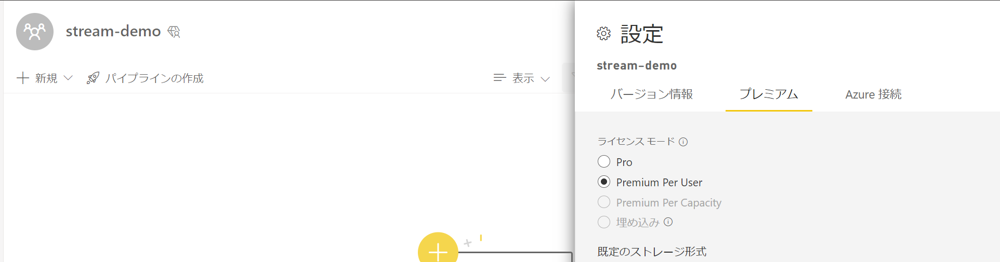

##### Power BI Premium Per Capacity or Azure Power BI Embedded のA3 SKUを利用する場合

Power BI Premium Per Capacityを個人で利用される方はあまりいないと思うので、以下を参考にPower BI Embeddedを利用しましょう。

[Power BI Premium専用機能を従量課金でテストする方法](https://qiita.com/ryoma-nagata/items/08b1e54627853e679fd1)

#### Streaming dataflowsの作成

workspaceからStreamin dataflowsを作成します。

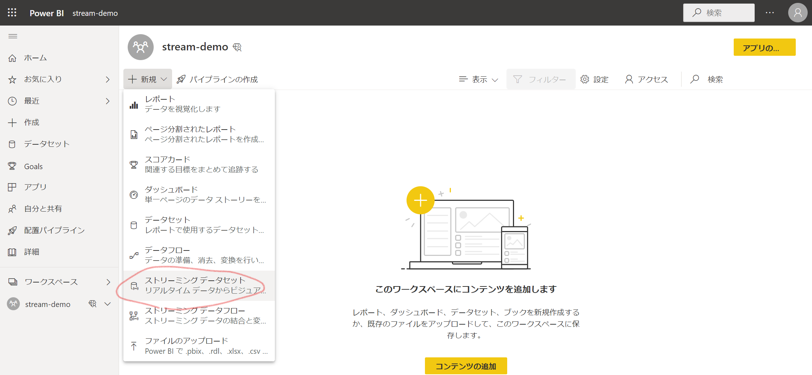

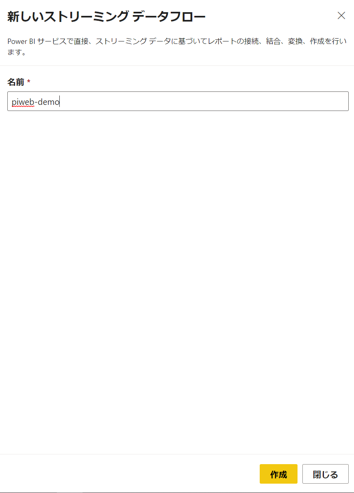

データソースとしてIoT Hub か Event Hubsを選択します。
今回はIoT Hubを選びます。

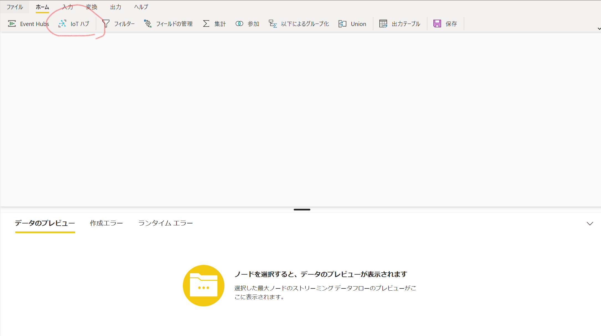

IoT Hubを利用する場合にはIoTHubの接続文字列ではなく、Event Hub互換エンドポイントを利用することになるので、注意

IoT Hubでは以下の情報を利用します。

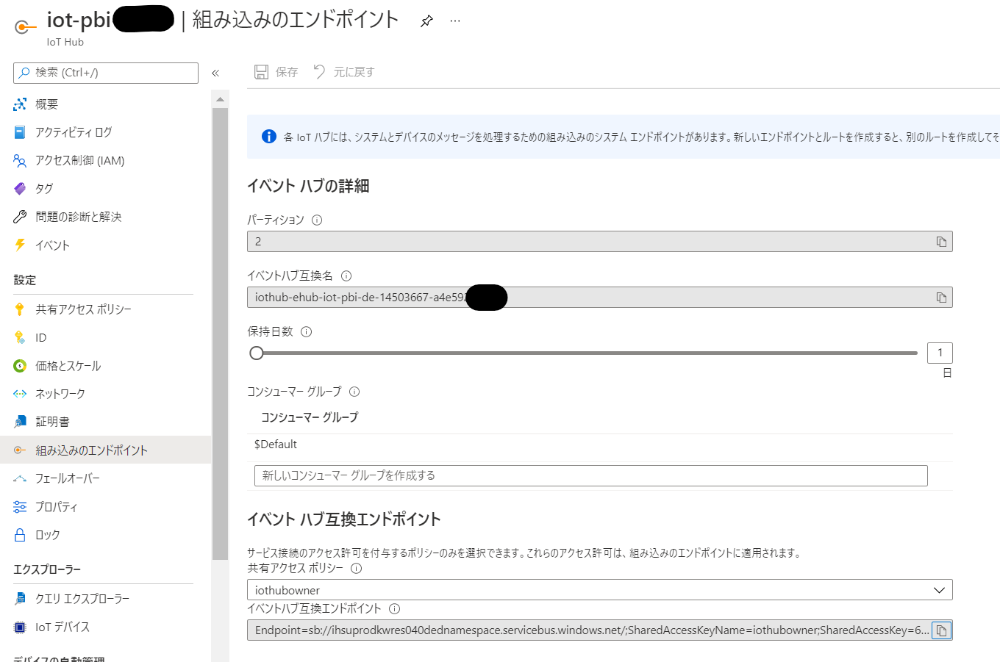

イベントハブ互換エンドポイントの情報を入力します。

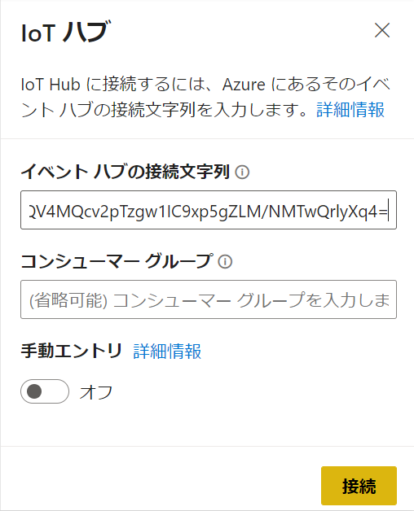

IoT Hubに送信されているデータの項目を検出可能です。

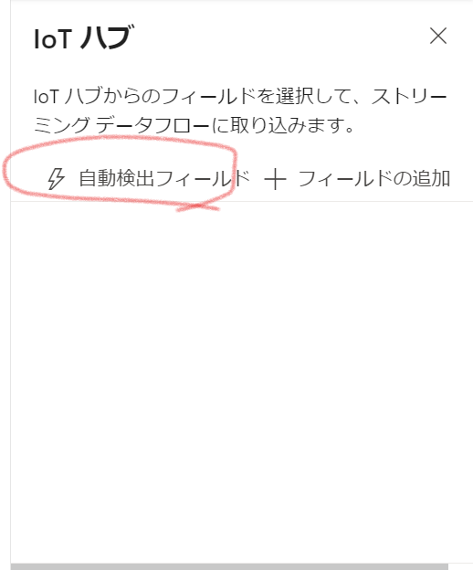

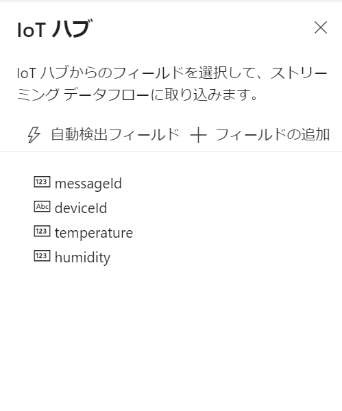

IoT Hubが自動的に付与するタイムスタンプ情報は自動検出されないので、手動で入力します。
Power BI Streaming dataflowsのオーサリング画面上ではプレビューもできない点は注意

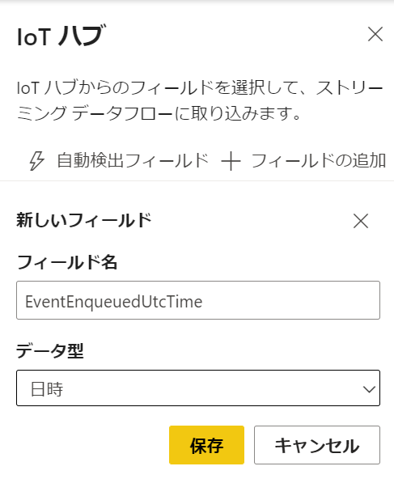

変換のステップをリボンから選択し、入力と出力の線をつなぐことで変換を実装していきます。

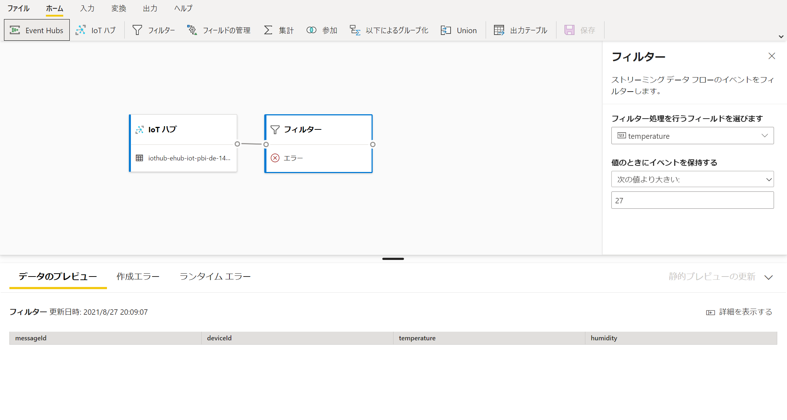

変換ステップは出力の線を結ばないとプレビューが表示されないようです。

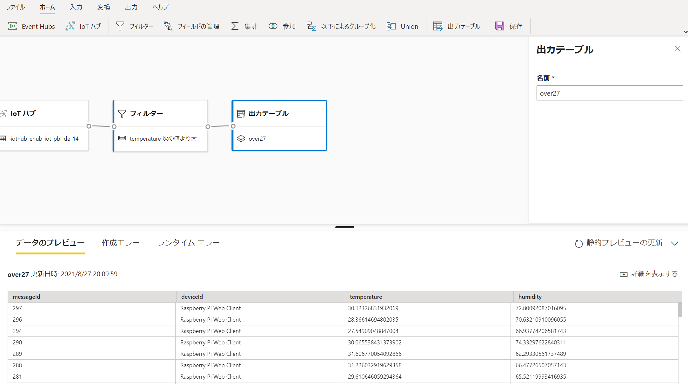

最終的にはこのようなデータフローになりました。

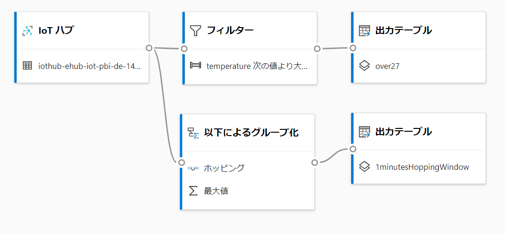

保存してワークスペースに戻ります。

データフローの実行ボタンをクリックすることでPower BI Streaming dataflowsが開始します。

### Power BI Desktopからのモデル作成

Power BI Desktopでモデル化を行います。
データフローのコネクタから、先ほど作成したStreaming Dataflowsを選択すると、hotとColdが選択できます。
※Power BI データフローコネクタではhotのみの表示になります。今後データフローコネクタに統合されるようです。

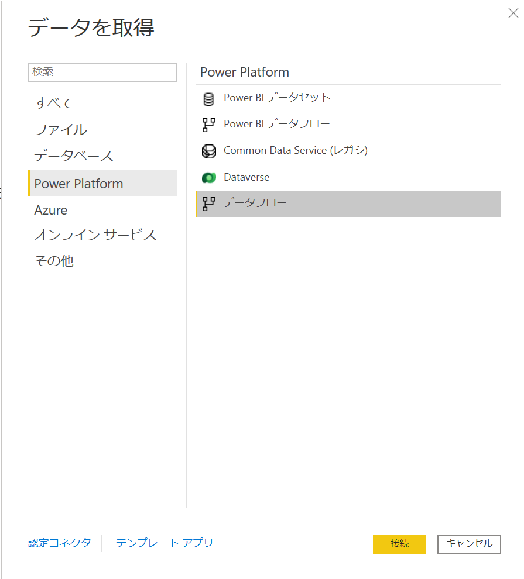

プレビューが表示されます。

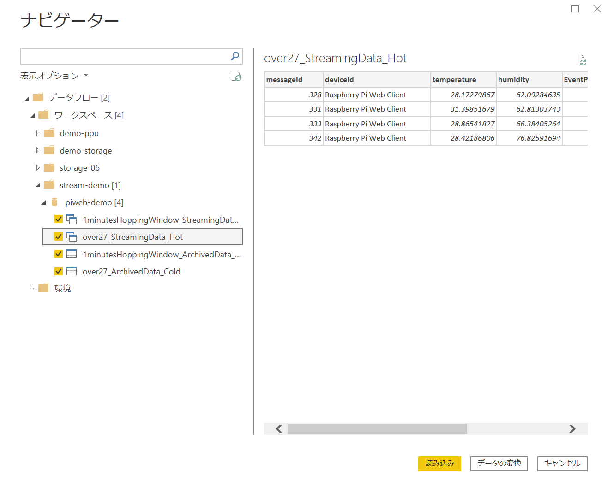

Power BI のデータセット（モデル）を作成していきます。
ストリーミングデータ同士のリレーションシップを構成したり、他のデータともリレーションシップを構成可能です。
以下のようにDevice マスタ的なテーブルをつないでみました。
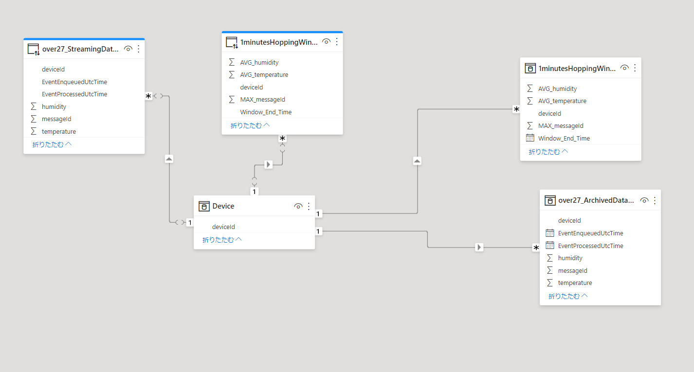

>**Note**
>  
> このようにリアルタイムデータを利用したデータモデルを作成できるというのが従来のリアルタイムデータセットと最も違う点となります。

簡単なレポートを作成して発行してみます

### Power BI Service上で確認

発行後、レポートを確認すると認証エラー

データセットの認証情報を修正します。このあたりは通常のデータセットと同じ取り扱いですね。

設定画面に進みます。
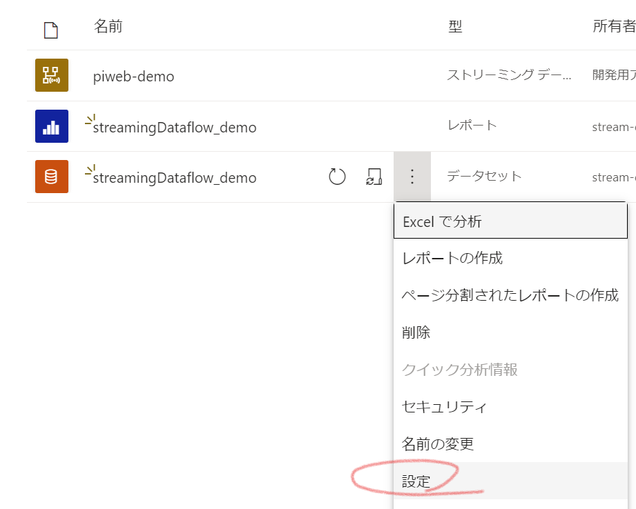

資格情報の編集からサインインをすることで認証が構成されます。

レポートを確認します。
途中PiWebシミュレータを止めたのでいびつになっていますが、きちんと最新情報が表示されています。
Streaming Dataflows上のテーブルに対してダイレクトクエリモードなのでレポートを更新すると常に最新のデータが取得されます。

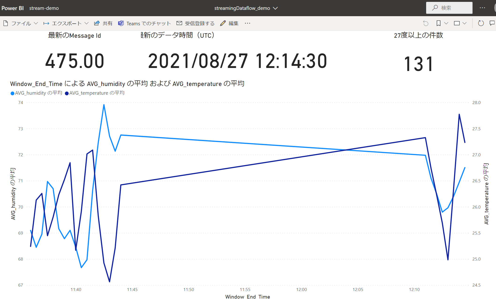

