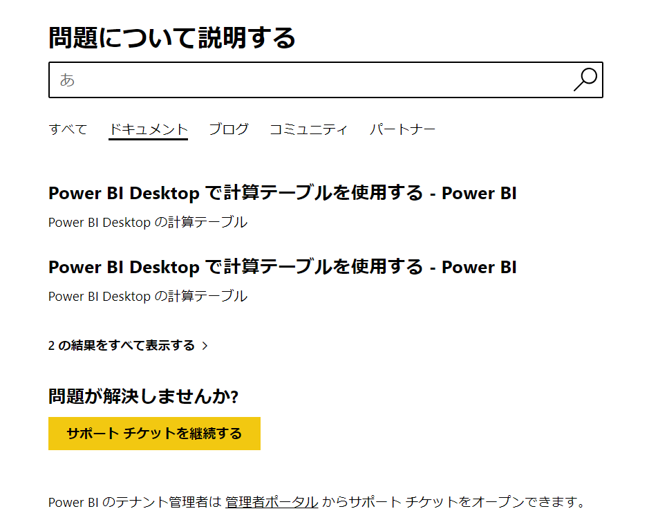
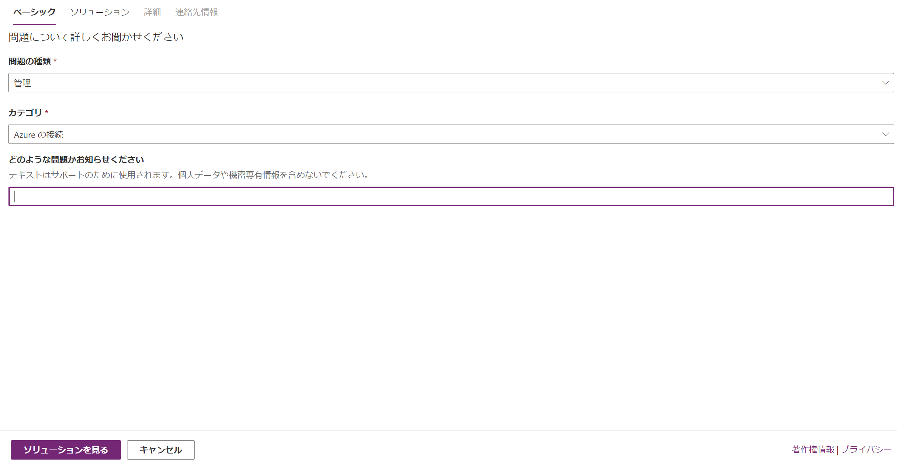
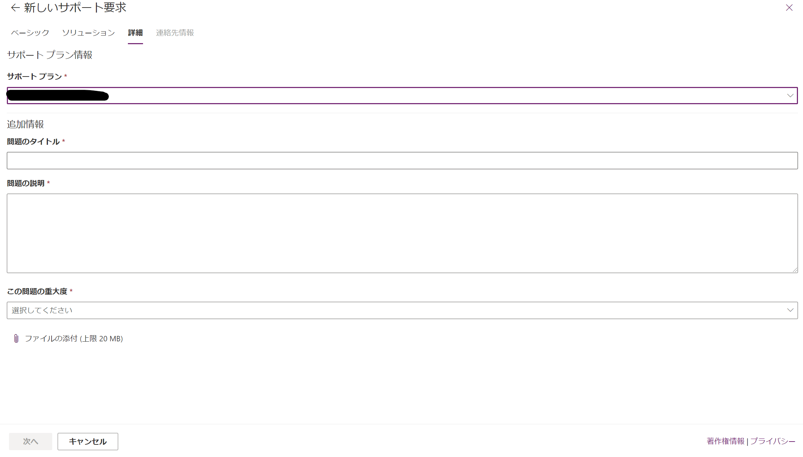

# Power BI Supportへの問い合わせ方法

地味に聞かれることが多いので備忘録

## 手順
前提条件：
Proライセンスを持っている方向けの問い合わせ方法です。(2020/10時点での情報です)

1. https://powerbi.microsoft.com/ja-jp/support/pro/ticket/ にアクセス。ここでProライセンスをもったユーザでサインインしてください。
2. 適当な問題で検索します。（儀式です）

3. 「サポートチケットを継続する」をクリックします

4. 関連の問題の種類とカテゴリを選択して「ソリューションを見る」をクリックします。
**注意** : 「どのような問題かお知らせください」を埋めるとソリューションから先に進めなくなります。（Feedbackします。。）

5. ソリューションにほしい情報がない場合は、「次へ」をクリックします。

6. 情報を記載して、チケットを発行します。
