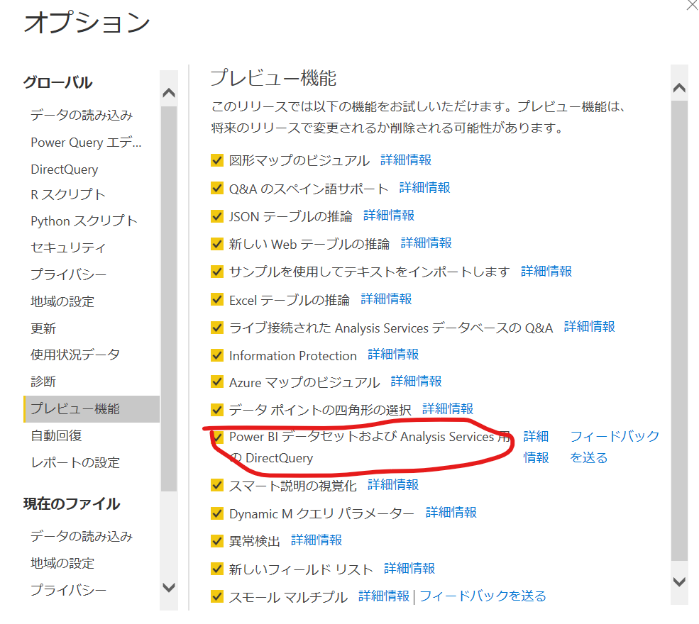
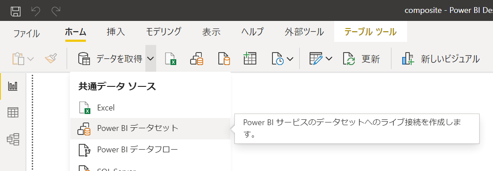
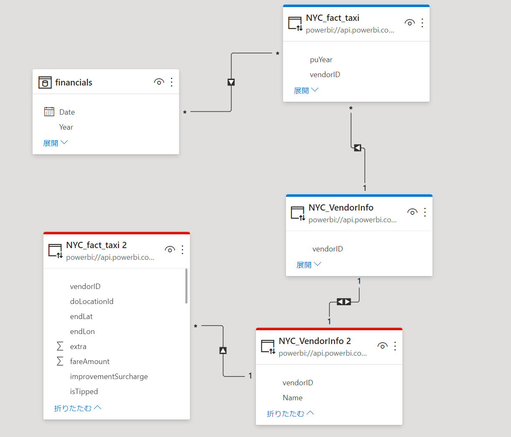
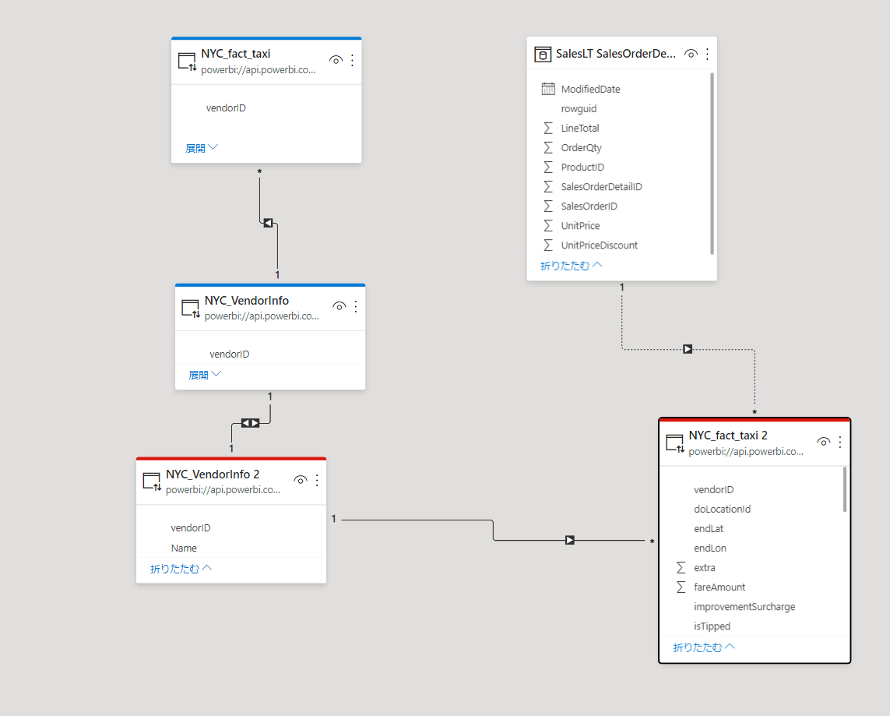
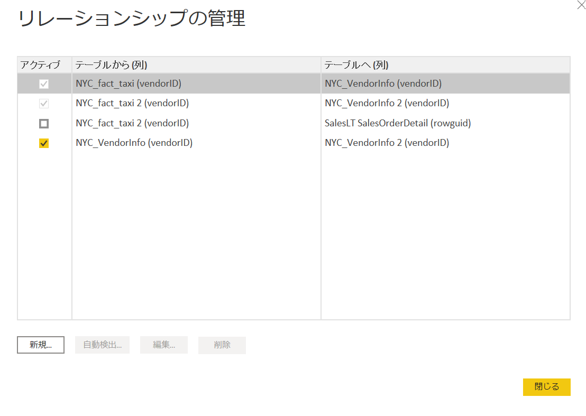
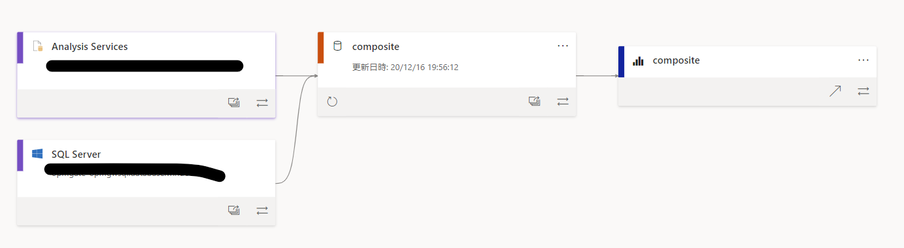
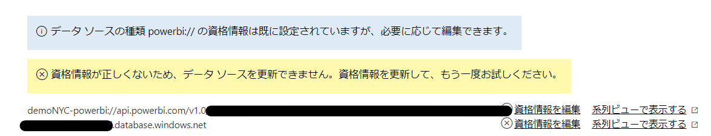

# Power BIデータセットおよびAnalysis Services用のDirect Query がプレビュー

## 速報

超重要機能がプレビューされたので速報記事として紹介いたします。  
先月プレビューの予定が延期されていたのでひやひやしていましたが、ようやく触れました。
現時点ではPower BI Blogは確認できておりません。

(2020年12月16日時点の情報)

## Power BI プレビュー機能のPower BIデータセットおよびAnalysis Services用のDirect Query とはhttps://docs.microsoft.com/ja-jp/power-bi/transform-model/desktop-composite-models

すでに定義済みのデータモデルを参照して新しい情報を追加したモデルを作成できる機能です。

ロードマップの記事では、[Power BI データセットと Azure Analysis Services に対する複合モデル](https://docs.microsoft.com/ja-jp/power-platform-release-plan/2020wave2/power-bi/direct-query-over-power-bi-azure-analysis-services?fbclid=IwAR0WomySC8cK-4Gi5bK77PCKyn50qSJJqQYSFZPf2WQQt7H9_pyDjz3DQCo)と題されています。

上記記事より引用

これを利用することで、IT部門が提供する、大規模なエンタープライズBIモデルに対して、個人で準備したモデルやデータを組み合わせるといったBI活用の形が生まれます。(=エンタープライズBIとセルフサービスBIの複合化)

## おためし方法

### 前提条件

現時点ではマイワークスペース上のモデルを組み合わせることはできないようです。  
つまり、Pro ライセンスもちのユーザ向け機能となります。

### 2020年12月版をインストールしてPreview機能をon

ちなみに、詳細情報のリンクはまだnot foundとなります

### 追加するモデルを取得（Power BI の場合）

すでにローカルで作成しているモデル、あるいはPower BI サービス ワークスペース上のモデルを使ったPower BI desktop上で、データを取得からPower BI Datasetを選択して、すでに共有されているデータセットを選択します。

Analysis servicesの場合は、Analysis Servicesのデータソースを選択しましょう

### 結果

私は手元でサンプルデータセットのxlsx もしくは Azure SQLのデータをインポートした状態で、Power BI データセットを二回同じものを追加してみました。
ローカルのデータ+Power BIデータセット、追加したデータセット同士という形でリレーションシップを組むことができることがわかります。

赤ヘッダーと青ヘッダーが追加したPower BI サービス上のデータセット

Excel×Power BI データセット×2

SQL Server×Power BI データセット×2

以降はSQL Server×Power BI データセット×2で説明します

追加したデータセットの中のリレーションシップは変更できず、メジャーはカプセル化された状態になっています。（＝提供したデータセットを改変されない状態）

リレーションシップの内容は確認できるが、変更不可となっている

リレーションシップは変更できませんが、データセットを組み合わせた状態の新しいデータセットという扱いになるので、新しくメジャーを作ったりテーブルの名称を設定できます。

作成したデータセットはマイワークスペースや、ワークスペースに発行することができ、リネージはこのような状態になります。

データセットの更新設定はこんな感じ  
※SQLDBの認証設定いれていないので余分な警告でています

